# Authorization, Frontend RBAC y Entitlements — Auditoría y Plan de Implementación

**Sistemas:** TaxVision Backend (`TaxVsion_BackEnd`, rama `Develop`, HEAD `26347ca0`) · CRM `TaxVsion_Front` (Angular 21, rama `develop`) · Customer Portal `CLIENTTAXPROFRONTEND` (Angular 19)
**Fecha:** 2026-09-25 · **Estado:** investigación y diseño. **No se modificó código, permisos, roles, frontend, Subscription, Entitlements, migraciones, deploy, JWT ni `perm_v`.**
**Fuente de verdad:** el código actual. Toda diferencia con la documentación se señala explícitamente.

# Revisión 2026-09-26 — Cambios respecto a la versión anterior

> **Qué es esta sección.** El plan original se escribió el 2026-09-25 contra `TaxVsion_BackEnd`
> (rama `Develop`). Desde entonces cerró el plan **Account / Manage Subscription** (F1–F14) y avanzó
> el **rediseño del Portal del Cliente**. Esta revisión re-audita el plan contra el código real de
> los tres repositorios donde se va a implementar, en su rama `claude-trabajo`:
>
> | Repo | Es copia de | Qué contiene |
> |---|---|---|
> | `BACKENDPERMISSIONS` | `TaxVsion_BackEnd` | Backend .NET 10 completo + Communication (Node) |
> | `FRONTENDPERMISSIONS` | `TaxVsion_Front` | CRM Angular 21 (staff) |
> | `CLIENTREDESIGN` | `CLIENTAXPROFRONTEND` | Portal del cliente Angular 19, rediseñado |
>
> Las copias están **al día** (incluyen todo lo cerrado el 2026-09-25/26). Las etiquetas
> **[A]/[B]/[C]/[D]/[E]** del documento original se mantienen; todo lo verificado aquí es **[A]**.
> Las rutas `BE\`, `FE\` y `PT\` del original ahora se leen sobre estos tres repos.

## R.1 Lo que el plan daba por abierto y **ya está cerrado**

| # | Afirmación del plan | Realidad hoy | Evidencia |
|---|---|---|---|
| §1.4 / A0.4 | `payment_app.saas_payment.refund` sin flags: un TA se reembolsa | **Cerrado.** `IsAssignableByTenant: false` y el POST salió del controller de tenant al de admin | `PermissionCatalog.cs:1465-1472`; `SaaSPaymentsController` ya no tiene POST |
| §1.6 primer bullet / G2 | Un usuario sin roles recibe los defaults **ignorando sus denies** | **Cerrado.** El fallback exige además `activeCustomRoles.Count == 0` | `UserAccessResolver.cs:31-32` |
| B1 (bug de logout) | Un 403 en el reintento tras refresh cierra la sesión | **Cerrado.** El logout solo ocurre si el refresh fue rechazado (`isRefreshRejected`); cualquier otro error se propaga | `FRONTENDPERMISSIONS/src/app/core/http/error.interceptor.ts` |
| C0 (prefijo `/auth`) | MFA, sesiones, email y teléfono sin prefijo | **Cerrado** en `CLIENTREDESIGN` | `core/auth/auth.service.ts` |
| C8 (legacy) | Eliminar `universal-auth.interceptor` | **Cerrado**: el archivo ya no existe | — |
| D-A12 | ¿En qué repo va el Track C? | **Decidido: `CLIENTREDESIGN`.** Es la copia que se despliega y la que se prepara aquí | esta revisión |
| D-A13 | ¿Cancelar un add-on a fin de periodo? | **Decidido e implementado** (cancel-at-period-end con flag, resume y correos) | plan Account/Manage Subscription §12 F9 |

**Consecuencia:** A0.4 sale del alcance de A0; B1 se reduce a parsear el `code` RFC 9457 (el logout ya
no es un problema); C0 se reduce a la ruta `**` y al manejo del 5xx en `/me`.

## R.2 Lo que sigue abierto, verificado hoy

| # | Hallazgo | Verificación |
|---|---|---|
| A0.1 | **Bypass por nombre de rol.** `IsPlatformAdmin()` sigue siendo `IsInRole("PlatformAdmin")` | `BuildingBlocks/ActorTypeAuthorization/ClaimsPrincipalExtensions.cs:55` |
| A0.1 | Hay **tres** copias del chequeo, no una | la de BuildingBlocks · `Services/Growth/TaxVision.Growth.Api/Common/ClaimsPrincipalExtensions.cs:21` · `Services/Tenant/TaxVision.Tenant.Api/Program.cs:92` |
| A0.1 | `Role.Create` / `Role.Update` **no** validan nombres reservados | `Auth/Domain/Roles/Role.cs:28-62` |
| A0.6 | IDOR de llamadas: la ruta sigue solo con `app.authenticate` | `Communication/src/api/http/routes/calls.route.ts:82` |
| A3 | El bundle **Employee** (75 permissions) sigue **sin Campaigns y sin Notes** | `PermissionCatalog.cs`, `SystemRoleDefaults(Role.SystemEmployee)` |
| A5 | No existe `GET /auth/me/access`, ni `access.changed`, ni `IAuthorizationMiddlewareResultHandler` | búsqueda en todo el backend: 0 resultados |
| A6 | `Authorization:ModuleGate:Enforce` sigue sin aparecer en compose ni en `deploy.yml` | 0 resultados |
| B2–B9 | El CRM **no tiene** `core/access`; solo una ruta con guard de permission (`sms.read`) | `FRONTENDPERMISSIONS/src/app/app.routes.ts` |
| C1–C8 | El Portal **no tiene** `core/access`; sigue `meetings-plan.guard.ts`; **no hay ruta comodín** | `CLIENTREDESIGN/src/app/app.routes.ts`, `guards/` |

## R.3 Estado real por fase y por repo

Leyenda: **NI** no iniciada · **P** parcial · **C** completa · **OB** obsoleta · **CE** cambió el enfoque.

### Track A — `BACKENDPERMISSIONS`

| Fase | Estado | Detalle |
|---|---|---|
| A0 | **P** | A0.4 (refund) completa. Abiertas: A0.1 bypass de rol (3 sitios), A0.2 nombres reservados, A0.5 DMCA, A0.6–A0.9 (IDOR de llamadas, broadcasts, private links, M2M) |
| A1 | **NI** | Ownership de Signature, Tasks y Correspondence sin tocar |
| A2 | **P** | G2 (el fallback que ignoraba denies) cerrado. Abiertas: fan-out por titular, consumidores de `RolePermissionsChanged`, jerarquía en deactivate, `Reason`/`ExpiresAtUtc` |
| A3 | **NI** | Employee sigue sin Campaigns ni Notes |
| A4 | **NI** | Sin `Grantable(...)` unificado ni `GET /auth/roles/{id}/users` |
| A5 | **NI** | Sin bootstrap, sin 403 con código, sin `access.changed` |
| A6 | **NI** | El gate sigue en log-only |
| A7 | **P** | Hay fitness tests de catálogo y de superficie; falta la matriz actor × permission × deny × plan |
| A8 | **NI** | — |

### Track B — `FRONTENDPERMISSIONS`

| Fase | Estado | Detalle |
|---|---|---|
| B0 | **NI** | No existe `core/access/features.ts` |
| B1 | **P** | El logout por 403 ya no ocurre; falta parsear `code`/`reason` y leer `?reason=session_expired` |
| B2–B6 | **NI** | Sin `AccessStore`, sin guard compuesto, sidebar sin registro |
| B7, B8 | **NI** | Dependen de A5 |
| B9 | **CE** | La UI de roles sigue pendiente, pero **Subscription ya no vive en el CRM** (ver R.4) |
| B10 | **NI** | — |

### Track C — `CLIENTREDESIGN`

| Fase | Estado | Detalle |
|---|---|---|
| C0 | **P** | Prefijo `/auth` corregido y `universal-auth.interceptor` eliminado. **Falta la ruta comodín** y el 5xx de `/me` |
| C1–C5 | **NI** | Sin `core/access`; sigue `meetings-plan.guard` |
| C6–C9 | **NI** | — |

## R.4 Choques con Management Subscription y con el rediseño del Portal

1. **Una capa de autorización que el plan no conoce: la superficie.**
   Existen `AccessSurface`, `[AllowSurface]` y `SurfaceAuthorizationFilter` (fail-closed), y el
   verificador de Communication rechaza **cualquier** claim `surface`
   (`Auth.SurfaceNotAllowed`, `jwt-verifier.ts:85-88`). El orden real de capas hoy es:
   **superficie → actor type → permission (+ module gate) → ownership/scope.**
   *Impacto:* A5 debe devolver un bootstrap **consciente de la superficie** —un token del Account del
   Landing no puede recibir el mismo `access` que uno del CRM— y todo endpoint nuevo que el Account
   deba alcanzar necesita `[AllowSurface]`. El filtro es **de MVC**: no cubre Communication, que se
   protege por su cuenta.
2. **Subscription salió del CRM.** `features/subscription` se borró; los asientos viven en
   `/company/users` y "Manage subscription" abre el Account del Landing por handoff.
   *Impacto:* la viñeta de B6 "Subscription (seats, add-ons)" queda **obsoleta**. Lo que hay que
   gatear es la entrada del menú de usuario (ya lo hace: `isAdmin() && has('billing.view')`) y el
   panel de asientos. El Account del Landing es una **cuarta superficie**, fuera del alcance original,
   que hereda los mismos contratos de error.
3. **Add-ons y ciclo de vida** (A6.5/A6.6) ya tienen dueño: guard de doble compra
   (`AddOn.AlreadyIncludedInPlan`), cancel-at-period-end y resume. A6 **no** debe rehacerlos.
4. **ABAC por asignación (P1+P2) aterrizó después del plan.** `customers.view_all` como bypass de
   admin, y el kit `BuildingBlocks.CustomerVisibility` en 6 servicios .NET + Communication, con un flag
   por servicio (`<Svc>:AssignmentVisibility:Enabled`) **en `false` en el compose de producción** y en
   `true` en local. *Impacto:* la matriz de pruebas de A7 gana una dimensión (asignado / no asignado),
   y A6 no debe encender dos gates a la vez.
5. **Primitiva nueva disponible:** `[HasPermissionForActor(actorType, permission)]` exige un permiso
   **solo a un actor type** en endpoints compartidos. Es la herramienta de R.6 sin romper al staff.
6. **El rediseño del Portal es el Track C.** `CLIENTREDESIGN` ya trae su propio `CLAUDE.md`,
   `docs/PROMPT.md`, `docs/especificaciones.md` y `docs/mockups/`. El Track C **se implementa sobre ese
   rediseño**, respetando sus mockups y su sistema de diseño; no se reintroduce la UI vieja.

## R.5 Protección de `PlatformAdmin` — recomendación final

**Cómo se modela hoy** (verificado):

- `ActorType` es un enum de cinco valores que viaja en el claim `actor_type`, **inmutable**, fijado al
  registrar el usuario (`BuildingBlocks/ActorTypeAuthorization/ActorType.cs`).
- Además, `User.Register` añade a `_roles` un **pseudo-rol derivado del actor type**:
  `UserActorRoles.For(actorType)` → `"PlatformAdmin"`, `"TenantAdmin"`, …
  (`Auth/Domain/Users/UserActorType.cs:26-37`, `User.cs:138`).
- `UserAccessResolver` concatena a esa lista **los nombres de los custom roles activos**
  (`UserAccessResolver.cs:21-23`), y `JwtTokenGenerator` los emite todos como `ClaimTypes.Role`
  (`JwtTokenGenerator.cs:63`).
- Un `Role` de tenant tiene `IsSystem`, `IsActive`, `TenantId` y `PermissionsVersion`. Los de sistema se
  llaman `"Tenant Admin"`, `"Employee"` y `"Customer Portal"` (`Role.cs:9-11`) y **no** son editables:
  `Update`, `SetPermissions` y `Deactivate` fallan con `Role.System`.

**Por qué existe el bypass:** el pseudo-rol de plataforma y un custom role de tenant terminan en el
**mismo claim**, y `IsPlatformAdmin()` compara **texto**.

**Recomendación, en este orden:**

1. **La comprobación se basa en la naturaleza, no en el nombre.** `IsPlatformAdmin()` pasa a leer
   `ClaimNames.ActorType == nameof(ActorType.PlatformAdmin)`. Hay que cambiarlo en los **tres** sitios:
   `BuildingBlocks/ActorTypeAuthorization/ClaimsPrincipalExtensions.cs:55`,
   `Services/Growth/TaxVision.Growth.Api/Common/ClaimsPrincipalExtensions.cs:21` y
   `Services/Tenant/TaxVision.Tenant.Api/Program.cs:92`. Con esto el bypass muere aunque alguien ya
   tenga un rol llamado así.
2. **Nombres reservados, con comparación normalizada** — defensa en profundidad, no la barrera.
   En `Role.Create` y `Role.Update`: normalizar a Unicode NFKC, bajar a minúsculas invariantes,
   colapsar espacios y separadores (`-`, `_`, `.`) y descartar todo lo que no sea alfanumérico antes de
   comparar, de modo que `PlatformAdmin`, `platform admin`, un guion suave en medio y los homoglifos
   cirílicos caigan en la misma clave. La lista reservada son los cuatro `UserActorRoles.For(...)` más
   los tres nombres de rol de sistema.
3. **Un rol de tenant nunca recibe permisos de ámbito plataforma.** El techo ya existe
   (`RolePermissionGuard`); A4 lo unifica en `Grantable(...)` y lo aplica en **create, set-permissions,
   assign, invite y accept**. Un rol con `TenantId` no nulo nunca puede tomar un `PlatformOnly`.
4. **Los roles de sistema no se renombran, borran ni editan desde la UI de tenant.** Ya es así en el
   dominio; A4 debe cubrir también la **importación** de roles si llega a existir.
5. **Consulta previa al deploy** (A0.2): buscar roles cuyo nombre normalizado colisione y sanearlos
   antes de activar la validación. Con el punto 1 ya no dan poderes, pero conviene renombrarlos para
   que nadie los confunda.

**Pruebas obligatorias:** un usuario con `actor_type=TenantAdmin` y un custom role llamado
`PlatformAdmin` (y sus variantes) → `IsPlatformAdmin()` falso, no se salta `[HasPermission]`,
`TryResolveTenantId` no acepta otro tenant, y `Role.Create` lo rechaza.

## R.6 Permisos por defecto del Portal del Cliente — evidencia

**Son exactamente dos y están identificados:** `portal.calls.use` y `portal.miles.use`.

**Evidencia.** El catálogo declara **16** permissions que un actor `CustomerPortal` puede tener
(`IsCustomerPortal: true`, o `AllowedActorTypes` con `CustomerPortal`). El bundle
`SystemRoleDefaults(Role.SystemCustomerPortal)` tiene **14**. Los dos que faltan:

| Permission | Declarado en | ¿En el bundle? | ¿Alguien lo exige? |
|---|---|---|---|
| `portal.calls.use` | `PermissionCatalog.cs` (GUID `a1000000-0000-0000-0000-000000000019`) | **No** | **No** — cero referencias fuera de la constante y el catálogo |
| `portal.miles.use` | `PermissionCatalog.cs` (GUID `a1000000-0000-0000-0000-000000000020`) | **No** | **No** — `PermissionModuleMap.cs:14` dice que `miles` es "feature de frontend/futura sin endpoints propios" |

Las constantes viven en `BuildingBlocks/Authorization/PortalPermissions.cs`; el catálogo las alias.

**La conclusión honesta no es "agregarlos al bundle y listo".** Son dos casos distintos:

- **`portal.calls.use` — permiso duplicado y sin aplicar.** El cliente **ya llama** hoy, y lo que lo
  autoriza es `communication.call.start` / `communication.video_call.start`, que **sí** están en el
  bundle. Hay dos caminos y el plan debe elegir uno, no los dos:
  - **(a) Aplicarlo** en las rutas de llamada de Communication solo para el actor `CustomerPortal`
    —el equivalente en Node de `[HasPermissionForActor]`—, agregarlo al bundle y ejecutar el backfill.
    Sin el backfill, **todos** los clientes existentes pierden las llamadas: es exactamente el riesgo
    de R.7.
  - **(b) Retirarlo del catálogo** por superado por los permisos de Communication. Es lo más honesto
    si no se quiere una segunda palanca para lo mismo.
  - **Recomendación: (a)**, porque `portal.calls.use` es el nombre que el administrador reconoce en el
    cajón de accesos del cliente, y "quitarle las llamadas a este cliente" es una petición real. Exige
    backfill.
- **`portal.miles.use` — placeholder de una feature que no existe.** No hay módulo `miles` ni
  endpoints. **Recomendación: marcarlo reservado (o retirarlo) hasta que la feature exista**, en vez de
  concederlo. Un permiso que no protege nada solo ensucia el cajón.

**Precedente que confirma el patrón.** `portal.folders.view` estaba en la misma situación —en el
catálogo, en el bundle y en el cajón, pero sin ningún endpoint que lo mirara— y se cerró el 2026-09-26
aplicándolo en `FoldersController.Contents` y `Tree` con
`[HasPermissionForActor(ActorType.CustomerPortal, PortalPermissions.FoldersView)]`. **Ese es el patrón
a seguir.**

**Migración y backfill.** El bundle vive en código (`SystemRoleDefaults`) y lo propaga
`SystemRolePermissionsSyncService` al arrancar Auth, que publica `RolePermissionsChanged`. **No se
concede el permiso por INSERT de migración**: el sync no ve diferencia, no publica, y las proyecciones
quedan viejas (lección ya documentada en el proyecto). La secuencia correcta es
`PermissionCatalog` (código) → migración `HasData` **solo** para la fila del permiso → arranque de Auth
→ sync → `RolePermissionsChanged` → fan-out a las proyecciones → y recién entonces activar el
enforcement.

**Si aparece un tercer candidato**, la forma de verificarlo es la de esta sección: listar las
permissions del catálogo con `IsCustomerPortal: true` o `AllowedActorTypes` con `CustomerPortal`,
restarle el bundle del rol de portal, y para cada sobrante buscar si algún endpoint la exige.

## R.7 No bloquear de más — regla para todas las fases

Por cada chequeo nuevo, la fase trae **en el mismo commit** el seed o backfill que conserva el acceso
actual. Lo verificado hoy:

| Chequeo nuevo | A quién puede dejar fuera | Qué debe acompañarlo |
|---|---|---|
| `portal.calls.use` aplicado | **Todos** los clientes de portal existentes (ninguno lo tiene) | Añadirlo al bundle + sync + verificar proyecciones ANTES de aplicarlo |
| `IsPlatformAdmin` por actor type | Cualquier flujo de plataforma que dependiera del **rol** | Los PA reales tienen `actor_type=PlatformAdmin`: revisar los 37 usos y los 3 sitios del chequeo |
| Split de Campaigns (A3.2) | El TA, si el rol de sistema no se resiembra | Catálogo + sync; el TA recibe las nuevas por el filtro del bundle |
| Employee gana Notes y Campaigns | A nadie, solo suma | Verificar que A2 esté hecho antes, o los denies se resucitan (G3) |
| `ModuleGate:Enforce` | Tenants con snapshot vacío o sin fila | Recalc-all + backfill + anti-entropía **antes**, y encender servicio por servicio |
| `<Svc>:AssignmentVisibility` | Empleados sin asignaciones | Ya está apagado en producción; no encenderlo junto con el module gate |

**Regla de oro para la sesión en la nube:** ningún rol existente pierde un acceso que hoy tiene
legítimamente, salvo que el plan lo pida de forma explícita y justificada. Cada fase lleva un test de
regresión que lo demuestra.

## R.8 Orden de ejecución ajustado

El orden del plan original sigue siendo válido; lo que cambia es dónde empieza cada track y qué se
puede saltar:

1. **A0** (sin A0.4, ya hecho) — es lo único que no puede esperar.
2. **A2** (lo que queda) **antes** de A3, o los denies se resucitan.
3. **A1** y **A3** en paralelo con **B0–B1** y **C0** (que no dependen del backend).
4. **A4** → habilita **B9**.
5. **A5** → habilita **B7**, **B8**, **C5** y **C8**. El bootstrap nace **consciente de la superficie**
   (R.4.1).
6. **B2–B6** y **C1–C4** pueden avanzar con `/auth/me` + `/auth/me/effective-access` y migrar después.
7. **A6** al final, y **solo** cuando B7 y C5 estén desplegados, servicio por servicio, sin encender a
   la vez el gate de módulos y el de visibilidad por asignación.

## R.9 Criterios de aceptación y riesgos añadidos

A los de §56 y §53 se suman:

- **Aceptación R.5:** existe un test que crea un custom role con cada variante normalizada de
  `PlatformAdmin` y demuestra que ni se crea ni otorga bypass.
- **Aceptación R.6:** existe un test que demuestra que un cliente de portal recién invitado recibe el
  bundle completo, y otro que demuestra que un cliente **existente** no pierde las llamadas tras el
  cambio.
- **Aceptación R.4.1:** existe un test que demuestra que un token de la superficie Account no obtiene
  el bootstrap del CRM, y que Communication lo sigue rechazando.
- **Riesgo nuevo — doble gate:** encender el module gate y la visibilidad por asignación en la misma
  ventana hace indistinguible qué produjo un 403. *Mitigación:* ventanas separadas y la métrica
  `authz.module_decision` observada por separado.
- **Riesgo nuevo — la superficie Account:** un endpoint que A5 o A6 toquen y que el Account necesite
  quedará fuera si nadie le pone `[AllowSurface]`. *Mitigación:* los fitness tests de superficie ya
  existen; hay que mantenerlos actualizados en cada fase.

---

## Cómo leer este documento

Cada afirmación lleva una etiqueta. Las categorías no se mezclan.

| Etiqueta | Significado |
|---|---|
| **[A]** | VERIFICADO EN CÓDIGO: leído en el código o la configuración actuales, con archivo:línea cuando aporta. |
| **[B]** | DOCUMENTADO PERO NO CONFIRMADO: lo dice un MD, plan, README o memoria, y el código no lo confirma o lo contradice. |
| **[C]** | HALLAZGO DE PRUEBAS: comportamiento observado usando el sistema (reportado por el equipo). |
| **[D]** | GAP CONFIRMADO: defecto o ausencia demostrada en el código. |
| **[E]** | RECOMENDACIÓN: propuesta de diseño; aún no existe. |

**Abreviaturas de actores:** TE = TenantEmployee · TA = TenantAdmin · PA = PlatformAdmin · CP = CustomerPortal · Svc = Service (M2M) · Guest = invitado externo de meeting (solo Communication) · anon = anónimo.

**Rutas abreviadas:** `BE\` = `C:\Users\devcacg\Desktop\Proyectos\TaxVsion_BackEnd\src\` · `FE\` = `C:\Users\devcacg\Desktop\Proyectos\TaxVsion_Front\src\app\` · `PT\` = `C:\Users\devcacg\Desktop\Proyectos\CLIENTTAXPROFRONTEND\src\app\` · `CAT` = `BE\Services\Auth\Domain\Roles\PermissionCatalog.cs` · `PPP` = `BE\BuildingBlocks\BuildingBlocks.Web\ActorTypeAuthorization\PermissionPolicyProvider.cs` · `PPS` = `...\ProjectionPermissionsSource.cs` · `CPE` = `BE\BuildingBlocks\ActorTypeAuthorization\ClaimsPrincipalExtensions.cs`.

---

# 1. Executive Summary

**La base del modelo existe y es sólida; lo que falla es que sus piezas no están conectadas ni aplicadas de punta a punta.**

1. **[A]** El backend ya tiene casi todo el modelo pedido:
   - ActorType inmutable y filtro de actor global que falla cerrado.
   - Catálogo de **189** permissions con flags (`IsAssignableByTenant`, `PlatformOnly`, `IsDangerous`, `MinPlanTier`, `AllowedActorTypes`).
   - Roles de sistema y custom roles con guardrail de techo (`RolePermissionGuard`).
   - Capa **deny por usuario** ya implementada (`UserPermissionDeny` + `PUT /auth/users/{id}/permission-overrides`).
   - Proyecciones de permisos en los 24 servicios con `perm_v` (401 `Auth.TokenStale`).
   - Denylist de sesión por `sid`.
   - Snapshot de entitlements por tenant (plan + add-ons, sensible al estado) propagado por `TenantEntitlementsChangedIntegrationEvent`.
   - Module gate (`PermissionModuleMap` + `ITenantModuleEntitlementsSource`).
   - Ownership (`IsOwnerOrHasManageHandler`) y visibilidad por asignación (`customers.view_all`).
2. **[D]** **El gate de módulos/entitlements no bloquea nada en producción.**
   - `Authorization:ModuleGate:Enforce` no está definido en ningún `appsettings*.json`, compose, `deploy.yml` ni `.env`, y el default del código es `false` (`PPP:68-70`). Solo registra log y métrica.
   - Communication (Node) no tiene camino de enforce.
   - **Un tenant Starter usa hoy email, campaigns y comms (chat, llamadas, meetings) por API.**
3. **[D] Hallazgo de seguridad crítico nuevo: un custom role llamado `PlatformAdmin` otorga poderes de PlatformAdmin.**
   - `IsPlatformAdmin()` es `IsInRole("PlatformAdmin")` (`CPE:55`), y los nombres de custom roles se emiten como claims `role` en el JWT (`UserAccessResolver.cs:22-23`, `JwtTokenGenerator.cs:56`).
   - No hay nombres reservados (`Role.cs:29-49`).
   - Un TA puede crear el rol y asignárselo a otro usuario. Ese usuario salta todos los `[HasPermission]`, el module gate y el ownership, y además puede operar sobre otro tenant en las rutas con `TryResolveTenantId` (branding de `TenantBrandsController`, proveedores de `Postmaster`), el backfill de CloudStorage y las plantillas de sistema.
4. **[D] Crítico: `payment_app.saas_payment.refund` no tiene flags** (`CAT:1465-1471`). Un TA puede reembolsarse su propio pago de suscripción con dinero real (`SaaSPaymentsController.cs:19,38-42`).
5. **[C] → [A] Campaigns:** el TenantEmployee no puede operar Campaigns.
   - Causa verificada: los 34 endpoints exigen `campaigns.manage` y esa permission **no está** en el bundle `Employee` (`CAT:2002-2145`).
   - No es un fallo de proyección, del gate ni del frontend.
   - Lo mismo ocurre con Notes (`notes.read/manage`), con "Email invoice" (`notification.email.send`) y con listar plantillas de firma (`signature.template.create`).
6. **[A]** El caso "quitarle a Juan `campaigns.manage` sin crear un custom role" **ya está soportado** por la capa deny (UI "Edit access" en `/company/users`). Tiene tres defectos:
   - **[D]** Si un usuario se queda sin roles, Auth le devuelve los permisos por defecto de su tipo de actor **ignorando sus denies** (`UserAccessResolver.cs:27-32`).
   - **[D]** Al cambiar los permisos de un rol, los servicios recomputan la unión **sin denies** y el usuario recupera lo denegado hasta la reconciliación de 6 h.
   - **[D]** El drawer ofrece permissions PlatformOnly y fuera de plan.
7. **[D] Frontends:**
   - **CRM:**
     - `plan.enabledModules` de `/auth/me` **no se lee nunca**.
     - Solo `/sms` y `/task` tienen guard; el sidebar solo filtra SMS.
     - Un 403 muestra "Something went wrong".
     - Hay un bug que **cierra la sesión** cuando el reintento tras refresh devuelve 403 (`FE\core\http\error.interceptor.ts:64-80`).
   - **Portal:**
     - Solo Meetings respeta el plan (`comms`) y solo los botones de llamada respetan permissions.
     - No existe ruta `**`.
     - Una suscripción suspendida en sesión termina en login.
8. **[D] IDOR y ownership:**
   - `GET /communication/customers/:customerId/calls`: cualquier usuario del portal lee el historial de llamadas de otro cliente.
   - DM y llamadas cliente↔cliente.
   - Links `/storage/private/{token}` `TenantOnly` resolubles por CP.
   - 14 sub-recursos de Signature sin ownership (incluido `preparer/sign`).
   - Tasks: dependencias, adjuntos y series.
   - Correspondence: cuenta de envío sin validar.
   - Broadcasts de socket a todo el tenant que llegan a CP y Guests.
9. **[E] Modelo recomendado.** Se conserva la arquitectura y no se añade ningún servicio nuevo:
   - La autorización efectiva se calcula así: Rol de sistema (baseline) ∪ Custom Roles − Denies por usuario, y luego se intersecta con el entitlement del módulo del tenant, el tenant boundary y el ownership/scope del recurso. Todo **en el backend**.
   - Los frontends consumen **un único bootstrap** (extensión de `/auth/me`) con permissions efectivas, estado por módulo y versiones.
   - Cada frontend tiene **un único** registro de features + guard compuesto + directiva.
   - Los 403 llevan un **código de razón**.
   - Refresco: evento realtime existente (Socket.IO) → refetch; de respaldo, 403 → refetch.
   - **No** se añade `ent_v` al JWT: ya existe `RevisionNumber` monótono en el snapshot de entitlements.

**Prioridad inmediata (MUST, antes de cualquier trabajo de UX):**
1. Cerrar el bypass del rol `PlatformAdmin`.
2. Refund PlatformOnly.
3. IDOR de llamadas.
4. Que la deny layer funcione ante cambios de rol y roles vacíos.
5. Corregir el logout del interceptor del CRM.
6. Activar el module gate por fases, con backfill previo.

---

# 2. Alcance

- **[A] Sistemas auditados:**
  - 24 microservicios .NET 10 + Gateway YARP + Communication (Node/Fastify/Socket.IO).
  - CRM Angular 21 (el prompt menciona React: ambos frontends son **Angular**, así que las recomendaciones usan signals/guards de Angular).
  - Customer Portal Angular 19.
- **Superficie revisada:**
  - ~336 acciones de controller en 12 servicios (grupo A).
  - ~430 endpoints/eventos en 13 servicios más (grupo B, incluido Auth con 98 y Communication con 47 HTTP + eventos Socket.IO).
  - Router, sidebar, guards, interceptores, stores y componentes de ambos frontends.
- **Método:**
  - Lectura estática del código, sin ejecutar.
  - 8 auditorías paralelas (Auth core; enforcement y entitlements; endpoints A; endpoints B; docs vs código; CRM; Portal; industria).
  - Verificación propia de los hallazgos críticos: bypass `PlatformAdmin` (`CPE:55`, `JwtTokenGenerator.cs:56`, `ControllerIdentityExtensions.cs:32-44`, `TenantBrandsController.cs:51-233`) y conteos del catálogo (script sobre `CAT`).
- **Fuera de alcance:**
  - Pruebas en vivo (lo que requiere runtime queda como [B] o "por confirmar").
  - Valores reales de secrets de producción (`*_ASSIGNMENT_VISIBILITY_ENABLED`).
  - Datos vivos del catálogo de planes (el seeder solo corre con la tabla vacía).
- **No implementado:** nada. Este documento prepara el plan y se detiene.

---

# 3. Fuentes revisadas

**Código (fuente de verdad) [A]:**
- `BE\Services\Auth\` (Domain/Roles, Application/Common, Roles, Users, Permissions, Invitations, Subscriptions consumers, Infrastructure/Security, Api/Controllers, Bootstrap, Jobs).
- `BE\BuildingBlocks\` (ActorTypeAuthorization, Authorization/PermissionModuleMap, BuildingBlocks.Web: PermissionPolicyProvider, ProjectionPermissionsSource, TenantModuleEntitlementsSource, ActorTypeAuthorizationFilter, ResourceAuthorization, Session, Tenancy, Middleware, Identity, CustomerVisibility, Messaging).
- Controllers y handlers de Customer, CloudStorage, Documents, Scribe, Notes, Signature, Tasks, Calendar, Reminder, Correspondence, Connectors, Postmaster, Campaigns, Sms, Notification, Billing, PaymentApp, PaymentClient, Subscription (+ `SubscriptionPlanCatalogSeeder`, `SubscriptionAddOnCatalogSeeder`, `EntitlementSnapshotBuilder`, jobs), Tenant, Catalog, Inventory, Growth, Gateway, Communication (`src/domain/shared/permissions.ts`, routes, socket handlers, consumers).
- `deploy\docker\docker-compose.yml`, `.github\workflows\deploy.yml`, los 48 `appsettings*.json`.
- CRM: `FE\app.routes.ts`, `core\auth\*`, `core\http\*`, `layout\sidebar|navbar|app-shell`, `features\*` (clients, documents, signature, task, chat, meetings, mail, campaigns, sms, billing, user-management, subscription, company-settings, settings).
- Portal: `PT\app.routes.ts`, `core\auth\*`, `guards\*`, `core\http\*`, `shared\components\layout\*`, `components\*`.

**Documentación contrastada [B] (el detalle está en el Anexo B):**
- `Implementaciones\RABC\`: `RBAC_Hardening_Plan.md`, `RBAC_ABAC_Authorization_Entitlements_Architecture_Analysis.md`, `Guia_Arquitectura_de_Accesos.md`, `audit\group_*.md`.
- `Implementaciones\DEVS\`: `User_Permission_Overrides_RBAC_Phased_Plan.md`, `Seats_Billing_Phased_Plan.md`, `Guia_Creacion_Microservicio.md`, `Guia_Support_Tickets_y_Admin_Panel.md`, `Guia_Integracion_Cliente.md`, y en `Futuras Implementaciones\`: `Modelo-Acceso-Clientes-Asignacion-Visibilidad-PLAN.md`, `Account-Manage-Subscription-Landing-ANALISIS-PLAN.md`, `Fase4-Anonymize-Retiro-TenantEmployees-PLAN.md`.
- `BE\README.md` §41.1–41.14; `documents\RBAC_Endurecimiento_Defensa_Senior.md`; `documents\architecture\campaigns\...\Security.md`; `Users_Lifecycle.md`; guías de Portal.
- Memoria del proyecto (varias entradas desactualizadas; ver Anexo B).

**Industria [E-soporte]:** NIST RBAC/ABAC (SP 800-162), OWASP (Authorization Cheat Sheet, Top 10 A01:2025, API1/API5), Microsoft ASP.NET Core Authorization, Azure RBAC y deny assignments, Entra CAE, GitHub custom roles, Kubernetes RBAC, AWS permission boundaries, Stripe Entitlements, WorkOS, Slack, Atlassian, Notion, GitLab, Oso, AuthZEN, RFC 9457/9110, Newman, Richardson, Vernon (IDDD), Clean Architecture (lista completa en §45).

---

# 4. Arquitectura actual de Authorization

## 4.1 Capas reales y orden

**[A]** Pipeline idéntico en los 24 servicios .NET (ej. `Signature Program.cs:282-298`):

1. **Gateway (YARP):**
   - `InternalSurfaceGuard`: 404 a cualquier ruta con segmento `internal`.
   - Rate limit pre-auth en login/MFA/reset.
   - Strip de `X-Tenant-Id`.
   - `TenantHostGuard`: Host de oficina no registrado → 404; tenant del JWT ≠ tenant del Host → 403 `tenant_mismatch`; si Auth no responde, deja pasar.
   - No aplica policies de autorización. Es pass-through.
2. **Autenticación JWT** (RS256 vía JWKS).
3. **`JwtTenantContextMiddleware`:** `tenant_id` malformado → 401. Fija `TenantContext`.
4. **`SessionDenylistMiddleware`:** `sid` revocado → 401 `Auth.SessionRevoked`. FailOpen si Redis cae.
5. **`UseAuthorization`:**
   - **Capa 1** `[HasPermission(code)]` = policy `perm:{code}` → `PermissionPolicyProvider` → `IUserPermissionsSource` (Projection). PA pasa siempre.
   - Staleness de `perm_v` → 401 `Auth.TokenStale`.
   - Si la permission se concede → **module gate** (solo log).
6. **MVC filter, Capa 2** `ActorTypeAuthorizationFilter`: global, **falla cerrado** si falta `[AllowActorTypes]`, PA siempre pasa (por claim `actor_type`).
7. **Controller/handler:**
   - **Capa 3b**: ownership (`IsOwnerOrHasManageHandler`, activo en 4 servicios).
   - Visibilidad por asignación (`customers.view_all`).
   - Scope de cliente (`customer_id`).
   - Participante (Communication).
   - Tenant boundary por EF global query filter (falla cerrado con `Guid.Empty`).

**[A]** Un 403 de las capas 1 y 2 sale **con body vacío**: no existe `IAuthorizationMiddlewareResultHandler`. Solo el module gate (con Enforce) devolvería `Authz.ModuleUnavailable`, y `Auth.Forbidden` solo existe en Node.

## 4.2 Diagrama 1 — Arquitectura de autorización actual

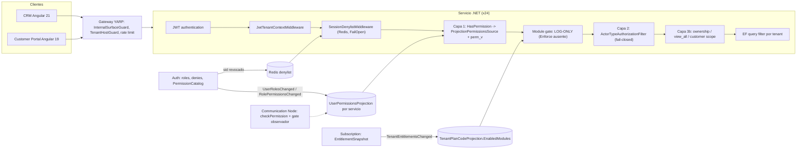

## 4.3 Diagrama 8 — Flujo de autorización de un request (backend, actual)

```mermaid
sequenceDiagram
  participant C as Cliente
  participant G as Gateway
  participant S as Servicio .NET
  participant P as Proyección local
  participant M as TenantPlanCodeProjection
  C->>G: HTTP + Bearer
  G->>G: internal? -> 404 / Host vs tenant -> 403
  G->>S: forward
  S->>S: JWT válido? no -> 401
  S->>S: sid en denylist? sí -> 401 Auth.SessionRevoked
  S->>P: permissions(user) (cache 30 s; pull-recovery en 14 servicios)
  alt perm_v del JWT menor que el de la proyección
    S-->>C: 401 Auth.TokenStale
  else sin la permission
    S-->>C: 403 (body vacío)
  else con la permission
    S->>M: módulo habilitado?
    M-->>S: no -> solo log "Module gate (log-only)"
    S->>S: AllowActorTypes? no -> 403 (body vacío)
    S->>S: ownership / visibilidad / tenant filter
    S-->>C: 200 / 404 / 403
  end
```

---

# 5. ActorTypes

- **[A] Enums:** `UserActorType { TenantEmployee, TenantAdmin, CustomerPortal, PlatformAdmin }` (`BE\Services\Auth\Domain\Users\UserActorType.cs:18-24`). El compartido `ActorType` añade `Service` (`BE\BuildingBlocks\ActorTypeAuthorization\ActorType.cs:12-19`). La paridad de orden la vigilan `ActorTypeParityTests`.
- **[A] Significado:**
  - TE: staff de la oficina.
  - TA: dueño/admin de la oficina.
  - CP: cliente final de la oficina (exige `CustomerId`, `User.cs:106-118`).
  - PA: operador de la plataforma (solo en `PlatformTenant`, `User.cs:88-104`).
  - Service: cliente M2M, nunca un usuario.
- **[A] Inmutable:** se fija en `User.Register` y se copia de la invitación al aceptarla. Ningún comando lo cambia.
- **[A] Dónde viaja:**
  - Claim `actor_type` en el JWT.
  - Un **pseudo-rol** con el mismo nombre se guarda en `User._roles` y se emite como claim `role` junto con los nombres de los roles asignados (`JwtTokenGenerator.cs:56`).
  - Los servicios parsean el actor fallando cerrado (valor desconocido → `null`).
- **[A] Quién crea qué** (`CreateInvitation.cs:221-236`): PA crea TA en cualquier tenant cliente o PA en el tenant de plataforma. TA crea TA, TE o CP en su tenant. Nadie más.
- **[A] Guardrails de actor:**
  - `ActorTypeRoleGuard.ValidateRolesForActorType`: en assign-roles e invitaciones con roles; **no** se re-ejecuta al aceptar.
  - `ValidatePermissionsForActorType`: en create-role y set-permissions (siempre como staff) y en overrides.
  - `User.SelfAction`: prohíbe desactivarse, dar de baja, reasignar roles o denies sobre uno mismo.
  - `User.LastAdmin`: solo en offboard.
- **Equivalencias incorrectas que el código NO sostiene [A]:**
  - `Role ≠ ActorType`: el actor es un atributo inmutable del sujeto; el rol es un contenedor de permissions.
  - `CustomerPortal ≠ TenantEmployee`: actor distinto, bundle distinto, endpoints distintos por `[AllowActorTypes]`.

---

# 6. Roles

- **[A] Modelo:** `Role` (TenantId, Name 2–60, IsSystem, IsActive, `PermissionsVersion`, `RolePermissions`), `UserRoles` M:N.
- **[A] Permisos efectivos (lectura):** unión de las permissions de los roles **activos** del usuario, menos sus denies, calculada en SQL (`RoleRepository.cs:75-109`).
- **[D]** Fallback pre-RBAC: si el usuario no tiene ningún rol activo, `UserAccessResolver` devuelve `DefaultsFor(actorType)` **sin restar denies** (`UserAccessResolver.cs:27-32`).
- **[A] En el JWT:** los nombres de roles viajan como `ClaimTypes.Role`, pero **ningún servicio autoriza por nombre de rol**, salvo el check `IsInRole("PlatformAdmin")`. Ese check es precisamente el hueco (§10, §47).

### Diagrama 3 — ActorType → Role → Permission (actual)

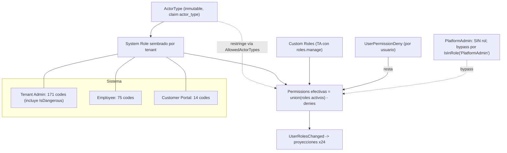

---

# 7. System Roles

- **[A] Nombres:** `"Tenant Admin"`, `"Employee"`, `"Customer Portal"` (`Role.cs:9-11`). Se siembran solo para tenants `TenantKind.Customer` (`TenantCreatedConsumer.cs:46-49` → `RoleRepository.cs:149-176`) o en la creación del owner por onboarding.
- **[A] Inmutables** fuera del seeding: `Update`, `SetPermissions` y `Deactivate` rechazan roles de sistema. El TA **no** puede editar el bundle Employee de su tenant; solo puede restar por usuario (deny) o sumar con custom roles.
- **[A] Tenant Admin sembrado:**
  - Se construye con `SystemTenantAdminRootPermissions()` = todo lo que no es portal ni PlatformOnly, **incluidas las IsDangerous**, más 5 comms de doble uso (`CAT:1974-1981, 2190-2195`). Son 171 codes.
  - `SystemRoleDefaults(SystemTenantAdmin)` **excluye** las IsDangerous, pero solo alimenta el fallback `DefaultsFor` (165 codes).
- **[A] Employee:** lista explícita de 75 codes (`CAT:2002-2145`; detalle en §10).
- **[A] Customer Portal:** 14 codes (`CAT:2146-2169`).
- **[A] PlatformAdmin:** **no tiene rol de sistema.** Su poder viene entero de bypasses. `/auth/me` le muestra el fallback de 165 codes (engañoso, R7).
- **[A] `SystemRolePermissionsSyncService`:**
  - Corre una vez tras `ApplicationStarted`.
  - Recalcula el set esperado de cada rol de sistema en todos los tenants y, si difiere, hace `SetPermissions(seeding:true)` (sube `Role.PermissionsVersion`) y publica `RolePermissionsChanged` **solo de los roles que cambiaron**.
  - Nunca sube el `perm_v` del usuario.
- **[A] Plan y system roles:** los system roles **no se filtran por plan**. Un tenant Starter tiene en el rol Employee y en el rol Customer Portal permissions Pro (`communication.*`, `email.use`, `comms.calls`, `reports.view`). La única barrera de plan en runtime sería el module gate, que está en log-only.

---

# 8. Custom Roles

| Operación | Endpoint | Permission / actor | Validaciones reales | Eventos |
|---|---|---|---|---|
| Listar | `GET /auth/roles` | `roles.manage` · TE, TA, PA | Tenant del JWT. Devuelve system e inactivos con `AssignableActorTypes` | — |
| Catálogo | `GET /auth/permissions` | `roles.manage` | Solo Id, Code, Module, Description, IsCustomerPortal. **Sin flags** (R19) | — |
| Crear | `POST /auth/roles` | `roles.manage` | Guard PA-target; nombre único (incluye inactivos) y de 2-60 chars; `Permission.NotFound`; `RolePermissionGuard`; actor target o staff | **Ninguno** (G4) |
| Renombrar | `PUT /auth/roles/{id}` | `roles.manage` | No sistema; 2-60 chars. Colisión de nombre → 409 de persistencia | Ninguno |
| Cambiar permissions | `PUT /auth/roles/{id}/permissions` | `roles.manage` | `RolePermissionGuard`; actor **siempre staff** (G7/G8); `Role.PermissionsVersion++` | `RolePermissionsChanged` (sin subir `perm_v` de usuarios) |
| "Eliminar" | `DELETE /auth/roles/{id}` | `roles.manage` | Soft: `IsActive=false`; filas `UserRoles` conservadas; **no se puede reactivar**; el nombre queda tomado | **Ninguno** (G6) |
| Duplicar | — | — | No existe | — |
| Usuarios por rol | — | — | No hay endpoint (`CountUsersInRoleAsync` es código muerto). `GET /auth/users` trae nombres de roles por usuario | — |
| Asignar/quitar | `PUT /auth/users/{id}/roles` | `roles.manage` · TE, TA, PA | SelfAction; roles activos; `ValidateRolesForActorType`; reemplazo total; **`perm_v++`**; acepta lista vacía (→ G2) | `UserRolesChanged` |
| Invitar con roles | `POST /auth/invitations` | `users.invite` · TA, PA | `CanInvite`; roles activos; actor. Al aceptar **no** se revalida (R8) | `InvitationCreated` → `UserRolesChanged` |

- **[A]** `roles.manage` es IsDangerous y no asignable. En la práctica, **solo el TA con el rol raíz** gestiona roles.
- **[D]** El CRM **no tiene UI** para crear, editar o borrar custom roles. Solo existen "asignar roles" (panel de invitación en modo edición) y "Edit access" (deny por usuario).
- **[A]** Roles históricos: el soft-delete conserva la configuración y las asignaciones. Eso sirve como "dormido", pero no hay reactivación.

### Diagrama 4 — TenantAdmin → Custom Roles → TenantEmployees (actual)

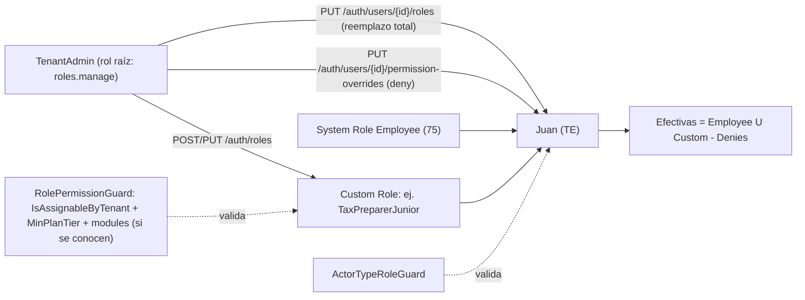

---

# 9. Permission Catalog

- **[A] Definición:** `PermissionDefinition(Id, Code, Module, Description, IsCustomerPortal, MinPlanTier=Starter, IsAssignableByTenant=true, PlatformOnly=false, AllowedActorTypes=null, IsDangerous=false)` (`CAT:337-357`). Se siembra por EF `HasData`. `AllowedActorTypes` se infiere al sembrar: PlatformOnly → [PA]; portal → [CP]; resto → [TE, TA, PA] (`Permission.cs:101-104`).
- **[A] Conteos** (medidos con un script sobre `CAT`, sin contar comentarios):

| Medida | Valor |
|---|---:|
| Permissions | **189** |
| PlatformOnly | **13** |
| IsDangerous | **7** (`roles.manage`, `billing.view`, `billing.manage`, `subscription.manage`, `cloudstorage.legal.manage`, `signature.constraints.manage`, `tenant.domains.manage`) |
| IsCustomerPortal | 10 |
| IsAssignableByTenant = false | **27** (incluye las 13 PlatformOnly y las 7 dangerous) |
| MinPlanTier = Pro | 22 |
| AllowedActorTypes explícito | 12 |
| Rol raíz "Tenant Admin" | 171 |
| Fallback TenantAdmin (`DefaultsFor`) | 165 |
| Employee | 75 |
| Customer Portal | 14 |
| **Sin enforcement en backend** | **38** en .NET + 5 de Communication que Node nunca valida |

- **[B]** Las cifras "178/181 permissions", "15 PlatformOnly" y "30 no asignables" de documentos y de auditorías previas son erróneas: cuentan comentarios o están desactualizadas.
- **[A] Flags que los guards leen en runtime:** solo `IsAssignableByTenant`, `MinPlanTier` (`RolePermissionGuard.cs:44`) y `AllowedActorTypes`. `PlatformOnly` e `IsDangerous` solo los leen los constructores de bundles.
- **[D] (R2)** La seguridad depende de la convención "PlatformOnly ⇒ no asignable" y "IsDangerous ⇒ no asignable". Ningún test de fitness la impone.
- **[A] Dos vocabularios de "módulo":** el campo `Module` del catálogo (p. ej. `signatures`, `notes`, `cloudstorage`) no es el `PermissionModuleMap` del gate (p. ej. `signatures`, `planner`, `documents`). `signatures.request` (legacy) no se gatea porque su prefijo es `signatures.` y el mapa espera `signature.` (R5).

El detalle completo por permission está en la **Súper Tabla (§19)**.

---

# 10. Permission Bundles

| Bundle | Construcción | Tamaño | Incluye peligrosas | Filtrado por plan |
|---|---|---:|---|---|
| Tenant Admin (sembrado) | `SystemTenantAdminRootPermissions()` = `!IsCustomerPortal && !PlatformOnly` + 5 comms de doble uso | 171 | **Sí** | No |
| Fallback TA/PA (`DefaultsFor`) | `SystemRoleDefaults(SystemTenantAdmin)` = además `!IsDangerous` | 165 | No | No |
| Employee | lista explícita `CAT:2002-2145` | 75 | No | No |
| Customer Portal | lista explícita `CAT:2146-2169` | 14 | No | No |

**[A] Employee (75), agrupado:**
- Clientes: `customers.view`, `customers.manage`.
- **Legacy sin enforcement:** `signatures.request`, `documents.view`, `documents.manage`, `email.use`, `comms.calls`, `reports.view`.
- CloudStorage: `file.view`, `file.upload`, `file.download`, `folder.manage`, `share.create`, `share.revoke`.
- Signature: `request.create`, `request.read`, `request.resend`, `document.prepare`, `document.sign`, `document.view`, `document.download`, `document.send`.
- Communication: `chat.start`, `chat.reply`, `support.open`, `call.start`, `videocall.start`, `meeting.create`, `meeting.join`, `meeting.host`, `screenshot.create`, `notification.read`.
- Correspondence: `read`, `attachment.download`, `compose`, `reply`, `send`. Connectors: `accounts.read`, `connect_own`, `office.read`.
- Scribe: `templates.read`, `layouts.read`, `event_mappings.read`. Postmaster: `messages.read`, `suppression.read`, `providers.read`.
- Notification: `email.view`, `template.view`.
- Pagos (lectura): `payment_app.saas_payment.read`, `provider_customer.read`; `payment_client.config.read`, `payment.read`, `payment_link.read`, `connect_account.read`, `payout.read`, `recurring.read`.
- Planner: `reminders.read/write`; `tasks.read/write/assign/client_requests.manage`; `calendar.read/write/availability.manage`.
- Catálogo e inventario: `catalog.read/write/delete`; `inventory.read/write/adjust`.
- SMS y facturación: `sms.send/read`; `invoicing.view/manage`.

**[A] No incluido en Employee** (causa directa de 403 operativos):
- `notes.read`, `notes.manage`.
- `campaigns.manage`.
- `signature.template.create` (que además protege listar y obtener plantillas), `signature.request.cancel`.
- `communication.group.create`, `group.manage_members`, `chat.moderate`.
- `notification.email.send`.
- `documents.branding.manage`.
- `correspondence.manage`.
- `cloudstorage.file.delete`, `recyclebin.manage`, `settings.manage`.
- `users.*`, `branding.manage`, `referrals.own.read`, `payment_client.*.manage`, `sms.manage`.

**[A] Customer Portal (14):**
- `portal.folders.view` (sin uso), `tasks.portal.client_requests`, `notes.portal.read`.
- `cloudstorage.file.view/upload/download`.
- `communication.chat.start`, `chat.reply`, `support.open`, `call.start`, `videocall.start`, `meeting.join`, `screenshot.create`, `notification.read`.

---

# 11. Permission Projections / perm_v

- **[A] Qué es:** `Users.PermissionsVersion` (int, `User.cs:45`), emitido en el JWT como `perm_v`. Es distinto de `Role.PermissionsVersion`, que solo ordena eventos de rol.
- **[A] Se incrementa solo en:**
  - Assign roles (`UserManagementCommands.cs:404`).
  - Deny overrides (`SetUserPermissionOverridesCommand.cs:77`).
  - Aceptar invitación (`AcceptInvitation.cs:156`).
  - Creación del owner por onboarding (`CreateTenantOwnerFromOnboardingCommand.cs:98`).
- **[A] NO se incrementa en:**
  - Set-role-permissions, desactivar o renombrar rol, sync de roles de sistema.
  - Desactivar, reactivar o dar de baja un usuario.
  - Suspensión del tenant.
  - **Cambios de plan o entitlements.**
  - Backfill, reconciliación, reproject.
- **[A] Validación** (`PPS:50-117`):
  1. PA → permitir.
  2. Service → claim `perm`.
  3. Humano → proyección local (cache **30 s**). Si falta la fila: pull-recovery (`GET internal/tenants/{t}/users/{u}/permissions-snapshot`) en 14 servicios; en los demás, 403.
  4. Si el `perm_v` del JWT es menor que el de la proyección → `Auth.TokenStale` → **401**.
- **[A] Node:** mismo esquema, **sin pull-recovery**. Un usuario nuevo recibe 403 hasta que llega el evento.
- **[A] Eventos:**
  - `UserRolesChangedIntegrationEvent`: UserId, `PermissionsVersion`, RoleNames, RoleIds, **PermissionCodes efectivos (ya sin denies)**, ActorType.
  - `RolePermissionsChangedIntegrationEvent`: RoleId, codes completos del rol, versión del rol.
- **[D] G3:** al recibir `RolePermissionsChanged`, cada servicio recomputa la unión de los usuarios que tienen ese rol **sin restar denies**. El denegado vuelve a tener la permission hasta su próximo `UserRolesChanged`, que puede tardar hasta 6 h (reconciliación).
- **[D] G4:** los servicios solo conocen un rol por eventos de rol. Crear un rol y sembrar roles de sistema **no publican** evento, y el sync solo publica los que cambian. Al editar un rol, la recomputación puede **quitar** permissions de otro rol nunca publicado.
- **[A] Anti-entropía:**
  - `PermissionsReconciliationService` republica a todos los usuarios activos cada **6 h** (el primer pase 6 h después del arranque).
  - `PermissionsBackfillService` corre una vez al arrancar.
  - Reproject manual (PA).
- **[A] JWT limpio:** el JWT humano **no lleva `perm`** (`JwtTokenGenerator.cs:41-57`). Si un servicio con `[HasPermission]` intenta arrancar en modo `Jwt`, falla al iniciar (`UserPermissionsSourceRegistration.cs:53-63`). **Este diseño debe preservarse.**

---

# 12. Session Revocation

- **[A] Sesión única:**
  - Toda emisión pasa por `IssueOrRequireTakeoverAsync`. Si hay otra sesión activa se devuelve un ticket de takeover.
  - `POST /auth/session/takeover` denylistea y revoca las previas.
- **[A] Denylist:** clave Redis `auth:denylist:sid:{sid}`, TTL 20 min. `SessionDenylistMiddleware` responde 401 `Auth.SessionRevoked`. `FailOpen` por defecto.
- **[A] Realtime:**
  - Canal Redis `auth:session-revoked` → Communication emite `session.revoked` a `t:{tenant}:u:{user}`.
  - Se emite en takeover, revoke-session y revoke-all.
  - **No** se emite en deactivate, offboard, suspensión del tenant ni bloqueo por billing (R12, G10).
- **[D] G10:** la suspensión o el bloqueo por billing revocan sesiones **solo en BD** (`SessionRepository.cs:105-122`). No hay entrada en la denylist ni evento, así que el access token sigue válido hasta 15 min.
- **[A] Lifetimes:** access 15 min · refresh 14 días (rotación y detección de reuso) · token de servicio 10 min · ticket de takeover 2 min · ticket MFA 5 min · clock skew 30 s.
- **[A] Frontends:**
  - El CRM y el Portal escuchan `session.revoked` (modal + logout).
  - **[D]** El Portal conecta el socket con un token fijo (sin función `auth`), así que al reconectar tras rotar el token falla.

---

# 13. Tenant Boundary

- **[A]** El tenant siempre sale del JWT (`JwtTenantContextMiddleware`). Los 24 DbContext tienen query filter que falla cerrado (`Guid.Empty` → 0 filas).
- **[A]** En consumidores de eventos, el tenant se toma del payload (`IntegrationEventTenantMiddleware`, lanza con `Guid.Empty`). Los repositorios usan `IgnoreQueryFilters` con tenant explícito.
- **[A] Rutas cross-tenant legítimas** (`{tenantId}` + `[AllowActorTypes(PlatformAdmin)]`): suspend, reactivate y renew de Subscription, admin de Subscription, PaymentApp y PaymentClient, tenants list y status.
- **[D] Rutas cross-tenant por rol, no por actor:**
  - Afectadas: `TryResolveTenantId` (`ControllerIdentityExtensions.cs:32-44`; usado en `TenantBrandsController` ×7 y `Postmaster ProvidersController` ×4), el backfill de CloudStorage, las plantillas System de Scribe y Notification, y la policy `TenantRegistration`.
  - Estas rutas admiten TE y TA y deciden el cross-tenant con `IsPlatformAdmin()` (nombre de rol). Por eso el hueco G1 las abre.
- **[D]** Connectors M2M (`internal/accounts/visible-ids`, `messages/{id}/body`, `attachments`, `accounts/{id}/send`) toma el `TenantId` del body **sin compararlo** con el token de servicio. Postmaster sí lo compara.
- **[D] (R16)** Cualquier cliente M2M registrado puede emitir un token para cualquier tenant (`IssueServiceToken.cs:26-51`), y `ServiceOnly` solo valida `actor_type=Service`, sin scope por cliente.
- **[A→riesgo]** `TenantDomains__EnforceHostResolution: "false"` en el compose de producción (`docker-compose.yml:322`), con un comentario que dice "DEV". El login acepta el tenant del body si el Host no resuelve. La intención está por confirmar.

---

# 14. Ownership / Resource Authorization

- **[A] `IsOwnerOrHasManageHandler`:** permite PA (por rol), a quien tenga la permission de manage del recurso, o al creador (`CreatedByUserId == sub`). En cualquier otro caso falla cerrado.
- **[A]** El flag `Authorization:ResourceOwnership:Enabled` tiene default `false` en el código, pero vale **`true` en el `appsettings.json`** de CloudStorage (ShareLink, override `cloudstorage.share.manage`), Signature (SignatureRequest, override `signature.request.manage`), Correspondence (Draft, sin override) y Notes (Note, sin override). Compose no lo pisa, así que está **activo en producción**.
- **[B]** README §41.8, la auditoría previa y el comentario de `Signature Program.cs:78-79` dicen "apagado por default". El comportamiento efectivo es el contrario.
- **[A] Visibilidad por asignación (`customers.view_all`):**
  - Customer: ON en `appsettings`.
  - Notes, Sms, Campaigns, Calendar, Tasks, Signature y Billing: flags `${VAR:-false}` alimentados por secrets. Su valor en producción está por confirmar.
  - Communication: flag global OR setting por tenant `restrictCustomerChatToAssignedPreparer`.
- **[D] Brechas de ownership y scope:**
  - Signature: 14 sub-recursos del request sin ownership. `preparer/sign` permite a cualquiera con `document.sign` firmar como preparer en cualquier request.
  - Tasks: dependencias, adjuntos y series sin `CanMutate`; crear, serie o plantilla con `AssigneeUserId` sin `tasks.assign`.
  - Correspondence:
    - Leer drafts ajenos.
    - `AccountId` de envío sin validar (se puede enviar desde el buzón personal de un colega).
    - Adjuntos sin gate de buzón.
    - `office.read` da acceso a todo el correo, incluidos buzones personales.
  - Customer con asignación ON: las mutaciones y el reveal del tax ID ignoran la asignación.
  - CloudStorage: el staff no se filtra por asignación. `/storage/private/{token}` `TenantOnly` es accesible a CP sin `CanAccess`. Borrar una carpeta borra sus archivos sin `file.delete`.
  - Communication:
    - `customers/:id/calls` sin scope.
    - `offboarding-impact` abierto a cualquier actor.
    - `call.initiate` sin gate de asignación.
    - Typing, recording y presencia sin participante.
    - Token de invitación a meeting no ligado a su meeting.
  - Campaigns: la ejecución programada evade la visibilidad (`CanViewAllCustomers=true`).

---

# 15. Entitlements

- **[A] Modelo:**
  - `TenantSubscription` → `SubscriptionPlan` → `SubscriptionPlanVersion` (features `module.*`, entitlements de cantidad, precios).
  - `AddOnDefinition` y `TenantAddOn`; `SubscriptionSeat`.
  - `TenantEntitlementSnapshot` = lista de `EntitlementEntry` (key, type, value, status, source, expiry) con `RevisionNumber` monótono.
- **[A] Builder** (`EntitlementSnapshotBuilder.cs`):
  - Usa la versión **publicada** del plan, no la `PlanVersionId` del tenant (sin grandfathering de módulos).
  - `module.*` = true solo con estado Trialing, Active, PastDue o GracePeriod.
  - Add-ons solo si están Active y el estado concede acceso; features en OR.
- **[A] Recalculo:**
  - Comando local de Wolverine que publica `TenantEntitlementsChangedIntegrationEvent`: `RevisionNumber`, `ChangedKeys`, `PlanCode`, `SubscriptionStatus`, seats, `MaxStaffUsers`, `EntitlementValues` (p. ej. `module.email`).
  - Lo disparan: trial nuevo, activación por onboarding, compra, cancelación o renovación de add-on, upgrade pagado, downgrade aplicado en la renovación, expiración de trial, expiración de gracia, suspensión o reactivación por admin, cancelación, seats y cambio de módulos de un plan.
  - **No** lo disparan: fallo de renovación (PastDue/Grace), recuperación, activación anticipada de trial, pago o fallo de add-on, precios.
- **[A] Consumidores:**
  - `TenantPlanCodeProjection` en 24 servicios (con `EnabledModules` en los 13 gateados; guard de revisión).
  - Auth `TenantPlanLimits` (con `EnabledModulesJson`; **sin guard de revisión**).
  - CloudStorage `TenantStorageLimit` (sin guard) y Communication `TenantCommunicationLimits` (sin guard).
- **[D] Brechas:**
  - Sin anti-entropía de entitlements (solo endpoints manuales).
  - El recalculo puede no ser durable (no hay `UseDurableLocalQueues`).
  - Consumidores sin guard de revisión.
  - El snapshot no se refresca en PastDue ni en recuperación.
  - Nadie consume `AddOnActivated` ni `AddOnCancelled`.
- **[A] Separación de conceptos:** Entitlement = "¿el tenant tiene acceso comercial?" (snapshot de Subscription). Permission = "¿el actor puede hacer la acción?" (Auth). **El código los mantiene separados**. La intersección solo se haría en el module gate, y hoy es log-only.

---

# 16. Modules

**[A] `PermissionModuleMap` (`BE\BuildingBlocks\Authorization\PermissionModuleMap.cs:28-47`, copia idéntica en Node):**

| Prefijo de permission | Module |
|---|---|
| `customers.` | customers |
| `signature.` | signatures |
| `documents.`, `cloudstorage.`, `scribe.` | documents |
| `calendar.`, `reminders.`, `tasks.`, `notes.` | planner |
| `correspondence.`, `connectors.`, `postmaster.`, `email.` | email |
| `communication.`, `comms.` | comms |
| `campaigns.` | campaigns |
| `reports.` | reports |
| cualquier otro | **no gateado** (siempre efectivo) |

- **[A]** `marketing`, `builder`, `irs` y `miles` no tienen permissions de backend. El código asume que el frontend los oculta (`PermissionModuleMap.cs:11-15`).
- **[A]** **Meetings no es un módulo separado:** forma parte de `comms`, junto con chat, llamadas, video, soporte y notificaciones in-app. Un "add-on de Meetings" solo sería posible creando un módulo nuevo (decisión de producto, ver §47).
- **[A] Gate registrado en 13 servicios .NET:** Customer, CloudStorage, Documents, Scribe, Notes, Signature, Tasks, Calendar, Reminder, Correspondence, Connectors, Postmaster, Campaigns.
- **[A]** El gate lee `EnabledModules` de la BD **en cada request gateado**, sin caché.
- **[A]** Permite pasar si no hay fila de proyección, y niega (en log) si la fila tiene `[]`.
- **[D]** Las filas creadas antes del 2026-09-14 quedaron con `"[]"`, así que con Enforce habría 403 masivos hasta recalcular. Campaigns no tiene fila para tenants anteriores al 2026-09-19.

---

# 17. Subscription / Plans

**[A] Catálogo sembrado** (`SubscriptionPlanCatalogSeeder.cs`; solo corre con la tabla vacía, así que los datos vivos pueden diferir [B]):

| | starter (tier Standard) | pro | enterprise |
|---|---|---|---|
| `seats.max` | 3 | 10 | 25 |
| `invitations.max_pending` | 5 | 15 | 40 |
| `storage.max_bytes` | 10 GiB | 50 GiB | 200 GiB |
| Precio mes / año | $49 / $490 | $129 / $1,290 | $299 / $2,990 |

- **[A]** No existe un plan "Trial" ni "Standard". El trial es el estado `Trialing` sobre `starter` durante 14 días. Los nombres "Standard" y "Professional" del prompt se corresponden con `starter` y `pro`.
- **[A] Estados:**
  - Trialing, Active, PastDue y GracePeriod: módulos ON.
  - Suspended y Expired: módulos OFF; login y refresh bloqueados para TE y CP con 403 `Auth.SubscriptionInactive` (el TA puede entrar a renovar).
  - Cancelled: módulos OFF de inmediato, pero el login **no** se bloquea hasta Expired.

### Diagrama 6 — Subscription → Plan → Module → Entitlement (actual)

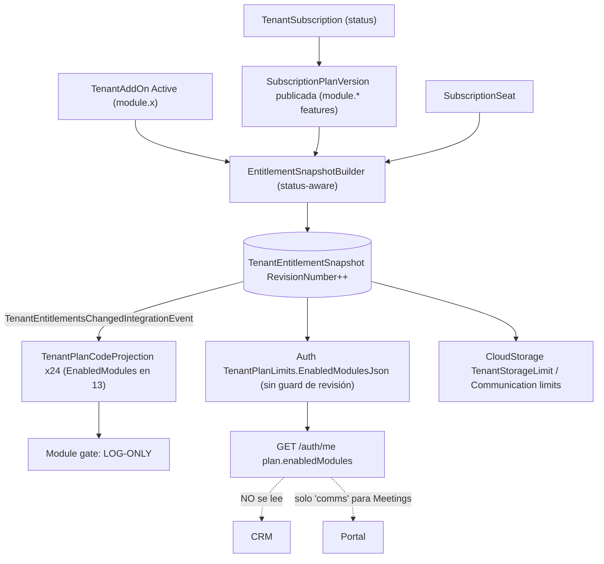

---

# 18. Effective Authorization actual

**[A] Fórmula real que ejecuta hoy un servicio .NET, en su orden real:**

```
Acceso = JWT válido
       ∧ tenant_id bien formado
       ∧ sid no está en la denylist (FailOpen si Redis cae)
       ∧ [HasPermission]:
            PA (IsInRole "PlatformAdmin")  → true   ← hueco G1
            Service                        → claim perm
            humano → code ∈ Proyección(user) (∪ roles activos − denies*),
                     con perm_v(JWT) ≥ perm_v(proyección), si no 401
       ∧ (module gate: solo log; nunca bloquea)
       ∧ AllowActorTypes(endpoint) ∋ actor_type   (PA siempre pasa)
       ∧ ownership (4 recursos) / view_all (con flag) / customer_id (portal) / participante (Node)
       ∧ EF tenant filter
```

\* En los servicios downstream, la resta de denies se pierde tras un `RolePermissionsChanged` (G3).

Lo que **no** interviene hoy en runtime:
- **[D]** El entitlement del módulo (log-only).
- **[D]** El plan tier (`MinPlanTier` solo se aplica al crear o editar custom roles).
- **[D]** El estado de la suscripción durante la sesión (solo en login y refresh; los tokens vivos siguen hasta 15 min).
- **[D]** En Communication, las permissions `call.record`, `meeting.record`, `meeting.host`, `screenshot.create` y `notification.read`.

### Diagrama 7a — Effective Authorization actual

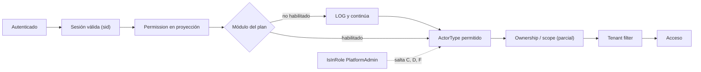

---

# 19. Super Tabla ActorType/Role/Permission

## 19.1 Vista por ActorType y Role (estado real)

| ActorType | Role | Fuente | Razón | Operación habilitada | Default | Revocable por TA | TenantAssignable | PlatformOnly |
|---|---|---|---|---|---:|---:|---:|---:|
| PlatformAdmin | *(ninguno)* | Bypass `IsInRole("PlatformAdmin")` en `CPE:55`, `PPS:52-53`, module gate, ownership, `TryResolveTenantId`; bypass por `actor_type` en `ActorTypeAuthorizationFilter:69-71` | Operador de plataforma, "god-mode" por diseño | Todo endpoint `[HasPermission]`, más las rutas `[AllowActorTypes(PlatformAdmin)]` cross-tenant | n/a | No (no pertenece a ningún tenant) | n/a | Recibe las 13 PlatformOnly por bypass |
| TenantAdmin | Tenant Admin (sistema) | `SystemTenantAdminRootPermissions()` (`CAT:2190-2195`), sembrado por `RoleRepository.cs:165-171` y sincronizado en cada arranque | Dueño o admin raíz del tenant | **171** permissions, incluidas 7 IsDangerous (`roles.manage`, `billing.*`, `subscription.manage`, `cloudstorage.legal.manage`, `tenant.domains.manage`; `signature.constraints.manage` queda fuera por PlatformOnly) | Sí | Sí, deny por usuario hecho por otro TA; nunca sobre sí mismo | El rol de sistema no es editable | No incluye PlatformOnly |
| TenantAdmin | Custom roles | `PUT /auth/users/{id}/roles` | Opcional | Suma permissions (dentro del techo) | No | Sí | Sí, si `IsAssignableByTenant` ∧ tier ∧ módulo | No |
| TenantEmployee | Employee (sistema) | `SystemRoleDefaults(SystemEmployee)` (`CAT:2002-2145`) | Baseline operativo | **75** permissions (§10) | Sí | Sí, deny por usuario | El rol de sistema no es editable | No |
| TenantEmployee | Custom roles | idem | Especialización de equipo | Suma, dentro del techo | No | Sí | Sí | No |
| CustomerPortal | Customer Portal (sistema) | `CAT:2146-2169`; los usuarios sin roles reciben lo mismo por fallback | Cliente final | **14** permissions (documentos propios, requests, notas visibles, chat, soporte, llamadas, meetings) | Sí | Sí, deny por cliente (la UI solo lo refleja en llamadas) | El rol de sistema no es editable | No |
| CustomerPortal | Custom portal roles | Se pueden crear | Raro | — | No | Sí | **[D] G8:** una vez creados no se pueden editar (set-permissions valida como staff) | No |
| Service | *(sin rol)* | `ServiceAuth:Clients` (config) → claim `perm`/`scope` en el token de servicio | M2M | Lo que configure el cliente. `scribe.render` se entrega así | n/a | n/a | n/a | `ServiceOnly` es una **policy** (`actor_type=Service`), no una permission |

## 19.2 Tabla completa por permission (189 filas)

**Leyenda:**
- **Enforcement (sitios)** = número de puntos del backend donde se exige la permission (`[HasPermission]`, `HasPermissionAsync` en código, ownership). `TS n` = llamadas `checkPermission` en Communication (Node). `0` = **ningún endpoint la exige**.
- **Module (gate)** = módulo del `PermissionModuleMap`. Con Enforce activo, ese módulo condicionaría la permission a un entitlement. Hoy es log-only.
- **TenantAdmin / Employee / Customer Portal** = presencia en el rol de sistema. "Sí (raíz, peligroso)" significa que la tiene el rol raíz sembrado, pero no el fallback `DefaultsFor`.
- **TenantAssignable** = el TA puede incluirla en un custom role (sujeto además a `MinPlanTier` y módulo).
- **Revocable por TA** = el TA puede quitarla a un usuario concreto con deny (`PUT permission-overrides`). No aplica a PlatformAdmin ni sobre sí mismo.
- **ServiceOnly:** ninguna permission es ServiceOnly. Es una policy. `scribe.render` es la única PlatformOnly que se usa vía token M2M.
- La columna "Operación" usa la descripción real del catálogo (en español en el código).

| # | Permission | Operación que habilita (descripción del catálogo) | Servicio que la exige | Enforcement (sitios) | Module (gate) | ActorTypes permitidos | TenantAdmin | Employee | Customer Portal | TenantAssignable | Revocable por TA (deny) | PlatformOnly | IsDangerous | Tier mínimo | Observación |
|---:|---|---|---|---:|---|---|---|---|---|---|---|---|---|---|---|
| 1 | `users.view` | Ver usuarios del tenant | Auth | 3 | — (no gateado) | TE·TA·PA | Sí | No | No | Sí | Sí (deny por usuario) | No | No | Starter |  |
| 2 | `users.invite` | Invitar usuarios | Auth | 4 | — (no gateado) | TE·TA·PA | Sí | No | No | Sí | Sí (deny por usuario) | No | No | Starter | TA con esta permission crea otros TA con rol raíz |
| 3 | `users.manage` | Activar, desactivar y editar usuarios | Auth | 5 | — (no gateado) | TE·TA·PA | Sí | No | No | Sí | Sí (deny por usuario) | No | No | Starter | Delegable: permite desactivar admins (sin jerarquía) |
| 4 | `roles.manage` | Gestionar roles y permisos | Auth | 4 | — (no gateado) | TE·TA·PA | Sí (raíz, peligroso) | No | No | No | Sí (deny por usuario) | No | Sí | Starter | Único grant de roles/overrides; nunca delegable |
| 5 | `audit.view` | Consultar auditoría | Auth + Subscription | 2 | — (no gateado) | TE·TA·PA | Sí | No | No | Sí | Sí (deny por usuario) | No | No | Starter |  |
| 6 | `settings.manage` | Gestionar configuración del tenant | Auth | 2 | — (no gateado) | TE·TA·PA | Sí | No | No | Sí | Sí (deny por usuario) | No | No | Starter |  |
| 7 | `billing.view` | Ver facturación y suscripción | — (sin endpoint) | **0** | — (no gateado) | TE·TA·PA | Sí (raíz, peligroso) | No | No | No | Sí (deny por usuario) | No | Sí | Starter | SIN USO: ningún endpoint lo exige; lecturas de Subscription abiertas a todo staff |
| 8 | `billing.manage` | Gestionar métodos de pago y facturación | — (sin endpoint) | **0** | — (no gateado) | TE·TA·PA | Sí (raíz, peligroso) | No | No | No | Sí (deny por usuario) | No | Sí | Starter | SIN USO |
| 9 | `subscription.manage` | Cambiar plan y gestionar suscripción | Subscription | **0** | — (no gateado) | TE·TA·PA | Sí (raíz, peligroso) | No | No | No | Sí (deny por usuario) | No | Sí | Starter | SIN USO (Subscription usa plan.change/seats/addons) |
| 10 | `invoicing.view` | Ver facturas de clientes del tenant | Billing | 4 | — (no gateado) | TE·TA·PA | Sí | Sí | No | Sí | Sí (deny por usuario) | No | No | Starter |  |
| 11 | `invoicing.manage` | Crear, emitir y gestionar facturas de clientes y los datos del emisor | Billing | 7 | — (no gateado) | TE·TA·PA | Sí | Sí | No | Sí | Sí (deny por usuario) | No | No | Starter | Incluye editar el emisor legal (IssuerProfile) |
| 12 | `customers.view` | Ver clientes | Customer (+ lectores de view_all) | 7 | customers | TE·TA·PA | Sí | Sí | No | Sí | Sí (deny por usuario) | No | No | Starter |  |
| 13 | `customers.view_all` | Ver TODOS los clientes del tenant (no solo los asignados) | Customer (+ lectores de view_all) | 26 | customers | TE·TA·PA | Sí | No | No | Sí | Sí (deny por usuario) | No | No | Starter | Bypass de visibilidad por asignación; se chequea en código (no pasa por module gate) |
| 14 | `customers.manage` | Crear y editar clientes | Customer (+ lectores de view_all) | 19 | customers | TE·TA·PA | Sí | Sí | No | Sí | Sí (deny por usuario) | No | No | Starter |  |
| 15 | `customers.import` | Importar clientes en bloque (CSV/Excel) | Customer (+ lectores de view_all) | 1 | customers | TE·TA·PA | Sí | No | No | Sí | Sí (deny por usuario) | No | No | Starter | Además exige actor TA (gate de actor) |
| 16 | `signatures.request` | Solicitar firmas | — (legacy) | **0** | — (no gateado) | TE·TA·PA | Sí | Sí | No | Sí | Sí (deny por usuario) | No | No | Starter | LEGACY sin enforcement; en bundle Employee |
| 17 | `documents.view` | Ver documentos | — (legacy) | **0** | documents | TE·TA·PA | Sí | Sí | No | Sí | Sí (deny por usuario) | No | No | Starter | LEGACY sin enforcement; en bundle Employee |
| 18 | `documents.manage` | Gestionar documentos | — (legacy) | **0** | documents | TE·TA·PA | Sí | Sí | No | Sí | Sí (deny por usuario) | No | No | Starter | LEGACY sin enforcement; en bundle Employee |
| 19 | `documents.branding.manage` | Configurar el branding de documentos del tenant | Documents | 2 | documents | TE·TA·PA | Sí | No | No | Sí | Sí (deny por usuario) | No | No | Starter | Falta en Employee → 403 incluso en GET |
| 20 | `email.use` | Usar el módulo de correo | — (legacy) | **0** | email | TE·TA·PA | Sí | Sí | No | Sí | Sí (deny por usuario) | No | No | Pro | LEGACY sin enforcement; en bundle Employee |
| 21 | `comms.calls` | Realizar llamadas y meetings | — (legacy) | **0** | comms | TE·TA·PA | Sí | Sí | No | Sí | Sí (deny por usuario) | No | No | Pro | LEGACY sin enforcement; en bundle Employee |
| 22 | `campaigns.manage` | Gestionar campañas | Campaigns | 34 | campaigns | TE·TA·PA | Sí | No | No | Sí | Sí (deny por usuario) | No | No | Pro | Única permission de Campaigns (34 endpoints); falta en Employee → 403 total |
| 23 | `reports.view` | Ver dashboard y reportes | — (legacy) | **0** | reports | TE·TA·PA | Sí | Sí | No | Sí | Sí (deny por usuario) | No | No | Pro | Sin enforcement (no hay UI/endpoints de reports) |
| 24 | `portal.calls.use` | El cliente puede realizar llamadas | — (sin endpoint) | **0** | — (no gateado) | CP | No | No | No | Sí | Sí (deny por usuario) | No | No | Starter | SIN USO |
| 25 | `portal.miles.use` | El cliente puede usar el módulo de millas | — (sin endpoint) | **0** | — (no gateado) | CP | No | No | No | Sí | Sí (deny por usuario) | No | No | Starter | SIN USO |
| 26 | `portal.folders.view` | El cliente puede ver folders de su perfil | — (sin endpoint) | **0** | — (no gateado) | CP | No | No | Sí | Sí | Sí (deny por usuario) | No | No | Starter | SIN USO; en bundle Customer Portal |
| 27 | `cloudstorage.file.view` | Ver metadatos de archivos | CloudStorage | 9 | documents | TE·TA·PA·CP | Sí | Sí | Sí | Sí | Sí (deny por usuario) | No | No | Starter |  |
| 28 | `cloudstorage.file.upload` | Subir archivos mediante el gateway seguro | CloudStorage | 4 | documents | TE·TA·PA·CP | Sí | Sí | Sí | Sí | Sí (deny por usuario) | No | No | Starter |  |
| 29 | `cloudstorage.file.download` | Descargar archivos disponibles | CloudStorage | 2 | documents | TE·TA·PA·CP | Sí | Sí | Sí | Sí | Sí (deny por usuario) | No | No | Starter |  |
| 30 | `cloudstorage.file.delete` | Eliminar archivos | CloudStorage | 1 | documents | TE·TA·PA | Sí | No | No | Sí | Sí (deny por usuario) | No | No | Starter | Borrar carpeta borra archivos sin esta permission (bypass) |
| 31 | `cloudstorage.settings.manage` | Gestionar políticas de almacenamiento | CloudStorage | 3 | documents | TE·TA·PA | Sí | No | No | Sí | Sí (deny por usuario) | No | No | Starter |  |
| 32 | `cloudstorage.audit.view` | Consultar auditoría de archivos | CloudStorage | 1 | documents | TE·TA·PA | Sí | No | No | Sí | Sí (deny por usuario) | No | No | Starter |  |
| 33 | `cloudstorage.recyclebin.manage` | Restaurar y purgar archivos de la papelera | CloudStorage | 1 | documents | TE·TA·PA | Sí | No | No | Sí | Sí (deny por usuario) | No | No | Starter |  |
| 34 | `cloudstorage.folder.manage` | Crear, renombrar y mover carpetas de archivos | CloudStorage | 5 | documents | TE·TA·PA | Sí | Sí | No | Sí | Sí (deny por usuario) | No | No | Starter |  |
| 35 | `cloudstorage.share.create` | Crear links para compartir archivos | CloudStorage | 2 | documents | TE·TA·PA | Sí | Sí | No | Sí | Sí (deny por usuario) | No | No | Starter |  |
| 36 | `cloudstorage.share.revoke` | Revocar links de compartir existentes | CloudStorage | 1 | documents | TE·TA·PA | Sí | Sí | No | Sí | Sí (deny por usuario) | No | No | Starter |  |
| 37 | `cloudstorage.share.manage` | Otorgar permisos elevados en links y gestionar su expiracion | CloudStorage | 5 | documents | TE·TA·PA | Sí | No | No | No | Sí (deny por usuario) | No | No | Starter | También override de ownership de ShareLink |
| 38 | `cloudstorage.legal.manage` | Gestionar legal hold y takedowns DMCA | CloudStorage | 4 | documents | TE·TA·PA | Sí (raíz, peligroso) | No | No | No | Sí (deny por usuario) | No | Sí | Starter | Documentado como solo plataforma pero NO es PlatformOnly → TA hace legal hold/DMCA |
| 39 | `cloudstorage.file.dmca_counternotice` | Presentar contranotificacion DMCA sobre un archivo propio | CloudStorage | 1 | documents | TE·TA·PA | Sí | No | No | Sí | Sí (deny por usuario) | No | No | Starter |  |
| 40 | `correspondence.read` | Ver la bandeja de correspondencia con customers | Correspondence | 12 | email | TE·TA·PA | Sí | Sí | No | Sí | Sí (deny por usuario) | No | No | Starter |  |
| 41 | `correspondence.attachment.download` | Descargar adjuntos de la bandeja de correspondencia | Correspondence | 2 | email | TE·TA·PA | Sí | Sí | No | Sí | Sí (deny por usuario) | No | No | Starter |  |
| 42 | `correspondence.compose` | Crear, editar y descartar borradores de correspondencia | Correspondence | 7 | email | TE·TA·PA | Sí | Sí | No | Sí | Sí (deny por usuario) | No | No | Starter |  |
| 43 | `correspondence.reply` | Responder a un mensaje entrante de correspondencia | Correspondence | 1 | email | TE·TA·PA | Sí | Sí | No | Sí | Sí (deny por usuario) | No | No | Starter |  |
| 44 | `correspondence.send` | Enviar un borrador de correspondencia ya redactado | Correspondence | 1 | email | TE·TA·PA | Sí | Sí | No | Sí | Sí (deny por usuario) | No | No | Starter |  |
| 45 | `correspondence.manage` | Archivar, enviar a papelera, restaurar y borrar definitivamente correspondencia | Correspondence | 8 | email | TE·TA·PA | Sí | No | No | Sí | Sí (deny por usuario) | No | No | Starter | Archivar/papelera/purga; falta en Employee |
| 46 | `connectors.accounts.read` | Ver las cuentas de correo conectadas del tenant | Connectors (+ Correspondence) | 3 | email | TE·TA·PA | Sí | Sí | No | Sí | Sí (deny por usuario) | No | No | Starter |  |
| 47 | `connectors.accounts.write` | Conectar, reconectar y desconectar cuentas de correo del tenant | Connectors (+ Correspondence) | 5 | email | TE·TA·PA | Sí | No | No | Sí | Sí (deny por usuario) | No | No | Starter |  |
| 48 | `connectors.accounts.connect_own` | Conectar y administrar el buzón de correo personal propio | Connectors (+ Correspondence) | 2 | email | TE·TA·PA | Sí | Sí | No | Sí | Sí (deny por usuario) | No | No | Starter |  |
| 49 | `connectors.accounts.office.read` | Ver el buzón de correo de oficina y su correo | Connectors (+ Correspondence) | 2 | email | TE·TA·PA | Sí | Sí | No | Sí | Sí (deny por usuario) | No | No | Starter | En Correspondence da acceso a TODO el correo (incl. buzones personales) |
| 50 | `scribe.templates.read` | Ver templates de correo (System y del tenant) | Scribe | 2 | documents | TE·TA·PA | Sí | Sí | No | Sí | Sí (deny por usuario) | No | No | Starter |  |
| 51 | `scribe.templates.write` | Crear, editar y publicar versiones de templates de correo | Scribe | 3 | documents | TE·TA·PA | Sí | No | No | Sí | Sí (deny por usuario) | No | No | Starter |  |
| 52 | `scribe.layouts.read` | Ver layouts de correo (System y del tenant) | Scribe | **0** | documents | TE·TA·PA | Sí | Sí | No | Sí | Sí (deny por usuario) | No | No | Starter | SIN USO (no hay GET de layouts) |
| 53 | `scribe.layouts.write` | Crear, editar y publicar versiones de layouts de correo | Scribe | 4 | documents | TE·TA·PA | Sí | No | No | Sí | Sí (deny por usuario) | No | No | Starter |  |
| 54 | `scribe.event_mappings.read` | Ver las reglas de resolución evento→template | Scribe | 2 | documents | TE·TA·PA | Sí | Sí | No | Sí | Sí (deny por usuario) | No | No | Starter |  |
| 55 | `scribe.event_mappings.write` | Crear, editar y borrar reglas de resolución evento→template | Scribe | 3 | documents | TE·TA·PA | Sí | No | No | Sí | Sí (deny por usuario) | No | No | Starter |  |
| 56 | `scribe.campaigns.read` | Ver campañas de correo basadas en templates de Scribe (reservado, sin controller aún) | Scribe | **0** | documents | TE·TA·PA | Sí | No | No | Sí | Sí (deny por usuario) | No | No | Starter | SIN USO (reservada) |
| 57 | `scribe.campaigns.write` | Gestionar campañas de correo basadas en templates de Scribe (reservado, sin controller aún) | Scribe | **0** | documents | TE·TA·PA | Sí | No | No | Sí | Sí (deny por usuario) | No | No | Starter | SIN USO (reservada) |
| 58 | `scribe.render` | Invocar el render de templates (M2M — Notification u otros servicios via token de servicio) | Scribe | 1 | documents | PA | No | No | No | No | n/a | Sí | No | Starter | M2M vía claim perm del token de servicio |
| 59 | `sms.send` | Enviar SMS/MMS (batch 1..N) vía el microservicio SMS | Sms | 2 | — (no gateado) | TE·TA·PA | Sí | Sí | No | Sí | Sí (deny por usuario) | No | No | Starter |  |
| 60 | `sms.read` | Ver el historial de SMS, su estado y las bajas (opt-outs) | Sms | 1 | — (no gateado) | TE·TA·PA | Sí | Sí | No | Sí | Sí (deny por usuario) | No | No | Starter |  |
| 61 | `sms.manage` | Gestionar manualmente las bajas de SMS (opt-out/opt-in) | Sms | 1 | — (no gateado) | TE·TA·PA | Sí | No | No | Sí | Sí (deny por usuario) | No | No | Starter | Gate de actor solo TA: delegarla no sirve |
| 62 | `catalog.read` | Ver el catálogo de productos/servicios | Catalog | 4 | — (no gateado) | TE·TA·PA | Sí | Sí | No | Sí | Sí (deny por usuario) | No | No | Starter |  |
| 63 | `catalog.write` | Crear/editar productos, servicios y categorías | Catalog | 7 | — (no gateado) | TE·TA·PA | Sí | Sí | No | Sí | Sí (deny por usuario) | No | No | Starter |  |
| 64 | `catalog.delete` | Borrar productos, servicios y categorías | Catalog | 2 | — (no gateado) | TE·TA·PA | Sí | Sí | No | Sí | Sí (deny por usuario) | No | No | Starter |  |
| 65 | `inventory.read` | Ver stock, proveedores y movimientos | Inventory | 6 | — (no gateado) | TE·TA·PA | Sí | Sí | No | Sí | Sí (deny por usuario) | No | No | Starter |  |
| 66 | `inventory.write` | Gestionar proveedores y umbrales de stock | Inventory | 7 | — (no gateado) | TE·TA·PA | Sí | Sí | No | Sí | Sí (deny por usuario) | No | No | Starter |  |
| 67 | `inventory.adjust` | Ajustar stock (registrar movimientos) | Inventory | 1 | — (no gateado) | TE·TA·PA | Sí | Sí | No | Sí | Sí (deny por usuario) | No | No | Starter |  |
| 68 | `signature.request.create` | Crear solicitudes de firma electrónica | Signature | 24 | signatures | TE·TA·PA | Sí | Sí | No | Sí | Sí (deny por usuario) | No | No | Starter | También cubre 14 sub-recursos sin ownership |
| 69 | `signature.request.read` | Consultar solicitudes de firma | Signature | 8 | signatures | TE·TA·PA | Sí | Sí | No | Sí | Sí (deny por usuario) | No | No | Starter |  |
| 70 | `signature.request.cancel` | Cancelar solicitudes de firma | Signature | 1 | signatures | TE·TA·PA | Sí | No | No | Sí | Sí (deny por usuario) | No | No | Starter | Falta en Employee (no puede cancelar sus propias solicitudes) |
| 71 | `signature.request.resend` | Reenviar invitaciones a firmantes | Signature | 2 | signatures | TE·TA·PA | Sí | Sí | No | Sí | Sí (deny por usuario) | No | No | Starter | También extiende expiración (debería ser request.expire) |
| 72 | `signature.request.expire` | Extender el vencimiento de solicitudes | Signature | **0** | signatures | TE·TA·PA | Sí | No | No | Sí | Sí (deny por usuario) | No | No | Starter | SIN USO |
| 73 | `signature.request.manage` | Gestionar solicitudes de firma creadas por otros usuarios del tenant | Signature | 1 | signatures | TE·TA·PA | Sí | No | No | No | Sí (deny por usuario) | No | No | Starter | Override de ownership |
| 74 | `signature.document.prepare` | Validar y preparar documentos para firma | Signature | 5 | signatures | TE·TA·PA | Sí | Sí | No | Sí | Sí (deny por usuario) | No | No | Starter |  |
| 75 | `signature.document.sign` | Aplicar firma del preparador al documento | Signature | 1 | signatures | TE·TA·PA | Sí | Sí | No | Sí | Sí (deny por usuario) | No | No | Starter | preparer/sign sin ownership (alto) |
| 76 | `signature.document.view` | Ver documentos firmados y sus metadatos | Signature | **0** | signatures | TE·TA·PA | Sí | Sí | No | Sí | Sí (deny por usuario) | No | No | Starter | SIN USO |
| 77 | `signature.document.download` | Descargar sellado, original o certificado | Signature | **0** | signatures | TE·TA·PA | Sí | Sí | No | Sí | Sí (deny por usuario) | No | No | Starter | SIN USO |
| 78 | `signature.document.send` | Entregar por email/SMS el documento firmado y el certificado a los firmantes | Signature | 1 | signatures | TE·TA·PA | Sí | Sí | No | Sí | Sí (deny por usuario) | No | No | Starter |  |
| 79 | `signature.document.audit.read` | Consultar el audit trail de una firma | Signature | **0** | signatures | TE·TA·PA | Sí | No | No | Sí | Sí (deny por usuario) | No | No | Starter | SIN USO |
| 80 | `signature.legal.manage` | Colocar y levantar retención legal (legal hold) sobre una firma | Signature | 2 | signatures | TE·TA·PA | Sí | No | No | Sí | Sí (deny por usuario) | No | No | Starter |  |
| 81 | `signature.template.create` | Crear plantillas de firma reutilizables | Signature | 3 | signatures | TE·TA·PA | Sí | No | No | Sí | Sí (deny por usuario) | No | No | Starter | También protege listar/obtener plantillas → Employee no puede instanciar desde plantilla |
| 82 | `signature.template.update` | Modificar plantillas de firma | Signature | 14 | signatures | TE·TA·PA | Sí | No | No | Sí | Sí (deny por usuario) | No | No | Starter |  |
| 83 | `signature.template.delete` | Eliminar plantillas de firma | Signature | 1 | signatures | TE·TA·PA | Sí | No | No | Sí | Sí (deny por usuario) | No | No | Starter |  |
| 84 | `signature.settings.manage` | Gestionar la configuración de firma del tenant | Signature | 2 | signatures | TE·TA·PA | Sí | No | No | Sí | Sí (deny por usuario) | No | No | Starter |  |
| 85 | `signature.preparer.manage` | Gestionar firmas persistentes del preparador | Signature | **0** | signatures | TE·TA·PA | Sí | No | No | Sí | Sí (deny por usuario) | No | No | Starter | SIN USO |
| 86 | `signature.certificate.verify` | Verificar certificados de firma (endpoint público) | Signature | **0** | signatures | TE·TA·PA | Sí | No | No | Sí | Sí (deny por usuario) | No | No | Starter | SIN USO (endpoint público) |
| 87 | `signature.constraints.manage` | Gestionar los techos de plan de Signature de un tenant (uso exclusivo de plataforma) | Signature | 2 | signatures | PA | No | No | No | No | n/a | Sí | Sí | Starter |  |
| 88 | `customers.fiscalprofile.reveal` | Revelar el SSN/ITIN/EIN completo de un customer | Customer (+ lectores de view_all) | 2 | customers | TE·TA·PA | Sí | No | No | Sí | Sí (deny por usuario) | No | No | Starter | UI muestra "Reveal" sin chequear → 403 genérico |
| 89 | `customers.preparer.manage` | Asignar o reasignar el preparador responsable de un customer | Customer (+ lectores de view_all) | 5 | customers | TE·TA·PA | Sí | No | No | Sí | Sí (deny por usuario) | No | No | Starter |  |
| 90 | `tenant.domains.manage` | Gestionar dominios propios del tenant (custom hostnames) | Auth | 1 | — (no gateado) | TE·TA·PA | Sí (raíz, peligroso) | No | No | No | Sí (deny por usuario) | No | Sí | Starter |  |
| 91 | `communication.chat.start` | Iniciar conversaciones de chat | Communication (Node) | TS 1 | comms | TE·TA·PA·CP | Sí (extra comms) | Sí | Sí | Sí | Sí (deny por usuario) | No | No | Pro | Doble uso staff/portal |
| 92 | `communication.chat.reply` | Responder en conversaciones de chat | Communication (Node) | TS 4 | comms | TE·TA·PA·CP | Sí (extra comms) | Sí | Sí | Sí | Sí (deny por usuario) | No | No | Pro | Doble uso staff/portal |
| 93 | `communication.chat.moderate` | Moderar mensajes en conversaciones del tenant | Communication (Node) | TS 3 | comms | TE·TA·PA | Sí | No | No | Sí | Sí (deny por usuario) | No | No | Pro |  |
| 94 | `communication.support.open` | Abrir chat de soporte hacia el PlatformTenant | Communication (Node) | TS 1 | comms | TE·TA·PA·CP | Sí | Sí | Sí | Sí | Sí (deny por usuario) | No | No | Pro |  |
| 95 | `communication.support.agent` | Atender chats de soporte como agente (PlatformTenant) | Communication (Node) | TS 10 | comms | TE·TA·PA | Sí | No | No | Sí | Sí (deny por usuario) | No | No | Pro | Solo tiene efecto en el tenant de plataforma |
| 96 | `communication.call.start` | Iniciar llamadas de audio 1:1 | Communication (Node) | TS dyn | comms | TE·TA·PA·CP | Sí | Sí | Sí | Sí | Sí (deny por usuario) | No | No | Pro |  |
| 97 | `communication.videocall.start` | Iniciar llamadas de video 1:1 | Communication (Node) | TS dyn | comms | TE·TA·PA·CP | Sí | Sí | Sí | Sí | Sí (deny por usuario) | No | No | Pro |  |
| 98 | `communication.call.record` | Grabar llamadas 1:1 (con banner de disclosure) | Communication (Node) | **TS 0** | comms | TE·TA·PA | Sí | No | No | Sí | Sí (deny por usuario) | No | No | Pro | Node NUNCA la valida |
| 99 | `communication.meeting.create` | Crear reuniones multi-party | Communication (Node) | TS 1 | comms | TE·TA·PA | Sí | Sí | No | Sí | Sí (deny por usuario) | No | No | Pro |  |
| 100 | `communication.meeting.join` | Unirse a reuniones (previa invitación válida) | Communication (Node) | TS 1 | comms | TE·TA·PA·CP | Sí (extra comms) | Sí | Sí | Sí | Sí (deny por usuario) | No | No | Pro |  |
| 101 | `communication.meeting.host` | Actuar como host de reuniones (waiting room, mute all, transfer) | Communication (Node) | **TS 0** | comms | TE·TA·PA | Sí | Sí | No | Sí | Sí (deny por usuario) | No | No | Pro | Node NUNCA la valida (host = regla de dominio) |
| 102 | `communication.meeting.record` | Grabar reuniones (con banner de disclosure) | Communication (Node) | **TS 0** | comms | TE·TA·PA | Sí | No | No | Sí | Sí (deny por usuario) | No | No | Pro | Node NUNCA la valida |
| 103 | `communication.screenshot.create` | Adjuntar screenshots/voice/video en chat | Communication (Node) | **TS 0** | comms | TE·TA·PA·CP | Sí (extra comms) | Sí | Sí | Sí | Sí (deny por usuario) | No | No | Pro | Node NUNCA la valida |
| 104 | `communication.group.create` | Crear grupos internos por tenant | Communication (Node) | TS 1 | comms | TE·TA·PA | Sí | No | No | Sí | Sí (deny por usuario) | No | No | Pro | Falta en Employee |
| 105 | `communication.group.manage_members` | Gestionar miembros de grupos internos | Communication (Node) | TS 2 | comms | TE·TA·PA | Sí | No | No | Sí | Sí (deny por usuario) | No | No | Pro |  |
| 106 | `communication.notification.read` | Consultar notificaciones in-app propias | Communication (Node) | **TS 0** | comms | TE·TA·PA·CP | Sí (extra comms) | Sí | Sí | Sí | Sí (deny por usuario) | No | No | Pro | Node NUNCA la valida; eximir del gate antes de aplicar Enforce |
| 107 | `communication.settings.manage` | Gestionar la configuración de Communication del tenant | Communication (Node) | TS 2 | comms | TE·TA·PA | Sí | No | No | Sí | Sí (deny por usuario) | No | No | Pro |  |
| 108 | `communication.analytics.read` | Consultar analytics de Communication del tenant | Communication (Node) | TS 2 | comms | TE·TA·PA | Sí | No | No | Sí | Sí (deny por usuario) | No | No | Pro |  |
| 109 | `postmaster.messages.read` | Ver el historial de correos enviados del tenant | Postmaster | 1 | email | TE·TA·PA | Sí | Sí | No | Sí | Sí (deny por usuario) | No | No | Starter |  |
| 110 | `postmaster.suppression.read` | Ver la suppression list (direcciones que rebotaron o se dieron de baja) del tenant | Postmaster | 1 | email | TE·TA·PA | Sí | Sí | No | Sí | Sí (deny por usuario) | No | No | Starter |  |
| 111 | `postmaster.suppression.write` | Agregar o quitar direcciones de la suppression list del tenant | Postmaster | 2 | email | TE·TA·PA | Sí | No | No | Sí | Sí (deny por usuario) | No | No | Starter |  |
| 112 | `postmaster.providers.read` | Ver el proveedor de correo configurado para el tenant | Postmaster | 2 | email | TE·TA·PA | Sí | Sí | No | Sí | Sí (deny por usuario) | No | No | Starter |  |
| 113 | `postmaster.providers.write` | Configurar el proveedor de correo (SMTP/API) del tenant | Postmaster | 4 | email | TE·TA·PA | Sí | No | No | Sí | Sí (deny por usuario) | No | No | Starter |  |
| 114 | `notification.settings.manage` | Gestionar la configuración SMTP/API de Notification del tenant | Notification | 6 | — (no gateado) | TE·TA·PA | Sí | No | No | Sí | Sí (deny por usuario) | No | No | Starter |  |
| 115 | `notification.email.send` | Enviar un correo puntual desde Notification | Notification | 1 | — (no gateado) | TE·TA·PA | Sí | No | No | Sí | Sí (deny por usuario) | No | No | Starter | Falta en Employee → "Email invoice" 403 |
| 116 | `notification.email.view` | Ver el historial de correos enviados desde Notification | Notification | 2 | — (no gateado) | TE·TA·PA | Sí | Sí | No | Sí | Sí (deny por usuario) | No | No | Starter |  |
| 117 | `notification.template.view` | Ver los templates de correo del tenant | Notification | 3 | — (no gateado) | TE·TA·PA | Sí | Sí | No | Sí | Sí (deny por usuario) | No | No | Starter |  |
| 118 | `notification.template.manage` | Crear, editar y publicar templates de correo del tenant | Notification | 4 | — (no gateado) | TE·TA·PA | Sí | No | No | Sí | Sí (deny por usuario) | No | No | Starter |  |
| 119 | `notification.layout.manage` | Gestionar los layouts base de correo del tenant | Notification | 2 | — (no gateado) | TE·TA·PA | Sí | No | No | Sí | Sí (deny por usuario) | No | No | Starter |  |
| 120 | `notification.campaign.view` | Ver campañas de correo del tenant (reservado, sin controller aún) | Notification | **0** | — (no gateado) | TE·TA·PA | Sí | No | No | Sí | Sí (deny por usuario) | No | No | Starter | SIN USO (controller eliminado) |
| 121 | `notification.campaign.manage` | Gestionar campañas de correo del tenant (reservado, sin controller aún) | Notification | **0** | — (no gateado) | TE·TA·PA | Sí | No | No | Sí | Sí (deny por usuario) | No | No | Starter | SIN USO (controller eliminado) |
| 122 | `notification.log.view` | Ver el historial de notificaciones del tenant (email/SMS/in-app) para auditoría y soporte | Notification | 1 | — (no gateado) | TE·TA·PA | Sí | No | No | Sí | Sí (deny por usuario) | No | No | Starter | Gate de actor TA/PA: delegarla no sirve |
| 123 | `payment_app.saas_payment.read` | Ver los pagos SaaS (suscripción/seats/add-ons) del propio tenant | PaymentApp | 2 | — (no gateado) | TE·TA·PA | Sí | Sí | No | Sí | Sí (deny por usuario) | No | No | Starter |  |
| 124 | `payment_app.saas_payment.refund` | Reembolsar un pago SaaS del propio tenant | PaymentApp | 1 | — (no gateado) | TE·TA·PA | Sí | No | No | Sí | Sí (deny por usuario) | No | No | Starter | CRÍTICO: sin flags → TA se reembolsa su suscripción |
| 125 | `payment_app.provider_customer.read` | Ver el método de pago guardado (provider customer) del propio tenant | PaymentApp | 1 | — (no gateado) | TE·TA·PA | Sí | Sí | No | Sí | Sí (deny por usuario) | No | No | Starter |  |
| 126 | `payment_app.provider_customer.manage` | Gestionar el método de pago guardado del propio tenant | PaymentApp | 4 | — (no gateado) | TE·TA·PA | Sí | No | No | Sí | Sí (deny por usuario) | No | No | Starter |  |
| 127 | `payment_app.admin.cross_tenant` | Ver pagos SaaS de CUALQUIER tenant, incluso suspendido (soporte/investigación, uso exclusivo de plataforma) | PaymentApp | 6 | — (no gateado) | PA | No | No | No | No | n/a | Sí | No | Starter |  |
| 128 | `payment_client.config.read` | Ver la configuración de cobro (Stripe DirectApiKeys/Connect) del propio tenant | PaymentClient | 2 | — (no gateado) | TE·TA·PA | Sí | Sí | No | Sí | Sí (deny por usuario) | No | No | Starter |  |
| 129 | `payment_client.config.manage` | Configurar el modo/credenciales de cobro del propio tenant | PaymentClient | 7 | — (no gateado) | TE·TA·PA | Sí | No | No | Sí | Sí (deny por usuario) | No | No | Starter |  |
| 130 | `payment_client.payment.read` | Ver los pagos que el tenant cobró a sus propios clientes | PaymentClient | 1 | — (no gateado) | TE·TA·PA | Sí | Sí | No | Sí | Sí (deny por usuario) | No | No | Starter |  |
| 131 | `payment_client.payment.charge` | Cobrar un pago a un cliente del tenant | PaymentClient | 1 | — (no gateado) | TE·TA·PA | Sí | No | No | Sí | Sí (deny por usuario) | No | No | Starter |  |
| 132 | `payment_client.payment.refund` | Reembolsar un pago cobrado a un cliente del tenant | PaymentClient | **0** | — (no gateado) | TE·TA·PA | Sí | No | No | Sí | Sí (deny por usuario) | No | No | Starter | SIN USO |
| 133 | `payment_client.payment_link.read` | Ver los links de pago del tenant | PaymentClient | 1 | — (no gateado) | TE·TA·PA | Sí | Sí | No | Sí | Sí (deny por usuario) | No | No | Starter |  |
| 134 | `payment_client.payment_link.manage` | Crear y gestionar links de pago del tenant | PaymentClient | 2 | — (no gateado) | TE·TA·PA | Sí | No | No | Sí | Sí (deny por usuario) | No | No | Starter |  |
| 135 | `payment_client.connect_account.read` | Ver el estado de la cuenta Stripe Connect del tenant | PaymentClient | 1 | — (no gateado) | TE·TA·PA | Sí | Sí | No | Sí | Sí (deny por usuario) | No | No | Starter |  |
| 136 | `payment_client.connect_account.onboard` | Iniciar el onboarding de la cuenta Stripe Connect del tenant | PaymentClient | 1 | — (no gateado) | TE·TA·PA | Sí | No | No | Sí | Sí (deny por usuario) | No | No | Starter |  |
| 137 | `payment_client.payout.read` | Ver los payouts programados del tenant | PaymentClient | 1 | — (no gateado) | TE·TA·PA | Sí | Sí | No | Sí | Sí (deny por usuario) | No | No | Starter |  |
| 138 | `payment_client.payout.manage` | Gestionar el calendario de payouts del tenant | PaymentClient | 1 | — (no gateado) | TE·TA·PA | Sí | No | No | Sí | Sí (deny por usuario) | No | No | Starter |  |
| 139 | `payment_client.recurring.read` | Ver los pagos recurrentes configurados del tenant | PaymentClient | 2 | — (no gateado) | TE·TA·PA | Sí | Sí | No | Sí | Sí (deny por usuario) | No | No | Starter |  |
| 140 | `payment_client.recurring.manage` | Crear y gestionar pagos recurrentes del tenant | PaymentClient | 4 | — (no gateado) | TE·TA·PA | Sí | No | No | Sí | Sí (deny por usuario) | No | No | Starter |  |
| 141 | `payment_client.admin.cross_tenant` | Ver pagos de CUALQUIER tenant, incluso suspendido (soporte/investigación, uso exclusivo de plataforma) | PaymentClient | 3 | — (no gateado) | PA | No | No | No | No | n/a | Sí | No | Starter |  |
| 142 | `branding.manage` | Gestionar el logo/branding del tenant | Tenant | 5 | — (no gateado) | TE·TA·PA | Sí | No | No | Sí | Sí (deny por usuario) | No | No | Starter | Falta en Employee; UI de branding sin gating |
| 143 | `codes.code.read` | Ver códigos del propio tenant | Growth | 1 | — (no gateado) | TE·TA·PA | Sí | No | No | Sí | Sí (deny por usuario) | No | No | Starter |  |
| 144 | `codes.code.manage` | Gestionar códigos del propio tenant | Growth | 1 | — (no gateado) | TE·TA·PA | Sí | No | No | Sí | Sí (deny por usuario) | No | No | Starter |  |
| 145 | `codes.code.issue` | Emitir códigos de beneficio | Growth | **0** | — (no gateado) | TE·TA·PA | Sí | No | No | Sí | Sí (deny por usuario) | No | No | Starter | SIN USO |
| 146 | `codes.code.activate` | Activar códigos | Growth | 1 | — (no gateado) | TE·TA·PA | Sí | No | No | Sí | Sí (deny por usuario) | No | No | Starter |  |
| 147 | `codes.code.revoke` | Revocar códigos | Growth | 1 | — (no gateado) | TE·TA·PA | Sí | No | No | Sí | Sí (deny por usuario) | No | No | Starter |  |
| 148 | `codes.audit.read` | Consultar auditoría de códigos | Growth | **0** | — (no gateado) | TE·TA·PA | Sí | No | No | Sí | Sí (deny por usuario) | No | No | Starter | SIN USO |
| 149 | `codes.redemption.read` | Consultar redemptions | Growth | **0** | — (no gateado) | TE·TA·PA | Sí | No | No | Sí | Sí (deny por usuario) | No | No | Starter | SIN USO |
| 150 | `codes.compensation.manage` | Gestionar compensaciones promocionales | Growth | **0** | — (no gateado) | TE·TA·PA | Sí | No | No | No | Sí (deny por usuario) | No | No | Starter | SIN USO |
| 151 | `referrals.own.read` | Ver referidos propios | Growth | 1 | — (no gateado) | TE·TA·PA | Sí | No | No | Sí | Sí (deny por usuario) | No | No | Starter |  |
| 152 | `referrals.program.read` | Ver programas de referidos | Growth | **0** | — (no gateado) | TE·TA·PA | Sí | No | No | Sí | Sí (deny por usuario) | No | No | Starter | SIN USO |
| 153 | `referrals.program.manage` | Gestionar programas de referidos | Growth | **0** | — (no gateado) | TE·TA·PA | Sí | No | No | Sí | Sí (deny por usuario) | No | No | Starter | SIN USO |
| 154 | `referrals.attribution.read` | Consultar atribuciones | Growth | **0** | — (no gateado) | TE·TA·PA | Sí | No | No | Sí | Sí (deny por usuario) | No | No | Starter | SIN USO |
| 155 | `referrals.fraud.read` | Consultar revisiones antifraude | Growth | **0** | — (no gateado) | TE·TA·PA | Sí | No | No | Sí | Sí (deny por usuario) | No | No | Starter | SIN USO |
| 156 | `referrals.fraud.manage` | Gestionar revisiones antifraude | Growth | **0** | — (no gateado) | TE·TA·PA | Sí | No | No | No | Sí (deny por usuario) | No | No | Starter | SIN USO |
| 157 | `referrals.reward.read` | Consultar rewards | Growth | **0** | — (no gateado) | TE·TA·PA | Sí | No | No | Sí | Sí (deny por usuario) | No | No | Starter | SIN USO |
| 158 | `referrals.reward.manage` | Gestionar rewards no monetarios | Growth | **0** | — (no gateado) | TE·TA·PA | Sí | No | No | No | Sí (deny por usuario) | No | No | Starter | SIN USO |
| 159 | `referrals.audit.read` | Consultar auditoría de referidos | Growth | **0** | — (no gateado) | TE·TA·PA | Sí | No | No | Sí | Sí (deny por usuario) | No | No | Starter | SIN USO |
| 160 | `growth.admin.cross_tenant` | Operar recursos Growth de cualquier tenant | Growth | 1 | — (no gateado) | PA | No | No | No | No | n/a | Sí | No | Starter |  |
| 161 | `subscription.plan.change` | Cambiar plan, activar, cancelar y gestionar el ciclo de vida de la suscripción del propio tenant | Subscription | 5 | — (no gateado) | TE·TA·PA | Sí | No | No | No | Sí (deny por usuario) | No | No | Starter | Change-plan, activate, renew-checkout, cancel |
| 162 | `subscription.suspend` | Suspender la suscripción de cualquier tenant (uso exclusivo de plataforma) | Subscription | 1 | — (no gateado) | PA | No | No | No | No | n/a | Sí | No | Starter |  |
| 163 | `subscription.reactivate` | Reactivar la suscripción de cualquier tenant (uso exclusivo de plataforma) | Subscription | 1 | — (no gateado) | PA | No | No | No | No | n/a | Sí | No | Starter |  |
| 164 | `subscription.renew` | Renovación manual de la suscripción de cualquier tenant, mientras no exista Billing (uso exclusivo de plataforma) | Subscription | 1 | — (no gateado) | PA | No | No | No | No | n/a | Sí | No | Starter |  |
| 165 | `subscription.admin.cross_tenant` | Consultar renovaciones próximas, seats vencidos y suscripciones en mora de CUALQUIER tenant, y forzar el recálculo de entitlements (uso exclusivo de plataforma) | Subscription | 4 | — (no gateado) | PA | No | No | No | No | n/a | Sí | No | Starter |  |
| 166 | `seats.manage` | Comprar, asignar, liberar, reasignar y renovar seats del propio tenant | Subscription | 6 | — (no gateado) | TE·TA·PA | Sí | No | No | No | Sí (deny por usuario) | No | No | Starter |  |
| 167 | `addons.manage` | Comprar, cancelar y renovar add-ons del propio tenant | Subscription | 3 | — (no gateado) | TE·TA·PA | Sí | No | No | No | Sí (deny por usuario) | No | No | Starter |  |
| 168 | `tenant.status.change` | Cambiar el estado de cualquier tenant (uso exclusivo de plataforma) | Tenant | 1 | — (no gateado) | PA | No | No | No | No | n/a | Sí | No | Starter |  |
| 169 | `tenant.list.view` | Listar todos los tenants de la plataforma (uso exclusivo de plataforma) | Tenant | 1 | — (no gateado) | PA | No | No | No | No | n/a | Sí | No | Starter |  |
| 170 | `onboarding.admin.manage` | Ver y administrar onboardings de PayFlow en ManualReview/ProvisioningFailed de cualquier tenant (resume, corrección, force-complete, cancelar y reembolsar) | Auth (PayFlow admin) | 2 | — (no gateado) | PA | No | No | No | No | n/a | Sí | No | Starter | También autoriza el reproject de permisos |
| 171 | `notes.read` | Ver notas del tenant | Notes | 4 | planner | TE·TA·PA | Sí | No | No | Sí | Sí (deny por usuario) | No | No | Starter | Falta en Employee → 403 en /notes |
| 172 | `notes.manage` | Crear, editar, archivar/restaurar y adjuntar archivos a notas propias | Notes | 11 | planner | TE·TA·PA | Sí | No | No | Sí | Sí (deny por usuario) | No | No | Starter | Falta en Employee → 403 en /notes |
| 173 | `notes.view_all` | Ver, archivar y borrar notas de cualquier autor del tenant (gobernanza) | Notes | 14 | planner | TA·PA | Sí | No | No | Sí | Sí (deny por usuario) | No | No | Starter | AllowedActorTypes explícito TA/PA (sostiene que el rol raíz no sea asignable a TE) |
| 174 | `notes.portal.read` | El cliente puede ver sus notas marcadas como visibles para el cliente | Notes | 1 | planner | CP | No | No | Sí | Sí | Sí (deny por usuario) | No | No | Starter |  |
| 175 | `reminders.read` | Ver los recordatorios propios | Reminder | 3 | planner | TE·TA·PA | Sí | Sí | No | Sí | Sí (deny por usuario) | No | No | Starter |  |
| 176 | `reminders.write` | Crear, reprogramar, posponer, descartar y cancelar recordatorios propios | Reminder | 6 | planner | TE·TA·PA | Sí | Sí | No | Sí | Sí (deny por usuario) | No | No | Starter |  |
| 177 | `tasks.read` | Ver las tareas del tenant | Tasks | 20 | planner | TE·TA·PA | Sí | Sí | No | Sí | Sí (deny por usuario) | No | No | Starter |  |
| 178 | `tasks.write` | Crear, editar, cerrar y reabrir tareas propias o asignadas a uno mismo | Tasks | 23 | planner | TE·TA·PA | Sí | Sí | No | Sí | Sí (deny por usuario) | No | No | Starter | Crear/serie/plantilla acepta assignee sin tasks.assign |
| 179 | `tasks.assign` | Asignar una tarea a otra persona del tenant (sin restricción de dirección) | Tasks | 2 | planner | TE·TA·PA | Sí | Sí | No | Sí | Sí (deny por usuario) | No | No | Starter |  |
| 180 | `tasks.manage_all` | Cerrar, editar o reasignar la tarea de cualquier usuario del tenant (supervisión) | Tasks | 1 | planner | TE·TA·PA | Sí | No | No | Sí | Sí (deny por usuario) | No | No | Starter | Override de CanMutate (en código) |
| 181 | `tasks.templates.manage` | Crear y editar las plantillas de tarea de la firma | Tasks | 8 | planner | TE·TA·PA | Sí | No | No | Sí | Sí (deny por usuario) | No | No | Starter |  |
| 182 | `tasks.client_requests.manage` | Pedirle documentacion al cliente y cerrar lo que mande | Tasks | 2 | planner | TE·TA·PA | Sí | Sí | No | Sí | Sí (deny por usuario) | No | No | Starter |  |
| 183 | `calendar.read` | Ver el calendario del tenant y consultar disponibilidad | Calendar | 9 | planner | TE·TA·PA | Sí | Sí | No | Sí | Sí (deny por usuario) | No | No | Starter |  |
| 184 | `calendar.write` | Crear, mover y cancelar las citas propias | Calendar | 5 | planner | TE·TA·PA | Sí | Sí | No | Sí | Sí (deny por usuario) | No | No | Starter |  |
| 185 | `calendar.manage_all` | Reorganizar agendas ajenas actuando como organizador (supervision) | Calendar | **0** | planner | TE·TA·PA | Sí | No | No | Sí | Sí (deny por usuario) | No | No | Starter | SIN USO (no existe override de organizador) |
| 186 | `calendar.types.manage` | Definir los tipos de cita de la firma | Calendar | 2 | planner | TE·TA·PA | Sí | No | No | Sí | Sí (deny por usuario) | No | No | Starter |  |
| 187 | `calendar.availability.manage` | Definir horarios de atencion y bloqueos de agenda | Calendar | **0** | planner | TE·TA·PA | Sí | Sí | No | Sí | Sí (deny por usuario) | No | No | Starter | SIN USO; en bundle Employee |
| 188 | `tasks.portal.client_requests` | El cliente ve sus pedidos y registra lo que sube | Tasks | 1 | planner | CP | No | No | Sí | Sí | Sí (deny por usuario) | No | No | Starter |  |
| 189 | `platform.branding.manage` | Gestionar la marca del sistema (colores/logo/favicon por defecto de la plataforma) | Tenant | 5 | — (no gateado) | PA | No | No | No | No | n/a | Sí | No | Starter |  |

---

# 20. Endpoint Authorization Audit

## 20.1 Método y leyenda

- **[A]** Se leyeron los 59 controllers del grupo A completos (336 acciones), contrastados con una extracción automática de atributos. El grupo B tiene 354 filas; en Auth algunas agrupan rutas con atributos idénticos, lo que da 98 endpoints de Auth y 47 rutas HTTP más eventos Socket.IO en Communication.
- Las matrices previas de `RABC\audit\group_*.md` se usaron solo como checklist. Toda diferencia con el código se marca **CAMBIADO**, **NUEVO** o **REEVALUADO**.
- **Columna Tenant:**
  - T1 = tenant del JWT + query filter de EF.
  - T2 = tenant del JWT + condición explícita en el repositorio.
  - T3 = tenant de ruta/query/body validado explícitamente.
  - TK = capability token.
  - BODY = tenant del body **sin validar** contra el token.
  - G = datos globales.
  - JWT = tenant del token pasado a handlers acotados.
  - Body(M2M) / Query(M2M) = tenant del caller de servicio.
  - X-tenant = cross-tenant a propósito (solo plataforma).
- **Columna Ownership / scope:**
  - assign(flag) = filtro por asignación de cliente, activo solo con el flag del servicio.
  - cust-scope = CP limitado al claim `customer_id`.
  - owner(flag) = `IsOwnerOrHasManageHandler` (activo).
  - CanMutate = regla de Tasks (asignado o creador, o `tasks.manage_all`).
  - mbx = gate de visibilidad del buzón de oficina.
  - P2 = visibilidad por asignación (`customers.view_all` la evita).
  - part. = participante.
  - host / host+co = regla de host de meeting.
  - propio = acotado al usuario del JWT.
- **Clasificaciones** (las del prompt): Correcto · Incompleto · Solo authentication · Solo ActorType · Permission faltante · Entitlement faltante · Ownership faltante · Tenant check faltante · PlatformOnly faltante · ServiceOnly faltante · Revisión requerida · Verbo≠permission (la permission no corresponde al verbo). **Entitlement faltante** no se marca fila a fila porque aplica a **todo** endpoint cuyo módulo está mapeado: el gate es log-only en todos (§16).

## 20.2 Totales

| Clasificación | Grupo A (12 servicios, 336 acciones) | Grupo B (13 servicios, 354 filas) |
|---|---:|---:|
| Correcto | 254 | 255 |
| Ownership faltante | 28 | 9 |
| Revisión requerida | 17 | 5 |
| Incompleto | 16 | 9 |
| Verbo≠permission | 8 | 17 |
| Permission faltante | 4 | 9 |
| PlatformOnly faltante | 4 | 1 |
| Tenant check faltante | 4 | 0 |
| ServiceOnly faltante | 0 | 1 |
| Solo authentication | 1 | 29 (casi todos autoservicio legítimo) |
| Solo ActorType | 0 | 18 (lecturas de Subscription, branding, directorio) |
| ActorType check faltante | 0 | 1 (broadcasts de socket) |
| **Entitlement faltante (efectivo)** | **todos los endpoints de módulos mapeados** | **todos los de `campaigns` y `comms`** |

## 20.3 Hallazgos por servicio

**Customer (41)**
- **[A]** Usa `customers.view` (7), `customers.manage` (19), `preparer.manage` (5), `fiscalprofile.reveal` (1) e `import` (6). `view_all` se evalúa en código.
- **[D]** Con asignación ON, solo Search, Overview y GetById filtran. Las mutaciones y el **reveal de tax ID** no filtran.
- **[D]** `GET /customers/offboarding-impact/{userId}` acepta cualquier userId. `GET /customers/check-exists` no filtra por asignación.
- **[A]** Archivar, activar, bulk, invitar al portal, fiscal-profile, assignees e imports están restringidos a TA **por actor type**, así que un custom role no puede delegarlos.
- Inconsistencia: `PUT /preparer` admite TE y `/assignees` (misma permission) solo TA.

**CloudStorage (44)**
- **[D]** `cloudstorage.legal.manage` es IsDangerous y no asignable, pero **no PlatformOnly**. El TA hace legal hold y registra y reinstala notificaciones DMCA, aunque el código y el comentario lo documentan como solo plataforma.
- **[D]** `GET /storage/private/{token}`: los links `TenantOnly` los resuelve cualquier actor del tenant, **incluido CP**, sin `CanAccess` (`ShareResolutionQueries.cs:325-336`).
- **[D]** Borrar una carpeta borra en cascada sus archivos sin `file.delete`.
- **[A]** El staff no se filtra por asignación. CP queda limitado por `StorageActorScope` (`customer_id`).
- **[A] CAMBIADO:** ownership de ShareLink activo.

**Documents (4)**
- **[A]** `documents.branding.manage` falta en Employee (403 incluso en GET).
- **[D]** Los `DocumentsServiceScopes` (8) están definidos pero **no se aplican**: cualquier token de servicio genera documentos.

**Scribe (15)**
- **[A]** Correcto.
- **[A]** `scribe.layouts.read`, `scribe.campaigns.*` sin uso.
- **[A]** El scope System lo decide `IsPlatformAdmin()` → afectado por G1.

**Notes (16)**
- **[A]** Ownership activo, lectura con asignación y handler de autor dado de baja.
- **[D]** `notes.read` y `notes.manage` **no están** en Employee: el TE recibe 403 en todo `/notes`.

**Signature (74)**
- **[D]** 14 mutaciones de sub-recursos del request (signers, fields, preparer-fields, PIN, preparer, **preparer/sign**) sin ownership. En cambio Send, Cancel, Update, Delete y Extend sí lo validan.
- **[D]** `extend-expiration` usa `request.resend` (Employee) en lugar de `request.expire` (admin).
- **[D]** `GET templates` y `GET templates/{id}` exigen `template.create`, así que el TE no puede elegir plantilla aunque `instantiate` solo pida `request.create`.
- **[A]** Nunca usadas: `request.expire`, `document.view`, `document.download`, `document.audit.read`, `preparer.manage`, `certificate.verify`.

**Tasks (57)**
- **[D]** Dependencias, adjuntos y series sin `CanMutate`.
- **[D]** Crear, subtask, serie y aplicar plantilla aceptan `AssigneeUserId` sin `tasks.assign`.
- **[A]** El Portal (2 endpoints) toma `customer_id` del token. El `FileId` enviado no se valida contra el cliente.

**Calendar (17)**
- **[A]** `calendar.manage_all` y `calendar.availability.manage` no se usan: no existe el override "actuar como organizador".
- **[A]** RSVP y feed token bajo `calendar.read` (por diseño).

**Reminder (9)**
- **[A]** Correcto (propio).

**Correspondence (31)**
- **[D]** `AccountId` de envío sin validar en drafts y send.
- **[D]** Drafts ajenos legibles; reply puede reutilizar el draft de un colega.
- **[D]** Descargas de adjuntos sin gate de buzón.
- **[D]** `office.read` ve todo el correo, incluidos buzones personales, cosa que Connectors oculta.
- **[A] CAMBIADO:** archivar, papelera y purga ahora exigen `correspondence.manage`.

**Connectors (17)**
- **[D]** 4 endpoints M2M toman el tenant del body sin compararlo con el token (**Tenant check faltante**).
- **[A]** Conectar, desconectar y reauth usan solo `[Authorize]` y validan la permission en código, así que evitan el gate y las métricas.
- **[D]** El webhook de Gmail valida la audience solo si está configurada (default `""`).

**Postmaster (11)**
- **[A]** Correcto.
- **[D]** Las rutas `tenants/{tenantId}/provider` usan `TryResolveTenantId` → afectadas por G1.

**Campaigns (34)**
- Ver §23.
- **[D]** `schedule` evade la visibilidad por asignación.
- **[D]** `SenderRef` no se verifica.
- **[A]** No existe permission de solo lectura.

**Sms (9)**
- **[D]** `POST sms/optouts` tiene gate de actor solo TA, aunque `sms.manage` sea delegable.
- **[D]** `reconcile` (escritura) va bajo `sms.read`.
- **[D]** El envío no aplica P2.

**Notification (23)**
- **[A]** `GET notifications` bajo `notification.log.view` y actor TA/PA (desajuste de capas).
- **[A]** El controller de EmailCampaigns fue eliminado: `notification.campaign.*` queda sin uso.

**Billing (11)**
- **[A]** Usa `invoicing.view/manage` (en Employee).
- **[D]** Las escrituras no aplican P2.
- **[D]** El CRM llama a `POST billing/invoices/{id}/status` y `/reissue`, que **no existen**.

**PaymentApp (22)**
- **[D] Crítico:** `POST payments-app/saas-payments/{id}/refund` permite TE, TA y PA con una permission sin flags. El handler no valida plataforma.

**PaymentClient (32)**
- **[A]** Correcto.
- **[A]** `payment_client.payment.refund` sin uso.

**Subscription (45)**
- **[D]** Las lecturas (`subscriptions/me`, `entitlements/*`, `seats*`, `addons/tenant`, `plan-change`) son **Solo ActorType**: cualquier TE lee precios, estado y último fallo de pago.
- **[A]** `billing.view` (que existe para esto) no se usa.

**Tenant (20)**
- **[D]** `TenantBrandsController` usa `TryResolveTenantId` (cross-tenant por nombre de rol) → G1.
- **[A]** `POST tenants` depende del capability ticket.

**Catalog (13) / Inventory (15)**
- **[A]** Correcto.
- **[D]** `internal/stock/commit-sale` sin policy ServiceOnly ni scope.
- **[A]** Los borrados de proveedores van bajo `inventory.write`.

**Growth (16)**
- **[D]** `POST growth/referrals/attributions` sin permission (escritura).
- **[A]** `referrals/codes` (emisión) bajo `referrals.own.read`.

**Auth (98)**
- **[A]** Autoservicio correcto.
- **[D]** `POST auth/onboarding/terms/publish` solo por actor PA, sin permission PlatformOnly.
- **[D]** `POST auth/service-token` es anónimo por client credentials y permite **cualquier tenant** (R16).
- **[A]** `users.invite` y `users.manage` son asignables → ver G5 y G9 en §47.

**Communication (47 HTTP + socket)**
- **[D]** `GET /communication/customers/:customerId/calls` sin staff check ni scope (IDOR, **alto**).
- **[D]** `GET /communication/offboarding-impact/:userId` abierto a cualquier actor, incluidos CP y Svc.
- **[D]** `call.record`, `meeting.record`, `meeting.host`, `screenshot.create` y `notification.read` definidas pero **nunca validadas**.
- **[D]** `call.initiate` sin gate de asignación; `call.upgrade_to_video` no revalida `videocall.start`.
- **[D]** Typing, recording y presencia sin scope de participante.
- **[D]** Broadcasts a `t:{tenant}` (`mail.incoming`, `customer.changed`, `signature.request.changed`, presencia) llegan a **sockets CP y Guest**.
- **[D]** `authenticate` HTTP no rechaza tokens `actor_type=Service`.
- **[A]** Sin pull-recovery de proyección.

## 20.4 Tablas por servicio

#### Customer (41)

| Servicio | HTTP | Endpoint | ActorType | Permission / policy | Entitlement (module) | Tenant | Ownership / scope | Clasificación |
|---|---|---|---|---|---|---|---|---|
| Customer | POST | /customers | TE·TA·PA | customers.manage | customers | T1 | n/a (creación) | Correcto |
| Customer | GET | /customers | TE·TA·PA | customers.view (+view_all en código) | customers | T1 | assign(flag) | Correcto |
| Customer | GET | /customers/overview | TE·TA·PA | customers.view (+view_all) | customers | T1 | assign(flag) | Correcto · NUEVO |
| Customer | GET | /customers/offboarding-impact/{userId} | TE·TA·PA | customers.view | customers | T1 | ninguno (cualquier userId) | Revisión requerida · NUEVO |
| Customer | GET | /customers/check-exists | TE·TA·PA | customers.view | customers | T1 | ninguno — sin filtro de asignación; revela si existe un email o tax ID | Revisión requerida |
| Customer | GET | /customers/{id} | TE·TA·PA | customers.view (+view_all) | customers | T1 | assign(flag) | Correcto |
| Customer | GET | /customers/occupations | TE·TA·PA | customers.view | customers | G | n/a | Correcto |
| Customer | GET | /customers/business-activities | TE·TA·PA | customers.view | customers | G | n/a | Correcto |
| Customer | PATCH | /customers/{id} | TE·TA·PA | customers.manage | customers | T1 | ninguno (asignación no aplicada) | Incompleto |
| Customer | POST | /customers/{id}/addresses | TE·TA·PA | customers.manage | customers | T1 | ninguno | Incompleto |
| Customer | PATCH | /customers/{id}/addresses/{addressId} | TE·TA·PA | customers.manage | customers | T1 | ninguno | Incompleto |
| Customer | DELETE | /customers/{id}/addresses/{addressId} | TE·TA·PA | customers.manage | customers | T1 | ninguno | Incompleto |
| Customer | POST | /customers/{id}/contact-points | TE·TA·PA | customers.manage | customers | T1 | ninguno | Incompleto |
| Customer | PATCH | /customers/{id}/contact-points/{contactPointId} | TE·TA·PA | customers.manage | customers | T1 | ninguno | Incompleto |
| Customer | DELETE | /customers/{id}/contact-points/{contactPointId} | TE·TA·PA | customers.manage | customers | T1 | ninguno | Incompleto |
| Customer | POST | /customers/{id}/relations | TE·TA·PA | customers.manage | customers | T1 | ninguno | Incompleto |
| Customer | PATCH | /customers/{id}/relations/{relationId} | TE·TA·PA | customers.manage | customers | T1 | ninguno | Incompleto |
| Customer | DELETE | /customers/{id}/relations/{relationId} | TE·TA·PA | customers.manage | customers | T1 | ninguno | Incompleto |
| Customer | POST | /customers/{id}/archive | TA·PA | customers.manage | customers | T1 | n/a | Correcto |
| Customer | POST | /customers/{id}/reactivate | TA·PA | customers.manage | customers | T1 | n/a | Correcto |
| Customer | POST | /customers/{id}/deactivate | TA·PA | customers.manage | customers | T1 | n/a | Correcto |
| Customer | POST | /customers/{id}/activate | TA·PA | customers.manage | customers | T1 | n/a | Correcto |
| Customer | PUT | /customers/{id}/preparer | TE·TA·PA | customers.preparer.manage | customers | T1 | n/a (gobierno) | Correcto |
| Customer | DELETE | /customers/{id}/preparer | TE·TA·PA | customers.preparer.manage | customers | T1 | n/a | Correcto |
| Customer | POST | /customers/{id}/assignees | TA·PA | customers.preparer.manage | customers | T1 | n/a | Correcto · NUEVO |
| Customer | DELETE | /customers/{id}/assignees/{assigneeUserId} | TA·PA | customers.preparer.manage | customers | T1 | n/a | Correcto · NUEVO |
| Customer | POST | /customers/assignees/bulk | TA·PA | customers.preparer.manage | customers | T1 | n/a | Correcto · NUEVO |
| Customer | POST | /customers/bulk/{statusAction} | TA·PA | customers.manage | customers | T1 | n/a | Correcto |
| Customer | POST | /customers/{id}/portal-invitations | TA·PA | customers.manage | customers | T1 | n/a | Correcto |
| Customer | PUT | /customers/{id}/fiscal-profile | TA·PA | customers.manage | customers | T1 | n/a | Correcto |
| Customer | GET | /customers/{id}/fiscal-profile/tax-identifier | TE·TA·PA | customers.fiscalprofile.reveal | customers | T1 + auditoría + rate limit | ninguno (asignación no aplicada) | Incompleto |
| Customer | PUT | /customers/{id}/relations/{relationId}/fiscal-profile | TA·PA | customers.manage | customers | T1 | n/a | Correcto |
| Customer | POST | /customers/imports | TA·PA | customers.import (clase) | customers | T1 | n/a | Correcto · CAMBIADO |
| Customer | GET | /customers/imports/{id} | TA·PA | customers.import | customers | T1 | n/a | Correcto · CAMBIADO |
| Customer | GET | /customers/imports | TA·PA | customers.import | customers | T1 | n/a | Correcto · CAMBIADO |
| Customer | POST | /customers/imports/{id}/cancel | TA·PA | customers.import | customers | T1 | n/a | Correcto · CAMBIADO |
| Customer | GET | /customers/imports/{id}/report | TA·PA | customers.import | customers | T1 + chequeo explícito `attempt.TenantId` | n/a | Correcto · CAMBIADO |
| Customer | GET | /customers/imports/template | TA·PA | customers.import | customers | static | n/a | Correcto · CAMBIADO |
| Customer | GET | /internal/customers/list | Svc | Policy ServiceOnly | — | T1 (token de servicio) | CanViewAll=true | Correcto |
| Customer | GET | /internal/customers/reconciliation | Svc | ServiceOnly + chequeo PlatformTenant | — | T3 (cross-tenant, solo plataforma) | n/a | Correcto |
| Customer | GET | /internal/customers/assignments/reconciliation | Svc | ServiceOnly + chequeo PlatformTenant | — | T3 | n/a | Correcto · NUEVO |

#### CloudStorage (44)

| Servicio | HTTP | Endpoint | ActorType | Permission / policy | Entitlement (module) | Tenant | Ownership / scope | Clasificación |
|---|---|---|---|---|---|---|---|---|
| CloudStorage | POST | /storage/files/uploads | TE·TA·PA·CP·Svc | cloudstorage.file.upload | documents | T1 | cust-scope (`CanCreate`: ownerType=Customer y ownerId=claim) | Correcto |
| CloudStorage | POST | /storage/files/{fileId}/complete | TE·TA·PA·CP·Svc | file.upload | documents | T1 | cust-scope (`CanAccess`) | Correcto |
| CloudStorage | POST | /storage/files/uploads/initiate-multipart | TE·TA·PA·CP | file.upload | documents | T1 | cust-scope | Correcto |
| CloudStorage | POST | /storage/files/{fileId}/complete-multipart | TE·TA·PA·CP | file.upload | documents | T1 | cust-scope | Correcto |
| CloudStorage | GET | /storage/files/{fileId} | TE·TA·PA·CP·Svc | file.view | documents | T1 | cust-scope | Correcto |
| CloudStorage | GET | /storage/files | TE·TA·PA·CP | file.view | documents | T1 | portal: restrictedCustomerId; staff sin restricción (sin asignación) | Correcto |
| CloudStorage | POST | /storage/files/{fileId}/download-url | TE·TA·PA·CP·Svc | file.download | documents | T1 | cust-scope | Correcto |
| CloudStorage | POST | /storage/files/zip | TE·TA·PA·CP | file.download | documents | T1 | cust-scope por archivo/carpeta | Correcto |
| CloudStorage | DELETE | /storage/files/{fileId} | TE·TA·PA | file.delete | documents | T1 | ninguno (todo el tenant; permission solo admin) | Correcto |
| CloudStorage | PUT | /storage/files/{fileId}/folder | TE·TA·PA | folder.manage | documents | T1 | CanAccess | Correcto |
| CloudStorage | PUT | /storage/files/{fileId}/legal-hold | TE·TA·PA | cloudstorage.legal.manage | documents | T1 | ninguno | **PlatformOnly faltante** · REEVALUADO |
| CloudStorage | DELETE | /storage/files/{fileId}/legal-hold | TE·TA·PA | legal.manage | documents | T1 | ninguno | **PlatformOnly faltante** · REEVALUADO |
| CloudStorage | GET | /storage/folders | TE·TA·PA·CP | file.view | documents | T1 | cust-scope | Correcto |
| CloudStorage | GET | /storage/folders/tree | TE·TA·PA·CP | file.view | documents | T1 | cust-scope | Correcto |
| CloudStorage | POST | /storage/folders | TE·TA·PA | folder.manage | documents | T1 | CanCreate | Correcto |
| CloudStorage | PUT | /storage/folders/{folderId}/rename | TE·TA·PA | folder.manage | documents | T1 | CanAccess | Correcto |
| CloudStorage | PUT | /storage/folders/{folderId}/move | TE·TA·PA | folder.manage | documents | T1 | CanAccess | Correcto |
| CloudStorage | DELETE | /storage/folders/{folderId} | TE·TA·PA | folder.manage | documents | T1 | CanAccess | Revisión requerida (borra lógicamente archivos en cascada sin `file.delete`) · REEVALUADO |
| CloudStorage | POST | /storage/files/{fileId}/shares | TE·TA·PA·Svc | share.create (+share.manage en código) | documents | T1 | CanAccess | Correcto |
| CloudStorage | GET | /storage/files/{fileId}/shares | TE·TA·PA·CP | file.view | documents | T1 | cust-scope | Correcto |
| CloudStorage | POST | /storage/folders/{folderId}/shares | TE·TA·PA | share.create | documents | T1 | CanAccess | Correcto |
| CloudStorage | GET | /storage/folders/{folderId}/shares | TE·TA·PA·CP | file.view | documents | T1 | cust-scope | Correcto |
| CloudStorage | GET | /storage/shares/shared-with-me | TE·TA·PA·CP | file.view | documents | T1 | por userId / customer_id | Correcto |
| CloudStorage | GET | /storage/offboarding-impact/{userId} | TE·TA·PA | file.view | documents | T1 | ninguno | Revisión requerida · NUEVO |
| CloudStorage | DELETE | /storage/shares/{shareLinkId} | TE·TA·PA | share.revoke | documents | T1 | owner(flag), override share.manage | Correcto · CAMBIADO (flag activo) |
| CloudStorage | PUT | /storage/shares/{shareLinkId}/expiration | TE·TA·PA | share.manage | documents | T1 | owner(flag), siempre pasa (permission = override) | Correcto |
| CloudStorage | PUT | /storage/shares/{shareLinkId}/permission | TE·TA·PA | share.manage | documents | T1 | no necesario (permission = override) | Correcto · REEVALUADO (antes: OwnershipFaltante) |
| CloudStorage | GET | /storage/public/{token} | anon | — | — | TK | token + password/email/expiración/conteo | Correcto |
| CloudStorage | GET | /storage/public/{token}/meta | anon | — | — | TK | igual | Correcto |
| CloudStorage | GET | /storage/public/{token}/folder | anon | — | — | TK | igual | Correcto · NUEVO |
| CloudStorage | GET | /storage/public/{token}/zip | anon | — | — | TK | igual (limiter share-public-zip) | Correcto · NUEVO |
| CloudStorage | GET | /storage/private/{token} | TE·TA·PA·CP | ninguno | — | TK + JWT tenant = link tenant | reglas de visibilidad; `TenantOnly` → cualquier actor del tenant incl. CP, sin `CanAccess` | **Solo authentication** |
| CloudStorage | GET | /internal/files/{fileId}/scan-status | Svc | file.view | documents | T1 | n/a | Correcto (usa actor type en vez de la policy ServiceOnly) |
| CloudStorage | POST | /storage/legal/dmca-notices | TE·TA·PA | legal.manage | documents | T1 | ninguno | **PlatformOnly faltante** · REEVALUADO |
| CloudStorage | POST | /storage/legal/dmca-notices/{dmcaNoticeId}/counter-notice | TE·TA·PA | cloudstorage.file.dmca_counternotice | documents | T1 | CanAccess(archivo) | Correcto |
| CloudStorage | POST | /storage/legal/dmca-notices/{dmcaNoticeId}/reinstate | TE·TA·PA | legal.manage | documents | T1 | ninguno | **PlatformOnly faltante** · REEVALUADO |
| CloudStorage | GET | /storage/recycle-bin | TE·TA·PA | recyclebin.manage (clase) | documents | T1 | todo el tenant | Correcto |
| CloudStorage | POST | /storage/recycle-bin/restore/{fileId} | TE·TA·PA | recyclebin.manage | documents | T1 | todo el tenant | Correcto |
| CloudStorage | POST | /storage/recycle-bin/restore-folder/{folderId} | TE·TA·PA | recyclebin.manage | documents | T1 | todo el tenant | Correcto · NUEVO |
| CloudStorage | DELETE | /storage/recycle-bin/empty | TE·TA·PA | recyclebin.manage | documents | T1 | todo el tenant (purga permanente) | Correcto |
| CloudStorage | GET | /storage/usage | TE·TA·PA | settings.manage | documents | T1 | n/a | Correcto |
| CloudStorage | GET | /storage/audit | TE·TA·PA | audit.view | documents | T1 | n/a | Correcto |
| CloudStorage | PUT | /storage/settings/public-sharing | TE·TA·PA | settings.manage | documents | T1 | n/a | Correcto |
| CloudStorage | POST | /storage/admin/backfill-system-folders | TE·TA·PA | settings.manage | documents | T1; otros tenants / todos solo si PlatformAdmin | n/a | Correcto |

#### Documents (4)

| Servicio | HTTP | Endpoint | ActorType | Permission / policy | Entitlement (module) | Tenant | Ownership / scope | Clasificación |
|---|---|---|---|---|---|---|---|---|
| Documents | GET | /internal/document-branding y /documents/branding | TE·TA·PA | documents.branding.manage | documents | T1 | config del tenant | Correcto |
| Documents | PUT | /internal/document-branding y /documents/branding | TE·TA·PA | documents.branding.manage | documents | T1 | config del tenant | Correcto |
| Documents | POST | /internal/document-generations/invoices | Svc | Policy ServiceOnly | — | T1 (token de servicio) | n/a | Correcto |
| Documents | POST | /internal/document-generations/onboarding-receipts | Svc | Policy ServiceOnly | — | tenant de plataforma internamente | n/a | Correcto |

#### Scribe (15)

| Servicio | HTTP | Endpoint | ActorType | Permission / policy | Entitlement (module) | Tenant | Ownership / scope | Clasificación |
|---|---|---|---|---|---|---|---|---|
| Scribe | POST | /scribe/templates | TE·TA·PA | scribe.templates.write | documents | T1 + handler: scope System→solo PA | n/a | Correcto |
| Scribe | POST | /scribe/templates/{id}/versions | TE·TA·PA | templates.write | documents | T1 + chequeo explícito (`AddEmailTemplateDraftVersion.cs:116-121`) | n/a | Correcto |
| Scribe | POST | /scribe/templates/{id}/versions/{versionId}/publish | TE·TA·PA | templates.write | documents | T1 + explícito | n/a | Correcto |
| Scribe | POST | /scribe/templates/{id}/versions/{versionId}/preview | TE·TA·PA | templates.read | documents | T1 + explícito | n/a | Correcto |
| Scribe | POST | /scribe/templates/{id}/versions/{versionId}/validate | TE·TA·PA | templates.read | documents | T1 + explícito | n/a | Correcto |
| Scribe | POST | /scribe/layouts | TE·TA·PA | scribe.layouts.write | documents | T1 + System→PA | n/a | Correcto |
| Scribe | POST | /scribe/layouts/{id}/versions | TE·TA·PA | layouts.write | documents | T1 + explícito | n/a | Correcto |
| Scribe | POST | /scribe/layouts/{id}/versions/{versionId}/publish | TE·TA·PA | layouts.write | documents | T1 + explícito | n/a | Correcto |
| Scribe | POST | /scribe/event-mappings | TE·TA·PA | scribe.event_mappings.write | documents | T1 + System→PA | n/a | Correcto |
| Scribe | GET | /scribe/event-mappings | TE·TA·PA | event_mappings.read | documents | T1 | n/a | Correcto |
| Scribe | GET | /scribe/event-mappings/{id} | TE·TA·PA | event_mappings.read | documents | T1 + explícito | n/a | Correcto |
| Scribe | PUT | /scribe/event-mappings/{id} | TE·TA·PA | event_mappings.write | documents | T1 + explícito | n/a | Correcto |
| Scribe | DELETE | /scribe/event-mappings/{id} | TE·TA·PA | event_mappings.write | documents | T1 + explícito | n/a | Correcto |
| Scribe | POST | /scribe/render | Svc (+PA bypass) | scribe.render (PlatformOnly) | documents | BODY (por diseño) | n/a | Correcto |
| Scribe | PUT | /scribe/system-assets/header-logo | PA | scribe.layouts.write | documents | toda la plataforma | n/a | Correcto |

#### Notes (16)

| Servicio | HTTP | Endpoint | ActorType | Permission / policy | Entitlement (module) | Tenant | Ownership / scope | Clasificación |
|---|---|---|---|---|---|---|---|---|
| Notes | POST | /notes | TE·TA·PA | notes.manage | planner | T1 | autor = caller; cliente destino sin chequeo de asignación | Correcto |
| Notes | GET | /notes/mine | TE·TA·PA | notes.read | planner | T1 | propio | Correcto |
| Notes | GET | /notes/search | TE·TA·PA | notes.read (+notes.view_all, customers.view_all en código) | planner | T1 | política de visibilidad + assign(flag) | Correcto |
| Notes | GET | /notes | TE·TA·PA | notes.read (+ igual) | planner | T1 | igual | Correcto |
| Notes | GET | /notes/{id} | TE·TA·PA | notes.read (+ igual) | planner | T1 | igual | Correcto |
| Notes | PUT | /notes/{id}/content | TE·TA·PA | notes.manage | planner | T1 | owner(flag, sin override) + handler de autor dado de baja + handler `CanEditContentAsync` | Correcto · CAMBIADO (flag activo) |
| Notes | PUT | /notes/{id}/visibility | TE·TA·PA | notes.manage | planner | T1 | igual | Correcto |
| Notes | POST | /notes/{id}/pin | TE·TA·PA | notes.manage | planner | T1 | igual | Correcto |
| Notes | POST | /notes/{id}/unpin | TE·TA·PA | notes.manage | planner | T1 | igual | Correcto |
| Notes | PUT | /notes/{id}/color | TE·TA·PA | notes.manage | planner | T1 | igual | Correcto |
| Notes | POST | /notes/{id}/archive | TE·TA·PA | notes.manage | planner | T1 | handler `CanManage` (autor o notes.view_all) | Correcto |
| Notes | POST | /notes/{id}/restore | TE·TA·PA | notes.manage | planner | T1 | igual | Correcto |
| Notes | DELETE | /notes/{id} | TE·TA·PA | notes.manage | planner | T1 | igual | Correcto |
| Notes | POST | /notes/{id}/attachments | TE·TA·PA | notes.manage | planner | T1 | owner(flag) + handler | Correcto |
| Notes | DELETE | /notes/{id}/attachments/{fileId} | TE·TA·PA | notes.manage | planner | T1 | owner(flag) + handler | Correcto |
| Notes | GET | /notes/portal | CP | notes.portal.read (clase) | planner | T1 | `customer_id` del token; `targetType≠Customer` o `targetId≠customer_id` → 404; SQL devuelve solo ClientVisible | Correcto |

#### Signature (74)

| Servicio | HTTP | Endpoint | ActorType | Permission / policy | Entitlement (module) | Tenant | Ownership / scope | Clasificación |
|---|---|---|---|---|---|---|---|---|
| Signature | GET | /signature/public/{token} | anon | — | — | TK (token firmado) | firmante ligado al token | Correcto |
| Signature | POST | /signature/public/{token}/consent | anon | — | — | TK | igual | Correcto |
| Signature | POST | /signature/public/{token}/sign | anon | — | — | TK | igual | Correcto |
| Signature | POST | /signature/public/{token}/signature-image | anon | — | — | TK (limiter de subida, 2 MB) | igual | Correcto · NUEVO |
| Signature | POST | /signature/public/{token}/verify-pin | anon | — | — | TK | igual | Correcto |
| Signature | POST | /signature/public/{token}/challenge | anon | — | — | TK | igual | Correcto |
| Signature | POST | /signature/public/{token}/verify-challenge | anon | — | — | TK | igual | Correcto |
| Signature | GET | /signature/public/{token}/verify-audit | anon | — | — | TK | solo lectura | Correcto |
| Signature | POST | /signature/public/{token}/reject | anon | — | — | TK | igual | Correcto |
| Signature | GET | /signature/.well-known/jwks.json | anon | — | — | G | claves públicas | Correcto |
| Signature | GET | /signature/settings | TE·TA·PA | signature.settings.manage | signatures | T2 | config del tenant | Correcto |
| Signature | PUT | /signature/settings | TE·TA·PA | settings.manage | signatures | T2 | config del tenant | Correcto |
| Signature | PUT | /admin/tenants/{tenantId}/signature-constraints | PA | signature.constraints.manage (PlatformOnly) | signatures | T3 ruta (cross-tenant por diseño) | n/a | Correcto |
| Signature | POST | /signature/admin/reassign-sealed-owners | PA | constraints.manage | signatures | T3 query | n/a | Correcto |
| Signature | GET | /signature/analytics/summary | TE·TA·PA | request.read | signatures | T2 | agregados de todo el tenant, sin filtro de asignación | Correcto |
| Signature | GET | /signature/analytics/timeline | TE·TA·PA | request.read | signatures | T2 | igual | Correcto |
| Signature | GET | /signature/analytics/by-category | TE·TA·PA | request.read | signatures | T2 | igual | Correcto |
| Signature | GET | /signature/categories | TE·TA·PA | request.read | signatures | T2 | n/a | Correcto · NUEVO |
| Signature | POST | /signature/categories | TE·TA·PA | request.create | signatures | T2 | ninguno (lista de categorías de todo el tenant) | Revisión requerida · NUEVO |
| Signature | PUT | /signature/categories/{id} | TE·TA·PA | request.create | signatures | T2 | ninguno | Revisión requerida · NUEVO |
| Signature | POST | /signature/categories/{id}/archive | TE·TA·PA | request.create | signatures | T2 | ninguno | Revisión requerida · NUEVO |
| Signature | POST | /signature/categories/{id}/unarchive | TE·TA·PA | request.create | signatures | T2 | ninguno | Revisión requerida · NUEVO |
| Signature | POST | /signature/documents/validate | TE·TA·PA | request.create | signatures | T2 | n/a | Correcto |
| Signature | GET | /signature/profiles/effective | TE·TA·PA | request.read | signatures | T2 | propio | Correcto · NUEVO |
| Signature | GET | /signature/profiles | TE·TA·PA | request.read | signatures | T2 | personal propio + oficina | Correcto · NUEVO |
| Signature | POST | /signature/profiles | TE·TA·PA | request.create | signatures | T2 | personal = propio; scope oficina exige actor admin (handler) | Correcto · NUEVO |
| Signature | PUT | /signature/profiles/{id} | TE·TA·PA | request.create | signatures | T2 | handler `EnsureCanManage` (dueño o admin) | Correcto · NUEVO |
| Signature | POST | /signature/profiles/{id}/default | TE·TA·PA | request.create | signatures | T2 | igual | Correcto · NUEVO |
| Signature | POST | /signature/profiles/{id}/archive | TE·TA·PA | request.create | signatures | T2 | igual | Correcto · NUEVO |
| Signature | POST | /signature/profiles/{id}/unarchive | TE·TA·PA | request.create | signatures | T2 | igual | Correcto · NUEVO |
| Signature | DELETE | /signature/profiles/{id} | TE·TA·PA | request.create | signatures | T2 | igual | Correcto · NUEVO |
| Signature | POST | /signature/requests | TE·TA·PA | request.create (+document.send en código para opciones de entrega) | signatures | T2 | n/a | Correcto |
| Signature | GET | /signature/requests | TE·TA·PA | request.read (+customers.view_all) | signatures | T2 | assign(flag) | Correcto |
| Signature | GET | /signature/requests/{id} | TE·TA·PA | request.read (+view_all) | signatures | T2 | assign(flag) | Correcto |
| Signature | POST | /signature/requests/{id}/signers | TE·TA·PA | request.create | signatures | T2 | ninguno | Ownership faltante · REEVALUADO |
| Signature | DELETE | /signature/requests/{id}/signers/{signerId} | TE·TA·PA | request.create | signatures | T2 | ninguno | Ownership faltante · REEVALUADO |
| Signature | PUT | /signature/requests/{id}/signers/order | TE·TA·PA | request.create | signatures | T2 | ninguno | Ownership faltante · REEVALUADO |
| Signature | POST | /signature/requests/{id}/fields | TE·TA·PA | document.prepare | signatures | T2 | ninguno | Ownership faltante · REEVALUADO |
| Signature | DELETE | /signature/requests/{id}/signers/{signerId}/fields/{fieldId} | TE·TA·PA | document.prepare | signatures | T2 | ninguno | Ownership faltante · REEVALUADO |
| Signature | POST | /signature/requests/{id}/preparer-fields | TE·TA·PA | document.prepare | signatures | T2 | ninguno | Ownership faltante · NUEVO |
| Signature | DELETE | /signature/requests/{id}/preparer-fields/{fieldId} | TE·TA·PA | document.prepare | signatures | T2 | ninguno | Ownership faltante · NUEVO |
| Signature | PUT | /signature/requests/{id}/preparer-signature | TE·TA·PA | document.prepare | signatures | T2 | se valida el uso del perfil de firma, no el ownership del request | Ownership faltante · NUEVO |
| Signature | POST | /signature/requests/{id}/send | TE·TA·PA | request.create | signatures | T2 | owner(flag), override request.manage | Correcto · CAMBIADO (flag activo) |
| Signature | POST | /signature/requests/{id}/cancel | TE·TA·PA | request.cancel | signatures | T2 | owner(flag) | Correcto · CAMBIADO |
| Signature | PUT | /signature/requests/{id} | TE·TA·PA | request.create | signatures | T2 | owner(flag) | Correcto · NUEVO |
| Signature | DELETE | /signature/requests/{id} | TE·TA·PA | request.create | signatures | T2 | owner(flag) (solo borradores) | Correcto · NUEVO |
| Signature | POST | /signature/requests/{id}/extend-expiration | TE·TA·PA | request.resend | signatures | T2 | owner(flag) | **Verbo≠permission** (debería ser `signature.request.expire`) |
| Signature | POST | /signature/requests/{id}/signers/{signerId}/resend | TE·TA·PA | request.resend | signatures | T2 | ninguno | Ownership faltante |
| Signature | PUT | /signature/requests/{id}/practitioner-pin | TE·TA·PA | request.create | signatures | T2 | ninguno | Ownership faltante |
| Signature | DELETE | /signature/requests/{id}/practitioner-pin | TE·TA·PA | request.create | signatures | T2 | ninguno | Ownership faltante |
| Signature | POST | /signature/requests/{id}/legal-hold | TE·TA·PA | signature.legal.manage | signatures | T2 | gobierno | Correcto · CAMBIADO (antes audit.read) |
| Signature | DELETE | /signature/requests/{id}/legal-hold | TE·TA·PA | legal.manage | signatures | T2 | gobierno | Correcto · CAMBIADO |
| Signature | PUT | /signature/requests/{id}/preparer | TE·TA·PA | request.create | signatures | T2 | ninguno (acepta cualquier PTIN/EFIN) | Ownership faltante |
| Signature | DELETE | /signature/requests/{id}/preparer | TE·TA·PA | request.create | signatures | T2 | ninguno | Ownership faltante |
| Signature | POST | /signature/requests/{id}/preparer/sign | TE·TA·PA | document.sign | signatures | T2 | ninguno — identidad del preparer no ligada al caller (`SignatureRequest.cs:697-726`) | **Ownership faltante (alto)** |
| Signature | POST | /signature/templates | TE·TA·PA | template.create | signatures | T2 | n/a | Correcto |
| Signature | GET | /signature/templates | TE·TA·PA | template.create | signatures | T2 | n/a | Revisión requerida (lectura bajo permission de escritura) |
| Signature | GET | /signature/templates/{id} | TE·TA·PA | template.create | signatures | T2 | n/a | Revisión requerida (igual) |
| Signature | PUT | /signature/templates/{id}/metadata | TE·TA·PA | template.update | signatures | T2 | compartido en el tenant | Correcto |
| Signature | PUT | /signature/templates/{id}/defaults | TE·TA·PA | template.update | signatures | T2 | compartido en el tenant | Correcto |
| Signature | PUT | /signature/templates/{id}/practitioner-pin | TE·TA·PA | template.update | signatures | T2 | compartido en el tenant | Correcto · NUEVO |
| Signature | DELETE | /signature/templates/{id}/practitioner-pin | TE·TA·PA | template.update | signatures | T2 | compartido en el tenant | Correcto · NUEVO |
| Signature | PUT | /signature/templates/{id}/base-document | TE·TA·PA | template.update | signatures | T2 | compartido en el tenant | Correcto · NUEVO |
| Signature | POST | /signature/templates/{id}/slots | TE·TA·PA | template.update | signatures | T2 | compartido en el tenant | Correcto |
| Signature | PUT | /signature/templates/{id}/slots/{slotOrder} | TE·TA·PA | template.update | signatures | T2 | compartido en el tenant | Correcto |
| Signature | DELETE | /signature/templates/{id}/slots/{slotOrder} | TE·TA·PA | template.update | signatures | T2 | compartido en el tenant | Correcto |
| Signature | POST | /signature/templates/{id}/fields | TE·TA·PA | template.update | signatures | T2 | compartido en el tenant | Correcto |
| Signature | DELETE | /signature/templates/{id}/fields/{fieldId} | TE·TA·PA | template.update | signatures | T2 | compartido en el tenant | Correcto |
| Signature | POST | /signature/templates/{id}/preparer-fields | TE·TA·PA | template.update | signatures | T2 | compartido en el tenant | Correcto · NUEVO |
| Signature | DELETE | /signature/templates/{id}/preparer-fields/{fieldId} | TE·TA·PA | template.update | signatures | T2 | compartido en el tenant | Correcto · NUEVO |
| Signature | POST | /signature/templates/{id}/publish | TE·TA·PA | template.update | signatures | T2 | compartido en el tenant | Correcto |
| Signature | POST | /signature/templates/{id}/revert-to-draft | TE·TA·PA | template.update | signatures | T2 | compartido en el tenant | Correcto |
| Signature | POST | /signature/templates/{id}/archive | TE·TA·PA | template.delete | signatures | T2 | compartido en el tenant | Correcto |
| Signature | POST | /signature/templates/{id}/instantiate | TE·TA·PA | request.create | signatures | T2 | n/a | Correcto |

#### Tasks (57)

| Servicio | HTTP | Endpoint | ActorType | Permission / policy | Entitlement (module) | Tenant | Ownership / scope | Clasificación |
|---|---|---|---|---|---|---|---|---|
| Tasks | POST | /tasks | TE·TA·PA | tasks.write | planner | T1 | creador; `AssigneeUserId` del body sin tasks.assign | **Permission faltante** (evade assign) · REEVALUADO |
| Tasks | POST | /tasks/{id}/subtasks | TE·TA·PA | write | planner | T1 | CanMutate(padre); assignee sin assign | **Permission faltante** · REEVALUADO |
| Tasks | GET | /tasks/{id} | TE·TA·PA | read (+view_all) | planner | T1 | assign(flag) | Correcto |
| Tasks | GET | /tasks/offboarding-impact/{userId} | TE·TA·PA | read | planner | T1 | ninguno | Revisión requerida · NUEVO |
| Tasks | GET | /tasks/{id}/subtasks | TE·TA·PA | read (+view_all) | planner | T1 | assign(flag) | Correcto |
| Tasks | GET | /tasks/mine | TE·TA·PA | read | planner | T1 | propio | Correcto |
| Tasks | GET | /tasks/by-customer/{customerId} | TE·TA·PA | read (+view_all) | planner | T1 | assign(flag) | Correcto |
| Tasks | GET | /tasks/waiting-on-client | TE·TA·PA | read (+view_all) | planner | T1 | assign(flag) | Correcto |
| Tasks | GET | /tasks/search | TE·TA·PA | read (+view_all) | planner | T1 | assign(flag) | Correcto |
| Tasks | GET | /tasks/board | TE·TA·PA | read (+view_all) | planner | T1 | assign(flag) | Correcto |
| Tasks | GET | /tasks/calendar | TE·TA·PA | read (+view_all) | planner | T1 | assign(flag) | Correcto |
| Tasks | PUT | /tasks/{id} | TE·TA·PA | write | planner | T1 | CanMutate | Correcto |
| Tasks | PUT | /tasks/{id}/priority | TE·TA·PA | write | planner | T1 | CanMutate | Correcto |
| Tasks | PUT | /tasks/{id}/due | TE·TA·PA | write | planner | T1 | CanMutate | Correcto |
| Tasks | POST | /tasks/{id}/start | TE·TA·PA | write | planner | T1 | CanMutate | Correcto |
| Tasks | POST | /tasks/{id}/complete | TE·TA·PA | write | planner | T1 | CanMutate | Correcto |
| Tasks | POST | /tasks/{id}/reopen | TE·TA·PA | write | planner | T1 | CanMutate | Correcto |
| Tasks | POST | /tasks/{id}/cancel | TE·TA·PA | write | planner | T1 | CanMutate | Correcto |
| Tasks | PUT | /tasks/{id}/assignee | TE·TA·PA | tasks.assign | planner | T1 | CanMutate | Correcto |
| Tasks | DELETE | /tasks/{id}/assignee | TE·TA·PA | assign | planner | T1 | CanMutate | Correcto |
| Tasks | DELETE | /tasks/{id} | TE·TA·PA | write | planner | T1 | CanMutate | Correcto |
| Tasks | POST | /tasks/{id}/wait-on-client | TE·TA·PA | write | planner | T1 | CanMutate | Correcto |
| Tasks | POST | /tasks/{id}/dependencies | TE·TA·PA | write | planner | T1 | ninguno | **Ownership faltante** · REEVALUADO |
| Tasks | DELETE | /tasks/{id}/dependencies/{dependsOnTaskId} | TE·TA·PA | write | planner | T1 | ninguno | **Ownership faltante** · REEVALUADO |
| Tasks | GET | /tasks/{id}/graph | TE·TA·PA | read | planner | T1 | solo tenant | Correcto |
| Tasks | POST | /tasks/client-requests | TE·TA·PA | tasks.client_requests.manage | planner | T1 | creator | Correcto |
| Tasks | POST | /tasks/client-requests/{clientRequestId}/resolve | TE·TA·PA | client_requests.manage | planner | T1 | cualquier titular (por diseño) | Correcto |
| Tasks | GET | /tasks/client-requests/by-task/{taskId} | TE·TA·PA | read | planner | T1 | solo tenant | Correcto |
| Tasks | GET | /tasks/client-requests?customerId= | TE·TA·PA | read | planner | T1 | solo tenant (sin filtro de asignación) | Correcto |
| Tasks | GET | /tasks/portal/client-requests | CP | tasks.portal.client_requests (clase) | planner | T1 | `customer_id` del token | Correcto |
| Tasks | POST | /tasks/portal/client-requests/{clientRequestId}/documents | CP | igual | planner | T1 | `request.CustomerId == customer_id` (`SubmitClientDocumentHandler.cs:47`) | Correcto (FileId no se valida contra el cliente) |
| Tasks | POST | /tasks/{taskId}/attachments/link | TE·TA·PA | write | planner | T1 | ninguno | **Ownership faltante** · REEVALUADO |
| Tasks | POST | /tasks/{taskId}/attachments | TE·TA·PA | write | planner | T1 | ninguno | **Ownership faltante** · REEVALUADO |
| Tasks | DELETE | /tasks/{taskId}/attachments/{fileId} | TE·TA·PA | write | planner | T1 | ninguno | **Ownership faltante** · REEVALUADO |
| Tasks | GET | /tasks/{taskId}/attachments | TE·TA·PA | read | planner | T1 | solo tenant | Correcto |
| Tasks | GET | /tasks/taxonomies | TE·TA·PA | read | planner | T1 | n/a | Correcto |
| Tasks | POST | /tasks/labels | TE·TA·PA | tasks.templates.manage | planner | T1 | n/a | Correcto |
| Tasks | PUT | /tasks/labels/{id} | TE·TA·PA | templates.manage | planner | T1 | n/a | Correcto |
| Tasks | DELETE | /tasks/labels/{id} | TE·TA·PA | templates.manage | planner | T1 | n/a | Correcto |
| Tasks | POST | /tasks/series | TE·TA·PA | write | planner | T1 | assignee del body sin assign | **Permission faltante** · REEVALUADO |
| Tasks | GET | /tasks/series/{seriesId} | TE·TA·PA | read | planner | T1 | solo tenant | Correcto |
| Tasks | GET | /tasks/series | TE·TA·PA | read | planner | T1 | solo tenant | Correcto |
| Tasks | POST | /tasks/series/{seriesId}/pause | TE·TA·PA | write | planner | T1 | ninguno | **Ownership faltante** · REEVALUADO |
| Tasks | POST | /tasks/series/{seriesId}/resume | TE·TA·PA | write | planner | T1 | ninguno | **Ownership faltante** · REEVALUADO |
| Tasks | POST | /tasks/series/{seriesId}/end | TE·TA·PA | write | planner | T1 | ninguno | **Ownership faltante** · REEVALUADO |
| Tasks | POST | /tasks/templates | TE·TA·PA | templates.manage | planner | T1 | n/a | Correcto |
| Tasks | POST | /tasks/templates/install-standard | TE·TA·PA | templates.manage | planner | T1 | n/a | Correcto |
| Tasks | PUT | /tasks/templates/{templateId} | TE·TA·PA | templates.manage | planner | T1 | n/a | Correcto |
| Tasks | POST | /tasks/templates/{templateId}/active | TE·TA·PA | templates.manage | planner | T1 | n/a | Correcto |
| Tasks | PUT | /tasks/templates/{templateId}/attachments | TE·TA·PA | templates.manage | planner | T1 | n/a | Correcto |
| Tasks | POST | /tasks/templates/{templateId}/apply | TE·TA·PA | write | planner | T1 | assignee del body sin assign | **Permission faltante** · REEVALUADO |
| Tasks | GET | /tasks/templates/{templateId} | TE·TA·PA | read | planner | T1 | n/a | Correcto |
| Tasks | GET | /tasks/templates | TE·TA·PA | read | planner | T1 | n/a | Correcto |
| Tasks | POST | /tasks/{id}/timer/start | TE·TA·PA | write | planner | T1 | propio (su timer) | Correcto |
| Tasks | POST | /tasks/{id}/timer/{timerId}/stop | TE·TA·PA | write | planner | T1 | dominio `StopTimer(timerId, userId)` | Correcto |
| Tasks | GET | /tasks/{id}/timers | TE·TA·PA | read | planner | T1 | solo tenant | Correcto |
| Tasks | GET | /tasks/timers/report | TE·TA·PA | read | planner | T1 | cualquier `userId` (horas por persona) | Revisión requerida |

#### Calendar (17)

| Servicio | HTTP | Endpoint | ActorType | Permission / policy | Entitlement (module) | Tenant | Ownership / scope | Clasificación |
|---|---|---|---|---|---|---|---|---|
| Calendar | GET | /calendar/types | TE·TA·PA | calendar.read | planner | T1 | n/a | Correcto |
| Calendar | POST | /calendar/types | TE·TA·PA | calendar.types.manage | planner | T1 | n/a | Correcto |
| Calendar | POST | /calendar/types/install-standard | TE·TA·PA | types.manage | planner | T1 | n/a | Correcto |
| Calendar | POST | /calendar/appointments | TE·TA·PA | calendar.write | planner | T1 | organizador = caller | Correcto |
| Calendar | GET | /calendar/appointments/{appointmentId} | TE·TA·PA | read (+view_all) | planner | T1 | assign(flag) | Correcto |
| Calendar | GET | /calendar/offboarding-impact/{userId} | TE·TA·PA | read | planner | T1 | ninguno | Revisión requerida · NUEVO |
| Calendar | GET | /calendar/appointments?from&to&organizerUserId | TE·TA·PA | read (+view_all) | planner | T1 | assign(flag) | Correcto |
| Calendar | GET | /calendar/appointments/my-day | TE·TA·PA | read (+view_all) | planner | T1 | propio | Correcto |
| Calendar | PUT | /calendar/appointments/{appointmentId}/schedule | TE·TA·PA | write | planner | T1 | organizador (`Appointment.cs:530`) | Correcto |
| Calendar | POST | /calendar/appointments/{appointmentId}/cancel | TE·TA·PA | write | planner | T1 | organizador | Correcto |
| Calendar | POST | /calendar/appointments/{appointmentId}/attendees | TE·TA·PA | write | planner | T1 | organizador | Correcto |
| Calendar | DELETE | /calendar/appointments/{appointmentId}/attendees/{attendeeId} | TE·TA·PA | write | planner | T1 | organizador | Correcto |
| Calendar | POST | /calendar/appointments/{appointmentId}/respond | TE·TA·PA | read | planner | T1 | asistente = caller | Verbo≠permission (RSVP bajo read; por diseño) |
| Calendar | GET | /calendar/availability?userId= | TE·TA·PA | read | planner | T1 | cualquier colega (solo libre/ocupado) | Revisión requerida |
| Calendar | POST | /calendar/feed/token | TE·TA·PA | read | planner | T1 | propio | Verbo≠permission (acotado a sí mismo) |
| Calendar | DELETE | /calendar/feed/token | TE·TA·PA | read | planner | T1 | propio | Verbo≠permission (acotado a sí mismo) |
| Calendar | GET | /calendar/feed/{userId}/{token}.ics | anon | — | — | TK | el token es la credencial | Correcto |

#### Reminder (9)

| Servicio | HTTP | Endpoint | ActorType | Permission / policy | Entitlement (module) | Tenant | Ownership / scope | Clasificación |
|---|---|---|---|---|---|---|---|---|
| Reminder | POST | /reminders | TE·TA·PA | reminders.write | planner | T1 | propio (404 si es de otro) | Correcto |
| Reminder | GET | /reminders/{id} | TE·TA·PA | reminders.read | planner | T1 | propio (404 si es de otro) | Correcto |
| Reminder | GET | /reminders/mine | TE·TA·PA | read | planner | T1 | propio (404 si es de otro) | Correcto |
| Reminder | GET | /reminders/upcoming | TE·TA·PA | read | planner | T1 | propio (404 si es de otro) | Correcto |
| Reminder | PUT | /reminders/{id}/schedule | TE·TA·PA | write | planner | T1 | propio (404 si es de otro) | Correcto |
| Reminder | PUT | /reminders/{id}/subject | TE·TA·PA | write | planner | T1 | propio (404 si es de otro) | Correcto |
| Reminder | POST | /reminders/{id}/snooze | TE·TA·PA | write | planner | T1 | propio (404 si es de otro) | Correcto |
| Reminder | POST | /reminders/{id}/dismiss | TE·TA·PA | write | planner | T1 | propio (404 si es de otro) | Correcto |
| Reminder | DELETE | /reminders/{id} (cancel) | TE·TA·PA | write | planner | T1 | propio (404 si es de otro) | Correcto |

#### Correspondence (31)

| Servicio | HTTP | Endpoint | ActorType | Permission / policy | Entitlement (module) | Tenant | Ownership / scope | Clasificación |
|---|---|---|---|---|---|---|---|---|
| Correspondence | GET | /correspondence/customers/{customerId}/threads | TE·TA·PA | correspondence.read | email | T1 | mbx (sin asignación de cliente) | Correcto |
| Correspondence | GET | /correspondence/threads/{threadId}/messages | TE·TA·PA | read | email | T1 | mbx | Correcto |
| Correspondence | POST | /correspondence/threads/{threadId}/archive | TE·TA·PA | correspondence.manage | email | T1 | todo el tenant | Correcto · CAMBIADO (antes read) |
| Correspondence | POST | /correspondence/threads/{threadId}/unarchive | TE·TA·PA | manage | email | T1 | todo el tenant | Correcto · CAMBIADO |
| Correspondence | POST | /correspondence/threads/{threadId}/read | TE·TA·PA | read | email | T1 | sin mbx | Verbo≠permission (menor) |
| Correspondence | POST | /correspondence/threads/{threadId}/unread | TE·TA·PA | read | email | T1 | sin mbx | Verbo≠permission (menor) |
| Correspondence | POST | /correspondence/messages/{id}/read | TE·TA·PA | read | email | T1 | sin mbx | Verbo≠permission (menor) |
| Correspondence | POST | /correspondence/messages/{id}/unread | TE·TA·PA | read | email | T1 | sin mbx | Verbo≠permission (menor) |
| Correspondence | POST | /correspondence/messages/{id}/trash | TE·TA·PA | manage | email | T1 | todo el tenant | Correcto · CAMBIADO |
| Correspondence | POST | /correspondence/messages/{id}/restore | TE·TA·PA | manage | email | T1 | todo el tenant | Correcto · CAMBIADO |
| Correspondence | DELETE | /correspondence/messages/{id} | TE·TA·PA | manage | email | T1 | todo el tenant (purga permanente) | Correcto · CAMBIADO |
| Correspondence | GET | /correspondence/messages/{id} | TE·TA·PA | read | email | T1 | mbx | Correcto |
| Correspondence | GET | /correspondence/messages/{id}/body | TE·TA·PA | read | email | T1 | mbx | Correcto |
| Correspondence | GET | /correspondence/messages/{id}/attachments | TE·TA·PA | read | email | T1 | mbx | Correcto |
| Correspondence | POST | /correspondence/messages/{id}/attachments/{attachmentId}/download | TE·TA·PA | correspondence.attachment.download | email | T1 | **sin mbx** | Ownership faltante |
| Correspondence | GET | /correspondence/messages/{id}/attachments/{attachmentId}/download-url | TE·TA·PA | attachment.download | email | T1 | **sin mbx** | Ownership faltante |
| Correspondence | POST | /correspondence/messages/{id}/reply/draft | TE·TA·PA | correspondence.reply | email | T1 | ninguno; puede reutilizar el borrador de un colega; `AccountId` sin validar | Ownership faltante |
| Correspondence | GET | /correspondence/offboarding-impact/{userId} | TE·TA·PA | read | email | T1 | ninguno | Revisión requerida · NUEVO |
| Correspondence | GET | /correspondence/drafts?customerId= | TE·TA·PA | correspondence.compose | email | T1 | ninguno (lista borradores de todos los usuarios) | Ownership faltante (lectura) · REEVALUADO |
| Correspondence | GET | /correspondence/sent?customerId= | TE·TA·PA | read | email | T1 | mbx | Correcto |
| Correspondence | GET | /correspondence/trash?customerId= | TE·TA·PA | read | email | T1 | mbx | Correcto |
| Correspondence | POST | /correspondence/sent/{id}/trash | TE·TA·PA | manage | email | T1 | todo el tenant | Correcto · CAMBIADO |
| Correspondence | POST | /correspondence/sent/{id}/restore | TE·TA·PA | manage | email | T1 | todo el tenant | Correcto · CAMBIADO |
| Correspondence | DELETE | /correspondence/sent/{id} | TE·TA·PA | manage | email | T1 | todo el tenant | Correcto · CAMBIADO |
| Correspondence | POST | /correspondence/drafts | TE·TA·PA | compose | email | T1 | creador; **`AccountId` de envío sin validar** (`CreateDraftHandler.cs:23`) | Ownership faltante |
| Correspondence | GET | /correspondence/drafts/{id} | TE·TA·PA | compose | email | T1 | ninguno (lee el borrador de un colega) | Ownership faltante (lectura) · REEVALUADO |
| Correspondence | PATCH | /correspondence/drafts/{id} | TE·TA·PA | compose | email | T1 | owner(flag, sin override) | Correcto · CAMBIADO |
| Correspondence | DELETE | /correspondence/drafts/{id} | TE·TA·PA | compose | email | T1 | owner(flag) | Correcto |
| Correspondence | POST | /correspondence/drafts/{id}/attachments | TE·TA·PA | compose | email | T1 | owner(flag) | Correcto |
| Correspondence | DELETE | /correspondence/drafts/{id}/attachments/{fileId} | TE·TA·PA | compose | email | T1 | owner(flag) | Correcto |
| Correspondence | POST | /correspondence/drafts/{id}/send | TE·TA·PA | correspondence.send | email | T1 | owner(flag); cuenta de envío sin validar | Incompleto |

#### Connectors (17)

| Servicio | HTTP | Endpoint | ActorType | Permission / policy | Entitlement (module) | Tenant | Ownership / scope | Clasificación |
|---|---|---|---|---|---|---|---|---|
| Connectors | POST | /connectors/accounts | TE·TA·PA | solo `[Authorize]`; en código: accounts.write O (connect_own y personal) | — (sin gate) | T2 | cuenta personal ligada al iniciador | Incompleto · CAMBIADO |
| Connectors | POST | /connectors/accounts/manual | TE·TA·PA | igual | — | T2 | igual | Incompleto · CAMBIADO |
| Connectors | GET | /connectors/accounts | TE·TA·PA | connectors.accounts.read (+office.read en código) | email | T2 | oficina visible solo con office.read; personal solo para el dueño | Correcto · CAMBIADO |
| Connectors | GET | /connectors/accounts/{id} | TE·TA·PA | accounts.read | email | T2 | igual (handler) | Correcto |
| Connectors | GET | /connectors/offboarding-impact/{userId} | TE·TA·PA | accounts.read | email | T2 | ninguno | Revisión requerida · NUEVO |
| Connectors | DELETE | /connectors/accounts/{id} | TE·TA·PA | `[Authorize]`; en código: write o dueño+connect_own | — | T2 | dueño (en código) | Incompleto · CAMBIADO |
| Connectors | GET | /connectors/accounts/admin-consent-url | TE·TA·PA | accounts.write | email | T2 | n/a | Correcto |
| Connectors | POST | /connectors/accounts/{id}/reauth | TE·TA·PA | `[Authorize]`; en código: write o dueño+connect_own | — | T2 | dueño (en código) | Incompleto · CAMBIADO |
| Connectors | POST | /internal/accounts/visible-ids | Svc | ServiceOnly | — | BODY (tenant + user) | n/a | **Tenant check faltante** · NUEVO |
| Connectors | POST | /connectors/messages/{providerMessageId}/body | Svc | ServiceOnly | — | BODY | n/a | **Tenant check faltante** |
| Connectors | POST | /connectors/messages/{providerMessageId}/attachments/{attachmentId} | Svc | ServiceOnly | — | BODY | n/a | **Tenant check faltante** |
| Connectors | POST | /connectors/accounts/{accountId}/send | Svc | ServiceOnly | — | BODY | n/a | **Tenant check faltante** |
| Connectors | GET | /connectors/oauth/callback/gmail | anon | — | — | TK (state de un solo uso) | iniciador desde el state | Correcto |
| Connectors | GET | /connectors/oauth/callback/graph | anon | — | — | TK | igual | Correcto |
| Connectors | GET | /connectors/oauth/admin-consent-callback | anon | — | — | TK | n/a | Correcto |
| Connectors | POST | /connectors/webhooks/gmail-push | anon | JWT OIDC firmado por Google | — | n/a | n/a | Revisión requerida (audience solo se valida si está configurada; default `""`) |
| Connectors | POST | /connectors/webhooks/graph-notification | anon | clientState, comparación en tiempo constante | — | n/a | n/a | Correcto |

#### Postmaster (11)

| Servicio | HTTP | Endpoint | ActorType | Permission / policy | Entitlement (module) | Tenant | Ownership / scope | Clasificación |
|---|---|---|---|---|---|---|---|---|
| Postmaster | GET | /postmaster/messages/{id}/events | TE·TA·PA | postmaster.messages.read | email | T1 | todo el tenant | Correcto |
| Postmaster | POST | /postmaster/correspondence-messages | Svc | ServiceOnly | — | T3 (tenant del token = tenant del body) | n/a | Correcto |
| Postmaster | GET | /postmaster/suppression | TE·TA·PA | suppression.read | email | T1 | n/a | Correcto |
| Postmaster | POST | /postmaster/suppression | TE·TA·PA | suppression.write | email | T1 | n/a | Correcto |
| Postmaster | DELETE | /postmaster/suppression/{address} | TE·TA·PA | suppression.write | email | T1 | n/a | Correcto |
| Postmaster | GET | /postmaster/providers/status?tenantId | TE·TA·PA | providers.read | email | T3 `TryResolveTenantId` | n/a | Correcto |
| Postmaster | GET | /postmaster/tenants/{tenantId}/provider | TE·TA·PA | providers.read | email | T3 | n/a | Correcto |
| Postmaster | POST | /postmaster/tenants/{tenantId}/provider | TE·TA·PA | providers.write | email | T3 | n/a | Correcto |
| Postmaster | PUT | /postmaster/tenants/{tenantId}/provider | TE·TA·PA | providers.write | email | T3 | n/a | Correcto |
| Postmaster | DELETE | /postmaster/tenants/{tenantId}/provider | TE·TA·PA | providers.write | email | T3 | n/a | Correcto |
| Postmaster | PUT | /postmaster/system/provider/{providerCode} | PA (override en método) | providers.write | email | platform | n/a | Correcto |

#### Campaigns (34 filas)

| Servicio | HTTP | Endpoint | ActorType | Permission / policy | Entitlement (module) | Tenant | Ownership / scope | Clasificación |
|---|---|---|---|---|---|---|---|---|
| Campaigns | POST | /campaigns | TE·TA·PA | campaigns.manage | campaigns | JWT | creador = usuario JWT | Correcto |
| Campaigns | GET | /campaigns | TE·TA·PA | campaigns.manage | campaigns | JWT | — | Verbo≠permission (no existe permission de solo lectura) |
| Campaigns | GET | /campaigns/{id} | TE·TA·PA | campaigns.manage | campaigns | JWT | — | Verbo≠permission |
| Campaigns | PUT | /campaigns/{id} | TE·TA·PA | campaigns.manage | campaigns | JWT | — | Correcto |
| Campaigns | DELETE | /campaigns/{id} | TE·TA·PA | campaigns.manage | campaigns | JWT | — | Correcto |
| Campaigns | POST | /campaigns/{id}/ready | TE·TA·PA | campaigns.manage | campaigns | JWT | — | Correcto |
| Campaigns | POST | /campaigns/{id}/revise | TE·TA·PA | campaigns.manage | campaigns | JWT | — | Correcto |
| Campaigns | POST | /campaigns/{id}/archive | TE·TA·PA | campaigns.manage | campaigns | JWT | — | Correcto |
| Campaigns | POST | /campaigns/{id}/senders | TE·TA·PA | campaigns.manage | campaigns | JWT | sender del tenant, Active, mismo canal | Correcto |
| Campaigns | POST | /campaigns/{id}/send-now | TE·TA·PA | campaigns.manage | campaigns | JWT | destinatarios libres | Verbo≠permission (envío real bajo "manage") |
| Campaigns | POST | /campaigns/{id}/send-to-audience | TE·TA·PA | campaigns.manage | campaigns | JWT | P2 vía chequeo manual `customers.view_all` (`:231`) | Correcto (envío bajo manage) |
| Campaigns | POST | /campaigns/{id}/schedule | TE·TA·PA | campaigns.manage | campaigns | JWT | **P2 evadido**: el scheduler dispara con `CanViewAllCustomers` en true por defecto (`StartCampaignRunFromAudienceCommand.cs:29-31`, `CampaignSchedulerService.cs:83-91`); el schedule no guarda la visibilidad del creador | **Ownership faltante** (solo con el flag de visibilidad ON) |
| Campaigns | GET | /campaigns/{id}/schedules | TE·TA·PA | campaigns.manage | campaigns | JWT | — | Verbo≠permission |
| Campaigns | POST | /campaigns/schedules/{scheduleId}/{action} | TE·TA·PA | campaigns.manage | campaigns | JWT | acción ∈ pause/resume/cancel | Correcto |
| Campaigns | GET | /campaigns/{id}/runs | TE·TA·PA | campaigns.manage | campaigns | JWT | — | Verbo≠permission |
| Campaigns | GET | /campaigns/runs/{runId} | TE·TA·PA | campaigns.manage | campaigns | JWT | — | Verbo≠permission |
| Campaigns | POST | /contact-lists | TE·TA·PA | campaigns.manage | campaigns | JWT | — | Correcto |
| Campaigns | GET | /contact-lists | TE·TA·PA | campaigns.manage | campaigns | JWT | — | Verbo≠permission |
| Campaigns | GET | /contact-lists/{id} | TE·TA·PA | campaigns.manage | campaigns | JWT | — | Verbo≠permission |
| Campaigns | PUT | /contact-lists/{id} | TE·TA·PA | campaigns.manage | campaigns | JWT | — | Correcto |
| Campaigns | DELETE | /contact-lists/{id} | TE·TA·PA | campaigns.manage | campaigns | JWT | — | Correcto |
| Campaigns | POST | /contact-lists/{id}/members | TE·TA·PA | campaigns.manage | campaigns | JWT | contacto acotado al tenant | Correcto |
| Campaigns | DELETE | /contact-lists/{id}/members/{contactId} | TE·TA·PA | campaigns.manage | campaigns | JWT | — | Correcto |
| Campaigns | POST | /contact-lists/{id}/import | TE·TA·PA | campaigns.manage | campaigns | JWT | importación CSV | Correcto |
| Campaigns | POST | /contacts | TE·TA·PA | campaigns.manage | campaigns | JWT | — | Correcto |
| Campaigns | GET | /contacts | TE·TA·PA | campaigns.manage | campaigns | JWT | — | Verbo≠permission |
| Campaigns | PUT | /contacts/{id} | TE·TA·PA | campaigns.manage | campaigns | JWT | — | Correcto |
| Campaigns | DELETE | /contacts/{id} | TE·TA·PA | campaigns.manage | campaigns | JWT | — | Correcto |
| Campaigns | POST | /contacts/{id}/opt-out | TE·TA·PA | campaigns.manage | campaigns | JWT | — | Correcto |
| Campaigns | POST | /sender-profiles | TE·TA·PA | campaigns.manage | campaigns | JWT | `SenderRef` (from-address / sender ID) solo valida requerido + longitud (`SenderProfile.cs:93-102`) | Revisión requerida (identidad no verificada en Campaigns) |
| Campaigns | GET | /sender-profiles | TE·TA·PA | campaigns.manage | campaigns | JWT | — | Verbo≠permission |
| Campaigns | GET | /sender-profiles/{id} | TE·TA·PA | campaigns.manage | campaigns | JWT | — | Verbo≠permission |
| Campaigns | PUT | /sender-profiles/{id} | TE·TA·PA | campaigns.manage | campaigns | JWT | misma duda sobre `SenderRef` | Revisión requerida |
| Campaigns | POST | /sender-profiles/{id}/status | TE·TA·PA | campaigns.manage | campaigns | JWT | — | Correcto |

#### Sms (9 filas)

| Servicio | HTTP | Endpoint | ActorType | Permission / policy | Entitlement (module) | Tenant | Ownership / scope | Clasificación |
|---|---|---|---|---|---|---|---|---|
| Sms | POST | sms/messages | Svc, TA, TE (+PA) | `sms.send` | — | JWT (`ITenantContext`) | CustomerId/To vienen del body; **sin P2 al enviar** | Ownership faltante (P2) + mezcla M2M/humano |
| Sms | GET | sms/messages | Svc, TA, TE | `sms.read` (class, `SmsReadController.cs:24`) | — | JWT | P2 (`customers.view_all` manual) | Correcto |
| Sms | GET | sms/messages/stats | igual | `sms.read` | — | JWT | P2 | Correcto |
| Sms | GET | sms/messages/{id} | igual | `sms.read` | — | JWT | P2 | Correcto |
| Sms | POST | sms/messages/reconcile | igual | `sms.read` | — | JWT | — | **Verbo≠permission** (acción de escritura bajo read, `:112-129`) |
| Sms | GET | sms/optouts | igual | `sms.read` | — | JWT | P2 | Correcto |
| Sms | POST | sms/optouts | **TA solo** (+PA) | `sms.manage` | — | JWT | — | Correcto, con desajuste de capas: `sms.manage` es delegable (actores inferidos incluyen TE) pero el gate de actor bloquea TE (`SmsConsentController.cs:21`) |
| Sms | POST | sms/webhooks/{provider}/status | anon | — | — | provider | firma del proveedor validada en el handler | Correcto (anónimo por diseño) |
| Sms | POST | sms/webhooks/{provider}/inbound | anon | — | — | provider | firma del proveedor | Correcto (anónimo por diseño) |

#### Notification (23 filas)

| Servicio | HTTP | Endpoint | ActorType | Permission / policy | Entitlement (module) | Tenant | Ownership / scope | Clasificación |
|---|---|---|---|---|---|---|---|---|
| Notification | POST | notifications/email/configurations | TE, TA, PA | `notification.settings.manage` | — | JWT; scope System solo vía `IsPlatformAdmin` | — | Correcto |
| Notification | GET | …/configurations | TE, TA, PA | settings.manage | — | JWT | — | Correcto (lectura bajo manage; las configs guardan credenciales) |
| Notification | GET | …/configurations/{id} | TE, TA, PA | settings.manage | — | JWT | — | Correcto |
| Notification | PUT | …/configurations/{id} | TE, TA, PA | settings.manage | — | JWT + flag PA | — | Correcto |
| Notification | POST | …/configurations/{id}/set-default | TE, TA, PA | settings.manage | — | JWT + flag PA | — | Correcto |
| Notification | POST | …/configurations/{id}/test | TE, TA, PA | settings.manage | — | JWT + flag PA | — | Correcto |
| Notification | POST | notifications/email/layouts | TE, TA, PA | `notification.layout.manage` | — | JWT + flag PA | — | Correcto |
| Notification | GET | notifications/email/layouts | TE, TA, PA | `notification.template.view` | — | JWT | — | Verbo≠permission (la lectura de layouts usa una permission de templates; no existe layout.view) |
| Notification | POST | …/layouts/{id}/set-default | TE, TA, PA | layout.manage | — | JWT + flag PA | — | Correcto |
| Notification | POST | notifications/email/send | TE, TA, PA | `notification.email.send` | — | JWT | — | Correcto (no está en el bundle Employee) |
| Notification | GET | notifications/email/messages | TE, TA, PA | `notification.email.view` | — | JWT | — | Correcto |
| Notification | GET | …/messages/{id} | TE, TA, PA | email.view | — | JWT | — | Correcto |
| Notification | POST | notifications/email/templates | TE, TA, PA | `notification.template.manage` | — | JWT + flag PA | — | Correcto |
| Notification | GET | …/templates | TE, TA, PA | template.view | — | JWT | — | Correcto |
| Notification | GET | …/templates/{id} | TE, TA, PA | template.view | — | JWT | — | Correcto |
| Notification | POST | …/templates/{id}/versions | TE, TA, PA | template.manage | — | JWT + flag PA | — | Correcto |
| Notification | POST | …/templates/{id}/publish | TE, TA, PA | template.manage | — | JWT + flag PA | — | Correcto |
| Notification | POST | …/templates/{id}/archive | TE, TA, PA | template.manage | — | JWT + flag PA | — | Correcto |
| Notification | GET | notifications/preferences | TE, TA, CP, PA | — | — | JWT | propio | Solo authentication (autoservicio) |
| Notification | PUT | notifications/preferences | TE, TA, CP, PA | — | — | JWT | propio | Solo authentication (autoservicio) |
| Notification | GET | notifications | **TA, PA** | `notification.log.view` | — | JWT | — | Correcto (antes por Role); desajuste de capas: permission asignable a TE pero el gate de actor excluye TE |
| Notification | POST | notifications/push/devices | TE, TA, CP, PA | — | — | JWT | propio | Solo authentication (propio) |
| Notification | DELETE | notifications/push/devices/{tokenId} | TE, TA, CP, PA | — | — | JWT | propio | Solo authentication (propio) |

#### Billing (11 filas)

| Servicio | HTTP | Endpoint | ActorType | Permission / policy | Entitlement (module) | Tenant | Ownership / scope | Clasificación |
|---|---|---|---|---|---|---|---|---|
| Billing | POST | billing/invoices | TE·TA·PA | `invoicing.manage` | — | JWT | actor = usuario JWT | Correcto |
| Billing | POST | billing/invoices/{id}/issue | TE·TA·PA | manage | — | JWT | **sin P2 en escrituras** | Ownership faltante (P2) |
| Billing | GET | billing/invoices | TE·TA·PA | `invoicing.view` | — | JWT | P2 (`ListInvoicesQuery`) | Correcto |
| Billing | POST | billing/invoices/{id}/record-payment | TE·TA·PA | manage | — | JWT | sin P2 | Ownership faltante (P2) |
| Billing | GET | billing/invoices/{id} | TE·TA·PA | view | — | JWT | P2 | Correcto |
| Billing | GET | billing/invoices/{id}/detail | TE·TA·PA | view | — | JWT | P2 | Correcto |
| Billing | PUT | billing/invoices/{id} | TE·TA·PA | manage | — | JWT | sin P2 | Ownership faltante (P2) |
| Billing | DELETE | billing/invoices/{id} | TE·TA·PA | manage | — | JWT | sin P2 | Ownership faltante (P2) |
| Billing | POST | billing/invoices/{id}/void | TE·TA·PA | manage | — | JWT | sin P2 | Ownership faltante (P2); permission amplia (anular bajo manage) |
| Billing | GET | billing/issuer-profile | TE·TA·PA | view | — | JWT | — | Correcto |
| Billing | PUT | billing/issuer-profile | TE·TA·PA | manage | — | JWT | — | Correcto (el empleado puede cambiar los datos legales del emisor; evaluar una permission de nivel admin) |

#### PaymentApp (22 filas)

| Servicio | HTTP | Endpoint | ActorType | Permission / policy | Entitlement (module) | Tenant | Ownership / scope | Clasificación |
|---|---|---|---|---|---|---|---|---|
| PaymentApp | POST | internal/onboarding/checkout | Svc | ServiceOnly | — | pre-tenant | — | Correcto (ServiceOnly) |
| PaymentApp | GET | internal/onboarding/payment-options | Svc | ServiceOnly | — | — | — | Correcto (ServiceOnly) |
| PaymentApp | POST | internal/onboarding/reconcile-payment | Svc | ServiceOnly | — | — | — | Correcto (ServiceOnly) |
| PaymentApp | POST | internal/seats/checkout | Svc | ServiceOnly | — | Body(M2M) | — | Correcto (ServiceOnly, sin scope por cliente) |
| PaymentApp | GET | internal/seats/payments/{id}?tenantId | Svc | ServiceOnly | — | Query(M2M) | — | Correcto (ServiceOnly) |
| PaymentApp | POST | internal/subscription-renewal/checkout | Svc | ServiceOnly | — | Body(M2M) | — | Correcto (ServiceOnly) |
| PaymentApp | GET | internal/subscription-renewal/payments/{id} | Svc | ServiceOnly | — | Query(M2M) | — | Correcto (ServiceOnly) |
| PaymentApp | POST | payments-app/webhooks/paypal | anon | signature | — | — | — | Correcto (anónimo por diseño) |
| PaymentApp | POST | payments-app/webhooks/stripe | anon | signature | — | — | — | Correcto (anónimo por diseño) |
| PaymentApp | GET | payments-app/admin/onboarding/payment-methods | PA | `payment_app.admin.cross_tenant` (PlatformOnly) | — | X-tenant | — | Correcto |
| PaymentApp | PUT | …/admin/onboarding/payment-methods/{provider}/{method}/availability | PA | igual | — | X-tenant | — | Correcto |
| PaymentApp | GET | …/admin/payments | PA | igual | — | X-tenant | — | Correcto |
| PaymentApp | GET | …/admin/tenants/{tenantId}/payments | PA | igual | — | X-tenant | — | Correcto |
| PaymentApp | POST | …/admin/payments/{id}/republish-onboarding-result | PA | igual | — | X-tenant | — | Correcto |
| PaymentApp | GET | …/admin/payments/export | PA | igual | — | X-tenant | — | Correcto |
| PaymentApp | GET | payments-app/saas-payments/{id} | TE, TA, PA | `payment_app.saas_payment.read` | — | JWT | — | Correcto |
| PaymentApp | POST | **payments-app/saas-payments/{id}/refund** | **TE, TA, PA** | `payment_app.saas_payment.refund` | — | JWT | — | **PlatformOnly faltante (crítico)** |
| PaymentApp | GET | payments-app/provider-customers/{provider} | TE, TA, PA | `payment_app.provider_customer.read` | — | JWT | — | Correcto |
| PaymentApp | POST | …/provider-customers/{provider}/setup-intent | TE, TA, PA | `payment_app.provider_customer.manage` | — | JWT | — | Correcto (toca la tarjeta guardada del tenant pero no es IsDangerous) |
| PaymentApp | POST | …/provider-customers/{provider}/methods | TE, TA, PA | manage | — | JWT | — | Correcto |
| PaymentApp | DELETE | …/provider-customers/{tpcId}/methods/{methodId} | TE, TA, PA | manage | — | JWT | el handler valida `GetByIdAsync(id, tenantId)` | Correcto |
| PaymentApp | POST | …/provider-customers/{tpcId}/methods/{methodId}/default | TE, TA, PA | manage | — | JWT | handler acotado al tenant | Correcto |

#### PaymentClient (32 filas)

| Servicio | HTTP | Endpoint | ActorType | Permission / policy | Entitlement (module) | Tenant | Ownership / scope | Clasificación |
|---|---|---|---|---|---|---|---|---|
| PaymentClient | GET | payments-client/admin/payments (P) | TE·TA·PA | `payment_client.admin.cross_tenant` (PlatformOnly), X-tenant | — | JWT |  | Correcto |
| PaymentClient | GET | …/admin/tenants/{tenantId}/payments (P) | TE·TA·PA | igual | — | JWT |  | Correcto |
| PaymentClient | GET | …/admin/payments/export (P) | TE·TA·PA | igual | — | JWT |  | Correcto |
| PaymentClient | POST | payments-client/payment-links | TE·TA·PA | `payment_client.payment_link.manage` | — | JWT |  | Correcto |
| PaymentClient | GET | payments-client/payment-links | TE·TA·PA | `…payment_link.read` | — | JWT |  | Correcto |
| PaymentClient | POST | …/payment-links/{id}/revoke | TE·TA·PA | payment_link.manage | — | JWT |  | Correcto |
| PaymentClient | GET | payments-client/payouts | TE·TA·PA | `…payout.read` | — | JWT |  | Correcto |
| PaymentClient | PUT | payments-client/payouts | TE·TA·PA | `…payout.manage` | — | JWT |  | Correcto |
| PaymentClient | POST | …/webhooks/stripe-connect (anon) | TE·TA·PA | firma con secreto de plataforma | — | JWT |  | Correcto (anónimo por diseño) |
| PaymentClient | POST | …/webhooks/{tenantId}/stripe (anon) | TE·TA·PA | firma con secreto por tenant | — | JWT |  | Correcto (anónimo por diseño) |
| PaymentClient | POST | payments-client/connect/onboard | TE·TA·PA | `…connect_account.onboard` | — | JWT |  | Correcto |
| PaymentClient | GET | payments-client/connect/status | TE·TA·PA | `…connect_account.read` | — | JWT |  | Correcto |
| PaymentClient | GET | payments-client/config | TE·TA·PA | `…config.read` | — | JWT |  | Correcto |
| PaymentClient | GET | payments-client/config/{provider} | TE·TA·PA | config.read | — | JWT |  | Correcto |
| PaymentClient | POST | payments-client/config | TE·TA·PA | `…config.manage` | — | JWT |  | Correcto |
| PaymentClient | PUT | …/config/{provider}/url (nuevo) | TE·TA·PA | config.manage | — | JWT |  | Correcto |
| PaymentClient | PUT | …/config/{provider}/secrets | TE·TA·PA | config.manage | — | JWT |  | Correcto |
| PaymentClient | DELETE | …/config/{provider} (nuevo) | TE·TA·PA | config.manage | — | JWT |  | Correcto |
| PaymentClient | POST | …/config/{provider}/deactivate | TE·TA·PA | config.manage | — | JWT |  | Correcto |
| PaymentClient | POST | …/config/{provider}/activate | TE·TA·PA | config.manage | — | JWT |  | Correcto |
| PaymentClient | POST | payments-client/payments | TE·TA·PA | `…payment.charge` | — | JWT |  | Correcto |
| PaymentClient | GET | payments-client/payments/{id} | TE·TA·PA | `…payment.read` | — | JWT |  | Correcto |
| PaymentClient | POST | payments-client/recurring | TE·TA·PA | `…recurring.manage` | — | JWT |  | Correcto |
| PaymentClient | GET | payments-client/recurring | TE·TA·PA | `…recurring.read` | — | JWT |  | Correcto |
| PaymentClient | GET | …/recurring/{id} | TE·TA·PA | recurring.read | — | JWT |  | Correcto |
| PaymentClient | POST | …/recurring/{id}/pause | TE·TA·PA | recurring.manage | — | JWT |  | Correcto |
| PaymentClient | POST | …/recurring/{id}/resume | TE·TA·PA | recurring.manage | — | JWT |  | Correcto |
| PaymentClient | POST | …/recurring/{id}/cancel | TE·TA·PA | recurring.manage | — | JWT |  | Correcto |
| PaymentClient | POST | internal/payables/invoices (S) | TE·TA·PA | policy `CreatePaymentLinksService` (exige `actor_type=Service` + `scope=payments.links.create`); tenant del token de servicio | — | JWT |  | Correcto (ServiceOnly con scope) |
| PaymentClient | GET | payments-client/checkout/{linkToken} (anon) | TE·TA·PA | el link token es la capability | — | JWT |  | Correcto (anónimo por diseño) |
| PaymentClient | POST | …/checkout/{linkToken}/pay (anon) | TE·TA·PA | link token + bloqueo por fallos | — | JWT |  | Correcto (anónimo por diseño) |
| PaymentClient | GET | payments-client/invoices/{reference} (anon) | TE·TA·PA | referencia opaca, redirect 302 | — | JWT |  | Correcto (anónimo por diseño) |

#### Subscription (45 filas)

| Servicio | HTTP | Endpoint | ActorType | Permission / policy | Entitlement (module) | Tenant | Ownership / scope | Clasificación |
|---|---|---|---|---|---|---|---|---|
| Subscription | GET | addons | anon | — | — | — |  | Correcto (catálogo público) |
| Subscription | GET | addons/tenant | TE, TA, PA | — | — | JWT |  | Solo ActorType (Permission faltante) |
| Subscription | POST | addons | TA, PA | `addons.manage` (no asignable, no peligroso) | — | JWT |  | Correcto |
| Subscription | POST | addons/{id}/cancel | TA, PA | addons.manage | — | JWT |  | Correcto |
| Subscription | POST | addons/{id}/renew | TA, PA | addons.manage | — | JWT |  | Correcto |
| Subscription | GET | audit | TA, PA | `audit.view` | — | JWT |  | Correcto (nota de capas: audit.view es asignable a TE) |
| Subscription | GET | entitlements/summary | TE, TA, PA | — | — | JWT |  | Solo ActorType |
| Subscription | GET | entitlements/{key} | TE, TA, PA | — | — | JWT |  | Solo ActorType |
| Subscription | GET | plans | anon | — | — | — |  | Correcto |
| Subscription | GET | seats | TE, TA, PA | — | — | JWT |  | Solo ActorType |
| Subscription | GET | seats/{id} | TE, TA, PA | — | — | JWT |  | Solo ActorType |
| Subscription | GET | seats/quote (nuevo) | TE, TA, PA | — | — | JWT |  | Solo ActorType |
| Subscription | POST | seats/purchase | TA, PA | `seats.manage` | — | JWT |  | Correcto |
| Subscription | POST | seats/checkout (nuevo) | TA, PA | seats.manage | — | JWT |  | Correcto |
| Subscription | GET | seats/checkout/{intentId} (nuevo) | TE, TA, PA | — | — | JWT |  | Solo ActorType |
| Subscription | POST | seats/{id}/assign | TA, PA | seats.manage | — | JWT |  | Correcto |
| Subscription | POST | seats/{id}/release | TA, PA | seats.manage | — | JWT |  | Correcto |
| Subscription | POST | seats/{id}/reassign | TA, PA | seats.manage | — | JWT |  | Correcto |
| Subscription | POST | seats/{id}/renew | TA, PA | seats.manage | — | JWT |  | Correcto |
| Subscription | GET | subscriptions/me | TE, TA, PA | — | — | JWT |  | Solo ActorType |
| Subscription | POST | subscriptions/change-plan | TA, PA | `subscription.plan.change` (no asignable, no peligroso) | — | JWT |  | Correcto |
| Subscription | POST | subscriptions/activate | TA, PA | plan.change | — | JWT |  | Correcto |
| Subscription | POST | subscriptions/me/renew-checkout (nuevo) | TA, PA | plan.change | — | JWT |  | Correcto |
| Subscription | GET | subscriptions/me/renew-checkout/{intentId} (nuevo) | TE, TA, PA | — | — | JWT |  | Solo ActorType |
| Subscription | GET | subscriptions/plan-change | TE, TA, PA | — | — | JWT |  | Solo ActorType |
| Subscription | POST | subscriptions/plan-change/cancel | TA, PA | plan.change | — | JWT |  | Correcto |
| Subscription | POST | subscriptions/cancel | TA, PA | plan.change | — | JWT |  | Correcto |
| Subscription | PATCH | subscriptions/{tenantId}/suspend | PA | `subscription.suspend` (PlatformOnly) | — | X-tenant |  | Correcto |
| Subscription | PATCH | subscriptions/{tenantId}/reactivate | PA | `subscription.reactivate` (PlatformOnly) | — | X-tenant |  | Correcto |
| Subscription | POST | subscriptions/{tenantId}/renew | PA | `subscription.renew` (PlatformOnly) | — | X-tenant |  | Correcto |
| Subscription | POST | admin/subscription/addons (nuevo) | PA | `subscription.admin.cross_tenant` (PlatformOnly) | — | global |  | Correcto |
| Subscription | PUT | admin/subscription/addons/{addOnId}/prices (nuevo) | PA | igual | — | global |  | Correcto |
| Subscription | GET | admin/subscription/upcoming-renewals | PA | igual | — | X-tenant |  | Correcto |
| Subscription | GET | admin/subscription/expired-seats | PA | igual | — | X-tenant |  | Correcto |
| Subscription | GET | admin/subscription/past-due-subscriptions | PA | igual | — | X-tenant |  | Correcto |
| Subscription | POST | admin/subscription/tenants/{tenantId}/recalculate-entitlements | PA | igual | — | X-tenant |  | Correcto |
| Subscription | POST | admin/subscription/plans/{planId}/recalculate-entitlements (nuevo) | PA | igual | — | global |  | Correcto |
| Subscription | POST | admin/subscription/recalculate-entitlements/all (nuevo) | PA | igual | — | global |  | Correcto |
| Subscription | PUT | admin/subscription/plans/{planId}/modules (nuevo) | PA | igual | — | global |  | Correcto (el nombre "cross_tenant" también cubre escrituras de catálogo) |
| Subscription | PUT | admin/subscription/plans/{planId}/prices (nuevo) | PA | igual | — | global |  | Correcto |
| Subscription | PUT | admin/subscription/seats/{seatType}/prices (nuevo) | PA | igual | — | global |  | Correcto |
| Subscription | GET | internal/plans/{planId}/pricing | Svc | ServiceOnly | — | — |  | Correcto (ServiceOnly) |
| Subscription | GET | internal/plan-rate-limits | Svc | ServiceOnly | — | — |  | Correcto (ServiceOnly) |
| Subscription | POST | internal/subscriptions/activate-from-onboarding | Svc | ServiceOnly | — | Body(M2M) |  | Correcto (ServiceOnly) |
| Subscription | GET | internal/users/{userId}/access?tenantId | Svc | ServiceOnly | — | Query(M2M) |  | Correcto (ServiceOnly) |

#### Tenant (20 filas)

| Servicio | HTTP | Endpoint | ActorType | Permission / policy | Entitlement (module) | Tenant | Ownership / scope | Clasificación |
|---|---|---|---|---|---|---|---|---|
| Tenant | GET | internal/tenants/subdomain-available | Svc | ServiceOnly | — | — |  | Correcto (ServiceOnly) |
| Tenant | POST | internal/tenants/from-onboarding | Svc | ServiceOnly | — | Body(M2M) |  | Correcto (ServiceOnly) |
| Tenant | GET | platform/branding/{surface} | PA | `platform.branding.manage` (PlatformOnly) | — | global |  | Correcto |
| Tenant | PUT | platform/branding/{surface}/colors | PA | igual | — | global |  | Correcto |
| Tenant | PUT | platform/branding/{surface}/assets/{assetKey} | PA | igual | — | global |  | Correcto |
| Tenant | DELETE | platform/branding/{surface}/assets/{assetKey} | PA | igual | — | global |  | Correcto |
| Tenant | POST | platform/branding/{surface}/reset | PA | igual | — | global |  | Correcto |
| Tenant | GET | tenants/branding/assets/{token} | anon | — | — | token |  | Correcto |
| Tenant | GET | tenants/branding/system | anon | — | — | — |  | Correcto |
| Tenant | GET | tenants/branding/public/{token} | anon | — | — | token |  | Correcto |
| Tenant | GET | tenants/{tenantId}/brands | TE, TA, CP, PA | — | — | Route✓ |  | Solo ActorType (lectura intencional) |
| Tenant | GET | tenants/{tenantId}/brands/{surface} | TE, TA, CP, PA | — | — | Route✓ |  | Solo ActorType |
| Tenant | PUT | tenants/{tenantId}/brands/{surface}/colors | TE, TA, PA | `branding.manage` | — | Route✓ |  | Correcto |
| Tenant | DELETE | …/brands/{surface}/colors | TE, TA, PA | branding.manage | — | Route✓ |  | Correcto |
| Tenant | PUT | …/brands/{surface}/assets/{assetKey} | TE, TA, PA | branding.manage | — | Route✓ |  | Correcto |
| Tenant | DELETE | …/brands/{surface}/assets/{assetKey} | TE, TA, PA | branding.manage | — | Route✓ |  | Correcto |
| Tenant | POST | …/brands/{surface}/reset | TE, TA, PA | branding.manage | — | Route✓ |  | Correcto |
| Tenant | POST | tenants | capability token (policy `TenantRegistration`: claim `purpose=tenant-registration` o PA; se salta el filtro de actor) | — | — | — |  | Revisión requerida (depende del ticket de un solo uso) |
| Tenant | GET | tenants | PA | `tenant.list.view` (PlatformOnly) | — | X-tenant |  | Correcto |
| Tenant | PATCH | tenants/{tenantId}/status | PA | `tenant.status.change` (PlatformOnly) | — | X-tenant |  | Correcto |

#### Catalog (13 filas)

| Servicio | HTTP | Endpoint | ActorType | Permission / policy | Entitlement (module) | Tenant | Ownership / scope | Clasificación |
|---|---|---|---|---|---|---|---|---|
| Catalog | POST | catalog/categories | TA·TE (+PA) | `catalog.write` | — | JWT |  | Correcto |
| Catalog | GET | catalog/categories | TA·TE (+PA) | `catalog.read` | — | JWT |  | Correcto |
| Catalog | GET | catalog/categories/{id} | TA·TE (+PA) | read | — | JWT |  | Correcto |
| Catalog | PUT | catalog/categories/{id} | TA·TE (+PA) | write | — | JWT |  | Correcto |
| Catalog | PUT | catalog/categories/{id}/active | TA·TE (+PA) | write | — | JWT |  | Correcto |
| Catalog | DELETE | catalog/categories/{id} | TA·TE (+PA) | `catalog.delete` | — | JWT |  | Correcto |
| Catalog | POST | catalog/items | TA·TE (+PA) | write | — | JWT |  | Correcto |
| Catalog | GET | catalog/items | TA·TE (+PA) | read | — | JWT |  | Correcto |
| Catalog | GET | catalog/items/{id} | TA·TE (+PA) | read | — | JWT |  | Correcto |
| Catalog | PUT | catalog/items/{id} | TA·TE (+PA) | write | — | JWT |  | Correcto |
| Catalog | PUT | catalog/items/{id}/price | TA·TE (+PA) | write | — | JWT |  | Correcto |
| Catalog | PUT | catalog/items/{id}/active | TA·TE (+PA) | write | — | JWT |  | Correcto |
| Catalog | DELETE | catalog/items/{id} | TA·TE (+PA) | delete | — | JWT |  | Correcto |

#### Inventory (15 filas)

| Servicio | HTTP | Endpoint | ActorType | Permission / policy | Entitlement (module) | Tenant | Ownership / scope | Clasificación |
|---|---|---|---|---|---|---|---|---|
| Inventory | POST | inventory/stock/{catalogItemId}/adjust | TA, TE | `inventory.adjust` | — | JWT |  | Correcto |
| Inventory | PUT | inventory/stock/{catalogItemId}/thresholds | TA, TE | `inventory.write` | — | JWT |  | Correcto |
| Inventory | GET | inventory/stock/movements | TA, TE | `inventory.read` | — | JWT |  | Correcto |
| Inventory | GET | inventory/stock/{catalogItemId} | TA, TE | read | — | JWT |  | Correcto |
| Inventory | GET | inventory/stock | TA, TE | read | — | JWT |  | Correcto |
| Inventory | POST | inventory/suppliers | TA, TE | write | — | JWT |  | Correcto |
| Inventory | GET | inventory/suppliers | TA, TE | read | — | JWT |  | Correcto |
| Inventory | GET | inventory/suppliers/{id} | TA, TE | read | — | JWT |  | Correcto |
| Inventory | PUT | inventory/suppliers/{id} | TA, TE | write | — | JWT |  | Correcto |
| Inventory | PUT | inventory/suppliers/{id}/active | TA, TE | write | — | JWT |  | Correcto |
| Inventory | DELETE | inventory/suppliers/{id} | TA, TE | write | — | JWT |  | Verbo≠permission (no existe permission de borrado) |
| Inventory | POST | inventory/item-suppliers | TA, TE | write | — | JWT |  | Correcto |
| Inventory | GET | inventory/item-suppliers | TA, TE | read | — | JWT |  | Correcto |
| Inventory | DELETE | inventory/item-suppliers/{id} | TA, TE | write | — | JWT |  | Verbo≠permission |
| Inventory | POST | internal/stock/commit-sale (nuevo) | Svc (+bypass PA) | **ninguno**: solo `[Authorize]`, sin policy ServiceOnly ni scope; tenant del token de servicio (`InternalStockController.cs:20-24`) | — | JWT |  | **ServiceOnly faltante** (cualquier cliente M2M; PlatformAdmin pasa el filtro de actor; el gateway bloquea `/internal`) |

#### Growth (16 filas)

| Servicio | HTTP | Endpoint | ActorType | Permission / policy | Entitlement (module) | Tenant | Ownership / scope | Clasificación |
|---|---|---|---|---|---|---|---|---|
| Growth | POST | growth/codes | TE, TA, PA | `codes.code.manage`; el scope Platform exige además `growth.admin.cross_tenant` manual + PlatformTenant (`CodesController.cs:194`) | — | JWT |  | Correcto |
| Growth | GET | growth/codes/{id} | TE, TA, PA | `codes.code.read` | — | JWT |  | Correcto |
| Growth | POST | growth/codes/{id}/activate | TE, TA, PA | `codes.code.activate` | — | JWT |  | Correcto |
| Growth | POST | growth/codes/{id}/revoke | TE, TA, PA | `codes.code.revoke` | — | JWT |  | Correcto |
| Growth | POST | growth/referrals/attributions | TE, TA, PA | **ninguno** (`ReferralsController.cs:101-104`) | — | referido = tenant del JWT |  | **Permission faltante** |
| Growth | POST | growth/referrals/codes | TE, TA, PA | `referrals.own.read` | — | JWT |  | Verbo≠permission (emisión bajo read) |
| Growth | POST | internal/codes/quotes | Svc | scope de servicio `growth.codes.quote` | — | token de servicio |  | Correcto (ServiceOnly por scope) |
| Growth | POST | internal/codes/benefit-gifts/reserve | Svc | `growth.codes.reserve-benefit-gift` | — | token de servicio |  | Correcto |
| Growth | POST | internal/codes/reservations | Svc | `growth.codes.reserve` | — | token de servicio |  | Correcto |
| Growth | POST | …/reservations/{id}/commit | Svc | `growth.codes.commit` | — | token de servicio |  | Correcto |
| Growth | POST | …/reservations/{id}/cancel | Svc | `growth.codes.cancel` | — | token de servicio |  | Correcto |
| Growth | POST | …/reservations/{id}/expire | Svc | `growth.codes.cancel` (compartido) | — | token de servicio |  | Correcto |
| Growth | POST | …/redemptions/{id}/compensate | Svc | `growth.codes.compensate` | — | token de servicio |  | Correcto |
| Growth | POST | internal/referrals/qualifications | Svc | `growth.referrals.qualify` | — | token de servicio |  | Correcto |
| Growth | POST | internal/referrals/grants/{id}/confirm | Svc | `growth.referrals.reward.confirm` | — | token de servicio |  | Correcto |
| Growth | POST | …/grants/{id}/clawbacks/confirm | Svc | igual | — | token de servicio |  | Correcto |

#### Auth (38 filas)

| Servicio | HTTP | Endpoint | ActorType | Permission / policy | Entitlement (module) | Tenant | Ownership / scope | Clasificación |
|---|---|---|---|---|---|---|---|---|
| Auth |  | GET auth/audit | TE, TA, PA | `audit.view` | — | JWT | — | Correcto |
| Auth |  | POST auth/login · POST auth/session/takeover · POST auth/refresh · GET auth/.well-known/jwks.json | anon | — | — | — | credenciales / token | Correcto (anónimo por diseño) |
| Auth |  | POST auth/service-token | anon | client credentials validadas en el handler | — | — | — | Revisión requerida (grant M2M anónimo) |
| Auth |  | POST auth/revoke · POST auth/logout · GET auth/me · GET auth/me/effective-access (nuevo) | TE, TA, CP, PA | — | — | JWT | propio | Solo authentication (propio) |
| Auth |  | POST auth/discover-login · POST auth/session/handoff · POST auth/session/from-ticket | anon | — | — | — | ticket | Correcto (anónimo por diseño) |
| Auth |  | POST auth/password/forgot · POST auth/password/reset · POST auth/me/email/confirm | anon | — | — | — | token | Correcto (anónimo por diseño) |
| Auth |  | POST auth/password/change · POST auth/me/email/change-request · POST auth/me/phone/change-request · POST auth/me/phone/confirm | TE, TA, CP, PA | — | — | JWT | propio | Solo authentication (propio) |
| Auth |  | GET internal/tenants/{tid}/users/{uid}/permissions-snapshot · GET internal/onboarding/tokens/{ref}/raw · POST internal/tenants/{tid}/owners · GET internal/tenants/{tid}/primary-host · POST internal/invitations/token-references · GET internal/tenants/{tid}/users/{uid}/contact | Svc | ServiceOnly | — | Route(M2M) | — | Correcto (ServiceOnly, sin scope por cliente) |
| Auth |  | POST auth/invitations | TA, PA | `users.invite` | — | JWT | — | Correcto (nota de capas: permission asignable a TE) |
| Auth |  | GET auth/invitations | TE, TA, PA | users.invite | — | JWT | — | Correcto |
| Auth |  | POST auth/invitations/accept · GET auth/invitations/validate (nuevo) | anon | — | — | — | token de invitación | Correcto (anónimo por diseño) |
| Auth |  | POST auth/invitations/{id}/resend · POST auth/invitations/{id}/cancel | TA, PA | users.invite | — | JWT | — | Correcto |
| Auth |  | POST auth/mfa/verify | anon | — | — | — | ticket de login | Correcto (anónimo por diseño) |
| Auth |  | POST auth/mfa/totp/setup · POST auth/mfa/totp/confirm · POST auth/mfa/disable · POST auth/mfa/recovery-codes/regenerate · DELETE auth/mfa/trusted-devices/{id} · GET auth/mfa/status | TE, TA, CP, PA | — | — | JWT | propio | Solo authentication (propio) |
| Auth |  | GET auth/mfa/policy · PUT auth/mfa/policy | TE, TA, PA | `settings.manage` | — | JWT | — | Correcto |
| Auth |  | GET auth/onboarding/admin · GET …/{id} · POST …/{id}/resume · POST …/{id}/update-and-resume · POST …/{id}/force-complete · POST …/{id}/resend-receipt · POST …/{id}/cancel-and-refund | PA | `onboarding.admin.manage` (PlatformOnly) | — | X-tenant | — | Correcto |
| Auth |  | POST onboarding/email-challenges · POST …/{id}/verify · POST …/{id}/resend · POST onboarding · POST onboarding/checkout · POST onboarding/resume-checkout (nuevo) · GET onboarding/payment-options · POST onboarding/reconcile-payment · POST onboarding/{id}/cancel · POST onboarding/register/preview · POST onboarding/register/complete · GET onboarding/status · POST onboarding/subdomains/check | anon (limiters nativos + sesión server-side / referencia opaca) | — | — | — | session | Correcto (anónimo por diseño) |
| Auth |  | GET onboarding/receipts/{fileId}/download | anon | — | — | — | fileId usado como capability (documentado) | Revisión requerida |
| Auth |  | POST auth/permissions/admin/users/{userId}/reproject | PA | onboarding.admin.manage | — | X-tenant | el handler sella el tenant destino | Correcto (reutiliza el nombre de la permission de onboarding) |
| Auth |  | GET auth/roles · GET /auth/permissions · POST auth/roles · PUT auth/roles/{id} · PUT auth/roles/{id}/permissions · DELETE auth/roles/{id} | TE, TA, PA | `roles.manage` (IsDangerous, non-assignable) | — | JWT | guardrails de custom roles | Correcto (TE nunca puede tenerla) |
| Auth |  | GET auth/sessions/me | TE, TA, CP, PA | — | — | JWT | propio | Solo authentication (propio) |
| Auth |  | GET auth/sessions/users/{targetUserId} | TE, TA, PA | `users.manage` | — | JWT | — | Correcto |
| Auth |  | DELETE auth/sessions/{sessionId} | TE, TA, CP, PA | — (chequeo manual users.manage para revocar sesiones ajenas) | — | JWT | propio o manage | Correcto (híbrido) |
| Auth |  | DELETE auth/sessions | TE, TA, CP, PA | — | — | JWT | propio | Solo authentication (propio) |
| Auth |  | GET auth/subdomains/check-availability · POST auth/subdomains/reserve | anon | — | — | — | — | Correcto (anónimo por diseño) |
| Auth |  | GET auth/tenant-domains · POST auth/tenant-domains · PUT …/{id}/verify · PUT …/{id}/activate · PUT …/{id}/disable · PUT …/{id}/subdomain | TE, TA, PA | `tenant.domains.manage` (IsDangerous) | — | JWT | — | Correcto |
| Auth |  | GET auth/tenant-resolution/by-host · POST auth/tenant-resolution/by-email | anon | — | — | — | — | Correcto (anónimo por diseño) |
| Auth |  | GET auth/tenant/terms/status · POST auth/tenant/terms/accept | TE, TA, CP, PA | — | — | JWT | propio (aceptación por usuario) | Solo authentication (propio) |
| Auth |  | GET auth/onboarding/terms/current · GET auth/onboarding/terms/{id}/content | anon | — | — | — | — | Correcto (anónimo por diseño) |
| Auth |  | POST auth/onboarding/terms/publish | PA | **ninguno** | — | global | — | Solo ActorType (falta permission PlatformOnly) |
| Auth |  | GET auth/users · GET auth/users/{id} | TE, TA, PA | `users.view` | — | JWT | — | Correcto |
| Auth |  | PATCH auth/users/{id}/deactivate · PATCH auth/users/{id}/reactivate | TE, TA, PA | users.manage | — | JWT (el handler valida `target.TenantId==`) | — | Correcto |
| Auth |  | POST auth/users/{id}/offboard (nuevo) | TA, PA | users.manage | — | JWT | guard de último admin | Correcto (nota de capas: TE excluido) |
| Auth |  | PUT auth/users/{id}/roles | TE, TA, PA | roles.manage | — | JWT | — | Correcto |
| Auth |  | GET auth/users/{id}/effective-access (nuevo) | TE, TA, PA | roles.manage | — | JWT (chequeo de tenant destino) | — | Correcto |
| Auth |  | PUT auth/users/{id}/permission-overrides (nuevo) | TE, TA, PA | roles.manage | — | JWT + anti-autobloqueo | — | Correcto |
| Auth |  | PUT auth/users/me/profile | TE, TA, CP, PA | — | — | — | propio | Solo authentication (propio) |
| Auth |  | GET /auth/tenants/limits | TE, TA, PA | users.view | — | JWT | — | Correcto |

#### Communication (76 filas)

| Servicio | HTTP | Endpoint | ActorType | Permission / policy | Entitlement (module) | Tenant | Ownership / scope | Clasificación |
|---|---|---|---|---|---|---|---|---|
| Communication (HTTP) | GET | /communication/analytics/summary | * | `communication.analytics.read` | comms | JWT (principal) | tenant | Correcto |
| Communication (HTTP) | GET | /communication/analytics/timeline | * | analytics.read | comms | JWT (principal) | tenant | Correcto |
| Communication (HTTP) | GET | /communication/webrtc/ice | * | — | — | JWT (principal) | propio | Solo authentication (entrega credenciales TURN sin permission de llamada) |
| Communication (HTTP) | GET | /communication/calls | * | — | — | JWT (principal) | propio | Solo authentication (propio) |
| Communication (HTTP) | GET | **/communication/customers/:customerId/calls** | * (sin `isStaffActor`) | **ninguno** | — | JWT (principal) | solo tenant; **cualquier customerId** (`calls.route.ts:82-95`); sin P2 | **Ownership faltante + ActorType check faltante** (un usuario del portal puede leer el historial de llamadas de otro cliente) |
| Communication (HTTP) | GET | /communication/conversations | * | — | — | JWT (principal) | propio | Solo authentication (propio) |
| Communication (HTTP) | GET | /communication/conversations/:id/messages | * | — | — | JWT (principal) | part. | Solo authentication (participante) |
| Communication (HTTP) | POST | /communication/conversations/:id/read | * | — | — | JWT (principal) | part. | Solo authentication (participante) |
| Communication (HTTP) | GET | /communication/conversations/:id/messages/search | * | — (alias `chat.search` sin uso) | — | JWT (principal) | part. | Solo authentication (participante) |
| Communication (HTTP) | GET | …/conversations/:id/attachments/:fileId | * | — | — | JWT (principal) | part. | Solo authentication (participante) |
| Communication (HTTP) | POST | …/conversations/:id/attachments/upload | * | — (`communication.screenshot.create` no se valida) | — | JWT (principal) | part. | **Permission faltante** |
| Communication (HTTP) | POST | …/attachments/:fileId/complete | * | — | — | JWT (principal) | part. | Permission faltante (igual) |
| Communication (HTTP) | POST | …/attachments/:fileId/download-url | * | — | — | JWT (principal) | part. + resultado de escaneo Available | Solo authentication (participante) |
| Communication (HTTP) | GET | /communication/directory/employees | staff (`isStaffActor`) | — | — | JWT (principal) | tenant | Solo ActorType |
| Communication (HTTP) | GET | /communication/directory/customers | staff | — (lee `customers.view_all` de la proyección) | — | JWT (principal) | P2 con flag/setting ON | Solo ActorType (+P2) |
| Communication (HTTP) | GET | /health/live · /health/ready | anon | — | — | JWT (principal) | — | Correcto |
| Communication (HTTP) | POST | /communication/meetings/:id/invitations | * | — | — | JWT (principal) | host+co | Incompleto (solo ownership; `meeting.host` sin uso) |
| Communication (HTTP) | GET | /communication/meetings/:id/invitations | * | — | — | JWT (principal) | host+co | Incompleto |
| Communication (HTTP) | DELETE | /communication/meetings/:id/invitations/:invitationId | * | — | — | JWT (principal) | host+co | Incompleto |
| Communication (HTTP) | POST | /communication/meetings/join-by-token | anon | token de 64 chars + rate limit por token | — | JWT (principal) | token | Correcto (anónimo, capability) |
| Communication (HTTP) | GET | /communication/meetings/by-code/:shortCode | anon | rate limit por código | — | JWT (principal) | — | Correcto (anónimo); revisar riesgo de enumeración |
| Communication (HTTP) | POST | /communication/meetings | * | `communication.meeting.create` | comms | JWT (principal) | host = propio | Correcto |
| Communication (HTTP) | GET | /communication/meetings | * | — | — | JWT (principal) | propio | Solo authentication (propio) |
| Communication (HTTP) | GET | /communication/meetings/stats | * | — | — | JWT (principal) | propio | Solo authentication (propio) |
| Communication (HTTP) | GET | **/communication/offboarding-impact/:userId** | * (incl. CP, Svc) | **ninguno** | — | JWT (principal) | cualquier userId del tenant (`meetings.route.ts:132-143`) | **Permission faltante** (debería ser staff + users.manage) |
| Communication (HTTP) | POST | /communication/meetings/:id/start | * | — | — | JWT (principal) | host | Incompleto (solo ownership) |
| Communication (HTTP) | POST | /communication/meetings/:id/cancel | * | — | — | JWT (principal) | host | Incompleto |
| Communication (HTTP) | POST | /communication/meetings/:id/reschedule | * | — | — | JWT (principal) | host+co | Incompleto |
| Communication (HTTP) | POST | /communication/meetings/:id/end | * | — | — | JWT (principal) | host+co | Incompleto |
| Communication (HTTP) | GET | /communication/admin/notification-action-mappings | PA (chequeo de actor) | — | — | JWT (principal) | global | Solo ActorType (falta permission PlatformOnly) |
| Communication (HTTP) | POST | /communication/admin/notification-action-mappings | PA | — | — | JWT (principal) | global | Solo ActorType |
| Communication (HTTP) | PUT | /communication/admin/notification-action-mappings/:id | PA | — | — | JWT (principal) | global | Solo ActorType |
| Communication (HTTP) | GET | /communication/notifications | * | — (`communication.notification.read` no se valida) | — | JWT (principal) | propio | Permission faltante (definida y nunca aplicada; acotada a sí mismo, riesgo bajo) |
| Communication (HTTP) | GET | /communication/notifications/unread-count | * | — | — | JWT (principal) | propio | Permission faltante (igual) |
| Communication (HTTP) | POST | /communication/notifications/:id/read | * | — | — | JWT (principal) | propio | Permission faltante (igual) |
| Communication (HTTP) | GET | /communication/settings | * | `communication.settings.manage` | comms | JWT (principal) | tenant | Correcto |
| Communication (HTTP) | PUT | /communication/settings | * | settings.manage | comms | JWT (principal) | tenant | Correcto |
| Communication (HTTP) | POST | /communication/support | * | `communication.support.open`; tenant de plataforma bloqueado | comms | JWT (principal) | opener = propio | Correcto |
| Communication (HTTP) | GET | /communication/support | * | vista de agente exige `support.agent` + tenant de plataforma; si no, tickets propios | comms | JWT (principal) | propio / agente | Correcto |
| Communication (HTTP) | GET | /communication/support/:id/messages | * | support.agent + chequeo de acceso al ticket | comms | JWT (principal) | ticket | Correcto |
| Communication (HTTP) | POST | /communication/support/:id/claim | * | support.agent + tenant del agente | comms | JWT (principal) | ticket | Correcto |
| Communication (HTTP) | POST | /communication/support/:id/resolve | * | opener, o agente con permission | comms | JWT (principal) | ticket | Correcto |
| Communication (HTTP) | POST | /communication/support/:id/reassign | * | agente/PA + tenant del agente | comms | JWT (principal) | ticket | Correcto |
| Communication (HTTP) | POST | /communication/support/:id/escalate | * | agente/PA | comms | JWT (principal) | ticket | Correcto |
| Communication (HTTP) | POST | /communication/support/:id/reopen | * | — (opener / agente asignado / PA) | — | JWT (principal) | ticket | Correcto (ownership) |
| Communication (HTTP) | POST | /communication/support/:id/close | * | opener / agente / PA | comms | JWT (principal) | ticket | Correcto |
| Communication (socket) | WS | chat.conversation.start_direct | * | `communication.chat.start` + chatEnabled + setting empleado↔empleado + gate de asignación de cliente (solo con flag P2 o `restrictCustomerChatToAssignedPreparer` ON) | comms | JWT (principal) | — | Correcto. Revisar: los DM cliente↔cliente no se bloquean con los gates apagados |
| Communication (socket) | WS | chat.conversation.start_group | * | `communication.group.create` | comms | JWT (principal) | — | Correcto |
| Communication (socket) | WS | chat.conversation.add_participant | * | `communication.group.manage_members` | comms | JWT (principal) | — | Correcto |
| Communication (socket) | WS | chat.conversation.remove_participant | * | salir uno mismo: ninguno; expulsar a alguien: group.manage_members | — | JWT (principal) | — | Correcto |
| Communication (socket) | WS | chat.message.send | * | `communication.chat.reply` + participante + rate limit | comms | JWT (principal) | — | Correcto |
| Communication (socket) | WS | chat.message.edit | * | chat.reply + autor | — | JWT (principal) | — | Correcto |
| Communication (socket) | WS | chat.message.delete | * | autor, o `communication.chat.moderate` | comms | JWT (principal) | — | Correcto |
| Communication (socket) | WS | chat.message.mark_read · chat.message.mark_delivered | * | participante | — | JWT (principal) | — | Solo authentication (participante) |
| Communication (socket) | WS | **chat.typing.start/stop · chat.recording.start/stop** | * | **ninguno**; emite a cualquier `conversationId` del tenant (`chat-handlers.ts:820-902`) | — | JWT (principal) | — | **Ownership faltante** (suplantación de indicadores y fuga de nombre visible; bajo) |
| Communication (socket) | WS | chat.presence.query | * | ninguno; cualquier userId del tenant (`:907-925`) | — | JWT (principal) | — | Solo authentication (enumeración de presencia, también desde el portal) |
| Communication (socket) | WS | chat.message.reaction.add | * | chat.reply (+ participante) | — | JWT (principal) | — | Correcto (alias `chat.react` sin uso) |
| Communication (socket) | WS | chat.message.reaction.remove | * | ninguno (solo la reacción propia) | — | JWT (principal) | — | Solo authentication (propio) |
| Communication (socket) | WS | chat.message.pin · chat.message.unpin | * | Direct: ambos participantes; Group/Meeting: chat.moderate (en el caso de uso) | — | JWT (principal) | — | Correcto |
| Communication (socket) | WS | chat.message.forward | * | chat.reply + participante en origen y destino | — | JWT (principal) | — | Correcto |
| Communication (socket) | WS | support.ticket.join · support.message.send | * | support.agent / PA + reglas del ticket | — | JWT (principal) | — | Correcto |
| Communication (socket) | WS | call.initiate | * | `communication.call.start` / `communication.videocall.start`; chatEnabled. **Sin gate de asignación de cliente** (el chat sí lo tiene) | comms | JWT (principal) | — | Incompleto (llamadas cliente↔staff y cliente↔cliente evaden el gate) |
| Communication (socket) | WS | call.accept · call.reject · call.cancel · call.end · call.signal · call.media_status · call.connection_quality · call.screen_share.start/stop · call.recording.attach | * | participante (reglas de dominio de la llamada) | — | JWT (principal) | — | Solo authentication (participante) |
| Communication (socket) | WS | call.recording.start_request · call.recording.stop | * | participante; **`communication.call.record` nunca se valida** | comms | JWT (principal) | — | **Permission faltante** (el flujo de consentimiento sigue aplicando) |
| Communication (socket) | WS | call.consent.respond | * | participante | — | JWT (principal) | — | Correcto |
| Communication (socket) | WS | call.upgrade_to_video | * | participante; **videocall.start no se revalida** | — | JWT (principal) | — | Verbo≠permission / Permission faltante |
| Communication (socket) | WS | meeting.join | * | `communication.meeting.join` (no invitado); el ticket del invitado debe coincidir con `meeting_id`; passcode / lock / sala de espera | comms | JWT (principal) | — | Correcto |
| Communication (socket) | WS | meeting.rejoin · meeting.leave · meeting.signal · meeting.media_status · meeting.raise_hand · meeting.dominant_speaker | * | participante | — | JWT (principal) | — | Solo authentication (participante) |
| Communication (socket) | WS | meeting.host.admit · remove · lock · mute_all · transfer · deny_participant · cancel · reschedule · promote_cohost · demote_cohost | * | regla de dominio host (o host+co); **`meeting.host` nunca se valida** | — | JWT (principal) | — | Incompleto (solo ownership) |
| Communication (socket) | WS | meeting.recording.start_request · meeting.recording.stop · meeting.recording.attach | * | host+co; **`communication.meeting.record` nunca se valida** | comms | JWT (principal) | — | **Permission faltante** |
| Communication (socket) | WS | meeting.consent.respond | * | participante | — | JWT (principal) | — | Correcto |
| Communication (socket) | WS | meeting.chat.send · meeting.chat.edit · meeting.chat.mark_read | * | participante de la conversación del meeting (invitados incluidos, por diseño) | — | JWT (principal) | — | Solo authentication (participante) |
| Communication (socket) | WS | meeting.chat.delete | * | autor, o host/cohost | — | JWT (principal) | — | Correcto |
| Communication (socket) | WS | meeting.sfu.get_router_capabilities · create_transport · connect_transport · produce · consume · resume_consumer · set_preferred_layers · list_remote_producers | * | participante unido (`sfu-signaling.ts` `ensureJoined`) | — | JWT (principal) | — | Solo authentication (participante) |
| Communication (socket) | WS | notification.mark_read · notification.dismiss | * | propio | — | JWT (principal) | — | Solo authentication (notification.read no se aplica) |
| Communication (socket) | WS | **Broadcasts del servidor a `t:{tenant}`**: `mail.incoming` (customerId, emailThreadId), `customer.changed`, `signature.request.changed`, cambios de presencia (`correspondence-consumers.ts:25`, `customer-consumers.ts:22`, `signature-consumers.ts:512`, `presence-changed-watcher.ts:62`) | * | ninguno: la sala incluye **sockets CustomerPortal y Guest** | — | JWT (principal) | — | **ActorType check faltante / Revisión requerida** (la metadata llega a invitados externos y a otros clientes) |


## 20.5 Listas consolidadas

**Endpoints humanos sin permission (no anónimos):**
- **[A] Autoservicio legítimo:**
  - Auth: `me`, `me/effective-access`, `logout`, `revoke`, `password/change`, `me/email|phone/*`, MFA propio, `sessions/me`, `DELETE sessions[/id]` propio, `users/me/profile`, `tenant/terms/*`.
  - Notification: `preferences`, `push/devices`.
  - Communication: conversaciones, notificaciones y meetings propios.
- **[D] A corregir:**
  - `GET /communication/customers/:customerId/calls`.
  - `GET /communication/offboarding-impact/:userId`.
  - `POST growth/referrals/attributions`.
  - `GET /storage/private/{token}` (sin `CanAccess` para `TenantOnly`).
  - Las lecturas de Subscription (Solo ActorType).
  - `POST auth/onboarding/terms/publish` y `admin/notification-action-mappings` ×3 (solo actor PA).

**PlatformOnly faltante [D]:**
- `POST payments-app/saas-payments/{id}/refund` (**crítico**).
- Los 4 endpoints de `cloudstorage.legal.manage`.
- `POST auth/onboarding/terms/publish`.
- `communication/admin/notification-action-mappings` ×3.

**ServiceOnly faltante o débil [D]:**
- `POST internal/stock/commit-sale`.
- Estructural: toda la policy `ServiceOnly` valida solo `actor_type=Service`, sin binding por cliente (las excepciones con scope son PaymentClient `CreatePaymentLinksService` y Growth).
- Node no rechaza tokens de servicio en `authenticate`.
- Los `DocumentsServiceScopes` no se aplican.

**Tenant check faltante [D]:** Connectors `internal/accounts/visible-ids`, `messages/{id}/body`, `messages/{id}/attachments/{a}`, `accounts/{id}/send`.

**Verbo≠permission [D]:**
- `extend-expiration` (resend).
- Correspondence read/unread (read).
- `sms reconcile` (read).
- `referrals/codes` (read).
- Todos los GET de Campaigns (manage).
- Borrados de Inventory (write).
- GET de layouts (template.view).
- Calendar RSVP y feed (read; por diseño).
- `call.upgrade_to_video`.

**Riesgos del Portal [D]:**
- IDOR de llamadas.
- DM y llamadas cliente↔cliente.
- `private/{token}` `TenantOnly`.
- Token de invitación a meeting no ligado a su meeting.
- Broadcasts de tenant.
- `FileId` sin validar en el submit de Tasks.

---

# 21. Permission → Endpoint Matrix

**[A]** Construida a partir de las matrices de los dos grupos de endpoints, con los roles y actores cruzados con el catálogo. "TA(raíz)" = solo el rol raíz sembrado (peligrosa). Las filas "ninguno (sin uso en backend)" son permissions del catálogo que **ningún endpoint exige**.

| Permission | Servicio | Endpoints que protege | Roles por defecto | ActorTypes | Module/Entitlement |
|---|---|---|---|---|---|
| `customers.view` | Customer | 7: GET /customers, /overview, /offboarding-impact/{u}, /check-exists, /{id}, /occupations, /business-activities | TA · Employee | TE·TA·PA | customers |
| `customers.manage` | Customer | 19: POST /customers; PATCH /{id}; POST/PATCH/DELETE addresses, contact-points, relations (9); POST archive/reactivate/deactivate/activate; POST bulk/{statusAction}; POST portal-invitations; PUT fiscal-profile; PUT relations/{rid}/fiscal-profile | TA · Employee | TE·TA·PA | customers |
| `customers.preparer.manage` | Customer | 5: PUT/DELETE /{id}/preparer; POST /{id}/assignees; DELETE /{id}/assignees/{u}; POST /assignees/bulk | TA | TE·TA·PA | customers |
| `customers.fiscalprofile.reveal` | Customer | 1: GET /{id}/fiscal-profile/tax-identifier | TA | TE·TA·PA | customers |
| `customers.import` | Customer | 6: POST/GET /imports; GET /imports/{id}, /{id}/report, /template; POST /{id}/cancel | TA | TE·TA·PA | customers |
| `customers.view_all` | Cust/Notes/Sig/Tasks/Cal | 0 (in code): filtro de filas en 17 handlers de lectura | TA | TE·TA·PA | customers |
| `cloudstorage.file.upload` | CloudStorage | 4: POST files/uploads, files/{id}/complete, uploads/initiate-multipart, files/{id}/complete-multipart | TA · Employee · Customer Portal | TE·TA·PA·CP | documents |
| `cloudstorage.file.view` | CloudStorage | 9: GET files/{id}, files, folders, folders/tree, files/{id}/shares, folders/{id}/shares, shares/shared-with-me, offboarding-impact/{u}; GET internal/files/{id}/scan-status | TA · Employee · Customer Portal | TE·TA·PA·CP | documents |
| `cloudstorage.file.download` | CloudStorage | 2: POST files/{id}/download-url, files/zip | TA · Employee · Customer Portal | TE·TA·PA·CP | documents |
| `cloudstorage.file.delete` | CloudStorage | 1: DELETE files/{id} | TA | TE·TA·PA | documents |
| `cloudstorage.folder.manage` | CloudStorage | 5: PUT files/{id}/folder; POST folders; PUT folders/{id}/rename, /move; DELETE folders/{id} | TA · Employee | TE·TA·PA | documents |
| `cloudstorage.share.create` | CloudStorage | 2: POST files/{id}/shares, folders/{id}/shares | TA · Employee | TE·TA·PA | documents |
| `cloudstorage.share.revoke` | CloudStorage | 1: DELETE shares/{id} | TA · Employee | TE·TA·PA | documents |
| `cloudstorage.share.manage` | CloudStorage | 2 (+override): PUT shares/{id}/expiration, /permission | TA | TE·TA·PA | documents |
| `cloudstorage.legal.manage` | CloudStorage | 4: PUT/DELETE files/{id}/legal-hold; POST legal/dmca-notices; POST …/{id}/reinstate | TA(raíz) | TE·TA·PA | documents |
| `cloudstorage.file.dmca_counternotice` | CloudStorage | 1: POST legal/dmca-notices/{id}/counter-notice | TA | TE·TA·PA | documents |
| `cloudstorage.recyclebin.manage` | CloudStorage | 4: GET recycle-bin; POST restore/{f}, restore-folder/{f}; DELETE empty | TA | TE·TA·PA | documents |
| `cloudstorage.settings.manage` | CloudStorage | 3: GET usage; PUT settings/public-sharing; POST admin/backfill-system-folders | TA | TE·TA·PA | documents |
| `cloudstorage.audit.view` | CloudStorage | 1: GET audit | TA | TE·TA·PA | documents |
| `documents.branding.manage` | Documents | 2 (4 routes): GET/PUT internal/document-branding and documents/branding | TA | TE·TA·PA | documents |
| `scribe.templates.write` | Scribe | 3: POST templates, templates/{id}/versions, …/publish | TA | TE·TA·PA | documents |
| `scribe.templates.read` | Scribe | 2: POST …/preview, …/validate | TA · Employee | TE·TA·PA | documents |
| `scribe.layouts.write` | Scribe | 4: POST layouts, layouts/{id}/versions, …/publish; PUT system-assets/header-logo | TA | TE·TA·PA | documents |
| `scribe.event_mappings.write` | Scribe | 3: POST event-mappings; PUT/DELETE event-mappings/{id} | TA | TE·TA·PA | documents |
| `scribe.event_mappings.read` | Scribe | 2: GET event-mappings, event-mappings/{id} | TA · Employee | TE·TA·PA | documents |
| `scribe.render` | Scribe | 1: POST scribe/render | — (ninguno) | PA | documents |
| `notes.manage` | Notes | 11: POST notes; PUT content/visibility/color; POST pin/unpin/archive/restore; DELETE {id}; POST/DELETE attachments | TA | TE·TA·PA | planner |
| `notes.read` | Notes | 4: GET notes/mine, notes/search, notes, notes/{id} | TA | TE·TA·PA | planner |
| `notes.portal.read` | Notes | 1: GET notes/portal | Customer Portal | CP | planner |
| `notes.view_all` | Notes | 0 (in code): gobierno en handlers | TA | TA·PA | planner |
| `signature.request.create` | Signature | 23: requests: POST, signers POST/DELETE, signers/order, send, PUT, DELETE, practitioner-pin PUT/DELETE, preparer PUT/DELETE (11); documents/validate; categories POST/PUT/archive/unarchive; profiles POST/PUT/default/archive/unarchive/DELETE; templates/{id}/instantiate | TA · Employee | TE·TA·PA | signatures |
| `signature.request.read` | Signature | 8: GET requests, requests/{id}, analytics x3, categories, profiles/effective, profiles | TA · Employee | TE·TA·PA | signatures |
| `signature.request.cancel` | Signature | 1: POST requests/{id}/cancel | TA | TE·TA·PA | signatures |
| `signature.request.resend` | Signature | 2: POST requests/{id}/extend-expiration, signers/{s}/resend | TA · Employee | TE·TA·PA | signatures |
| `signature.document.prepare` | Signature | 5: POST/DELETE fields; POST/DELETE preparer-fields; PUT preparer-signature | TA · Employee | TE·TA·PA | signatures |
| `signature.document.sign` | Signature | 1: POST requests/{id}/preparer/sign | TA · Employee | TE·TA·PA | signatures |
| `signature.legal.manage` | Signature | 2: POST/DELETE requests/{id}/legal-hold | TA | TE·TA·PA | signatures |
| `signature.template.create` | Signature | 3: POST templates; GET templates; GET templates/{id} | TA | TE·TA·PA | signatures |
| `signature.template.update` | Signature | 14: metadata, defaults, practitioner-pin PUT/DELETE, base-document, slots POST/PUT/DELETE, fields POST/DELETE, preparer-fields POST/DELETE, publish, revert-to-draft | TA | TE·TA·PA | signatures |
| `signature.template.delete` | Signature | 1: POST templates/{id}/archive | TA | TE·TA·PA | signatures |
| `signature.settings.manage` | Signature | 2: GET/PUT signature/settings | TA | TE·TA·PA | signatures |
| `signature.constraints.manage` | Signature | 2: PUT admin/tenants/{t}/signature-constraints; POST signature/admin/reassign-sealed-owners | — (ninguno) | PA | signatures |
| `signature.request.manage` / `signature.document.send` | Signature | 0 (in code): override de ownership / opciones de entrega | TA / TA · Employee | TE·TA·PA | signatures |
| `tasks.read` | Tasks | 20: GET tasks/{id}, offboarding-impact, {id}/subtasks, mine, by-customer, waiting-on-client, search, board, calendar, {id}/graph, client-requests/by-task, client-requests, {t}/attachments, taxonomies, series/{id}, series, templates/{id}, templates, {id}/timers, timers/report | TA · Employee | TE·TA·PA | planner |
| `tasks.write` | Tasks | 23: POST tasks, subtasks; PUT {id}, priority, due; POST start/complete/reopen/cancel/wait-on-client; DELETE {id}; POST/DELETE dependencies; attachments link/POST/DELETE; POST series, series pause/resume/end; templates/{id}/apply; timer start/stop | TA · Employee | TE·TA·PA | planner |
| `tasks.assign` | Tasks | 2: PUT/DELETE tasks/{id}/assignee | TA · Employee | TE·TA·PA | planner |
| `tasks.templates.manage` | Tasks | 8: POST/PUT/DELETE labels; POST templates, install-standard; PUT templates/{id}; POST {id}/active; PUT {id}/attachments | TA | TE·TA·PA | planner |
| `tasks.client_requests.manage` | Tasks | 2: POST client-requests, client-requests/{id}/resolve | TA · Employee | TE·TA·PA | planner |
| `tasks.portal.client_requests` | Tasks | 2: GET portal/client-requests; POST …/{id}/documents | Customer Portal | CP | planner |
| `tasks.manage_all` | Tasks | 0 (in code): override de CanMutate | TA | TE·TA·PA | planner |
| `calendar.read` | Calendar | 9: GET types, appointments/{id}, offboarding-impact, appointments, my-day, availability; POST {id}/respond; POST/DELETE feed/token | TA · Employee | TE·TA·PA | planner |
| `calendar.write` | Calendar | 5: POST appointments; PUT schedule; POST cancel; POST/DELETE attendees | TA · Employee | TE·TA·PA | planner |
| `calendar.types.manage` | Calendar | 2: POST types, types/install-standard | TA | TE·TA·PA | planner |
| `reminders.read` | Reminder | 3: GET reminders/{id}, mine, upcoming | TA · Employee | TE·TA·PA | planner |
| `reminders.write` | Reminder | 6: POST; PUT schedule, subject; POST snooze, dismiss; DELETE | TA · Employee | TE·TA·PA | planner |
| `correspondence.read` | Correspondence | 12: GET customers/{c}/threads, threads/{t}/messages, messages/{id}, /body, /attachments, sent, trash, offboarding-impact; POST threads/{t}/read, /unread, messages/{id}/read, /unread | TA · Employee | TE·TA·PA | email |
| `correspondence.manage` | Correspondence | 8: POST threads archive/unarchive; POST messages trash/restore; DELETE messages/{id}; POST sent trash/restore; DELETE sent/{id} | TA | TE·TA·PA | email |
| `correspondence.compose` | Correspondence | 7: GET drafts, drafts/{id}; POST drafts; PATCH/DELETE drafts/{id}; POST/DELETE drafts/{id}/attachments | TA · Employee | TE·TA·PA | email |
| `correspondence.attachment.download` | Correspondence | 2: POST …/attachments/{a}/download; GET …/download-url | TA · Employee | TE·TA·PA | email |
| `correspondence.reply` | Correspondence | 1: POST messages/{id}/reply/draft | TA · Employee | TE·TA·PA | email |
| `correspondence.send` | Correspondence | 1: POST drafts/{id}/send | TA · Employee | TE·TA·PA | email |
| `connectors.accounts.read` | Connectors | 3: GET accounts, accounts/{id}, offboarding-impact/{u} | TA · Employee | TE·TA·PA | email |
| `connectors.accounts.write` | Connectors | 1 (+4 in code): GET accounts/admin-consent-url | TA | TE·TA·PA | email |
| `connectors.accounts.connect_own` / `connectors.accounts.office.read` | Connectors (+Corr) | 0 (in code): POST accounts, accounts/manual, DELETE accounts/{id}, reauth; filtrado de listas; visibilidad en Correspondence | TA · Employee | TE·TA·PA | email |
| `postmaster.messages.read` | Postmaster | 1: GET messages/{id}/events | TA · Employee | TE·TA·PA | email |
| `postmaster.suppression.read` / `postmaster.suppression.write` | Postmaster | 1 / 2: GET suppression / POST suppression, DELETE suppression/{a} | TA · Employee / TA | TE·TA·PA | email |
| `postmaster.providers.read` / `postmaster.providers.write` | Postmaster | 2 / 4: GET providers/status, tenants/{t}/provider / POST/PUT/DELETE tenants/{t}/provider, PUT system/provider/{code} | TA · Employee / TA | TE·TA·PA | email |
| `campaigns.manage` | Campaigns | Los 34 endpoints de Campaigns | TA | TE·TA·PA | campaigns |
| `sms.send` | Sms | POST sms/messages | TA · Employee | TE·TA·PA | — |
| `sms.read` | Sms | GET sms/messages, /stats, /{id}; POST sms/messages/reconcile; GET sms/optouts | TA · Employee | TE·TA·PA | — |
| `sms.manage` | Sms | POST sms/optouts | TA | TE·TA·PA | — |
| `notification.settings.manage` | Notification | 6 endpoints email/configurations | TA | TE·TA·PA | — |
| `notification.email.send` | Notification | POST notifications/email/send | TA | TE·TA·PA | — |
| `notification.email.view` | Notification | GET email/messages, GET email/messages/{id} | TA · Employee | TE·TA·PA | — |
| `notification.template.view` | Notification | GET templates, GET templates/{id}, GET layouts | TA · Employee | TE·TA·PA | — |
| `notification.template.manage` | Notification | POST templates, /versions, /publish, /archive | TA | TE·TA·PA | — |
| `notification.layout.manage` | Notification | POST layouts, /set-default | TA | TE·TA·PA | — |
| `notification.log.view` | Notification | GET notifications | TA | TE·TA·PA | — |
| `notification.campaign.view` / `notification.campaign.manage` | Notification | **ninguno (sin uso)** | TA | TE·TA·PA | — |
| `invoicing.view` | Billing | GET invoices, /{id}, /{id}/detail, GET issuer-profile | TA · Employee | TE·TA·PA | — |
| `invoicing.manage` | Billing | POST invoices, /issue, /record-payment, PUT, DELETE, /void, PUT issuer-profile | TA · Employee | TE·TA·PA | — |
| `billing.view` / `billing.manage` / `subscription.manage` | — | **ninguno (sin uso)** | TA(raíz) | TE·TA·PA | — |
| `payment_app.saas_payment.read` | PaymentApp | GET saas-payments/{id} | TA · Employee | TE·TA·PA | — |
| `payment_app.saas_payment.refund` | PaymentApp | POST saas-payments/{id}/refund | TA | TE·TA·PA | — |
| `payment_app.provider_customer.read` | PaymentApp | GET provider-customers/{provider} | TA · Employee | TE·TA·PA | — |
| `payment_app.provider_customer.manage` | PaymentApp | setup-intent, POST methods, DELETE method, POST default | TA | TE·TA·PA | — |
| `payment_app.admin.cross_tenant` | PaymentApp | 6 endpoints admin de PaymentApp | — (ninguno) | PA | — |
| `payment_client.config.read` / `payment_client.config.manage` | PaymentClient | GET config ×2 / POST, PUT url, PUT secrets, DELETE, deactivate, activate | TA · Employee / TA | TE·TA·PA | — |
| `payment_client.payment.read` / `payment_client.payment.charge` | PaymentClient | GET payments/{id} / POST payments | TA · Employee / TA | TE·TA·PA | — |
| `payment_client.payment.refund` | PaymentClient | **ninguno (sin uso)** | TA | TE·TA·PA | — |
| `payment_client.payment_link.read` / `payment_client.payment_link.manage` | PaymentClient | GET payment-links / POST, revoke | TA · Employee / TA | TE·TA·PA | — |
| `payment_client.connect_account.read` / `payment_client.connect_account.onboard` | PaymentClient | GET connect/status / POST connect/onboard | TA · Employee / TA | TE·TA·PA | — |
| `payment_client.payout.read` / `payment_client.payout.manage` | PaymentClient | GET / PUT payouts | TA · Employee / TA | TE·TA·PA | — |
| `payment_client.recurring.read` / `payment_client.recurring.manage` | PaymentClient | GET ×2 / POST, pause, resume, cancel | TA · Employee / TA | TE·TA·PA | — |
| `payment_client.admin.cross_tenant` | PaymentClient | 3 endpoints admin de PaymentClient | — (ninguno) | PA | — |
| `subscription.plan.change` | Subscription | change-plan, activate, me/renew-checkout, plan-change/cancel, cancel | TA | TE·TA·PA | — |
| `seats.manage` | Subscription | purchase, checkout, assign, release, reassign, renew | TA | TE·TA·PA | — |
| `addons.manage` | Subscription | POST addons, cancel, renew | TA | TE·TA·PA | — |
| `audit.view` | Auth + Subscription | GET auth/audit; GET audit (Subscription, actors A,P) | TA | TE·TA·PA | — |
| `subscription.suspend` / `subscription.reactivate` / `subscription.renew` | Subscription | PATCH suspend, PATCH reactivate, POST {tenantId}/renew | — (ninguno) | PA | — |
| `subscription.admin.cross_tenant` | Subscription | 11 endpoints admin/subscription/* | — (ninguno) | PA | — |
| `tenant.list.view` / `tenant.status.change` | Tenant | GET tenants / PATCH tenants/{id}/status | — (ninguno) | PA | — |
| `branding.manage` | Tenant | 5 mutaciones de TenantBrands | TA | TE·TA·PA | — |
| `platform.branding.manage` | Tenant | 5 endpoints platform/branding | — (ninguno) | PA | — |
| `catalog.read` / `catalog.write` / `catalog.delete` | Catalog | Catalog: 4 GET / 7 escrituras / 2 DELETE | TA · Employee | TE·TA·PA | — |
| `inventory.read` / `inventory.write` / `inventory.adjust` | Inventory | Inventory: 6 / 8 / 1 | TA · Employee | TE·TA·PA | — |
| `codes.code.manage` / `codes.code.read` / `codes.code.activate` / `codes.code.revoke` | Growth | growth/codes: POST / GET / activate / revoke | TA | TE·TA·PA | — |
| `referrals.own.read` | Growth | POST growth/referrals/codes | TA | TE·TA·PA | — |
| `growth.admin.cross_tenant` | Growth | POST growth/codes con scope Platform | — (ninguno) | PA | — |
| `codes.audit.read` / `codes.redemption.read` / `codes.compensation.manage` / `referrals.attribution.read` | Growth | **ninguno (sin uso)** | TA | TE·TA·PA | — |
| `users.view` | Auth | GET auth/users, auth/users/{id}, /auth/tenants/limits | TA | TE·TA·PA | — |
| `users.invite` | Auth | POST, GET, resend, cancel invitations | TA | TE·TA·PA | — |
| `users.manage` | Auth | deactivate, reactivate, offboard, GET sessions/users/{id}; chequeo manual para revocar sesiones ajenas | TA | TE·TA·PA | — |
| `roles.manage` | Auth | 6 endpoints de roles + PUT users/{id}/roles + GET effective-access + PUT permission-overrides | TA(raíz) | TE·TA·PA | — |
| `settings.manage` | Auth | GET/PUT auth/mfa/policy | TA | TE·TA·PA | — |
| `tenant.domains.manage` | Tenant | 6 endpoints tenant-domains | TA(raíz) | TE·TA·PA | — |
| `onboarding.admin.manage` | Auth | 7 endpoints onboarding/admin + reproject de permisos | — (ninguno) | PA | — |
| `communication.chat.start` | Communication (Node) | start_direct | TA · Employee · Customer Portal | TE·TA·PA·CP | comms |
| `communication.chat.reply` | Communication (Node) | message.send, edit, reaction.add, forward | TA · Employee · Customer Portal | TE·TA·PA·CP | comms |
| `communication.chat.moderate` | Communication (Node) | message.delete (ajenos), pin/unpin en Group/Meeting | TA | TE·TA·PA | comms |
| `communication.support.open` | Communication (Node) | POST /communication/support | TA · Employee · Customer Portal | TE·TA·PA·CP | comms |
| `communication.support.agent` | Communication (Node) | rutas de soporte, eventos socket de soporte, join de sala al conectar | TA | TE·TA·PA | comms |
| `communication.call.start` | Communication (Node) | call.initiate (Audio) | TA · Employee · Customer Portal | TE·TA·PA·CP | comms |
| `communication.videocall.start` | Communication (Node) | call.initiate (Video) solo; no al hacer upgrade | TA · Employee · Customer Portal | TE·TA·PA·CP | comms |
| `communication.call.record` | Communication (Node) | **nunca se aplica** | TA | TE·TA·PA | comms |
| `communication.meeting.create` | Communication (Node) | POST /communication/meetings | TA · Employee | TE·TA·PA | comms |
| `communication.meeting.join` | Communication (Node) | meeting.join (no invitado) | TA · Employee · Customer Portal | TE·TA·PA·CP | comms |
| `communication.meeting.host` | Communication (Node) | **nunca se aplica** (host es una regla de dominio) | TA · Employee | TE·TA·PA | comms |
| `communication.meeting.record` | Communication (Node) | **nunca se aplica** | TA | TE·TA·PA | comms |
| `communication.screenshot.create` | Communication (Node) | **nunca se aplica** (subida de adjuntos) | TA · Employee · Customer Portal | TE·TA·PA·CP | comms |
| `communication.group.create` | Communication (Node) | start_group | TA | TE·TA·PA | comms |
| `communication.group.manage_members` | Communication (Node) | add_participant, kick | TA | TE·TA·PA | comms |
| `communication.notification.read` | Communication (Node) | **nunca se aplica** | TA · Employee · Customer Portal | TE·TA·PA·CP | comms |
| `communication.settings.manage` | Communication (Node) | GET/PUT settings | TA | TE·TA·PA | comms |
| `communication.analytics.read` | Communication (Node) | analytics ×2 | TA | TE·TA·PA | comms |
| `comms.calls` | Communication (Node) | sin uso | TA · Employee | TE·TA·PA | comms |
| `signatures.request` | — | **ninguno (sin uso en backend)** | TA · Employee | TE·TA·PA | — |
| `documents.view` | — | **ninguno (sin uso en backend)** | TA · Employee | TE·TA·PA | documents |
| `documents.manage` | — | **ninguno (sin uso en backend)** | TA · Employee | TE·TA·PA | documents |
| `email.use` | — | **ninguno (sin uso en backend)** | TA · Employee | TE·TA·PA | email |
| `reports.view` | — | **ninguno (sin uso en backend)** | TA · Employee | TE·TA·PA | reports |
| `portal.calls.use` | — | **ninguno (sin uso en backend)** | — (ninguno) | CP | — |
| `portal.miles.use` | — | **ninguno (sin uso en backend)** | — (ninguno) | CP | — |
| `portal.folders.view` | — | **ninguno (sin uso en backend)** | Customer Portal | CP | — |
| `scribe.layouts.read` | — | **ninguno (sin uso en backend)** | TA · Employee | TE·TA·PA | documents |
| `scribe.campaigns.read` | — | **ninguno (sin uso en backend)** | TA | TE·TA·PA | documents |
| `scribe.campaigns.write` | — | **ninguno (sin uso en backend)** | TA | TE·TA·PA | documents |
| `signature.request.expire` | — | **ninguno (sin uso en backend)** | TA | TE·TA·PA | signatures |
| `signature.document.view` | — | **ninguno (sin uso en backend)** | TA · Employee | TE·TA·PA | signatures |
| `signature.document.download` | — | **ninguno (sin uso en backend)** | TA · Employee | TE·TA·PA | signatures |
| `signature.document.audit.read` | — | **ninguno (sin uso en backend)** | TA | TE·TA·PA | signatures |
| `signature.preparer.manage` | — | **ninguno (sin uso en backend)** | TA | TE·TA·PA | signatures |
| `signature.certificate.verify` | — | **ninguno (sin uso en backend)** | TA | TE·TA·PA | signatures |
| `codes.code.issue` | — | **ninguno (sin uso en backend)** | TA | TE·TA·PA | — |
| `referrals.program.read` | — | **ninguno (sin uso en backend)** | TA | TE·TA·PA | — |
| `referrals.program.manage` | — | **ninguno (sin uso en backend)** | TA | TE·TA·PA | — |
| `referrals.fraud.read` | — | **ninguno (sin uso en backend)** | TA | TE·TA·PA | — |
| `referrals.fraud.manage` | — | **ninguno (sin uso en backend)** | TA | TE·TA·PA | — |
| `referrals.reward.read` | — | **ninguno (sin uso en backend)** | TA | TE·TA·PA | — |
| `referrals.reward.manage` | — | **ninguno (sin uso en backend)** | TA | TE·TA·PA | — |
| `referrals.audit.read` | — | **ninguno (sin uso en backend)** | TA | TE·TA·PA | — |
| `calendar.manage_all` | — | **ninguno (sin uso en backend)** | TA | TE·TA·PA | planner |
| `calendar.availability.manage` | — | **ninguno (sin uso en backend)** | TA · Employee | TE·TA·PA | planner |

## 21.1 Lo que la matriz permite detectar

| Detección | Resultado |
|---|---|
| **Permission sin endpoint** [D] | 38 en .NET: `billing.view`, `billing.manage`, `subscription.manage`, `signatures.request`, `documents.view`, `documents.manage`, `email.use`, `comms.calls`, `reports.view`, `portal.calls.use`, `portal.miles.use`, `portal.folders.view`, `scribe.layouts.read`, `scribe.campaigns.read/write`, `signature.request.expire`, `signature.document.view/download/audit.read`, `signature.preparer.manage`, `signature.certificate.verify`, `notification.campaign.view/manage`, `calendar.manage_all`, `calendar.availability.manage`, `payment_client.payment.refund`, `codes.code.issue`, `codes.audit.read`, `codes.redemption.read`, `codes.compensation.manage`, `referrals.program.read/manage`, `referrals.attribution.read`, `referrals.fraud.read/manage`, `referrals.reward.read/manage`, `referrals.audit.read`. Más 5 de Communication que Node no valida. **10 de ellas están en el bundle Employee y 1 en Customer Portal**, así que la UI no puede fiarse de "tener la permission" para decidir. |
| **Endpoint sin permission** [D] | §20.5 |
| **Permission duplicada o solapada** [A] | `notification.campaign.*` y `scribe.campaigns.*` frente a `campaigns.manage`. `billing.*` / `subscription.manage` frente a `subscription.plan.change` / `seats.manage` / `addons.manage`. Legacy `documents.*`, `email.use` y `comms.calls` frente a los prefijos reales. |
| **Permission demasiado amplia** [D] | `campaigns.manage` (lectura + edición + envío real + identidades de remitente). `signature.request.create` (23 endpoints, sub-recursos incluidos). `invoicing.manage` (incluye el emisor legal). `correspondence.manage` (archivar = purgar). `connectors.accounts.office.read` (todo el correo en Correspondence). |
| **Permission imposible de usar** [D] | `sms.manage`, `notification.log.view` y `users.invite` (crear) son delegables a TE, pero el endpoint solo admite TA por actor type. `roles.manage` está en el filtro `[AllowActorTypes(TE…)]`, pero ningún TE puede tenerla. |
| **Permission que el TenantEmployee necesita** [D] | `notes.read/manage`; Campaigns (ver §23); listar plantillas de firma; `signature.request.cancel` (con ownership); "Email invoice"; `communication.group.create`. Detalle en §22 y §24. |


---

# 22. TenantEmployee Operational Audit

**[A] Base:** bundle Employee (75 codes, §10) + endpoints (§20). "403 injustificado" = una operación diaria de un preparador que hoy falla con el rol por defecto sin razón de seguridad clara.

| Module | Permissions requeridas | Default TenantEmployee | Funciona hoy | 403 injustificado | Recomendación |
|---|---|---|---|---|---|
| Customer | `customers.view`, `customers.manage`; reveal: `customers.fiscalprofile.reveal`; asignar: `customers.preparer.manage` | view, manage | Sí: buscar, ver, crear, editar, sub-recursos | No. Archivar, activar, bulk, portal y fiscal están restringidos a TA por actor (intencional) | [E] Mantener. Reveal de SSN fuera del baseline (sensible) y concedido por custom role "Preparer". La UI debe ocultar Reveal sin permission |
| Documents (CloudStorage) | `file.view/upload/download`, `folder.manage`, `share.create/revoke`; borrar: `file.delete`; papelera: `recyclebin.manage`; uso: `settings.manage` | los 6 primeros | Sí: listar, subir, descargar, carpetas, compartir | Parcial: el widget y la página de uso fallan (`/storage/usage` exige `settings.manage`) y el estado "public sharing" aparece falso | [E] Exponer "public sharing allowed" en un endpoint de lectura para staff. Mantener `file.delete` fuera. Cerrar el bypass de borrado de carpeta |
| Notes | `notes.read`, `notes.manage` (propias); `notes.view_all` (gobierno) | **ninguna** | **No**: 403 en todo `/notes` | **Sí** | [E] **MUST:** añadir `notes.read` y `notes.manage` al baseline (el ownership ya limita a lo propio). `view_all` se queda en TA |
| Signature | `request.create/read/resend`, `document.prepare/sign/send`; cancelar: `request.cancel`; plantillas: `template.create` (también para listar) | create, read, resend, prepare, sign, view, download, send | Parcial: crear y enviar sí; **no puede listar ni elegir plantillas**; **no puede cancelar sus propias solicitudes** | **Sí** (plantillas, cancelar lo propio) | [E] MUST: `GET templates` y `{id}` pasan a exigir `signature.request.create`. SHOULD: añadir `request.cancel` (el ownership ya restringe a lo propio). Mantener `template.*` y `settings.manage` en TA |
| Chat | `communication.chat.start/reply`; grupos: `group.create`, `group.manage_members`; moderar: `chat.moderate` | start, reply | Sí: DM y responder | Parcial: no puede crear grupos internos | [E] SHOULD: `group.create` al baseline. `manage_members` solo sobre grupos propios (regla de dominio) |
| Calls | `communication.call.start`, `videocall.start`; grabar: `call.record` | call.start, videocall.start | Sí | No (y graba sin permission porque Node no valida `call.record`) | [E] MUST backend: aplicar `call.record` |
| Meetings | `meeting.create/join/host`; grabar: `meeting.record` | create, join, host | Sí | No (graba sin permission) | [E] MUST backend: aplicar `meeting.record`. `meeting.host` como permission o eliminarla (hoy host = dominio) |
| Support | `communication.support.open` | Sí | Sí | No | [E] Mantener (tickets a plataforma) |
| Correspondence / Mail | `correspondence.read/compose/reply/send/attachment.download`; archivar, papelera y purga: `correspondence.manage`; buzón propio: `connect_own` | read, compose, reply, send, attachment.download, connectors read, connect_own, office.read | Parcial: lee y envía; **no puede archivar ni mover a papelera** | Sí (archivar y papelera son operación diaria; la purga no) | [E] SHOULD: separar `correspondence.organize` (archivar, papelera, restaurar; baseline) de `correspondence.manage` (purga; TA). MUST: validar el `AccountId` de envío |
| **Campaigns** | **`campaigns.manage` (única, 34 endpoints)** | **ninguna** | **No: 403 total** | **Sí** | Ver §23 |
| SMS | `sms.send`, `sms.read`; opt-out: `sms.manage` | send, read | Sí | No (opt-out restringido a TA por actor) | [E] Alinear actor y permission: o `sms.manage` deja de ser delegable, o el endpoint admite TE con la permission |
| Tasks | `tasks.read/write/assign/client_requests.manage`; plantillas: `tasks.templates.manage` | read, write, assign, client_requests | Sí | No | [E] Mantener. Cerrar la evasión de assign y el ownership de dependencias, adjuntos y series |
| Calendar | `calendar.read/write`; tipos: `calendar.types.manage` | read, write, availability.manage (sin uso) | Sí | No | [E] Mantener. Quitar o implementar `availability.manage` y `manage_all` |
| Reminders | `reminders.read/write` | Sí | Sí | No | [E] Mantener |
| Billing (Invoices) | `invoicing.view/manage`; "Email invoice": `notification.email.send` | invoicing.view, manage | Parcial: todo menos "Email invoice" (403). "Change status" y "Reissue" dan 404 para todos | **Sí** (enviar la factura al cliente) | [E] SHOULD: endpoint dedicado `POST billing/invoices/{id}/email` bajo `invoicing.manage` (no dar `notification.email.send` genérico). Separar `IssuerProfile` a una permission admin |
| Payment links / providers | `payment_client.payment_link.manage`, `config.manage` | solo lecturas | Lectura sí; crear links no | Discutible | [E] Decisión de producto: `payment_link.manage` puede entrar al baseline (cobro diario). `config.manage` se queda en TA |
| Catalog / Inventory | `catalog.*`, `inventory.*` | todas | Sí (CRUD completo) | No | [E] Evaluar mover `catalog.delete` a TA (COULD) |
| Notification templates | `notification.template.view` / `manage` | view | Lectura | No | [E] Mantener |
| Document branding | `documents.branding.manage` | **no** | **No** (403 incluso en GET) | Parcial (solo la lectura) | [E] SHOULD: GET de branding para staff; PUT para TA |
| Company settings / Branding | `branding.manage`; issuer: `invoicing.manage` | **puede editar el emisor legal**; no el branding | Mixto | No | [E] SHOULD: `IssuerProfile` PUT bajo permission admin (`billing.issuer.manage` o `settings.manage`) |
| Users & Roles | `users.view/invite/manage`, `roles.manage` | ninguna | No (403; la UI muestra todo) | No (admin) | [E] Mantener fuera. Para selectores de asignación usar un directorio ligero de staff |
| Subscription | `subscription.plan.change`, `seats.manage`, `addons.manage` | ninguna (lecturas abiertas) | Lectura sí (exceso) | No | [E] SHOULD: restringir las lecturas completas a `billing.view` y exponer un `status` mínimo para el banner |
| Referrals | `referrals.own.read` | no | No | No | [E] Decisión de producto |

**Conclusión [A]:** el baseline actual es **razonable para Clientes, Documents, Tasks, Calendar, Reminders, Chat, Calls y Meetings**, pero **no sirve para operar Notes ni Campaigns**, está incompleto en Signature (plantillas, cancelar lo propio), Mail (archivar) y Billing (enviar factura), e incluye 10 permissions legacy sin efecto.

---

# 23. Campaigns Finding

**[C]** Observado por el equipo: un TenantEmployee no puede realizar prácticamente ninguna operación en Campaigns.

**[A] Causa exacta:**
1. Los 34 endpoints (`CampaignsController`, `ContactListsController`, `ContactsController`, `SenderProfilesController`) tienen `[HasPermission(CampaignsPermissions.Manage)]` = `campaigns.manage`. No existe ninguna otra permission de Campaigns.
2. `campaigns.manage` (`CAT:515-523`): módulo `campaigns`, **MinPlanTier Pro**, no peligrosa, asignable, actores inferidos TE/TA/PA.
3. El TE recibe el rol `Employee` (`AcceptInvitation.cs:141`), cuyos codes son `SystemRoleDefaults(SystemEmployee)`, y **no contiene `campaigns.manage`**. La capa deny solo resta, así que no puede añadirla.
4. Campaigns tiene una proyección real y correctamente alimentada (migración `20260918121440_AddRbacProjection`, consumidores de `UserRolesChanged` y `RolePermissionsChanged`, pull-recovery con el cliente M2M `campaigns-worker`). Esa proyección **no tiene la permission** para el TE, así que `ProjectionPermissionsSource` devuelve false → 403.

**[A] Descartado:**
- El module gate (solo log).
- Una proyección vacía.
- Un endpoint legacy: el frontend llama `/campaigns`, `/contacts`, `/contact-lists`, `/sender-profiles`. El controller viejo de Notification fue eliminado.
- La intención de seguridad: la permission no es peligrosa ni está reservada.

**[B] (riesgo de despliegue)** Si `CAMPAIGNS_SERVICE_CLIENT_SECRET` está vacío, falla el pull-recovery y **todos salvo PA** (incluido el TA) reciben 403 hasta que llega un evento de roles a Campaigns. No es la causa del TE, pero conviene verificarlo.

**[D] Agravantes:**
- **Frontend:** el sidebar muestra "Campaigns" sin `requiredPermissions` y la ruta `/campaigns` no tiene guard. El TE entra, ve errores crudos y sub-listas vacías en silencio.
- **Backend:** `campaigns.manage` es **demasiado amplia**. Cubre leer, editar, **enviar de verdad**, programar (y la ejecución programada evade la visibilidad por asignación) y gestionar **identidades de remitente** (`SenderRef` sin verificar).

**¿Intencional o accidental?**
- **[A]** El comentario del catálogo no justifica excluirla y las demás permissions operativas sí están en Employee.
- **[B]** La memoria del proyecto dice "falta proyección de permisos/TenantPlanCode/gate", pero está desactualizada: todo existe.
- **Conclusión:** exclusión **accidental** (Campaigns se añadió después del bundle), agravada por una permission única y demasiado amplia.

**[E] Opciones:**

| Opción | Qué | Pros | Contras | Recomendación |
|---|---|---|---|---|
| 1. Rápida | Añadir `campaigns.manage` a Employee | Una línea; el sync propaga a todos los tenants | Da envío masivo e identidades de remitente a todo TE; en Starter solo lo frena el gate (log-only) | Solo como parche temporal, y **después** de activar el gate de `campaigns` |
| 2. **Recomendada** | Dividir en `campaigns.view` (GET), `campaigns.manage` (borradores, listas, contactos), `campaigns.send` (send-now, send-to-audience, schedule) y `campaigns.senders.manage` (sender profiles). Baseline: `view` + `manage` + `send`; `senders.manage` solo TA | Least privilege; la UI puede ocultar Enviar o Remitentes | Nuevas permissions → migración `HasData`, `CampaignsPermissions`, 34 atributos, projection y tests | **Sí**, junto con que `schedule` guarde la visibilidad del creador |
| 3. Por tenant | El TA crea un custom role con `campaigns.manage` | Ya funciona hoy en Pro/Enterprise | Obliga a cada TA a configurarlo; en Starter lo rechaza el techo | Válido como workaround inmediato sin cambiar código |

Si se considera que enviar campañas no debe ser del baseline, `campaigns.send` se deja fuera (decisión de producto **D-A3**).

---

# 24. Baseline Permissions

**[E] Principio:** least privilege por **categoría**, no "todo el catálogo".

| Categoría | Quién | Permissions (propuesta) |
|---|---|---|
| **Operativo común (baseline Employee)** | TE por defecto | Clientes: `customers.view/manage`. Documents: `cloudstorage.file.view/upload/download`, `folder.manage`, `share.create/revoke`. Firma: `signature.request.create/read/resend/cancel`\*, `document.prepare/sign/send`. Planner: `notes.read/manage`\*, `tasks.read/write/assign/client_requests.manage`, `calendar.read/write`, `reminders.read/write`. Comms: `communication.chat.start/reply`, `group.create`\*, `support.open`, `call.start`, `videocall.start`, `meeting.create/join`, `screenshot.create`, `notification.read`. Mail: `correspondence.read/compose/reply/send/attachment.download`, `correspondence.organize`\* (nueva), `connectors.accounts.read/connect_own/office.read`. Campaigns: `campaigns.view/manage/send`\* (nuevas). SMS: `sms.send/read`. Facturación: `invoicing.view/manage`. Catálogo e inventario: `catalog.read/write`, `inventory.*`. Lecturas: `scribe.templates.read`, `scribe.event_mappings.read`, `postmaster.*.read`, `notification.email.view/template.view`, `payment_client.*.read`, `payment_app.*.read` |
| **Administrativo** (TA o custom role) | TA; delegable | `users.view/invite/manage`, `settings.manage`, `branding.manage`, `audit.view`. Clientes: `customers.import/preparer.manage/view_all/fiscalprofile.reveal`. Documents: `cloudstorage.file.delete/recyclebin.manage/settings.manage/audit.view/share.manage`, `documents.branding.manage`. Firma: `signature.template.*/settings.manage/legal.manage/request.manage`. `tasks.templates.manage`, `tasks.manage_all`, `calendar.types.manage`, `notes.view_all`. `correspondence.manage` (purga), `connectors.accounts.write`, `postmaster.*.write`. `notification.settings/template/layout.manage/email.send/log.view`. `campaigns.senders.manage`\*. `communication.chat.moderate/group.manage_members/settings.manage/analytics.read/call.record/meeting.record`. `sms.manage`. `payment_client.*.manage/charge`. `catalog.delete` |
| **Peligroso** (solo TA raíz, no delegable, reauth recomendado) | TA raíz | `roles.manage`, `tenant.domains.manage`, `cloudstorage.legal_hold.manage`\* (si se separa del DMCA) |
| **Subscription / Payment** (solo TA, no delegable) | TA raíz | `subscription.plan.change`, `seats.manage`, `addons.manage`, `payment_app.provider_customer.manage`, `billing.view`\* (para lecturas completas de Subscription) |
| **Platform** (PlatformOnly) | PA | las 13 actuales + `payment_app.saas_payment.refund`\* + `cloudstorage.dmca.manage`\* |
| **M2M** | Service | Fuera del catálogo humano: `ServiceAuth:Clients` (perm/scope por cliente). Nunca se muestra en la UI |

\* = cambio propuesto respecto al código actual.

**[E] Limpieza del baseline (COULD):** quitar del bundle Employee los 10 codes sin enforcement (`signatures.request`, `documents.view/manage`, `email.use`, `comms.calls`, `reports.view`, `calendar.availability.manage`, `scribe.layouts.read`, `signature.document.view/download`) o marcarlos `IsReserved` y ocultarlos de la UI. Evita que el frontend muestre algo por tener una permission que no significa nada.

**[E] Cómo se despliega un cambio de baseline:**
- El `SystemRolePermissionsSyncService` reescribe el rol Employee de todos los tenants en el siguiente arranque de Auth y publica `RolePermissionsChanged`.
- **Primero** hay que corregir G3 (la recomputación downstream sin denies) para no resucitar denies existentes.
- **No** conceder permissions de sistema por migración de datos: la memoria del proyecto documenta que la proyección queda obsoleta y el admin ve 0.

---

# 25. Per-user Revocations

**[A] Estado actual:** ya existe el modelo "Baseline Role + explicit deny" (opción D del prompt):
- Tabla `UserPermissionDenies` (UserId, PermissionId, DeniedAtUtc, DeniedByUserId).
- `PUT /auth/users/{id}/permission-overrides` (reemplazo total, `roles.manage`, SelfAction, actor coherente, `perm_v++`, `UserRolesChanged` con los codes efectivos, auditoría `UserPermissionOverridesChanged`).
- `GET /auth/users/{id}/effective-access`.
- UI "Edit access" en el CRM (toggles solo de deny, maestro por módulo).
- **Respuesta:** "quitarle `campaigns.manage` a Juan" **no exige crear un custom role**. Siempre que Juan la tenga, basta con Edit access.

**[D] Defectos:**
- **G2:** roles vacíos → fallback de defaults **sin denies** en Auth.
- **G3:** `RolePermissionsChanged` recomputado sin denies downstream.
- **G4:** roles nunca publicados que se pierden.
- **G6:** desactivar un rol no propaga.
- **R13:** denies de permissions que ningún rol concede quedan ocultos.
- **Anti-lockout mínimo:** solo "no a ti mismo". Un TA puede denegar `roles.manage` a otro TA, pero nada impide dejar el tenant sin nadie capaz de gestionar roles si ese era el único otro admin.
- Sin campo de razón ni expiración.
- El drawer ofrece PlatformOnly y permissions fuera de plan.
- `permissionsVersion` no se envía (sin control de concurrencia).

**[E] Comparativa de modelos:**

| Modelo | Administración para "quitar 1 permission a Juan" | Complejidad de razonar | Riesgo | Veredicto |
|---|---|---|---|---|
| A. Solo roles | Crear un rol copia sin esa permission y reasignar | Baja | Explosión de roles | No |
| B. System Role + Custom Roles | Igual que A | Baja | Explosión de roles | Insuficiente solo |
| C. Baseline + allow directo por usuario | Solo sirve para sumar | Media | Privilege creep, auditoría pobre (NIST, Microsoft, Oso lo desaconsejan) | **NOT RECOMMENDED** |
| D. Baseline + deny explícito | Un toggle | Media | Denies olvidados, bloqueos accidentales | Bueno como excepción |
| E. Baseline + Custom Roles + deny (sin allow por usuario) | Deny para excepciones; custom role para grupos | Media, con explicador | Controlado con guardrails | **RECOMENDADO** (ya es el modelo del código; hay que endurecerlo) |

**[E] Reglas para que no se vuelva inmanejable:**
1. **Solo deny**, nunca allow por usuario. Para sumar, custom roles.
2. El deny gana sobre cualquier rol, pero **no** sobre `PlatformOnly` (no aplica) ni sobre el entitlement (es otra dimensión).
3. **Razón obligatoria** y **expiración opcional** (`ExpiresAtUtc`); job de expiración con evento.
4. **Anti-lockout:** no se puede denegar a uno mismo (existe); no se pueden denegar `roles.manage`, `users.manage` ni `subscription.plan.change` al **último** TA activo; un TA no puede denegar a otro TA salvo que el caller sea el owner (si se modela owner) o haya al menos otro TA con `roles.manage` efectiva.
5. **Explicador de acceso efectivo** por permission: concedida por [roles], denegada por [quién, cuándo, por qué], bloqueada por plan o módulo, no asignable.
6. **Sugerencia:** si 3 o más usuarios comparten el mismo set de denies, proponer un custom role.
7. Mostrar en la UI solo lo delegable y dentro del plan. Nunca PlatformOnly.
8. **Correctitud de propagación:** que el cambio de rol llegue con los denies aplicados (§47 A3).

### Diagrama 5 — Baseline + Revocation (recomendado)

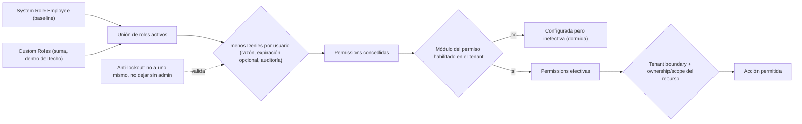

---

# 26. Custom Roles

**[A] Qué puede hacer hoy el TA:**
- Por API: crear, renombrar, cambiar permissions, asignar o quitar a empleados (reemplazo total) y desactivar ("eliminar", soft).
- **No puede:** duplicar, ver qué usuarios tienen un rol (no hay endpoint), reactivar un rol desactivado ni reutilizar su nombre.
- **En el CRM no hay UI** de CRUD de roles.

**[A] Guardrails existentes:**
- No asignables (cubre las 13 PlatformOnly y las 7 peligrosas, por convención).
- `MinPlanTier` y módulos habilitados (solo si hay datos de plan).
- `AllowedActorTypes`.
- Solo un PA crea roles con target PA.

**[D] Guardrails ausentes:**
- **G1 nombres reservados.**
- G5 techo en invitaciones.
- G7 revalidar contra los titulares al editar.
- G8 editar roles de portal.
- Sin fitness test de "PlatformOnly/IsDangerous ⇒ no asignable".
- El grantor no necesita tener lo que otorga. Hoy es inocuo porque solo el TA raíz tiene `roles.manage`.

**[E] Recomendaciones:**
- **MUST:** rechazar nombres de rol que coincidan (sin distinguir mayúsculas) con cualquier `ActorType`, rol de sistema o nombre reservado (`PlatformAdmin`, `TenantAdmin`, `TenantEmployee`, `CustomerPortal`, `Service`, `Tenant Admin`, `Employee`, `Customer Portal`). Además, dejar de usar nombres de rol como autoridad (ver §47 A0).
- **MUST:** publicar `RolePermissionsChanged` al **crear** un rol, y propagar desactivación y cambios con los denies aplicados (fan-out por usuario desde Auth).
- **SHOULD:**
  - UI de CRUD de roles en el CRM, con picker filtrado por el techo y "Duplicar".
  - Endpoint `GET /auth/roles/{id}/users` y reactivación de roles.
  - Unicidad de nombre validada en el handler (hoy da un 409 genérico).
- **SHOULD:** editar permissions de un rol valida contra el actor target del rol (roles de portal) y contra los actores de sus titulares.
- **COULD:** plantillas de rol sugeridas ("Preparer", "Front desk", "Marketing") como custom roles precreados que el TA puede adoptar.
- **NOT RECOMMENDED:** herencia de roles multinivel. El patrón GitHub (rol base + extras) ya se da en la práctica: el usuario tiene Employee más un custom role aditivo.

---

# 27. Permission Ceiling

**[A] Existe parcialmente:** `RolePermissionGuard` (catálogo existente + `IsAssignableByTenant` + `MinPlanTier` + módulo habilitado si se conoce) + `ActorTypeRoleGuard`. **Solo** se aplica al crear o editar custom roles.

**[E] Definición formal propuesta:**

```
Grantable(caller, tenant, targetActor) =
      PermissionCatalog
    ∩ { p | p.IsAssignableByTenant }
    ∩ { p | targetActor ∈ p.AllowedActorTypes }
    ∩ { p | tier(tenant) ≥ p.MinPlanTier }
    ∩ { p | module(p) = null ∨ module(p) ∈ EnabledModules(tenant) }
    − { p | p.PlatformOnly }            (explícito, además de la convención)
    − { p | p.IsDangerous }             (explícito: solo el rol raíz)
    ∩ Effective(caller)                 (solo relevante si roles.manage llegara a delegarse)
```

**Dónde aplicarlo:** crear rol, cambiar permissions de rol, asignar roles (hoy no se revalida plan ni módulo), roles en invitación y **al aceptar la invitación** (R8), e **invitar un TA** (G5: exigir que el caller tenga `roles.manage` efectiva).

**¿A. Impedir seleccionar o B. conservar configurada e inefectiva?**
- **[E] Recomendación: híbrido (industria: Kinde, Notion, lecciones de GitLab):**
  - **Al escribir configuración nueva: A.** No se puede otorgar una permission de un módulo no contratado. Ya es así en `RolePermissionGuard`.
  - **Configuración previa a un downgrade o cancelación: B (dormida).** No se borra de roles, asignaciones ni denies. Queda inefectiva por el gate en runtime y la UI la muestra como "Inactive — requires {module}".
  - **[D] Defecto actual que rompe B:** `RolePermissionGuard` valida el set **completo** al re-guardar, así que un rol con permissions dormidas no se puede editar hasta quitarlas (el bug análogo que tuvo GitLab). **[E]** Validar solo el **delta añadido**.
  - Al re-upgrade, mostrar al TA qué se reactivará.

---

# 28. Entitlement + Permission Interaction

**[A]** El código separa bien los conceptos (Auth ≠ Subscription). La intersección solo ocurre en el module gate, hoy log-only.

| Escenario (del prompt) | Resultado esperado | Resultado HOY | Tras el plan [E] |
|---|---|---|---|
| Tenant con `comms`; TE **sin** `meeting.create` | No crea meeting | **[A]** No crea (403). El botón de agendar sí se oculta en el CRM | Igual |
| Tenant con `comms`; CP con `meeting.join` y **sí** invitado | Participa | **[A]** Participa | Igual |
| Tenant **sin** `comms`; TE con `meeting.create` | No puede | **[D]** **Puede** (gate log-only; el sidebar muestra Meetings) | 403 `Authz.ModuleUnavailable` + oculto en la UI |
| Tenant **sin** `comms`; CP con `meeting.join` | No puede | **[D]** Backend **permite**; el Portal oculta Meetings (`meetingsPlanGuard`), salvo con `plan` null | 403 + oculto sin mensaje comercial |
| Tenant con `comms`; CP con `meeting.join` pero **no** invitado a X | No entra a X | **[A]** Lock, passcode e invitación; **[D]** un token de invitación de otro meeting puede desbloquearlo | Invitación ligada a meeting e invitado |

**Regla [E]:**
- `Efectiva(p) = Concedida(p) ∧ (module(p) = null ∨ Entitled(tenant, module(p)))`.
- La permission sola nunca "compra" la feature y el entitlement solo nunca "autoriza" al actor.
- **Excepciones al gate:** `communication.notification.read` (las notificaciones de solicitudes de documentos llegan por ahí) y, a decidir, `communication.support.open` (soporte de plataforma, no feature del tenant). Hay que eximirlas **antes** de activar Enforce.

---

# 29. Plan → Module Matrix

**[A]** Fuente: `SubscriptionPlanCatalogSeeder.cs:43,59,75-89` y `SubscriptionAddOnCatalogSeeder.cs:18-28`. Son datos de seed; los vivos pueden haber cambiado por los endpoints de admin [B].

| Plan | Module | Included | Add-on Available | Entitlement |
|---|---|---:|---:|---|
| starter | customers | ✓ | — | `module.customers` |
| starter | signatures | ✓ | — | `module.signatures` |
| starter | documents | ✓ | — | `module.documents` |
| starter | planner | ✓ | — | `module.planner` |
| starter | email | ✗ | ✓ `addon-email` $29/mes | `module.email` |
| starter | comms | ✗ | ✓ `addon-comms` $29/mes | `module.comms` |
| starter | campaigns | ✗ | ✓ `addon-campaigns` $29/mes | `module.campaigns` |
| starter | reports | ✗ | ✓ `addon-reports` $29/mes | `module.reports` |
| starter | marketing | ✗ | ✓ `addon-marketing` $49/mes | `module.marketing` |
| starter | builder | ✗ | ✓ `addon-builder` $49/mes | `module.builder` |
| starter | irs | ✗ | ✓ `addon-irs` $49/mes | `module.irs` |
| starter | miles | ✗ | ✓ `addon-miles` $49/mes | `module.miles` |
| pro | customers, signatures, documents, planner, email, comms, campaigns, reports | ✓ | (\*) | `module.*` |
| pro | marketing, builder, irs, miles | ✗ | ✓ ($49/mes c/u) | `module.*` |
| enterprise | los 12 | ✓ | (\*) | `module.*` |

- (\*) **[D]** Se puede comprar un add-on de un módulo que el plan ya incluye: no hay validación (`PurchaseAddOnHandler.cs:190-214`).
- **[A]** Precio anual = 10× el mensual. Los add-ons no traen entitlements de cantidad sembrados.
- **[A]** Seats: `Standard` $15/mes. Cupo efectivo = `seats.max` + seats Standard activos = `MaxStaffUsers`.
- **[A]** El Portal no tiene módulos propios: sus áreas dependen de `documents`, `planner` y `comms`.

---

# 30. Module → Permission Matrix

**[A]** Módulo según `PermissionModuleMap` (el que usaría el gate). "CRM (staff)" / "Customer Portal" = el actor puede recibir la permission según `AllowedActorTypes`. "Enforcement" = sitios del backend que la exigen (`TS` = Node).

| Module | Permission | ActorTypes | CRM (staff) | Customer Portal | Enforcement |
|---|---|---|---:|---:|---:|
| customers | `customers.view` | TE·TA·PA | Sí | No | 7 |
| customers | `customers.view_all` | TE·TA·PA | Sí | No | 26 |
| customers | `customers.manage` | TE·TA·PA | Sí | No | 19 |
| customers | `customers.import` | TE·TA·PA | Sí | No | 1 |
| customers | `customers.fiscalprofile.reveal` | TE·TA·PA | Sí | No | 2 |
| customers | `customers.preparer.manage` | TE·TA·PA | Sí | No | 5 |
| signatures | `signature.request.create` | TE·TA·PA | Sí | No | 24 |
| signatures | `signature.request.read` | TE·TA·PA | Sí | No | 8 |
| signatures | `signature.request.cancel` | TE·TA·PA | Sí | No | 1 |
| signatures | `signature.request.resend` | TE·TA·PA | Sí | No | 2 |
| signatures | `signature.request.expire` | TE·TA·PA | Sí | No | 0 |
| signatures | `signature.request.manage` | TE·TA·PA | Sí | No | 1 |
| signatures | `signature.document.prepare` | TE·TA·PA | Sí | No | 5 |
| signatures | `signature.document.sign` | TE·TA·PA | Sí | No | 1 |
| signatures | `signature.document.view` | TE·TA·PA | Sí | No | 0 |
| signatures | `signature.document.download` | TE·TA·PA | Sí | No | 0 |
| signatures | `signature.document.send` | TE·TA·PA | Sí | No | 1 |
| signatures | `signature.document.audit.read` | TE·TA·PA | Sí | No | 0 |
| signatures | `signature.legal.manage` | TE·TA·PA | Sí | No | 2 |
| signatures | `signature.template.create` | TE·TA·PA | Sí | No | 3 |
| signatures | `signature.template.update` | TE·TA·PA | Sí | No | 14 |
| signatures | `signature.template.delete` | TE·TA·PA | Sí | No | 1 |
| signatures | `signature.settings.manage` | TE·TA·PA | Sí | No | 2 |
| signatures | `signature.preparer.manage` | TE·TA·PA | Sí | No | 0 |
| signatures | `signature.certificate.verify` | TE·TA·PA | Sí | No | 0 |
| signatures | `signature.constraints.manage` | PA | No | No | 2 |
| documents | `documents.view` | TE·TA·PA | Sí | No | 0 |
| documents | `documents.manage` | TE·TA·PA | Sí | No | 0 |
| documents | `documents.branding.manage` | TE·TA·PA | Sí | No | 2 |
| documents | `cloudstorage.file.view` | TE·TA·PA·CP | Sí | Sí | 9 |
| documents | `cloudstorage.file.upload` | TE·TA·PA·CP | Sí | Sí | 4 |
| documents | `cloudstorage.file.download` | TE·TA·PA·CP | Sí | Sí | 2 |
| documents | `cloudstorage.file.delete` | TE·TA·PA | Sí | No | 1 |
| documents | `cloudstorage.settings.manage` | TE·TA·PA | Sí | No | 3 |
| documents | `cloudstorage.audit.view` | TE·TA·PA | Sí | No | 1 |
| documents | `cloudstorage.recyclebin.manage` | TE·TA·PA | Sí | No | 1 |
| documents | `cloudstorage.folder.manage` | TE·TA·PA | Sí | No | 5 |
| documents | `cloudstorage.share.create` | TE·TA·PA | Sí | No | 2 |
| documents | `cloudstorage.share.revoke` | TE·TA·PA | Sí | No | 1 |
| documents | `cloudstorage.share.manage` | TE·TA·PA | Sí | No | 5 |
| documents | `cloudstorage.legal.manage` | TE·TA·PA | Sí | No | 4 |
| documents | `cloudstorage.file.dmca_counternotice` | TE·TA·PA | Sí | No | 1 |
| documents | `scribe.templates.read` | TE·TA·PA | Sí | No | 2 |
| documents | `scribe.templates.write` | TE·TA·PA | Sí | No | 3 |
| documents | `scribe.layouts.read` | TE·TA·PA | Sí | No | 0 |
| documents | `scribe.layouts.write` | TE·TA·PA | Sí | No | 4 |
| documents | `scribe.event_mappings.read` | TE·TA·PA | Sí | No | 2 |
| documents | `scribe.event_mappings.write` | TE·TA·PA | Sí | No | 3 |
| documents | `scribe.campaigns.read` | TE·TA·PA | Sí | No | 0 |
| documents | `scribe.campaigns.write` | TE·TA·PA | Sí | No | 0 |
| documents | `scribe.render` | PA | No | No | 1 |
| planner | `notes.read` | TE·TA·PA | Sí | No | 4 |
| planner | `notes.manage` | TE·TA·PA | Sí | No | 11 |
| planner | `notes.view_all` | TA·PA | Sí | No | 14 |
| planner | `notes.portal.read` | CP | No | Sí | 1 |
| planner | `reminders.read` | TE·TA·PA | Sí | No | 3 |
| planner | `reminders.write` | TE·TA·PA | Sí | No | 6 |
| planner | `tasks.read` | TE·TA·PA | Sí | No | 20 |
| planner | `tasks.write` | TE·TA·PA | Sí | No | 23 |
| planner | `tasks.assign` | TE·TA·PA | Sí | No | 2 |
| planner | `tasks.manage_all` | TE·TA·PA | Sí | No | 1 |
| planner | `tasks.templates.manage` | TE·TA·PA | Sí | No | 8 |
| planner | `tasks.client_requests.manage` | TE·TA·PA | Sí | No | 2 |
| planner | `calendar.read` | TE·TA·PA | Sí | No | 9 |
| planner | `calendar.write` | TE·TA·PA | Sí | No | 5 |
| planner | `calendar.manage_all` | TE·TA·PA | Sí | No | 0 |
| planner | `calendar.types.manage` | TE·TA·PA | Sí | No | 2 |
| planner | `calendar.availability.manage` | TE·TA·PA | Sí | No | 0 |
| planner | `tasks.portal.client_requests` | CP | No | Sí | 1 |
| email | `email.use` | TE·TA·PA | Sí | No | 0 |
| email | `correspondence.read` | TE·TA·PA | Sí | No | 12 |
| email | `correspondence.attachment.download` | TE·TA·PA | Sí | No | 2 |
| email | `correspondence.compose` | TE·TA·PA | Sí | No | 7 |
| email | `correspondence.reply` | TE·TA·PA | Sí | No | 1 |
| email | `correspondence.send` | TE·TA·PA | Sí | No | 1 |
| email | `correspondence.manage` | TE·TA·PA | Sí | No | 8 |
| email | `connectors.accounts.read` | TE·TA·PA | Sí | No | 3 |
| email | `connectors.accounts.write` | TE·TA·PA | Sí | No | 5 |
| email | `connectors.accounts.connect_own` | TE·TA·PA | Sí | No | 2 |
| email | `connectors.accounts.office.read` | TE·TA·PA | Sí | No | 2 |
| email | `postmaster.messages.read` | TE·TA·PA | Sí | No | 1 |
| email | `postmaster.suppression.read` | TE·TA·PA | Sí | No | 1 |
| email | `postmaster.suppression.write` | TE·TA·PA | Sí | No | 2 |
| email | `postmaster.providers.read` | TE·TA·PA | Sí | No | 2 |
| email | `postmaster.providers.write` | TE·TA·PA | Sí | No | 4 |
| comms | `comms.calls` | TE·TA·PA | Sí | No | 0 |
| comms | `communication.chat.start` | TE·TA·PA·CP | Sí | Sí | TS 1 |
| comms | `communication.chat.reply` | TE·TA·PA·CP | Sí | Sí | TS 4 |
| comms | `communication.chat.moderate` | TE·TA·PA | Sí | No | TS 3 |
| comms | `communication.support.open` | TE·TA·PA·CP | Sí | Sí | TS 1 |
| comms | `communication.support.agent` | TE·TA·PA | Sí | No | TS 10 |
| comms | `communication.call.start` | TE·TA·PA·CP | Sí | Sí | TS dyn |
| comms | `communication.videocall.start` | TE·TA·PA·CP | Sí | Sí | TS dyn |
| comms | `communication.call.record` | TE·TA·PA | Sí | No | TS 0 |
| comms | `communication.meeting.create` | TE·TA·PA | Sí | No | TS 1 |
| comms | `communication.meeting.join` | TE·TA·PA·CP | Sí | Sí | TS 1 |
| comms | `communication.meeting.host` | TE·TA·PA | Sí | No | TS 0 |
| comms | `communication.meeting.record` | TE·TA·PA | Sí | No | TS 0 |
| comms | `communication.screenshot.create` | TE·TA·PA·CP | Sí | Sí | TS 0 |
| comms | `communication.group.create` | TE·TA·PA | Sí | No | TS 1 |
| comms | `communication.group.manage_members` | TE·TA·PA | Sí | No | TS 2 |
| comms | `communication.notification.read` | TE·TA·PA·CP | Sí | Sí | TS 0 |
| comms | `communication.settings.manage` | TE·TA·PA | Sí | No | TS 2 |
| comms | `communication.analytics.read` | TE·TA·PA | Sí | No | TS 2 |
| campaigns | `campaigns.manage` | TE·TA·PA | Sí | No | 34 |
| reports | `reports.view` | TE·TA·PA | Sí | No | 0 |
| — (no gateado) | `users.view` | TE·TA·PA | Sí | No | 3 |
| — (no gateado) | `users.invite` | TE·TA·PA | Sí | No | 4 |
| — (no gateado) | `users.manage` | TE·TA·PA | Sí | No | 5 |
| — (no gateado) | `roles.manage` | TE·TA·PA | Sí | No | 4 |
| — (no gateado) | `audit.view` | TE·TA·PA | Sí | No | 2 |
| — (no gateado) | `settings.manage` | TE·TA·PA | Sí | No | 2 |
| — (no gateado) | `billing.view` | TE·TA·PA | Sí | No | 0 |
| — (no gateado) | `billing.manage` | TE·TA·PA | Sí | No | 0 |
| — (no gateado) | `subscription.manage` | TE·TA·PA | Sí | No | 0 |
| — (no gateado) | `invoicing.view` | TE·TA·PA | Sí | No | 4 |
| — (no gateado) | `invoicing.manage` | TE·TA·PA | Sí | No | 7 |
| — (no gateado) | `signatures.request` | TE·TA·PA | Sí | No | 0 |
| — (no gateado) | `portal.calls.use` | CP | No | Sí | 0 |
| — (no gateado) | `portal.miles.use` | CP | No | Sí | 0 |
| — (no gateado) | `portal.folders.view` | CP | No | Sí | 0 |
| — (no gateado) | `sms.send` | TE·TA·PA | Sí | No | 2 |
| — (no gateado) | `sms.read` | TE·TA·PA | Sí | No | 1 |
| — (no gateado) | `sms.manage` | TE·TA·PA | Sí | No | 1 |
| — (no gateado) | `catalog.read` | TE·TA·PA | Sí | No | 4 |
| — (no gateado) | `catalog.write` | TE·TA·PA | Sí | No | 7 |
| — (no gateado) | `catalog.delete` | TE·TA·PA | Sí | No | 2 |
| — (no gateado) | `inventory.read` | TE·TA·PA | Sí | No | 6 |
| — (no gateado) | `inventory.write` | TE·TA·PA | Sí | No | 7 |
| — (no gateado) | `inventory.adjust` | TE·TA·PA | Sí | No | 1 |
| — (no gateado) | `tenant.domains.manage` | TE·TA·PA | Sí | No | 1 |
| — (no gateado) | `notification.settings.manage` | TE·TA·PA | Sí | No | 6 |
| — (no gateado) | `notification.email.send` | TE·TA·PA | Sí | No | 1 |
| — (no gateado) | `notification.email.view` | TE·TA·PA | Sí | No | 2 |
| — (no gateado) | `notification.template.view` | TE·TA·PA | Sí | No | 3 |
| — (no gateado) | `notification.template.manage` | TE·TA·PA | Sí | No | 4 |
| — (no gateado) | `notification.layout.manage` | TE·TA·PA | Sí | No | 2 |
| — (no gateado) | `notification.campaign.view` | TE·TA·PA | Sí | No | 0 |
| — (no gateado) | `notification.campaign.manage` | TE·TA·PA | Sí | No | 0 |
| — (no gateado) | `notification.log.view` | TE·TA·PA | Sí | No | 1 |
| — (no gateado) | `payment_app.saas_payment.read` | TE·TA·PA | Sí | No | 2 |
| — (no gateado) | `payment_app.saas_payment.refund` | TE·TA·PA | Sí | No | 1 |
| — (no gateado) | `payment_app.provider_customer.read` | TE·TA·PA | Sí | No | 1 |
| — (no gateado) | `payment_app.provider_customer.manage` | TE·TA·PA | Sí | No | 4 |
| — (no gateado) | `payment_app.admin.cross_tenant` | PA | No | No | 6 |
| — (no gateado) | `payment_client.config.read` | TE·TA·PA | Sí | No | 2 |
| — (no gateado) | `payment_client.config.manage` | TE·TA·PA | Sí | No | 7 |
| — (no gateado) | `payment_client.payment.read` | TE·TA·PA | Sí | No | 1 |
| — (no gateado) | `payment_client.payment.charge` | TE·TA·PA | Sí | No | 1 |
| — (no gateado) | `payment_client.payment.refund` | TE·TA·PA | Sí | No | 0 |
| — (no gateado) | `payment_client.payment_link.read` | TE·TA·PA | Sí | No | 1 |
| — (no gateado) | `payment_client.payment_link.manage` | TE·TA·PA | Sí | No | 2 |
| — (no gateado) | `payment_client.connect_account.read` | TE·TA·PA | Sí | No | 1 |
| — (no gateado) | `payment_client.connect_account.onboard` | TE·TA·PA | Sí | No | 1 |
| — (no gateado) | `payment_client.payout.read` | TE·TA·PA | Sí | No | 1 |
| — (no gateado) | `payment_client.payout.manage` | TE·TA·PA | Sí | No | 1 |
| — (no gateado) | `payment_client.recurring.read` | TE·TA·PA | Sí | No | 2 |
| — (no gateado) | `payment_client.recurring.manage` | TE·TA·PA | Sí | No | 4 |
| — (no gateado) | `payment_client.admin.cross_tenant` | PA | No | No | 3 |
| — (no gateado) | `branding.manage` | TE·TA·PA | Sí | No | 5 |
| — (no gateado) | `codes.code.read` | TE·TA·PA | Sí | No | 1 |
| — (no gateado) | `codes.code.manage` | TE·TA·PA | Sí | No | 1 |
| — (no gateado) | `codes.code.issue` | TE·TA·PA | Sí | No | 0 |
| — (no gateado) | `codes.code.activate` | TE·TA·PA | Sí | No | 1 |
| — (no gateado) | `codes.code.revoke` | TE·TA·PA | Sí | No | 1 |
| — (no gateado) | `codes.audit.read` | TE·TA·PA | Sí | No | 0 |
| — (no gateado) | `codes.redemption.read` | TE·TA·PA | Sí | No | 0 |
| — (no gateado) | `codes.compensation.manage` | TE·TA·PA | Sí | No | 0 |
| — (no gateado) | `referrals.own.read` | TE·TA·PA | Sí | No | 1 |
| — (no gateado) | `referrals.program.read` | TE·TA·PA | Sí | No | 0 |
| — (no gateado) | `referrals.program.manage` | TE·TA·PA | Sí | No | 0 |
| — (no gateado) | `referrals.attribution.read` | TE·TA·PA | Sí | No | 0 |
| — (no gateado) | `referrals.fraud.read` | TE·TA·PA | Sí | No | 0 |
| — (no gateado) | `referrals.fraud.manage` | TE·TA·PA | Sí | No | 0 |
| — (no gateado) | `referrals.reward.read` | TE·TA·PA | Sí | No | 0 |
| — (no gateado) | `referrals.reward.manage` | TE·TA·PA | Sí | No | 0 |
| — (no gateado) | `referrals.audit.read` | TE·TA·PA | Sí | No | 0 |
| — (no gateado) | `growth.admin.cross_tenant` | PA | No | No | 1 |
| — (no gateado) | `subscription.plan.change` | TE·TA·PA | Sí | No | 5 |
| — (no gateado) | `subscription.suspend` | PA | No | No | 1 |
| — (no gateado) | `subscription.reactivate` | PA | No | No | 1 |
| — (no gateado) | `subscription.renew` | PA | No | No | 1 |
| — (no gateado) | `subscription.admin.cross_tenant` | PA | No | No | 4 |
| — (no gateado) | `seats.manage` | TE·TA·PA | Sí | No | 6 |
| — (no gateado) | `addons.manage` | TE·TA·PA | Sí | No | 3 |
| — (no gateado) | `tenant.status.change` | PA | No | No | 1 |
| — (no gateado) | `tenant.list.view` | PA | No | No | 1 |
| — (no gateado) | `onboarding.admin.manage` | PA | No | No | 2 |
| — (no gateado) | `platform.branding.manage` | PA | No | No | 5 |

---

# 31. TaxVision_Front Current Authorization

**[A] Bootstrap:**
- **Initializer:**
  - Solo corre si hay access token no expirado; bloquea en `GET /auth/me` y traga el error (`FE\core\config\auth-initializer.ts:14-26`).
  - **[D]** Si recargas con el access token expirado y el refresh vigente, **no intenta refrescar** y te manda a `/login`.
- **Shell:**
  - `canActivateChild: [authGuard]` lee `actor_type` **del JWT**: rechaza CP, aplica el gate de Terms (fail-open) y el de enrolamiento MFA.
  - AppShell carga branding, `GET /subscriptions/me` (solo para el banner), socket, notificaciones, conversaciones y el listener `session.revoked`.
- **Campos de `/auth/me` usados:**
  - `permissions[]` → `PermissionService`, y 7 lecturas directas `permissions.includes(...)` que la evitan.
  - `actorType` → `isAdmin` (TA o PA).
  - `roles[0]` → chip del navbar.
  - `tenant`, `id`, `email`, etc.
  - **`plan` (code, maxUsers, isSuspendedForBilling, enabledModules): nunca se lee.**
- **[A] Re-fetch de `/auth/me`:** solo en bootstrap, login, MFA, central login (sin await), en el shell si `currentUser` es null y tras editar el perfil. **Nunca** tras un refresh de token, TokenStale, cambio de roles u overrides, compra de add-on o seats, ni cambio de plan.
- **[A] Primitivas:**

| Primitiva | Archivo | Uso real |
|---|---|---|
| `PermissionService.has/hasAny/hasAll/isAdmin` | `FE\core\auth\permission.service.ts:14-57` | Se usan `has`, `hasAny` e `isAdmin`; `hasAll`, `hasRole` e `isActor` no |
| `*appHasPermission` | `FE\shared\directives\has-permission.directive.ts:24-55` | **Solo** 4 botones de la cabecera de Tasks |
| `permissionGuard(...)` | `FE\core\auth\permission.guard.ts:15-21` | Solo `/sms` (`sms.read`) y `/task` (`tasks.read`). Redirige a `/dashboard` en silencio |
| Guard de módulo/plan | — | **No existe** |
| Guard de actor (rutas TA) | — | **No existe** |
| Capability signals por feature | `ClientPermissions`, `SmsCapabilities`, `ConnectorsCapabilities` | `canRevealFiscal`, `canView` y `canManagePreparer` definidos y **sin uso**; `canImport` ignora `customers.import` |

- **[D] Carreras:** `permissionGuard` puede correr antes de que resuelva `/me` (central login sin await; `/me` fallido en bootstrap) → redirección falsa.

---

# 32. TaxVision_Front Sidebar Audit

**[A]** `FE\layout\sidebar\sidebar.component.ts:114-133`. `canShowItem` oculta un item solo si declara `requiredPermissions` y el usuario no tiene ninguna. `canShowSubItem` siempre devuelve `true`. `visibleForRoles` está declarado y sin uso.

| Item | Ruta | Condición actual | ¿Se oculta sin módulo? | ¿Se oculta sin permission? | Correcto |
|---|---|---|---|---|---|
| Dashboard | /dashboard | ninguna | n/a | no | Sí (pero todos sus widgets cargan, ver §34) |
| Mail | /email | ninguna | **no** (`email`) | no | No |
| Task | /task | ninguna (la ruta sí tiene guard) | no (`planner`) | **no: se muestra y luego redirige en silencio** | No |
| Clients | /clients | ninguna | no | no | Parcial |
| Documents | /documents | ninguna | no | no | Parcial |
| Billing | /billing | ninguna | n/a | no | Parcial |
| Products/Services | /products-services | ninguna | n/a | no | Parcial |
| Inventory | /inventory | ninguna | n/a | no | Parcial |
| Signature | /signature | ninguna | no | no | No |
| SMS | /sms | `requiredPermissions: ['sms.read']` | no | **sí** | Parcial (falta módulo) |
| Chat | /chat | ninguna | **no** (`comms`) | no | No |
| Meetings | /meetings | ninguna | **no** (`comms`) | no | No |
| Support | /support | ninguna | no | no | Revisar |
| **Campaigns** | /campaigns | ninguna | **no** (`campaigns`) | **no** (el TE no tiene `campaigns.manage`) | **No** |
| AI | /ai-assistant | ninguna | n/a | no | n/a (sin backend) |
| Workflow | /workflow | ninguna | no (`builder` sin backend) | no | No |
| Subscription | /subscription | ninguna | n/a | no | No (acciones de TA) |
| Settings | /settings | ninguna | n/a | no | Parcial |
| Navbar: User management, Company settings | /company/* | ninguna | n/a | no | **No** |

- **[D]** El indicador resalta el item equivocado cuando se oculta alguno (`sidebar.component.ts:396-397`).
- **[D]** Los comentarios están obsoletos ("no hay auth", `sidebar.component.ts:31-39`; `app-shell.component.ts:39-43`).

---

# 33. TaxVision_Front Route Audit

**[A]** Todas las rutas hijas del shell pasan por `authGuard`. El único guard adicional es `permissionGuard` en `/sms` y `/task`. No hay `canMatch`, así que los chunks prohibidos se descargan igual.

| Ruta | Guard actual | Debería requerir [E] |
|---|---|---|
| dashboard | auth | auth (widgets gateados individualmente) |
| billing | auth | `invoicing.view` |
| plans, checkout | auth | TA (checkout) · catálogo público (plans) |
| subscription | auth | TA (`subscription.plan.change` o `billing.view`) |
| workflow, workflow/:id | auth | módulo `builder` (hoy sin backend) |
| documents, storage | auth | módulo `documents` + `cloudstorage.file.view` |
| support | auth | `communication.support.open` (exento del gate) |
| settings, settings/billing | auth | settings: auth · billing: `payment_client.config.read` |
| products-services, inventory | auth | `catalog.read` / `inventory.read` |
| chat | auth | módulo `comms` + `communication.chat.start` o `chat.reply` |
| meetings | auth | módulo `comms` + `communication.meeting.join` o `meeting.create` |
| email | auth | módulo `email` + `correspondence.read` o `connectors.accounts.read` |
| task | `tasks.read` | módulo `planner` + `tasks.read` |
| campaigns | auth | módulo `campaigns` + `campaigns.view` (o `manage` hoy) |
| signature, signature/templates | auth | módulo `signatures` + `signature.request.read` · templates: `signature.template.update` |
| clients, clients/:id | auth | módulo `customers` + `customers.view` |
| clients/import | auth (link oculto a no-admins, URL abierta) | `customers.import` + TA |
| company/users | auth | `users.view` |
| company/settings | auth | `settings.manage` o `branding.manage` |
| sms | `sms.read` | `sms.read` (SMS no es módulo) |
| templates | auth | `notification.template.view` |
| referrals | auth (sin menú) | `referrals.own.read` |
| profile, notifications | auth | auth |
| `**` | NotFoundPage (fuera del shell) | se conserva |

---

# 34. TaxVision_Front Action/Button Audit

**Súper matriz CRM** (formato del prompt). Entitlement = módulo del backend. "—" = ninguno.

| Module/Page/Action | Route | Entitlement | Permission (backend) | ActorType | Current Guard | Current UI | Gap |
|---|---|---|---|---|---|---|---|
| Dashboard: 13 widgets | /dashboard | mixto | por widget | staff | auth | Todos visibles; los errores salen como tarjeta | [D] Widgets de módulos no contratados o sin permission cargan y fallan |
| Dashboard: banner PRO → /plans | /dashboard | — | — | staff | — | Visible para todos, incluidos TE y tenants top | [D] Upsell a empleados; `/plans` sin compra y con copy de desarrollador |
| Dashboard: widget de notas (composer) | /dashboard | planner | `notes.manage` | staff | — | Composer oculto; la lista falla | [D] El TE no tiene `notes.read` |
| Dashboard: uso de storage | /dashboard | documents | `cloudstorage.settings.manage` | staff | — | Tarjeta de error | [D] 403 para TE |
| Clients: directorio | /clients | customers | `customers.view` | staff | auth | Sin estado 403 específico | [D] `canView` sin uso |
| Clients: crear/editar | panel | customers | `customers.manage` | staff | — | Gateado (`canManage`) | OK |
| Clients: status/archivar/bulk | tabla | customers | `customers.manage` + actor TA | TA | — | Gateado (manage + isAdmin) | OK |
| Clients: asignar staff | diálogo | customers | `customers.preparer.manage` + TA | TA | — | Gateado | OK |
| Clients: importar | /clients/import | customers | `customers.import` + TA | TA | **sin guard** | Link oculto a no-admins; la URL abre | [D] Ignora `customers.import` |
| Clients: SSN/EIN y Active en el alta | panel | customers | TA / fiscal | TA | — | Siempre visible | [D] **Pérdida silenciosa** (`clients.store.ts:335-357`) |
| Client profile: Edit (cabecera) | /clients/:id | customers | `customers.manage` | staff | — | Siempre visible | [D] 403 genérico |
| Client profile: Info, direcciones, contactos | tab | customers | `customers.manage` | staff | — | Todos los botones visibles | [D] |
| Client profile: **Reveal SSN/EIN** | tab Info | customers | `customers.fiscalprofile.reveal` | staff | — | **Siempre visible** | [D] 403 con "Something went wrong" |
| Client profile: Family | tab | customers | `customers.manage` | staff | — | Todo visible | [D] |
| Client profile: Documents | tab | documents | `cloudstorage.file.*` | staff | — | Gateado | Casi OK (lista aunque `!canView`) |
| Client profile: Work/Requests | tab | planner | `tasks.*`, `client_requests.manage` | staff | — | Gateado | OK |
| Client profile: Notes (composer) | tab | planner | `notes.manage` | staff | — | Composer siempre visible | [D] Inconsistente con el dashboard; 403 para TE |
| Client profile: Calls (Audio/Video) | tab | comms | `communication.call.start` / `videocall.start` | staff | — | Sin gating | [D] Chat sí gatea, esta pestaña no |
| Client profile: Reminders (Create) | tab | planner | `reminders.write` | staff | — | Siempre visible | [D] |
| Client profile: Portal access | tab | — | `users.invite/manage/view` + TA | TA | — | Gateado | OK |
| Client profile: pestañas Signature/SMS/Meetings | — | — | — | — | — | No existen | n/a (evaluar con §29 del prompt) |
| Documents: todas las acciones (subir, carpeta, renombrar, mover, compartir, borrar, bulk, papelera) | /documents | documents | `cloudstorage.*` | staff | auth | **Nada gateado** | [D] 403 en borrar/papelera/share manage; "Public sharing off" falso |
| Signature: cabecera (My signature, From template, Templates, Categories, New) | /signature | signatures | varias | staff | auth | Todo visible | [D] Las plantillas dan 403 al TE |
| Signature: acciones de fila (send, resend, extend, PIN, preparer, cancel, delete) | tabla | signatures | varias | staff | — | Solo por estado | [D] Cancel/expire → 403 |
| Signature: deliver copies | editor | signatures | `signature.document.send` | staff | — | Gateado | OK |
| Signature: templates | /signature/templates | signatures | `signature.template.*` | staff | **sin guard** | Sin gating | [D] |
| Task board | /task | planner | `tasks.read` | staff | perm | Cabecera gateada; drag, drawer y timer sin gating | Parcial |
| Chat | /chat | comms | `chat.start/reply`, `group.create`, `call.*` | staff | auth | Grupos y llamadas gateados | [D] Sin módulo; TokenStale se muestra como "may require a plan upgrade" |
| Call overlay: grabar / video | global | comms | `call.record`, `videocall.start` | staff | — | Gateado | OK (el backend no aplica `call.record`) |
| Meetings: agendar / grabar | /meetings | comms | `meeting.create`, `meeting.record` | staff | auth | Gateado | [D] Sin módulo ni `meeting.join` |
| Mail: conectar buzón | /email | email | `connectors.accounts.write` / `connect_own` | staff | auth | Gateado + empty state | OK |
| Mail: compose/reply/send | /email | email | `correspondence.compose/reply/send` | staff | — | Solo por estado | [D] Sin módulo |
| Mail: **Delete forever** | /email | email | `correspondence.manage` | staff | — | Visible | [D] 403 para TE |
| **Campaigns: todo** | /campaigns | campaigns | `campaigns.manage` | staff | **auth** | **Todo visible** | [D] 403 total para TE; sub-listas vacías en silencio |
| SMS | /sms | — | `sms.read/send/manage` | staff | perm | Gateado | OK (mejor feature) |
| Billing: facturas (crear, emitir, pago, anular, borrar, CSV) | /billing | — | `invoicing.*` | staff | auth | Visible | OK para TE por defecto; "Email invoice" → 403; status/reissue → 404 |
| Billing: payment links | tab | — | `payment_client.payment_link.manage` | staff | — | Visible | [D] 403 para TE |
| Settings/billing: proveedores | /settings/billing | — | `payment_client.config.manage` | staff | auth | Visible | [D] 403 para TE |
| Company settings: perfil legal | /company/settings | — | `invoicing.manage` | staff | auth | Save visible | [D] El TE **sí puede** cambiar el emisor legal |
| Company settings: branding | /company/settings | — | `branding.manage` | staff | auth | Visible | [D] 403 genérico |
| Users & roles: página completa | /company/users | — | `users.view/invite/manage`, `roles.manage` | TA | auth | **Todo visible** | [D] Errores rojos o silenciosos para TE |
| Users: invitar (incluye "Admin") | panel | — | `users.invite` + TA | TA | — | Visible para todos | [D] |
| Users: Manage roles / Edit access | drawer | — | `roles.manage` | TA | — | Visible | [D] Ofrece PlatformOnly y permissions fuera de plan; sin `permissionsVersion` |
| Users: suspender/offboard | menú | — | `users.manage` | TA | — | Visible | [D] |
| Custom roles CRUD | — | — | `roles.manage` | TA | — | **No existe** | [D] |
| Subscription: seats, add-ons, audit | /subscription | — | `seats.manage`, `addons.manage`, `audit.view` | TA | auth | Botones visibles | [D] 403 para TE |
| Buy seats (3 accesos) | varios | — | `seats.manage` | TA | — | Visible | [D] |
| Banner Renew | shell | — | `subscription.plan.change` + TA | TA | — | isAdmin | Casi OK (ignora la permission) |
| Referrals | /referrals | — | `referrals.own.read` | staff | auth (sin menú) | Línea de error | [D] |
| Reports | — | reports | `reports.view` | — | — | No existe UI | n/a |
| Plataforma (PA) | — | — | PlatformOnly | PA | — | No existe (PA = isAdmin) | n/a |

**Acciones destructivas o admin sin gating [D]:**
- Reveal SSN, borrar archivo o carpeta, vaciar papelera, compartir o revocar, exportar CSV o zip, purgar email, cancelar o extender firma.
- Gestionar roles, overrides, suspender, dar de baja e invitar.
- Comprar seats y add-ons, branding y perfil de la empresa, proveedores de pago.

---

# 35. CLIENTTAXPROFRONTEND Current Authorization

**[A] Bootstrap:**
- `clientPortalGuard` (`PT\core\auth\client-portal.guard.ts:27-86`) en el shell: sin token o con access expirado → login (**no intenta refresh**, [D]).
- En la primera entrada consulta Terms y luego `/me`. Cualquier error salvo throttle → login, **incluido un 500** [D].
- Arranca el socket, las llamadas y `session.revoked`.

**Campos de `/me` usados:**
- `actorType === 'CustomerPortal'`.
- `customerId` (Documents, Requests, Dashboard; el guard no valida que exista).
- `tenant.id` (branding).
- `plan.enabledModules` **solo `'comms'`** (`meetings-plan.guard.ts:19-20`, `sidebar.component.ts:149-151`).
- `permissions` **solo** `communication.call.start/videocall.start` (`customer-taxtalk.component.ts:178-180`).
- `isSuspendedForBilling` y `roles` no se usan.

**Guards:**
- `meetingsPlanGuard`: deja pasar si `plan` es null y redirige al dashboard en silencio.
- `customerAuthGuard` y `CompanyFeatureService` son código viejo sin uso real.

**[D] Sidebar:** solo filtra Meetings. El filtro se calcula una vez con el viejo `CompanyFeatureService.serviceLevel$` y **no reacciona** a `currentUser`.

**[D] Sin ruta `**`:** una URL desconocida produce NG04002 en consola y pantalla en blanco.

**[D] Rutas mal apuntadas:** `/me/*`, `/mfa/*` y `/sessions/*` se llaman **sin `/auth`** (`PT\core\auth\auth.service.ts:258-313`) → 404. MFA, sesiones y cambio de email o teléfono quedan rotos (B-1 del rediseño).

**[D] Otros:**
- El socket usa un token fijo (sin función `auth`) y no maneja `connect_error`.
- El interceptor viejo (`universal-auth.interceptor.ts`) sigue activo si queda `customer_auth_token` en localStorage.

---

# 36. CustomerPortal Module Audit

| Module | Tenant Entitlement | CustomerPortal Permission | Ownership Required | Visible Today | Correct? |
|---|---|---|---|---|---|
| Documents | `documents` (log-only) | `cloudstorage.file.view/upload/download` | Sí: `StorageActorScope` (ownerType Customer + `customer_id`) → 404 ajeno | Sí (sin guard) | Backend de ownership **sí**; plan **no**. Impacto bajo: todos los planes sembrados incluyen `documents` |
| Requests (Tasks) | `planner` (log-only) | `tasks.portal.client_requests` | Sí: `customer_id` del token; submit valida que el request sea del cliente; **`FileId` sin validar** | Sí | Parcial |
| Notes (modal del dashboard) | `planner` (log-only) | `notes.portal.read` | Sí: target = cliente o 404; solo ClientVisible | Sí | Sí (plan no) |
| Chat | `comms` (log-only; Node sin enforce) | `communication.chat.start/reply` | Participante; **DM cliente↔cliente permitido** con los gates apagados | Sí | **No** |
| Support | `comms` vía `support.open` | `communication.support.open` | Opener | Sí | Decidir: es soporte de **plataforma** |
| Calls | `comms` | `communication.call.start` | Accept/end de caller o callee; **initiate sin relación con el callee** | Botón con permission (solo Direct) | **No** |
| Video calls | `comms` | `communication.videocall.start` | Igual | Igual | **No** |
| Meetings | `comms` | `communication.meeting.join` (lista y stats sin chequeo) | Host, participante o invitado; lock, passcode y sala de espera; **token de invitación no ligado** | Oculto sin `comms` (`meetingsPlanGuard`), salvo `plan` null | Frontend casi sí; backend **no** |
| Notifications | nada efectivo | `communication.notification.read` (nunca validada) | Propio | Sí | **Sí, y debe seguir abierto** (eximir del gate) |
| Profile / MFA / Sessions | — | autoservicio | Propio | Sí | Autorización bien; **rutas rotas (404)** |
| Signature | `signatures` | ninguna para CP | — | No existe en el portal (la firma pública vive en el CRM `/sign/:token`) | Sí |
| Branding | — | `GET /tenants/{id}/brands/{surface}` | Tenant del token | Sí | Sí |

---

# 37. CustomerPortal Permission Audit

**[A]** El rol Customer Portal tiene 14 permissions (§10). Todas se siembran en **todos** los tenants, **sin filtrar por plan**. `/auth/me` devuelve `communication.*` a clientes de tenants Starter.

**[D] Permissions de CP nunca validadas:** `portal.folders.view`, `communication.screenshot.create`, `communication.notification.read`. En catálogo y sin conceder ni usar: `portal.calls.use`, `portal.miles.use`.

**[D]** El TA puede denegar permissions a un cliente concreto (overrides), pero el Portal solo lo refleja en los dos botones de llamada.

**[D] Settings de Communication del tenant** (llamadas, video, meetings, soporte on/off): se guardan pero **no se aplican** (`tenant-settings-provider.ts:6-19`, `initiate-call.ts:14-17`).

**Súper matriz Portal** (formato del prompt):

| Module/Page/Action | Route | Entitlement | Permission | ActorType | Ownership | Current Guard | Gap |
|---|---|---|---|---|---|---|---|
| Dashboard: stats de documentos | /client/dashboard | documents | `cloudstorage.file.view` | CP | `customer_id` | shell | [D] Sin estado de error específico |
| Dashboard: "Requested from you" y banner | /client/dashboard | planner | `tasks.portal.client_requests` | CP | `customer_id` | shell | [D] Sin plan |
| Dashboard: notas visibles (modal) | — | planner | `notes.portal.read` | CP | target = cliente | shell | Plan no |
| Dashboard: botón "Chat & Video Call" | /client/dashboard | comms | `chat.*` / `call.*` | CP | participante | shell | [D] Visible sin `comms` |
| Documents: listar y buscar | /client/documents | documents | `file.view` | CP | scope cliente (servidor limita `take` a 100, el front pide 500) | shell | [D] Búsqueda incompleta |
| Documents: subir | /client/documents | documents | `file.upload` | CP | `CanCreate` (cualquier folderType propio) | shell | [D] Sin restricción de folderType |
| Documents: descargar / zip | /client/documents | documents | `file.download` | CP | `CanAccess` | shell | OK |
| Requests: listar y enviar documentos | /client/requests | planner | `tasks.portal.client_requests` + upload | CP | request del cliente; **FileId sin validar** | shell (403 con mensaje) | [D] |
| Chat: listar y leer | /client/chat | comms | — (HTTP sin permission) | CP | participante | shell | [D] Sin plan; 403 → "No conversations yet" |
| Chat: iniciar DM | /client/chat | comms | `communication.chat.start` | CP | **ninguno (puede escribir a otros clientes)** | shell | [D] |
| Chat: enviar, editar, reaccionar, reenviar | /client/chat | comms | `communication.chat.reply` | CP | participante | shell | Plan no |
| Chat: adjuntos | /client/chat | comms | `screenshot.create` (no validada) | CP | participante | shell | [D] |
| Calls / video: iniciar | /client/chat | comms | `call.start` / `videocall.start` | CP | **sin relación con el callee** | botón gateado por permission | [D] |
| Meetings: lista y stats | /client/meetings | comms | — | CP | host/participante/invitado | `meetingsPlanGuard` | Parcial |
| Meetings: join por link o código | /client/meetings/join/:id, by-code/:code | comms | `meeting.join` | CP | invitación/lock/passcode; **token no ligado**; by-code roto (UUID) | `meetingsPlanGuard` | [D] |
| Support | /client/support | comms (decidir exención) | `support.open` | CP | opener | shell | Decidir |
| Notifications | /client/notifications | (exento) | `notification.read` (no validada) | CP | propio | shell | OK funcional |
| Profile: MFA, sesiones, email, teléfono | /client/profile | — | autoservicio | CP | propio | shell | [D] **404 por rutas sin `/auth`** |
| URL desconocida | cualquier | — | — | — | — | **no hay `**`** | [D] Pantalla en blanco |

---

# 38. CustomerPortal Ownership

- **[A] Documents:** `CanCreate` (upload), `CanAccess` (complete, get, download, zip; 404 si es ajeno). La lista se fuerza al cliente e ignora `ownerType`/`ownerId` del request. Sin `customer_id` no se ve nada.
- **[A] Tasks:** `customer_id` del token; submit valida el request. **[D]** No valida el dueño del `FileId`.
- **[A] Notes:** target = cliente o 404; solo ClientVisible (incluye archivadas).
- **[A] Communication:** participante en conversaciones, mensajes, adjuntos y subidas. Un no participante recibe **400** en lugar de 403. Meetings por host, participante o invitado. Soporte por opener. Notificaciones propias.
- **[D] IDOR y fugas:**
  1. **ALTO:** `GET /communication/customers/:customerId/calls` solo exige login y devuelve el historial, `recordingFileId`, conversaciones y `clientUserId` de **cualquier** cliente.
  2. **MEDIO:** DM y llamadas **cliente↔cliente** (el chequeo de asignación está apagado por defecto; `call.initiate` no tiene ninguno).
  3. **BAJO/MEDIO:** un token de invitación válido de un meeting desbloquea **otro** meeting bloqueado del tenant.
  4. **BAJO:**
     - `offboarding-impact` revela conteos.
     - Presencia de cualquier userId.
     - TURN sin permission.
     - `by-code` busca **cross-tenant** y devuelve título y host.
  5. **MEDIO:** broadcasts de `t:{tenant}` (`mail.incoming` con customerId, `customer.changed`, `signature.request.changed`, presencia) llegan a sockets CP y Guest.
  6. **MEDIO:** `/storage/private/{token}` `TenantOnly` es resoluble por CP.

### Diagrama 15 — Resource ownership CustomerPortal (recomendado)

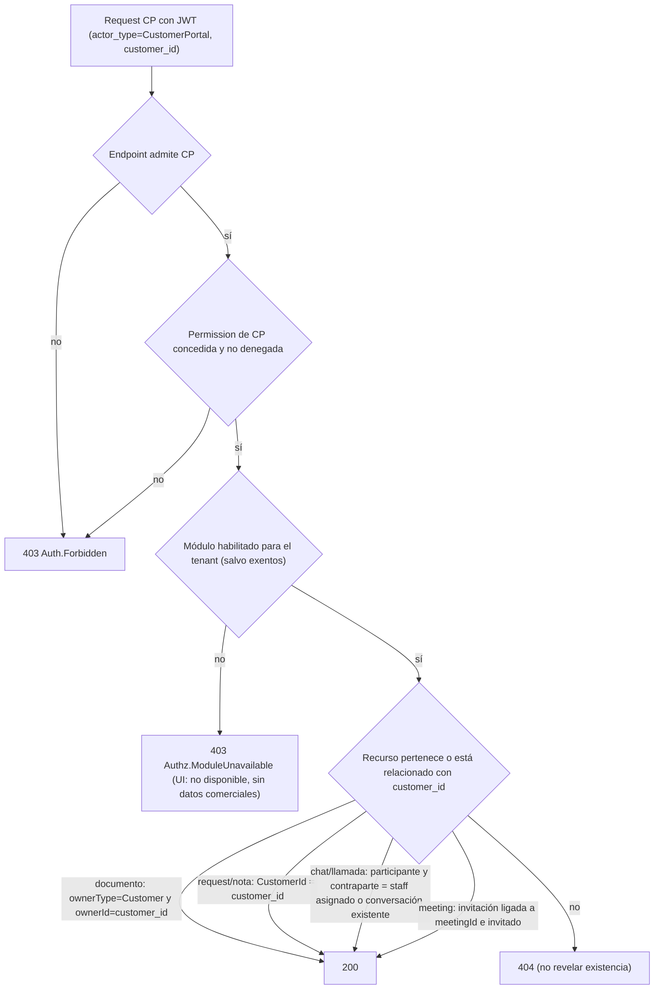

---

# 39. Direct URL Access

| Caso | CRM hoy | Portal hoy | Recomendado [E] |
|---|---|---|---|
| TE sin permission escribe `/campaigns` | **[D]** Entra, renderiza y las APIs fallan (403 genérico o vacío silencioso) | n/a | `canMatch` + `canActivate` del guard compuesto → `/forbidden` con copy neutro; el chunk no se descarga |
| Tenant sin `comms` → `/meetings` (CRM) o `/client/meetings` (Portal) | **[D]** Entra y el backend responde 200 (log-only) | **[A]** Redirige al dashboard en silencio (salvo `plan` null) | CRM: `/not-available` (admin: CTA; empleado: "ask your admin"). Portal: estado "This feature isn't available for your account" **sin datos comerciales**. Backend: 403 `Authz.ModuleUnavailable` |
| `/sms`, `/task` sin permission | **[A]** Redirección silenciosa a `/dashboard` | n/a | `/forbidden` (no redirigir en silencio) |
| URL inexistente | **[A]** NotFoundPage | **[D]** Pantalla en blanco | `**` → Not Found en ambos |
| Recurso de otro cliente (`/clients/:id` no asignado, documento ajeno) | **[A]** El perfil trata 403 y 404 igual ("not found / no access") | **[A]** 404 del backend | 404 en todos los casos (no revelar existencia) |

### Diagrama 14 — Route guard compuesto (recomendado, ambos frontends)

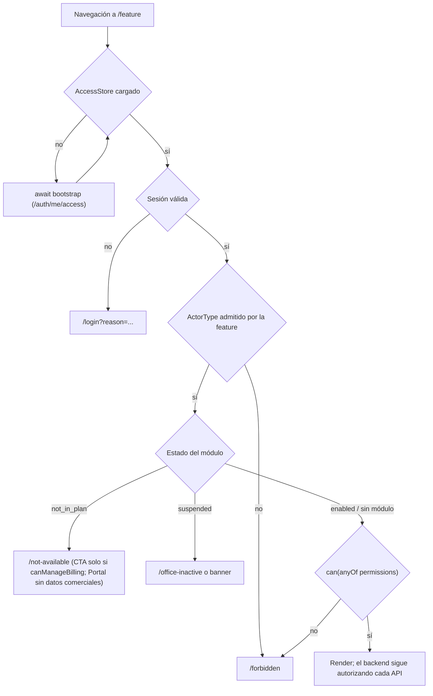

---

# 40. 401 / 403 / 404 / 429 / 500 / 502

**[A] Estado actual:**

| Código | CRM | Portal |
|---|---|---|
| 401 | Refresh single-flight y reintento. **[D] Bug:** el `catchError` también envuelve el **reintento**, así que un 400/401/403 del reintento → `logoutLocal()` y redirect a `/login` (`error.interceptor.ts:64-80` + `refresh-failure.ts:12`). Caso típico: revocan una permission → 401 TokenStale → refresh OK → reintento 403 → **logout**. Recarga con access expirado → login sin intentar refresh | Refresh single-flight. El guard no refresca. El interceptor viejo interfiere si queda token legacy |
| 401 `Auth.SessionRevoked` | Socket `session.revoked` → modal + logout (OK). Por HTTP es un 401 genérico → refresh (que falla) → login | Igual (depende del socket de token fijo) |
| 403 | Solo `Auth.SubscriptionInactive` tiene manejo global (banner, sin logout). Un 403 vacío → "Something went wrong. Please try again." `Auth.Forbidden` solo se mapea en `toUserMessage` (48 usos frente a 243 de `toApiError().message`). `Authz.ModuleUnavailable` sin mapear. **No hay página 403** | Sin manejo global. Solo Requests muestra un mensaje de 403; el resto, toast genérico o vacío engañoso ("No conversations yet"). `SubscriptionInactive` en sesión termina en **login** en lugar de `office-inactive` |
| 404 | `**` → NotFoundPage. En API, por página | **Sin `**`** → pantalla en blanco |
| 429 / 503 throttle | Toast global con countdown; GET ≤ 5 s reintenta una vez (OK) | Igual (OK); el guard reintenta hasta 2 veces |
| 500 / 502 | Por página; sin `ErrorHandler` global ni recuperación de chunk-load | Mensaje genérico por página; un 5xx en `/me` → **login** |

**[A] Backend:** los 403 de `[HasPermission]` y `[AllowActorTypes]` salen **con body vacío**, así que la UI no puede distinguir "sin permission" de "módulo no incluido" o "actor". Esto hay que resolverlo en el backend primero.

**[E] Diseño (responsabilidades, ambos frontends):**

| Situación | Señal del backend | UX | Nunca |
|---|---|---|---|
| Sesión inválida/expirada | 401 (sin código o `Auth.TokenExpired`) | Un refresh single-flight → reintento **una vez**. Si el refresh falla: modal "Your session expired" → login con `returnUrl` | Refrescar en bucle |
| Sesión revocada | 401 `Auth.SessionRevoked` / socket `session.revoked` | Modal "Your session was ended" (motivo si existe) → login | Seguir mostrando módulos |
| Token desactualizado | 401 `Auth.TokenStale` | Refresh silencioso → **refetch de access** → reintento | Logout |
| Sin permission | 403 `Auth.Forbidden` (body RFC 9457 con `code` y `reason: permission_denied`) | Refetch de access (con throttle). Si sigue denegado: estado o página `/forbidden` "You don't have access to this section. Ask your administrator." | Logout; upsell |
| Módulo no incluido | 403 `Authz.ModuleUnavailable` (`reason: module_not_entitled`, `module`) | CRM: TA con `canManageBilling` → "Available with an add-on" + CTA; TE → "Not available for your office. Ask your administrator." Portal → "This feature isn't available for your account." | Mostrar precios o planes a TE o CP |
| Suscripción inactiva | 403 `Auth.SubscriptionInactive` | CRM: banner o bloqueo (TA puede renovar). Portal: `/office-inactive` | Login |
| Recurso invisible o inexistente | 404 | "We couldn't find that" | Distinguir "existe pero no puedes" |
| Throttle | 429/503 + `Retry-After` | Countdown; reintento automático de GET cortos | Logout |
| Error del servidor | 500 | "Something went wrong on our side. Try again." + correlationId (copiable) | Stack traces |
| Upstream caído | 502/503/504 | "Service temporarily unavailable. We'll retry." con backoff | Tratarlo como 401 |

---

# 41. Permission Revocation During Session

**[A] Qué pasa hoy si el TA revoca `cloudstorage.file.upload` a Juan (deny):**
1. Auth: `UserPermissionDenies` actualizado, `perm_v++`, `UserRolesChanged` con los codes efectivos (sin upload) y auditoría.
2. CloudStorage consume el evento y reemplaza la proyección de Juan. Además hay un cache local de 30 s.
3. La próxima llamada de Juan a **cualquier** `[HasPermission]` de CloudStorage (o de un servicio que ya procesó el evento) → **401 `Auth.TokenStale`** (JWT `perm_v` < proyección).
4. **CRM:** refresh → nuevo JWT con `perm_v` actual → reintento. Si el reintento era la subida, da 403 → **[D] bug: logout forzado.** Si era una lectura, pasa, pero la UI **sigue ofreciendo Upload** porque `/me` no se refetch.
5. **Portal:** igual con su interceptor. Sin refetch de `/me`.
6. **Node:** TokenStale en ack de socket → se muestra como fallo genérico.

**Latencia [A]:**
- Auth: inmediata.
- Servicios downstream: lo que tarde el evento (segundos) más ≤ 30 s de cache.
- Cambios de permissions de **rol**: no suben `perm_v`, así que no hay 401. El set cambia tras el evento y la cache (y con G3 se pierden los denies).

**[E] Solución más simple y robusta:**
1. Backend: mantener `perm_v` para cambios a nivel de usuario (fuerza el refresh del token en el próximo request). **No** subirlo para cambios de rol.
2. Backend: tras `UserRolesChanged` o `RolePermissionsChanged`, Communication (que ya consume ambos) emite `access.changed` **sin payload sensible** a `t:{tenant}:u:{user}` de los afectados. Reutiliza la infraestructura de `session.revoked`. **No hace falta infraestructura nueva.**
3. Frontend: al recibir `access.changed`, o un 401 `TokenStale` resuelto, o un 403 → **refetch del bootstrap de acceso** (con throttle y ETag) → recalcular sidebar, guards y botones → si la ruta actual ya no se permite, navegar a `/forbidden` con un toast.
4. Backstop: refetch en `visibilitychange` o `focus` y al reconectar el socket; access token de 15 min.
5. Resultado: **inmediato** si hay socket; **al próximo request** si no; **siempre** coherente tras un 403.

### Diagrama 11 — Permission revocation (recomendado)

```mermaid
sequenceDiagram
  participant TA as TenantAdmin (CRM)
  participant AUTH as Auth
  participant BUS as RabbitMQ
  participant SVC as CloudStorage
  participant COMM as Communication
  participant J as Juan (CRM)
  TA->>AUTH: PUT /auth/users/{juan}/permission-overrides (deny upload, reason)
  AUTH->>AUTH: guardar deny, perm_v++, auditoría
  AUTH->>BUS: UserRolesChanged (codes efectivos, perm_v)
  BUS->>SVC: actualizar proyección de Juan
  BUS->>COMM: actualizar proyección + emitir access.changed a t:{tenant}:u:{juan}
  COMM-->>J: socket access.changed
  J->>AUTH: GET /auth/me/access (If-None-Match)
  AUTH-->>J: 200 permisos efectivos sin upload
  J->>J: ocultar Upload; si la ruta actual ya no se permite -> /forbidden
  Note over J,SVC: Sin socket: el próximo request da 401 TokenStale -> refresh -> refetch access; un 403 posterior nunca hace logout
```

---

# 42. Entitlement Change During Session

**[A] Hoy:**
- Subscription recalcula → evento → proyecciones (13 servicios), Auth `TenantPlanLimits` y Communication.
- **Sin push al frontend** (Communication solo limpia caches).
- Los módulos no están en el JWT, así que no hay `perm_v`.
- El CRM no lee módulos y el Portal lee `comms` una sola vez.
- **Un cambio de plan solo se ve tras recargar, y aun así el CRM no oculta nada.**

**[E] Diseño:**
- **Backend:**
  - Exponer `entitlementsRevision` (= `RevisionNumber` del snapshot, ya existente) en el bootstrap de acceso.
  - Communication, al consumir `TenantEntitlementsChanged`, emite `access.changed` con alcance de tenant **solo a sockets autenticados con JWT de Auth** (sala nueva `t:{tenant}:auth` o `t:{tenant}:staff` + `t:{tenant}:portal`; nunca Guest).
  - Payload vacío o solo la revisión: cada cliente refetch **su** acceso.
- **Frontend:**
  - Refetch del bootstrap. Si un módulo pasa a no disponible y el usuario está dentro: pantalla de "no disponible" con sus datos guardados sin tocar. Si pasa a disponible: aparece en el sidebar sin recargar.
  - Backstop: focus, visibility y reconexión.
- **No se inventa `ent_v`:** ya hay un número monótono (`RevisionNumber`). Los módulos no viajan en el token, así que no hay token que invalidar.

### Diagrama 13 — Module disabled (downgrade o cancelación de add-on, recomendado)

```mermaid
sequenceDiagram
  participant SUB as Subscription
  participant BUS as RabbitMQ
  participant SVC as Servicios (gate Enforce=on)
  participant AUTH as Auth (TenantPlanLimits)
  participant COMM as Communication
  participant FE as CRM / Portal abiertos
  SUB->>SUB: recalcular snapshot (module.comms=false, Revision n+1)
  SUB->>BUS: TenantEntitlementsChanged
  BUS->>SVC: EnabledModules sin comms
  BUS->>AUTH: TenantPlanLimits (guard de revisión)
  BUS->>COMM: limits + access.changed a sockets autenticados del tenant
  COMM-->>FE: access.changed
  FE->>AUTH: GET /auth/me/access
  AUTH-->>FE: modules.comms = not_in_plan
  FE->>FE: ocultar Chat/Meetings; si está dentro -> pantalla "no disponible"
  FE->>SVC: (cualquier API de comms)
  SVC-->>FE: 403 Authz.ModuleUnavailable
  Note over SVC: Roles, asignaciones y denies con permissions de comms quedan dormidos, no se borran
```

---

# 43. Add-on Purchase Activation

**[A] Flujo actual:**
1. `POST /addons` (`addons.manage`, TA/PA).
2. `TenantAddOn` se crea **Active antes del pago** [D] y se envía el cargo prorrateado a PaymentApp.
3. Recalculo: `module.X=true`, evento, proyecciones y `TenantPlanLimits`.
4. `/auth/me` lo muestra en la siguiente llamada. `/entitlements/summary` refrescado. `/subscriptions/me` **no** cambia (solo muestra el plan) [D].
5. Si el pago falla sin reintentos: el add-on pasa a PastDue **sin recalcular** → el módulo sigue ON [D]. PastDue queda atascado: los métodos de recuperación no tienen llamadores [D].
6. Cancelar el add-on apaga el módulo **de inmediato**, no al final del periodo pagado [D].

**[E] Flujo objetivo:** activación **tras el pago** confirmado (o Active provisional con ventana) → recalculo durable → evento → `access.changed` → los frontends refetch → el módulo aparece para los actores con permission, **sin redeploy**. Cancelación al final del periodo.

### Diagrama 12 — Add-on activation (recomendado)

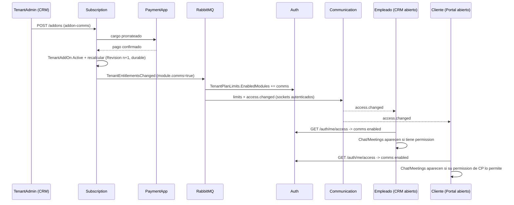

---

# 44. Upgrade / Downgrade Effects

| Evento | Backend hoy [A] | Frontends hoy [A] | Brechas [D] | Objetivo [E] |
|---|---|---|---|---|
| Upgrade (tras pago) | Absorbe los add-ons incluidos y recalcula | Nada cambia sin recargar; el CRM no oculta ni muestra por módulo | Sin push; `/subscriptions/me` inconsistente | `access.changed` → refetch → módulos aparecen |
| Downgrade (en la renovación, job horario) | Recalcula; **custom roles conservan** permissions de los módulos quitados; `perm_v` intacto | Sin cambios | El gate log-only no bloquea; re-guardar un rol con permissions dormidas falla | Gate Enforce → 403; configuración **dormida**; UI "Inactive — requires X"; guard por delta |
| Cancelar add-on | Módulo OFF inmediato | Sin cambios | Sin fin de periodo | Fin de periodo; dormido |
| El plan cambia de definición (`PUT plans/{id}/modules`) | Nueva versión + recalculo masivo; afecta a **todos** los tenants del plan al instante (sin grandfathering); nombres de módulo **sin validar** | Sin cambios | Riesgo operativo | Validar las claves contra `PermissionModuleMap`; aviso previo |
| La plataforma añade un módulo | Requiere: prefijo en `PermissionModuleMap` (.NET y Node), permissions en el catálogo, features en los planes, recalc-all | El frontend debe conocer la ruta → módulo | Dos copias del mapa | Registro de features del frontend que lea módulos del backend |
| La plataforma quita un módulo de un plan | Recalculo masivo; gate log-only | — | — | Enforce + dormido + aviso a TAs afectados |
| Suspended / Expired | Login y refresh bloqueados para TE y CP; sesiones revocadas solo en BD | CRM: banner; Portal: login en sesión | Tokens vivos 15 min; `isSuspendedForBilling`=false en Expired | Denylist + `session.revoked`; estado de suscripción coherente en el bootstrap |
| PastDue / Grace | Módulos ON; snapshot no refresca el status | Banner | Snapshot desactualizado | Recalcular en transiciones; decidir solo lectura en Grace (§E) |

---

# 45. Industry Research

Síntesis aplicada a TaxVision. Las citas están parafraseadas; las fuentes, al final de la sección.

| Tema | Qué dice la industria | Aplicación a TaxVision |
|---|---|---|
| RBAC / ABAC (NIST RBAC, SP 800-162, Kuhn-Coyne-Weil) | RBAC puro: permissions solo en roles. La explosión de roles se resuelve con híbridos; el **role-centric** usa roles como techo y atributos que solo **restan** | Es el modelo de TaxVision: rol → techo; plan, módulo, asignación, ownership y deny solo restan. Única excepción: permissions de bypass explícitas y auditables (`customers.view_all`) |
| Orden de decisión | Un único orden en todos los servicios, que falle cerrado y devuelva un código de razón | Autenticado → sesión → actor → tenant → permission (roles − deny) → módulo → recurso |
| ASP.NET Core | Proveedor de policies para permissions; resource-based **imperativo** tras cargar el recurso; `IAuthorizationMiddlewareResultHandler` para personalizar la respuesta; `AuthorizationFailureReason`; los roles como strings son frágiles | Ya existe el provider. Faltan el result handler con RFC 9457 + razón y **dejar de autorizar por nombre de rol** (G1) |
| OWASP (A01:2025, Authorization CS, API1/API5, IDOR) | Deny by default; implementar una vez y reutilizar; ownership en el modelo; nunca confiar en controles del cliente; log de fallos; tenant desde el token | Filtro de actor fail-closed (OK). IDOR de llamadas y Connectors con tenant del body (a corregir). Log de 403 con razón |
| Custom roles (GitHub, Azure, Google Workspace, Slack, Atlassian, Linear/Notion, Salesforce) | Mayoritariamente **aditivo**. GitHub: rol base + extras. Azure: NotActions **no** es deny; los deny assignments son raros y los gestiona la plataforma. Salesforce: "muting" solo dentro de un grupo | Mantener los custom roles aditivos; el deny por usuario como **excepción** con guardrails |
| Overrides por usuario | Allow por usuario desaconsejado (NIST, Microsoft, Oso). Deny = carve-out legítimo con costes: explicabilidad, auditoría, bloqueos | Solo deny; razón; expiración; anti-lockout; explicador de acceso efectivo |
| Techo de delegación (Kubernetes escalate/bind, Azure RBAC Admin con condiciones, AWS permission boundaries, GitHub sudo mode) | Solo se concede lo que uno tiene o lo que permite el boundary; lo peligroso exige reautenticar | `Grantable = catálogo ∩ asignable ∩ actor ∩ plan − PlatformOnly − peligrosas`; reauth para peligrosas |
| Entitlements (Stripe Entitlements, WorkOS, LaunchDarkly, Microsoft) | Entitlements ≠ permissions. Snapshot completo por evento, persistido localmente, reconciliado al arrancar y periódicamente. Fuera del IdP y fuera del token | Ya existe el snapshot con `RevisionNumber`. Faltan anti-entropía, guard de revisión en todos los consumidores y enforcement |
| Downgrade (GitHub, Notion, Kinde, GitLab #523883) | Efectivo al final del periodo; no borrar configuración; solo lectura con export; los admins deben poder editar lo dormido | Configuración dormida + guard por delta + aviso al re-upgrade |
| Quién ve el upgrade (Notion, Slack, GitLab) | Upsell solo a quien puede comprar; los miembros pueden "Request" | CTA solo con `canManageBilling`; TE ve "ask your admin"; CP nunca ve planes |
| Frontend UX (Angular guards, Nielsen, NN/g, Smashing) | Guards como UX, nunca como seguridad; `canMatch` evita cargar chunks; **ocultar** lo que el rol nunca tendrá; **deshabilitar con explicación** lo temporalmente no disponible | Ocultar por permission; "no disponible" por plan; deshabilitar con tooltip en estados (p. ej. solo lectura) |
| 403 frente a 404 (RFC 9110, GitHub) | 404 para ocultar la existencia de recursos | 404 para recursos no visibles (asignación, ownership) |
| Revocación (Entra CAE, OWASP Session, ASP.NET security stamp) | Tokens cortos más revocación por eventos; renovar la sesión tras cambios de privilegio | `perm_v` + denylist + evento `access.changed`; token de 15 min como respaldo |
| Datos de autorización para el front (Entra group overage, Auth0, Richardson, Google Drive capabilities, Oso, AuthZEN 1.0) | JWT mínimo; bootstrap `/me/access` con versión y ETag; `capabilities` por recurso calculadas en el servidor; batch-check tipo AuthZEN si hace falta | JWT actual limpio (se conserva). Añadir el bootstrap de acceso con ETag; capabilities por recurso en fase posterior |
| Zanzibar / OpenFGA / OPA / Cedar | Justificados con relaciones profundas, políticas definidas por el tenant o escala extrema; exigen centralizar y sincronizar datos | **No para TaxVision:** relaciones poco profundas (tenant → cliente → documento), reglas en código y proyecciones ya replicadas. Preparar una fachada interna con forma AuthZEN por si algún día hace falta |
| Arquitectura (Newman cap. 11, Richardson "fetch & replicate", *The Hard Parts*, Vernon IDDD, Clean Architecture) | El gateway autentica y cada servicio es autoritativo; replicar datos de autorización por eventos; la librería compartida vale si cambia poco; Identity & Access como bounded context; la seguridad en los casos de uso | Encaja con BuildingBlocks + proyecciones + Auth como contexto propio; la autorización de recursos en los handlers |

**Fuentes:**
- NIST RBAC (csrc.nist.gov/projects/role-based-access-control) · NIST SP 800-162 · Kuhn/Coyne/Weil 2010.
- Microsoft Learn: ASP.NET Core policies, resource-based, `IAuthorizationPolicyProvider`, response customization, `AuthorizationFailureReason`; Azure RBAC, deny assignments, delegación; Entra claims y CAE; Azure Architecture Center multitenant identity.
- OWASP: Authorization CS, Top 10 A01:2025, IDOR CS, API1/API5 2023, Logging CS, Session Management CS, Microservices Security CS.
- GitHub Docs: custom repository y organization roles, sudo mode, REST 404.
- Kubernetes RBAC · AWS IAM permission boundaries · Stripe Billing Entitlements · WorkOS entitlements y multi-tenant permissions · LaunchDarkly entitlements · Google Workspace custom admin roles · Slack Engineering role management · Atlassian Confluence roles · Salesforce muting permission sets · Oso RBAC best practices y UI integration · Cerbos multitenant.
- Kinde (downgrades) · Notion (downgrade y upgrade requests) · Slack (who can upgrade) · GitLab #523883 y #213344.
- Angular route guards · UX Tigers, NN/g y Smashing (ocultar vs deshabilitar) · MDN 401/403/429/ETag · RFC 9457 · RFC 9068 · OpenID AuthZEN Authorization API 1.0 · Google Drive capabilities.
- Zanzibar (Google Research) · Oso "authorization for the rest of us" · OPA external data · AWS prescriptive guidance.
- Newman, *Building Microservices* 2e · microservices.io (Access Token pattern y serie authn/authz 2025) · *Software Architecture: The Hard Parts* · Vernon, *IDDD* cap. 13 · Clean Architecture (template de Jason Taylor, `AuthorizationBehaviour`).

---

# 46. Recommended Effective Authorization Model

**[E] Definición formal**, derivada del sistema real (misma arquitectura, sin servicios nuevos):

```
EffectiveAccess(actor, action, resource) =
      Authenticated                       -- JWT válido                          → 401
  ∧   SessionActive                       -- sid no revocado                     → 401 Auth.SessionRevoked
  ∧   TenantAccessActive                  -- suscripción no bloqueada (runtime)  → 403 Auth.SubscriptionInactive
  ∧   ActorTypeAllowed(endpoint)          -- [AllowActorTypes], fail-closed      → 403 Auth.Forbidden (reason actor)
  ∧   Granted(action.permission)          -- (∪ roles activos) − denies;         → 403 Auth.Forbidden (reason permission_denied)
                                          --  PA por claim actor_type (no rol)
  ∧   Fresh(perm_v)                       -- JWT perm_v ≥ proyección             → 401 Auth.TokenStale
  ∧   ( module(permission) = ∅
        ∨ permission ∈ Exempt
        ∨ Entitled(tenant, module) )      -- snapshot plan + add-ons, status     → 403 Authz.ModuleUnavailable
  ∧   TenantBoundary                      -- EF filter / tenant explícito
  ∧   ResourceScope(resource)             -- ownership · asignación · customer_id
                                          --  · participante · invitación        → 404 (no revelar) / 403
  ∧   DomainPolicy(resource.state)        -- invariantes (p. ej. request cerrado)  → 409/422
```

**Orden.** Se mantiene el del pipeline actual: autenticación → tenant → denylist → permission → módulo (solo si la permission se concedió) → actor type → recurso. Evaluar el módulo **después** de conceder la permission hace que `module_not_entitled` solo aparezca a quien "podría si el plan lo tuviera". Esa es la semántica que necesita la UX de upgrade.

**Principios:**
1. **El backend es la autoridad.** El frontend representa `EffectiveAccess` para UX y **nunca** decide seguridad.
2. **Los atributos solo restan.** Nada salvo un rol concede. Las permissions de bypass (`customers.view_all`, `notes.view_all`, `tasks.manage_all`, `*.request.manage`) son explícitas y auditables.
3. **Entitlement ≠ Permission.** Ninguno implica al otro. Se intersectan en el gate.
4. **Configuración dormida.** Lo que se pierde por plan no se borra: queda inefectivo.
5. **JWT mínimo** (`sub`, `tenant_id`, `actor_type`, `sid`, `perm_v`, `customer_id`). Nunca permissions ni módulos.
6. **Un único bootstrap y un único evento** (`access.changed`) para los frontends.

### Diagrama 7b — Effective Authorization (recomendado)

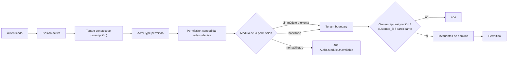

### Diagrama 2 — Arquitectura de autorización recomendada

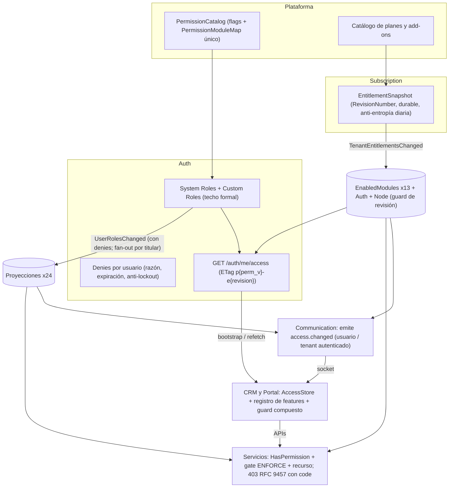

---

# 47. Recommended Backend Changes

| ID | Cambio | Clase | Justificación |
|---|---|---|---|
| A0.1 | `IsPlatformAdmin()` = claim `actor_type == PlatformAdmin` (y `tenant_id == PlatformTenant`); no usar nombres de rol como autoridad en ningún sitio | **MUST** | G1 (escalada y cross-tenant) |
| A0.2 | Nombres reservados para custom roles (actor types y roles de sistema, sin distinguir mayúsculas) + detectar roles existentes con esos nombres | **MUST** | G1 |
| A0.3 | Dejar de emitir los nombres de custom roles como `ClaimTypes.Role` (el frontend usa `/me.roles`) o emitirlos como `role_name` | SHOULD | Defensa en profundidad para G1 |
| A0.4 | `payment_app.saas_payment.refund` → `PlatformOnly`, no asignable, `[AllowActorTypes(PlatformAdmin)]` en el método | **MUST** | Reembolso propio |
| A0.5 | DMCA (`legal/dmca-notices*`) solo plataforma; decidir legal hold (tenant peligroso vs plataforma) separando permissions | **MUST** (DMCA) / SHOULD (split) | Contradicción documentada |
| A0.6 | Communication: `customers/:id/calls` solo staff + asignación; `offboarding-impact` solo staff + `users.manage` (en los 7 servicios); bloquear DM y llamadas CP↔CP; ligar el token de invitación a meeting e invitado; `authenticate` HTTP rechaza `actor_type=Service` en rutas humanas | **MUST** | IDOR y fugas |
| A0.7 | Broadcasts de tenant a una sala de staff (`t:{tenant}:staff`); nunca CP ni Guest | **MUST** | Fuga de metadata |
| A0.8 | `/storage/private/{token}` `TenantOnly` y `TenantCustomers` sin destinatarios → solo staff o con `CanAccess` | **MUST** | Exposición al portal |
| A0.9 | Connectors M2M: tenant del token = tenant del body; `internal/stock/commit-sale` con `ServiceOnly` + scope | **MUST** | Tenant boundary M2M |
| A1 | Ownership: Signature (14 sub-recursos, sobre todo `preparer/sign` ligado al caller); Tasks (dependencias, adjuntos, series + `tasks.assign` al fijar assignee); Correspondence (validar `AccountId`, drafts propios, gate de buzón en adjuntos); Customer (mutaciones y reveal con asignación); borrar carpeta exige `file.delete`; Campaigns `schedule` guarda la visibilidad del creador; Growth `referrals/attributions` con permission; `terms/publish` y notification mappings con permission PlatformOnly | **MUST** (Signature, Correspondence, Tasks) / SHOULD (resto) | OWASP API1 |
| A2.1 | G2: el fallback pre-RBAC solo para usuarios **nunca** migrados (flag), o eliminarlo; `PUT roles []` prohibido o equivalente a "sin permissions" | **MUST** | Evasión de denies |
| A2.2 | G3/G6: en cambios de permissions de rol, desactivación y sync de sistema, Auth publica `UserRolesChanged` **por titular** con los codes efectivos (con denies); los consumidores dejan de recomputar la unión o la mantienen solo como fallback que respeta denies | **MUST** | Correctitud de la deny layer |
| A2.3 | G4: publicar `RolePermissionsChanged` al crear rol y al sembrar roles de sistema (y un "full sync" en el arranque del sync) | **MUST** | Pérdida de permissions |
| A2.4 | R8/R9: revalidar roles activos y actor al aceptar invitación; excluir roles inactivos de RoleIds | SHOULD | Consistencia |
| A2.5 | Deny: `Reason` obligatoria, `ExpiresAtUtc` opcional (migración + job), anti-lockout del último TA, control de concurrencia (`permissionsVersion` en el PUT) | SHOULD | Operabilidad |
| A2.6 | G5: invitar a un TA exige `roles.manage` efectiva; G9: `users.manage` no puede desactivar TAs sin ser TA y guard de último admin en deactivate | **MUST** | Escalada y bloqueo |
| A3.1 | Baseline Employee: `notes.read/manage`; `GET signature/templates[/id]` → `signature.request.create`; `signature.request.cancel`; `communication.group.create` | **MUST** (notes, templates) / SHOULD (resto) | 403 injustificados |
| A3.2 | Campaigns: dividir en `campaigns.view/manage/send/senders.manage` | SHOULD | Least privilege |
| A3.3 | `correspondence.organize` (archivar, papelera, restaurar) separado de la purga | COULD | Operación diaria |
| A3.4 | `POST billing/invoices/{id}/email` bajo `invoicing.manage`; `IssuerProfile` PUT bajo permission admin | SHOULD | "Email invoice" 403; emisor legal |
| A3.5 | Limpieza: permissions sin uso → `IsReserved` (ocultas de la UI y fuera de los bundles) o eliminadas con migración | COULD | Ruido |
| A3.6 | Alinear actor y permission: `sms.manage`, `notification.log.view`, `users.invite` (crear), `audit.view` en Subscription | SHOULD | Permissions imposibles de usar |
| A4.1 | Techo formal (§27) aplicado también en asignar roles, invitaciones y aceptación; `PlatformOnly` e `IsDangerous` leídos explícitamente; validar solo el delta al editar | **MUST** (explícito) / SHOULD (delta) | Defensa en profundidad |
| A4.2 | API de roles: `GET /auth/roles/{id}/users`, reactivar, duplicar (COULD), unicidad en el handler, edición de roles de portal, validar contra los titulares | SHOULD | UI de roles |
| A4.3 | `GET /auth/permissions` con flags (`isAssignableByTenant`, `platformOnly`, `isDangerous`, `minPlanTier`, módulo del gate, `grantable` para el tenant actual) | SHOULD | Picker correcto en la UI |
| A4.4 | Fitness tests: PlatformOnly ⇒ no asignable; IsDangerous ⇒ no asignable; todo code de `[HasPermission]` existe en el catálogo; todo code del catálogo se aplica o es `IsReserved`; nombres reservados | **MUST** | Evitar regresiones |
| A5.1 | Pre-requisitos del gate: `recalculate-entitlements/all`; backfill de filas `[]` y de Campaigns; guard de revisión en Auth, CloudStorage y Node; anti-entropía diaria + reconcile al arrancar; recalculo durable (outbox o durable local queue); refrescar el status del snapshot en PastDue, Grace y recuperación | **MUST** (antes de Enforce) | Evitar 403 masivos o regresiones |
| A5.2 | Lista de exenciones del gate (`communication.notification.read`; decidir `support.open`) | **MUST** | Notificaciones del portal |
| A5.3 | Respuesta 403 RFC 9457 con `code` y `reason` (`IAuthorizationMiddlewareResultHandler` + el filtro de actor) | **MUST** | UX distinguible |
| A5.4 | Node: camino Enforce en `checkPermission` y `checkPermission` en las rutas HTTP de chat; aplicar `call.record`, `meeting.record`, `meeting.host` (o eliminarla), `screenshot.create` | **MUST** | Comms sin enforcement |
| A5.5 | Enforce por servicio vía config (`Authorization:ModuleGate:Enforce=true`) con despliegue escalonado observando `authz.module_decision`; tests con Enforce=true | **MUST** | Plan real |
| A5.6 | Cache corta del reader de módulos con invalidación por evento | SHOULD | 1 query por request |
| A5.7 | Ciclo de vida de add-ons: activar tras el pago, PastDue → recalcular o suspender, cancelar al final del periodo, bloquear add-ons duplicados con el plan. **Coordinar con el plan Account/Manage Subscription (C1–C4)** | SHOULD | Consistencia comercial |
| A5.8 | Validar las claves de módulo en `PUT plans/{id}/modules` contra el mapa | SHOULD | Operación |
| A6.1 | Bootstrap `GET /auth/me/access` (o bloque `access` en `/auth/me`) con ETag | **MUST** (para B/C) | Frontends |
| A6.2 | `access.changed` desde Communication (usuario y tenant autenticado) al consumir `UserRolesChanged`, `RolePermissionsChanged` y `TenantEntitlementsChanged` | SHOULD | Refresco en vivo sin infraestructura nueva |
| A6.3 | Suspensión, bloqueo por billing, deactivate y offboard → denylist + `session.revoked` | **MUST** | G10, R12 |
| A6.4 | Subscription: `GET subscriptions/me/status` mínimo (staff) y lecturas completas bajo `billing.view` | SHOULD | Datos de facturación expuestos |
| A6.5 | Estado de suscripción coherente en el bootstrap (Expired = bloqueado) | SHOULD | Inconsistencia `/me` vs `/subscriptions/me` |
| A7 | Tests de matriz (actor × permission × deny × plan × asignación) y de seguridad (G1, IDOR, cross-tenant); log de 403 con razón; paneles en `authorization.json` | **MUST** | Regresión |
| A8 | Documentación: README §41, guías, memoria; marcar las auditorías previas como históricas | SHOULD | Docs desactualizadas |
| — | **Módulo `meetings` separado de `comms`** | COULD (decisión de producto) | Solo si se quiere vender Meetings como add-on propio |

**Bootstrap propuesto (A6.1)** [E]:

```json
{
  "actorType": "TenantEmployee",
  "tenant": { "id": "…", "name": "…", "subDomain": "…" },
  "permissionsVersion": 12,
  "entitlementsRevision": 41,
  "subscription": { "state": "active", "canManageBilling": false },
  "modules": { "customers": "enabled", "planner": "enabled", "comms": "not_in_plan", "campaigns": "not_in_plan" },
  "permissions": ["customers.view", "customers.manage", "communication.meeting.create"],
  "effectivePermissions": ["customers.view", "customers.manage"]
}
```

- `ETag: "p12-e41"` y `Cache-Control: private, no-cache` (con `If-None-Match` → 304).
- `permissions` = roles − denies. `effectivePermissions` = ∩ módulo habilitado (+ exentas). Así los frontends **no** replican `PermissionModuleMap`.
- Para CP, `modules` usa `enabled | unavailable` (sin semántica comercial) y `subscription` solo trae `state`.
- Reutiliza `GetMe` y `GetMyEffectiveAccess` (ya existentes): **no** es un servicio nuevo.

---

# 48. Recommended TaxVision_Front Architecture

**[E] Componentes centrales (Angular 21, signals). Una sola abstracción, sin 40 reglas distintas:**

| Pieza | Responsabilidad | Reemplaza |
|---|---|---|
| `core/access/access.store.ts` | Estado único: `actorType`, `permissions`, `effective`, `modules`, versiones, `subscription`. Expone `can(p)`, `canAny(ps)`, `moduleState(key)`, `canUse(featureKey)`, `refresh(reason)` con throttle y ETag. Escucha el socket `access.changed`, `visibilitychange` y la reconexión | `PermissionService` (queda como fachada) y las 7 lecturas directas de `permissions.includes` |
| `core/access/features.ts` | Registro declarativo: `{ key, route, module?, anyOf?, allOf?, actors?, menu?, adminOnly? }` para cada feature, pestaña y widget | Condiciones sueltas en sidebar, navbar, settings grid y dashboard |
| `accessGuard` (funcional, `canMatch` + `canActivateChild`) | Lee `route.data.feature`. Salidas: permitir, `/forbidden`, `/not-available?module=`, `/office-inactive` o login | `permissionGuard` y la ausencia de guards |
| `*appCan` / `*appCanUse` (+ `else`) y `[appDisableUnless]` con tooltip | Botones, pestañas, tarjetas y acciones de menú | `*appHasPermission` (se extiende) |
| Interceptor de errores reescrito | 401: refresh una vez y reintento **fuera** del `catchError` de logout. 401 `TokenStale` → refresh + `access.refresh()`. 403 → `access.refresh()` una vez y luego estado por `code`. 429/503 con `Retry-After`. 5xx con backoff (solo GET). **Nunca** logout por 403 | `error.interceptor.ts` (bug de logout) |
| Páginas: `/forbidden`, `/not-available`, `/error` (500), estado "servicio no disponible" (502/503), `**` Not Found (existe) | Copy en inglés sin tecnicismos; CTA de upgrade solo si `subscription.canManageBilling` | "Something went wrong" genérico |
| UI de roles | CRUD de custom roles con picker filtrado por `grantable`, duplicar, usuarios por rol; Edit access filtrado (sin PlatformOnly ni fuera de plan; permissions dormidas marcadas); envío de `permissionsVersion` | Ausencia de UI; drawer que ofrece PlatformOnly |

### Diagrama 9 — TaxVision_Front authorization flow (recomendado)

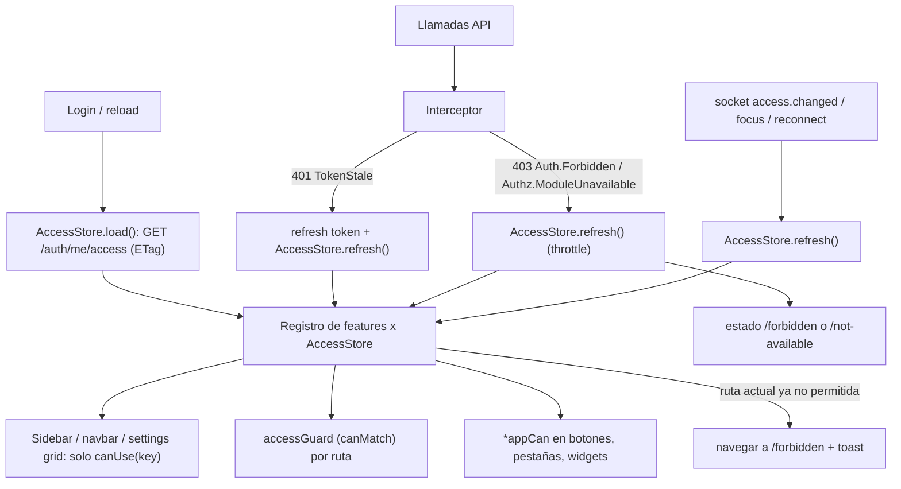

**Reglas de UX [E]:**
- **Sin permission:** ocultar (menú, botón, pestaña). Si se llega por URL: `/forbidden` neutro.
- **Sin módulo:**
  - TA con `canManageBilling`: el item aparece en el menú con candado, a lo sumo en una sección "More" (COULD). La página explica el add-on y el CTA.
  - TE: oculto en el menú; por URL, "not available for your office, ask your administrator".
- **Solo lectura por estado** (grace, suspended para TA): visible, escrituras deshabilitadas con explicación y enlace a billing.
- **Recursos:** usar `capabilities` del backend cuando existan (fase posterior). Mientras tanto, mismas reglas de ownership que el backend solo para ocultar.
- **Lo que NO debe hacer:** comparar `planCode`, ni duplicar `PermissionModuleMap` ni reglas de ownership complejas.

---

# 49. Recommended CLIENTTAXPROFRONTEND Architecture

**[E] Misma forma, más ligera (Angular 19):**

| Pieza | Responsabilidad |
|---|---|
| `PortalAccessStore` | Mismo bootstrap (`GET /auth/me/access`, forma CP: `modules` `enabled/unavailable`, sin datos comerciales). `can()`, `canUse()`, `refresh()`. Refetch por socket, focus, reconexión y 403 |
| `PORTAL_FEATURES` | Registro: documents → `documents` + `cloudstorage.file.view`; requests → `planner` + `tasks.portal.client_requests`; notes → `planner` + `notes.portal.read`; chat → `comms` + `communication.chat.*`; calls → `comms` + `call.start`/`videocall.start`; meetings → `comms` + `meeting.join`; support → `support.open` (según exención); notifications → siempre; profile → siempre |
| `portalAccessGuard` | Reemplaza `meetingsPlanGuard` (que hoy deja pasar con `plan` null); `canMatch` |
| Sidebar reactiva | Deriva del registro; se recalcula con cada `refresh` (hoy se calcula una vez con un servicio viejo) |
| Rutas de error | `**` → Not Found; `/client/unavailable` ("This feature isn't available for your account. Contact your tax office."); `/client/forbidden`; `office-inactive` también **durante** la sesión |
| Interceptor | No navegar a login si el refresh devuelve `SubscriptionInactive`; el guard intenta refresh antes de mandar a login; un 5xx en `/me` muestra error con reintento, no login |
| Socket | `auth` como **función** (token actual en cada reconexión); `connect_error` → refresh + reconexión |
| Limpieza | Eliminar `universal-auth.interceptor`, `customerAuthGuard` y `CompanyFeatureService`; corregir el prefijo `/auth` (B-1) |

### Diagrama 10 — Customer Portal authorization flow (recomendado)

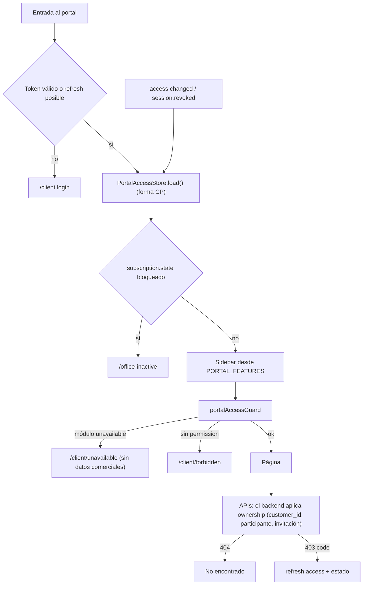

---

# 50. What Must Remain

- **[A→E]** El JWT mínimo **sin** permissions ni módulos, y el arranque que falla si un servicio queda en modo `Jwt`.
- **[A→E]** Proyecciones por servicio + `perm_v` + 401 `TokenStale` + pull-recovery + reconciliación de 6 h.
- **[A→E]** El filtro de actor global fail-closed y el fitness test de CI que exige `[AllowActorTypes]`.
- **[A→E]** El catálogo con GUID deterministas, sus flags y la inferencia de `AllowedActorTypes`.
- **[A→E]** El modelo System Role + Custom Roles aditivos + **deny por usuario**, sin allow por usuario.
- **[A→E]** `RolePermissionGuard` como base del techo.
- **[A→E]** El snapshot de entitlements con `RevisionNumber` + el evento con snapshot completo + `TenantPlanCodeProjection` con guard de revisión.
- **[A→E]** `PermissionModuleMap` como **única** fuente de módulo por permission (se expone al frontend en lugar de copiarlo).
- **[A→E]** Ownership (`IsOwnerOrHasManageHandler`) activo y visibilidad por asignación (`customers.view_all`).
- **[A→E]** Denylist por `sid` + `session.revoked` + sesión única con takeover.
- **[A→E]** Tenant desde el JWT + EF query filters fail-closed + `InternalSurfaceGuard` + `TenantHostGuard`.
- **[A→E]** Métricas `authz.decision` y `authz.module_decision` y el dashboard `authorization.json`.
- **[A→E]** En el CRM: `PermissionService` (como fachada), `SmsCapabilities` (patrón a imitar), el manejo de 429 con countdown y los modales de sesión.

---

# 51. What Must Change

1. Autoridad por nombre de rol → por `actor_type` (G1). Nombres reservados.
2. Refund, DMCA y rutas de plataforma sin permission → PlatformOnly.
3. IDOR, broadcasts, tokens de invitación y links `TenantOnly` → scope correcto.
4. Deny layer: propagación correcta (G2, G3, G4, G6), anti-lockout, razón y expiración.
5. Baseline Employee: notes, plantillas de firma, cancelar lo propio, grupos; Campaigns dividido.
6. Techo formal en todos los caminos de concesión, incluidas invitaciones (G5) y `users.manage` (G9).
7. Module gate: pre-requisitos → exenciones → 403 con código → Enforce por servicio → Node Enforce.
8. Suspensión y deactivate → denylist + evento.
9. Bootstrap de acceso con ETag + evento `access.changed`.
10. CRM: AccessStore + registro + guard compuesto + directiva + interceptor sin logout por 403 + páginas de error + UI de roles.
11. Portal: lo mismo en ligero + `**` + rutas `/auth` + socket con token dinámico + `office-inactive` en sesión.

---

# 52. What Must NOT Be Done

- **NOT RECOMMENDED:** meter permissions, módulos o la suscripción en el JWT.
- **NOT RECOMMENDED:** inventar `ent_v` en el token. `RevisionNumber` ya existe y los módulos no viajan en el token.
- **NOT RECOMMENDED:** allow por usuario.
- **NOT RECOMMENDED:** dar `*` o todo el catálogo al TenantEmployee.
- **NOT RECOMMENDED:** herencia de roles multinivel. Tampoco que un custom role "copie" el Employee (ya se suman).
- **NOT RECOMMENDED:** Zanzibar, OpenFGA, OPA, Cedar, Graph DB, PDP distribuido o un microservicio Authorization.
- **NOT RECOMMENDED:** activar `Enforce=true` en todos los servicios de golpe o sin backfill (403 masivos por filas `[]`).
- **NOT RECOMMENDED:** borrar roles o asignaciones en un downgrade. Se quedan dormidos.
- **NOT RECOMMENDED:** subir `perm_v` por cambios de entitlements o de permissions de rol: haría 401 a todo el tenant.
- **NOT RECOMMENDED:** conceder permissions de sistema por migración de datos (la memoria del proyecto documenta proyecciones obsoletas). Hacerlo por catálogo + sync + eventos.
- **NOT RECOMMENDED:** filtrar los system roles por plan en la BD. Es configuración, no autorización efectiva; el gate lo resuelve en runtime.
- **NOT RECOMMENDED:** `if (planCode === 'enterprise')` en los frontends, o replicar `PermissionModuleMap` o reglas de ownership en ellos.
- **NOT RECOMMENDED:** `display:none` como seguridad, o redirigir en silencio sin explicar.
- **NOT RECOMMENDED:** hacer logout ante un 403, o mostrar upsell a TE y CP.
- **NOT RECOMMENDED:** crear infraestructura realtime nueva. Se reutiliza Socket.IO y los consumidores de Communication.
- **NOT RECOMMENDED:** usar permissions de `Service` para construir UI.

---

# 53. Risks

| Riesgo | Prob. | Impacto | Mitigación |
|---|---|---|---|
| Activar Enforce produce 403 masivos (filas `[]`, Campaigns sin fila, snapshot desactualizado) | Alta si se hace sin preparar | Alto | A5.1 (recalc-all + backfill + anti-entropía) → observar la métrica deny→allow → Enforce por servicio → rollback por config |
| Cortar notificaciones del portal al aplicar el gate de `comms` | Alta | Alto | Exención de `communication.notification.read` (A5.2) |
| Cambiar el bundle Employee resucita denies (G3) | Alta | Medio | A2.2 antes de A3 |
| Cambiar `IsPlatformAdmin` rompe flujos de PA que dependían del rol | Media | Alto | Los PA reales tienen `actor_type=PlatformAdmin` (inmutable); tests de integración de las rutas PA; auditar los 40 usos |
| Fan-out por usuario en cambios de rol (volumen) | Baja (tenants de 3 a 25+ staff) | Bajo | Lotes y deduplicación; es el mismo patrón que la reconciliación |
| El frontend oculta algo que el backend permite (o al revés) | Media | Medio | `effectivePermissions` calculado en el backend; tests E2E de la matriz |
| Datos vivos del catálogo de planes distintos del seed | Media | Medio | Leer planes vivos antes de A5; validar claves (A5.8) |
| Solapamiento con el plan Account/Manage Subscription (add-ons, renew) | Alta | Medio | Coordinar A5.7 con ese plan (pendiente de aprobación) |
| Secrets de visibilidad por asignación desconocidos en prod | Media | Medio | Verificar antes de E2E; documentar el valor esperado |
| Un TA ya creó un rol llamado "PlatformAdmin" | Desconocida | Crítico | Consulta de auditoría en A0.2 antes del deploy |

---

# 54. MUST / SHOULD / COULD / NOT RECOMMENDED

**MUST (seguridad y correctitud):**
- **Seguridad inmediata:** A0.1–A0.2 (bypass por nombre de rol), A0.4 (refund), A0.5 (DMCA), A0.6–A0.9 (IDOR, broadcasts, private links, M2M).
- **Ownership:** A1 en Signature, Correspondence y Tasks.
- **Deny layer y escalada:** A2.1–A2.3, A2.6 (G5, G9).
- **Baseline:** A3.1 (notes, plantillas).
- **Techo y fitness tests:** A4.1 (techo explícito), A4.4.
- **Module gate:** A5.1–A5.5.
- **Bootstrap y sesión:** A6.1, A6.3.
- **Tests:** A7.
- **CRM:** interceptor sin logout por 403; AccessStore + guard compuesto + sidebar por registro; páginas 403/not-available.
- **Portal:** rutas `/auth`; `**`; `office-inactive` en sesión; guard de módulos por registro.

**SHOULD:**
- Backend:
  - A0.3, A1 (resto), A2.4–A2.5, A3.1 (cancel, grupos), A3.2 (split de Campaigns), A3.4, A3.6.
  - A4.1 (delta), A4.2, A4.3, A5.6–A5.8, A6.2, A6.4, A6.5, A8.
- CRM: UI de roles; Edit access filtrado; "not available" con CTA para admins; refresh por evento.
- Portal: socket con token dinámico; limpieza legacy; refresh por evento.

**COULD:**
- A3.3 `correspondence.organize`.
- A3.5 limpieza de permissions sin uso.
- Plantillas de rol sugeridas.
- `capabilities` por recurso en respuestas de detalle.
- Módulo `meetings` separado.
- Sección "More" con módulos bloqueados para admins.
- Fachada interna con forma AuthZEN.

**NOT RECOMMENDED:** ver §52.

---

# 55. Implementation Plan

Hay **tres tracks independientes**: A Backend, B TaxVision_Front, C CLIENTTAXPROFRONTEND. Las dependencias entre tracks están marcadas. Ninguna fase se ejecuta sin aprobación.

**Comandos de validación comunes** (exactos del CI donde aplica):
- **BE-BUILD:** `dotnet build TaxVision.slnx -c Release`
- **BE-GATE** (idéntico a `deploy.yml`): `dotnet test TaxVision.slnx --nologo --filter "FullyQualifiedName!~.Integration.&FullyQualifiedName!~.Persistence.&FullyQualifiedName!~ReminderRetentionJobTests"`
- **BE-INT** (por servicio, en serie): `dotnet test deploy/tests/TaxVision.<Svc>.Tests --filter "FullyQualifiedName~Integration" -m:1`
- **BE-FMT** (acotado a lo tocado): `dotnet csharpier check <archivos de la fase>`
- **COMM** (en `src/Services/Communication`): `npm run typecheck && npm test`
- **MIGR:** `dotnet ef migrations add <Nombre> -p <Infrastructure> -s <Api>`, y aplicarla **en el acto** (regla del proyecto).
- **CRM** (en `TaxVsion_Front`): `npm test -- --watch=false` (Vitest) · `npm run build`
- **PORTAL** (en `CLIENTTAXPROFRONTEND`): `npx ng test --watch=false --browsers=ChromeHeadless` (Karma, baseline 42/42) · `npm run build`

**Dependencias entre tracks:**
- B1 y C0 no dependen del backend (se pueden adelantar).
- B2 y C1 pueden empezar con `/auth/me` + `/auth/me/effective-access` y migrar a `/auth/me/access` cuando exista (A5).
- B7 y C5 necesitan los códigos 403 de A5.
- B8 y C8 (refresco en vivo) necesitan `access.changed` de A5.
- B9 necesita A4.
- El Enforce del gate (A6) va **después** de que B y C manejen `Authz.ModuleUnavailable`.

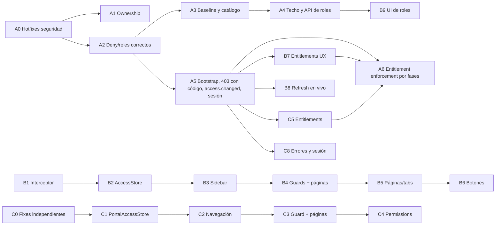

## TRACK A — BACKEND

### A0 — Hotfixes de seguridad
- **Objetivo:** cerrar las vías de escalada, fraude y fuga confirmadas.
- **Revisar:**
  - `CPE:55`, los 40 usos de `IsPlatformAdmin()`, `ControllerIdentityExtensions.cs`, `Role.cs`, `RoleCommands.cs`, `JwtTokenGenerator.cs`, `UserAccessResolver.cs`.
  - `SaaSPaymentsController.cs`, `RefundSaaSPaymentHandler.cs`, `LegalController.cs`.
  - Communication: `calls.route.ts`, `meetings.route.ts`, `start-direct-conversation.ts`, `initiate-call.ts`, `join-meeting.ts`, los consumers que emiten a `t:{tenant}`, `build-io.ts`.
  - `ShareResolutionQueries.cs:325-336`, Connectors `Internal*`/`Messages*`, `InternalStockController.cs`, los 7 `offboarding-impact`.
- **Modificar (probable):**
  - `ClaimsPrincipalExtensions.IsPlatformAdmin` → claim `actor_type` (+ PlatformTenant).
  - `Role.Create`/`Update` → nombres reservados.
  - `PermissionCatalog` (refund PlatformOnly y no asignable; DMCA) + migración `HasData`.
  - `[AllowActorTypes(PlatformAdmin)]` en refund.
  - Rutas y handlers de Communication (staff check, bloqueo CP↔CP, token↔meeting, sala `t:{tenant}:staff`, rechazo de `Service` en `authenticate`).
  - Resolución de private links; comparación de tenant M2M en Connectors; policy `ServiceOnly` en Inventory; `users.manage` + staff en offboarding-impact.
- **Impacto backend:** alto en seguridad, bajo en funcionalidad legítima. Consulta previa: ¿existen roles con nombre reservado?
- **Impacto frontend:** ninguno (el CRM no usa refund; los broadcasts de staff siguen llegando al CRM).
- **Events:** sin eventos nuevos. Para cambiar el catálogo se sigue el patrón migración + sync.
- **Permissions:** refund → PlatformOnly; DMCA → PlatformOnly (nueva `cloudstorage.dmca.manage`, según D-A1).
- **Entitlements:** n/a.
- **Tenant:** cierra el cross-tenant por nombre de rol y el tenant del body en M2M.
- **Tests:**
  - Unit de `IsPlatformAdmin` (rol "PlatformAdmin" con actor TA → false) y de nombres reservados.
  - Integración: un custom role "PlatformAdmin" no salta `[HasPermission]` ni `TryResolveTenantId`.
  - Refund con TA → 403.
- **Security tests:**
  - CP A no lee las llamadas de CP B (403/404).
  - CP no abre DM a otro CP.
  - Un token de invitación de M1 no abre M2.
  - Un socket Guest no recibe `mail.incoming`.
  - Token M2M con otro tenant en el body → 403.
- **Aceptación:** todos los security tests en verde; BE-GATE en verde; COMM en verde; consulta de roles reservados = 0 (o saneados).
- **Comandos:** BE-BUILD · BE-GATE · BE-INT (Auth, Tenant, Postmaster, CloudStorage, PaymentApp) · COMM · BE-FMT · MIGR (catálogo).
- **Rollback:** revertir el commit. El cambio de catálogo tiene una migración `Down`. Los checks de Communication se pueden aislar por flag si hiciera falta (no recomendado para el IDOR).

### A1 — Ownership y permissions de recurso
- **Objetivo:** que toda función que recibe un ID valide el ownership o el scope (OWASP API1).
- **Revisar:** `SignatureRequestsController` (14 sub-recursos) y `SignatureRequest.cs:697-726`; handlers de Tasks (dependencias, adjuntos, series, create/apply); Correspondence (`CreateDraftHandler`, send, drafts query, adjuntos); handlers de Customer (mutaciones, reveal); `FolderCommands.cs:525-608`; Campaigns `schedule`; `ReferralsController.cs:101-104`; `terms/publish`; notification mappings.
- **Modificar (probable):**
  - Aplicar `IsOwnerOrHasManageHandler` en los sub-recursos de Signature.
  - Ligar `preparer/sign` al usuario del JWT (PTIN/EFIN del perfil del caller).
  - `TaskAccessPolicy` en dependencias, adjuntos y series; `tasks.assign` si llega `AssigneeUserId`.
  - `AccountId` ∈ cuentas visibles del caller; drafts propios; gate de buzón en adjuntos.
  - Filtro de asignación en las mutaciones de Customer.
  - `file.delete` al borrar una carpeta con contenido.
  - El schedule guarda la visibilidad del creador.
  - Permissions en attributions, `terms/publish` y mappings.
- **Impacto backend:** medio. **Impacto frontend:** algunas acciones antes permitidas darán 403 o 404 (esperado).
- **Events:** ninguno nuevo. **Permissions:** posibles `growth.referrals.attribute` y `platform.terms.publish` (PlatformOnly), o reutilizar existentes. **Entitlements:** n/a. **Tenant:** sin cambios.
- **Tests:** unit por handler (dueño, no dueño, manage override); integración de Signature y Tasks.
- **Security tests:** un TE no firma como preparer en un request ajeno; un TE no envía desde el buzón personal de un colega; un TE no borra archivos borrando la carpeta.
- **Aceptación:** tabla §20 sin "Ownership faltante" en Signature, Tasks y Correspondence.
- **Comandos:** BE-BUILD · BE-GATE · BE-INT (Signature, Tasks, Correspondence, Customer, CloudStorage, Campaigns) · BE-FMT.
- **Rollback:** por servicio. La ownership existente ya va por flag `Authorization:ResourceOwnership:Enabled` (no apagar salvo emergencia).

### A2 — Deny layer y propagación de roles correctas
- **Objetivo:** que "roles − denies" sea cierto en todos los servicios y en todo momento; cerrar G2, G3, G4, G5, G6 y G9.
- **Revisar:** `UserAccessResolver.cs`, `RoleRepository.cs`, `RoleCommands.cs` (set-permissions, deactivate, create), `SystemRolePermissionsSyncService.cs`, `SetUserPermissionOverridesCommand.cs`, `AcceptInvitation.cs`, `CreateInvitation.cs`, `UserManagementCommands.cs` (deactivate), los consumidores `PermissionsProjectionConsumers.cs` de los 24 servicios (y Node), `PermissionsReconciliationService.cs`.
- **Modificar (probable):**
  - Fallback solo para usuarios pre-RBAC marcados, o eliminarlo.
  - En set-permissions, deactivate y sync: fan-out `UserRolesChanged` por titular (codes efectivos con denies).
  - Consumidores de `RolePermissionsChanged`: actualizar solo la proyección de rol, sin recomputar uniones de usuario (o recomputarlas restando denies si se proyectan).
  - Publicar evento al crear rol y al sembrar.
  - Revalidar roles al aceptar invitación.
  - Invitar un TA exige `roles.manage` efectiva.
  - Jerarquía en deactivate (TE con `users.manage` no desactiva TAs) + guard de último admin.
  - `UserPermissionDeny.Reason` / `ExpiresAtUtc` + job de expiración + anti-lockout (MIGR).
- **Impacto backend:** medio-alto (contrato de eventos). Hay que mantener la compatibilidad: los consumidores viejos deben tolerar el fan-out.
- **Impacto frontend:** el drawer Edit access añade razón y expiración (B9).
- **Events:** más `UserRolesChanged` (fan-out); `RolePermissionsChanged` al crear rol.
- **Permissions / Entitlements:** n/a. **Tenant:** los eventos llevan TenantId (el middleware ya lo exige).
- **Tests:**
  - Deny + cambio de rol → el denegado **no** recupera la permission en Customer, Campaigns y Node.
  - Rol vacío → sin permissions.
  - Rol nuevo asignado → llega a todos los servicios.
  - Rol desactivado → se retira en todos.
- **Security tests:** un TA con `roles.manage` denegada no puede invitar un TA; un TE con `users.manage` no desactiva al único TA.
- **Aceptación:** tests de propagación en verde; la reconciliación de 6 h deja de ser necesaria para la correctitud (sigue como respaldo).
- **Comandos:** BE-BUILD · BE-GATE · BE-INT (Auth + 3 consumidores representativos) · COMM · MIGR · BE-FMT.
- **Rollback:** el fan-out puede ir detrás de un flag de Auth. La migración de `Reason`/`ExpiresAtUtc` es aditiva (columnas nullable).

### A3 — Baseline y catálogo
- **Objetivo:** que el TE opere con normalidad con least privilege; que el catálogo sea coherente.
- **Revisar:** `CAT:2002-2145`, `CampaignsPermissions.cs` y los 34 atributos, `SignatureTemplatesController` (GET), `InvoicesController` y `IssuerProfileController`, `SmsConsentController`, `NotificationsController`, `InvitationsController`, `Subscription AuditController`.
- **Modificar (probable):**
  - Bundle Employee: `notes.read/manage`, `signature.request.cancel`, `communication.group.create`.
  - Los GET de plantillas pasan a `signature.request.create`.
  - Split de Campaigns (`campaigns.view/manage/send/senders.manage`) + migración `HasData` + actualizar los atributos.
  - Endpoint `POST billing/invoices/{id}/email`; permission de `IssuerProfile`.
  - Alinear actor y permission (sms.manage, log.view, invite, audit).
  - Marcar `IsReserved` (o eliminar) las permissions sin uso.
  - Fitness tests del catálogo.
- **Impacto backend:** medio. Despliegue: catálogo → sync de roles de sistema (arranque de Auth) → `RolePermissionsChanged` → fan-out (A2).
- **Impacto frontend:** el CRM debe dejar de ofrecer lo que ya no aplica y empezar a mostrar Notes y Campaigns al TE (B5 y B6).
- **Events:** `RolePermissionsChanged` del rol Employee en todos los tenants.
- **Permissions:** nuevas `campaigns.view`, `campaigns.send`, `campaigns.senders.manage` (+ `correspondence.organize` si D-A11).
- **Entitlements:** `campaigns.*` sigue en el módulo `campaigns` (Pro/add-on).
- **Tenant:** n/a.
- **Tests:** el TE por defecto opera notes, plantillas, cancelar lo propio y Campaigns (view, manage, send); el TE no gestiona senders; fitness tests.
- **Security tests:** el TE cancela solo sus requests (ownership); el TE no envía la factura por un endpoint genérico.
- **Aceptación:** tabla §22 sin "403 injustificado" en Notes, Signature y Campaigns.
- **Comandos:** BE-BUILD · BE-GATE · BE-INT (Auth, Campaigns, Notes, Signature, Billing) · MIGR · BE-FMT.
- **Rollback:** revertir la migración del catálogo (Down) + redeploy de Auth (el sync devuelve el bundle anterior).

### A4 — Techo formal y API de roles
- **Objetivo:** un único techo en todos los caminos de concesión y una API suficiente para la UI de roles.
- **Revisar:** `RolePermissionGuard.cs`, `ActorTypeRoleGuard.cs`, `GetRoles.cs`, `RolesController.cs`, `UsersController.cs`, `RoleRepository.CountUsersInRoleAsync`.
- **Modificar (probable):**
  - `Grantable(...)` (§27) con PlatformOnly e IsDangerous explícitos, aplicado en create, set, assign, invite y accept.
  - Validación por delta.
  - `GET /auth/permissions` con flags + `grantable`; `GET /auth/roles/{id}/users`; reactivar rol; unicidad en el handler.
  - Edición de roles de portal por el actor target; validar contra los titulares.
- **Impacto backend:** bajo-medio. **Impacto frontend:** habilita B9.
- **Events:** reactivar rol → fan-out (A2). **Permissions:** n/a.
- **Entitlements:** el techo usa `EnabledModules` de `TenantPlanLimits`.
- **Tenant:** los roles siguen siendo del tenant del JWT.
- **Tests:** matriz del techo (asignable × tier × módulo × actor); editar un rol con permissions dormidas añadiendo otra → OK; añadir una fuera de plan → rechazo.
- **Security tests:** no se puede conceder PlatformOnly ni peligrosas por ningún camino.
- **Aceptación:** API documentada (Postman) y tests en verde.
- **Comandos:** BE-BUILD · BE-GATE · BE-INT (Auth) · BE-FMT.
- **Rollback:** revertir; los endpoints nuevos son aditivos.

### A5 — Bootstrap de acceso, contrato de errores, realtime y sesión
- **Objetivo:** dar a los frontends una fuente única de verdad y señales para refrescar; cerrar G10 y R12.
- **Revisar:** `GetMe.cs`, `GetMyEffectiveAccess.cs`, `AuthController.cs:174-214`, `ExceptionHandlingMiddleware.cs`, `ActorTypeAuthorizationFilter.cs`, `ErrorHttpMapping.cs`; Communication `subscription-consumers.ts`, los consumidores de roles, `session-denylist-watcher.ts`; `TenantSubscriptionAccessConsumer.cs`, `TenantStatusChangedConsumer.cs`, `SessionRepository.cs`, `UserManagementCommands.cs` (deactivate, offboard); Subscription `SubscriptionsController`.
- **Modificar (probable):**
  - `GET /auth/me/access` (o bloque `access` en `/auth/me`) con `effectivePermissions`, `modules`, `permissionsVersion`, `entitlementsRevision`, `subscription.state/canManageBilling` y ETag. Forma CP sin semántica comercial.
  - `IAuthorizationMiddlewareResultHandler` + filtro de actor → 403 RFC 9457 `{code, reason, module?}`.
  - Communication emite `access.changed` (usuario y tenant autenticado).
  - La suspensión, el deactivate y el offboard denylistean y publican `session.revoked`.
  - `GET subscriptions/me/status` y lecturas completas bajo `billing.view`.
- **Impacto backend:** medio.
- **Impacto frontend:** habilita B2, B7, B8, C1, C5 y C8. El CRM debe leer el `code` (B1 lo prepara).
- **Events:** nuevo evento de socket `access.changed` (sin cambios en el bus).
- **Permissions:** `billing.view` pasa a usarse.
- **Entitlements:** expone `RevisionNumber`. **Sin `ent_v` en el JWT.**
- **Tenant:** `access.changed` nunca a Guests; payload sin datos.
- **Tests:** ETag/304; forma TE/TA/CP; 403 con código en las capas 1 y 2; suspensión → 401 en el siguiente request.
- **Security tests:** CP no recibe `canManageBilling` ni nombres de plan; el socket Guest no recibe `access.changed`.
- **Aceptación:** el CRM y el Portal pueden construir sidebar, guards y botones solo con el bootstrap.
- **Comandos:** BE-BUILD · BE-GATE · BE-INT (Auth, Subscription) · COMM · BE-FMT.
- **Rollback:** el endpoint es aditivo; el body de 403 es compatible (antes vacío); el evento de socket es ignorable.

### A6 — Entitlement enforcement por fases
- **Objetivo:** que el plan se aplique de verdad sin 403 masivos.
- **Revisar:** `PermissionPolicyProvider.cs:54-88`, `TenantModuleEntitlementsSource.cs`, `EfTenantEntitlementModulesReader` (13), `TenantPlanCodeProjectionHandler.cs`, Auth `TenantEntitlementsChangedConsumer.cs`, CloudStorage y Node consumers, `RecalculateEntitlements*`, jobs de Subscription, `PurchaseAddOnHandler.cs`, `TenantAddOn.cs`, Node `permissions.ts:148-156`, `main.ts:185-201`.
- **Modificar (probable):**
  1. **Pre-requisitos:** recalc-all; backfill de filas `[]` y Campaigns; guard de revisión en Auth, CloudStorage y Node; anti-entropía (job diario + reconcile al arrancar); recalculo durable; refresco del status del snapshot.
  2. Exenciones del gate.
  3. Cache corta del reader.
  4. Node: flag `COMMUNICATION_MODULE_GATE_ENFORCE` + `checkPermission` en las rutas HTTP de chat.
  5. Enforce por servicio vía config: primero `campaigns`, luego `email`, luego `comms` y al final los módulos de Starter.
  6. Ciclo de vida de add-ons (**coordinado con el plan Account/Manage Subscription**).
  7. Validar claves de módulos.
- **Impacto backend:** alto (comportamiento visible para los tenants).
- **Impacto frontend:** B7 y C5 deben estar desplegados antes.
- **Events:** job de anti-entropía que republica snapshots.
- **Permissions:** n/a. **Entitlements:** enforcement real. **Tenant:** n/a.
- **Tests:** integración con Enforce=true (hoy no existe ninguna); matriz plan × módulo × actor; exenciones.
- **Security tests:** un Starter sin add-on no usa Campaigns, Email ni Comms por API; tras comprar el add-on sí (sin redeploy).
- **Aceptación:** la métrica `authz.module_decision` de un tenant correcto no muestra "deny" inesperados durante la ventana de observación; los casos 2, 3 y 8 del Anexo C pasan.
- **Comandos:** BE-BUILD · BE-GATE · BE-INT (Campaigns, Correspondence, Signature, Notes) · COMM · BE-FMT.
- **Rollback:** `Authorization:ModuleGate:Enforce=false` por servicio (config, sin redeploy de código) y el flag de Node en false.

### A7 — Tests, observabilidad y hardening continuo
- **Objetivo:** que las regresiones de autorización fallen en CI.
- **Modificar (probable):**
  - Suite de matriz (actor × permission × deny × plan × asignación) por servicio crítico.
  - Fitness: todo code de `[HasPermission]` existe; todo code se aplica o es `IsReserved`; PlatformOnly/IsDangerous ⇒ no asignable; nombres reservados.
  - Log estructurado de 403 y 404 de policy con razón.
  - Paneles nuevos en `authorization.json` (módulos denegados, TokenStale, 403 por razón).
- **Comandos:** BE-GATE (los fitness entran al gate) · BE-INT.
- **Rollback:** n/a.

### A8 — Documentación
- **Objetivo:** que la documentación deje de contradecir el código.
- **Modificar:** README §41.x, `Guia_Arquitectura_de_Accesos.md`, `Guia_Creacion_Microservicio.md` (paso `PermissionModuleMap` + gate), guía de Support, plan de Overrides, plan de asignación (marcar implementado), `RABC\audit\*` (marcar históricos), memoria del proyecto.
- **Rollback:** n/a.

## TRACK B — TAXVISION_FRONT (CRM, Angular 21)

### B0 — Inventario y línea base
- **Objetivo:** congelar el mapa ruta → feature → módulo → permissions (§33, §34) como fixture de tests.
- **Revisar:** `app.routes.ts`, `features/*/…routes.ts`, `sidebar.component.ts`, `navbar.component.html`, `settings-module-grid.component.ts`.
- **Modificar:** `core/access/features.ts` (solo datos) + tests que verifican que toda ruta del shell tiene feature.
- **Impacto:** ninguno visible.
- **Aceptación:** 100 % de las rutas del shell mapeadas.
- **Comandos:** CRM.
- **Rollback:** n/a.

### B1 — Interceptor y contrato de errores (independiente del backend)
- **Objetivo:** eliminar el logout forzado y preparar el manejo por `code`.
- **Revisar:** `core/http/error.interceptor.ts:64-80`, `core/auth/refresh-failure.ts`, `core/models/api-error.model.ts`, `core/errors/error-messages.ts`, `auth-initializer.ts`, `auth.guard.ts`.
- **Modificar:**
  - Separar "el refresh falló → logout" de "el reintento falló → propagar error".
  - Manejar 401 `TokenStale` → refresh + (en B8) refetch.
  - 403 nunca hace logout.
  - Parsear RFC 9457 `code`/`reason`.
  - El initializer intenta refresh si el access expiró y hay refresh token.
  - Leer `?reason=session_expired`.
- **Impacto:** alto en UX, sin riesgo de seguridad.
- **Tests:** retry 403 → no logout; refresh 401 → logout; TokenStale → un solo refresh; recargar con access expirado → sesión restaurada.
- **Aceptación:** el caso 1 del Anexo C ya no hace logout.
- **Comandos:** CRM.
- **Rollback:** revertir el commit.

### B2 — AccessStore y registro de features
- **Objetivo:** una fuente única de autorización en el cliente.
- **Revisar:** `permission.service.ts`, `auth.service.ts`, `auth.model.ts`, las 7 lecturas directas `permissions.includes`, `client-permissions.ts`, `sms-permissions.ts`, `connectors-permissions.ts`.
- **Modificar:**
  - `core/access/access.store.ts`: al inicio compone `/auth/me` + `/auth/me/effective-access`; con A5 pasa a `/auth/me/access`.
  - `PermissionService` como fachada.
  - Reemplazar las lecturas directas.
  - Capability signals derivadas del store (`canImport` = `customers.import` ∧ TA; `canRevealFiscal`, etc.).
- **Impacto:** interno.
- **Tests:** `can`, `canAny`, `moduleState`, `canUse` con fixtures TE, TA, módulo off y deny.
- **Aceptación:** ningún componente lee `currentUser().permissions` directamente (lint o test).
- **Comandos:** CRM.
- **Rollback:** la fachada conserva la API anterior.

### B3 — Sidebar, navbar y settings grid desde el registro
- **Objetivo:** que el menú refleje la autorización efectiva.
- **Modificar:** `sidebar.component.ts` (items derivados de `features` + `canUse`; corregir `syncIndicator` usando el índice visible), `navbar.component.html` (User management y Company settings), `settings-module-grid.component.ts`, `dashboard-pro-banner` (solo `canManageBilling`).
- **Tests:** TE sin `campaigns.*` no ve Campaigns; tenant sin `comms` no ve Chat ni Meetings; TA con módulo y permission sí; el resaltado va al item correcto.
- **Aceptación:** casos 2, 4 y 7 del Anexo C a nivel de menú.
- **Comandos:** CRM.
- **Rollback:** revertir.

### B4 — Guard compuesto y páginas de error
- **Objetivo:** que una URL directa nunca renderice contenido no autorizado.
- **Modificar:**
  - `core/access/access.guard.ts` (`canMatch` + `canActivateChild`, espera el bootstrap, evita la carrera con `/me`).
  - `data.feature` en todas las rutas.
  - Páginas `/forbidden`, `/not-available`, `/error`; estado "service unavailable".
  - Reemplazar `permissionGuard` (redirección silenciosa).
- **Tests:** URL directa por cada feature × {sin permission, sin módulo, OK}; el chunk no se carga con `canMatch` falso.
- **Aceptación:** caso 7 del Anexo C.
- **Comandos:** CRM.
- **Rollback:** revertir; las páginas son aditivas.

### B5 — Páginas, pestañas y widgets
- **Objetivo:** autorización efectiva dentro de páginas compuestas.
- **Modificar:**
  - Dashboard: cada widget se declara como feature (no se cargan los que no aplican).
  - Client profile: pestañas Notes, Calls, Reminders y Documents según feature; Reveal según `customers.fiscalprofile.reveal`; Edit, Info y Family según `customers.manage`.
  - Clients: el alta no pierde datos en silencio (ocultar SSN y Active si no se puede).
  - Documents: los estados de uso y public sharing no aparecen falsos.
  - Campaigns: sub-listas con error visible.
- **Tests:** por página con fixtures TE, TA y módulo off.
- **Aceptación:** tabla §34 sin gaps de pestañas ni widgets.
- **Comandos:** CRM.
- **Rollback:** revertir por página.

### B6 — Botones y acciones
- **Objetivo:** ocultar las acciones no permitidas (o deshabilitarlas con explicación si son temporales).
- **Modificar:** `*appCan` en Documents (borrar, papelera, compartir), Signature (cancelar, extender, plantillas, categorías), Mail (purga), Users (todo), Subscription (seats, add-ons), Company (branding, perfil legal), proveedores de pago, payment links, Task board y drawer, Calls, Reminders.
- **Tests:** snapshot de acciones por rol.
- **Aceptación:** el backend ya no devuelve 403 por acciones que la UI ofreció (caso 6 del Anexo C).
- **Comandos:** CRM.
- **Rollback:** revertir.

### B7 — Entitlements UX (requiere A5)
- **Objetivo:** distinguir "sin permission" de "no incluido en el plan" sin exponer datos comerciales a quien no corresponde.
- **Modificar:** página `/not-available` (TA con `canManageBilling`: add-on y CTA a Subscription; TE: "ask your administrator"); manejo del 403 `Authz.ModuleUnavailable`; COULD: sección "More" con candados para admins.
- **Tests:** TA frente a TE ante un módulo off.
- **Aceptación:** caso 2 del Anexo C (CRM).
- **Comandos:** CRM.
- **Rollback:** revertir.

### B8 — Refresco en vivo y revocación (requiere A5)
- **Objetivo:** que la UI converja sola tras cambios de permissions, roles o plan.
- **Modificar:** escuchar `access.changed`; refetch en focus, visibility y reconexión; tras refresh por TokenStale; re-evaluar la ruta actual (si pierde acceso → `/forbidden` + toast); actualizar el banner de suscripción desde el bootstrap.
- **Tests:** simular `access.changed`; deny en caliente → el botón desaparece; add-on → el módulo aparece sin recargar.
- **Aceptación:** casos 1, 3 y 8 del Anexo C (CRM).
- **Comandos:** CRM.
- **Rollback:** desactivar el listener (el backstop de focus y 403 sigue funcionando).

### B9 — UI de roles (requiere A4)
- **Objetivo:** que el TA administre roles sin API manual.
- **Modificar:** `features/user-management`: CRUD de custom roles (picker por `grantable`, duplicar, usuarios por rol, reactivar); Edit access (sin PlatformOnly ni fuera de plan; dormidas marcadas; razón y expiración; `permissionsVersion`); explicador de acceso efectivo.
- **Tests:** crear TaxPreparerJunior → asignar → la UI del usuario refleja (caso 6).
- **Aceptación:** flujo completo sin Postman.
- **Comandos:** CRM.
- **Rollback:** revertir.

### B10 — QA
- **Objetivo:** validar los 8 casos del Anexo C y la matriz §34 E2E contra el backend local (flota).
- **Comandos:** CRM + BE-INT relevantes.
- **Aceptación:** checklist §56 (CRM) completo.

## TRACK C — CLIENTTAXPROFRONTEND (Portal, Angular 19)

> **Coordinación — resuelto en la Revisión 2026-09-26 (§R.1, D-A12):** el Track C se implementa en **`CLIENTREDESIGN`**, rama `claude-trabajo`. Su rediseño de UX/UI **ya está terminado y mergeado** (13 fases, PRs #1–#13): no es trabajo pendiente y no se rehace. Su documentación (`docs/especificaciones.md`, `docs/mockups/`) es el **contrato de diseño** que este track respeta. `CLIENTTAXPROFRONTEND` queda fuera y no se toca.

### C0 — Fixes independientes
- **Objetivo:** corregir defectos que no dependen del backend.
- **Modificar:** prefijo `/auth` en `auth.service.ts:258-313` (MFA, sesiones, email, teléfono); ruta `**` → Not Found; el guard intenta refresh antes de login; un 5xx en `/me` muestra error con reintento, no login.
- **Tests:** Karma sobre guard e interceptor; que se mantenga la línea base 42/42.
- **Aceptación:** MFA y sesiones funcionan; URL desconocida → Not Found.
- **Comandos:** PORTAL.
- **Rollback:** revertir.

### C1 — PortalAccessStore y registro de features
- **Modificar:** `core/access/portal-access.store.ts` (inicia con `/auth/me` + `/auth/me/effective-access`; luego `/auth/me/access` forma CP) y `PORTAL_FEATURES` (§49).
- **Aceptación:** ningún componente decide por `plan` ni por `permissions` directamente.
- **Comandos:** PORTAL.

### C2 — Navegación reactiva
- **Modificar:** `sidebar.component.ts` (derivar de features + store; quitar `CompanyFeatureService`); botón "Chat & Video Call" del dashboard según feature.
- **Aceptación:** tenant sin `comms` → sin Chat, Meetings ni el botón del dashboard.
- **Comandos:** PORTAL.

### C3 — Guard compuesto y páginas
- **Modificar:** `portalAccessGuard` (`canMatch`) en todas las rutas; eliminar `meetingsPlanGuard` y `customerAuthGuard`; páginas `/client/unavailable` y `/client/forbidden` (copy sin datos comerciales).
- **Aceptación:** caso 7 (Portal) y URL de Meetings sin `comms` → "unavailable".
- **Comandos:** PORTAL.

### C4 — Permissions en acciones
- **Modificar:** subir documentos, iniciar chat, llamadas, video y adjuntos según `can()`. Reflejar los denies por cliente, no solo en llamadas.
- **Aceptación:** un cliente con deny no ve la acción.
- **Comandos:** PORTAL.

### C5 — Entitlements (requiere A5)
- **Modificar:** manejar el 403 `Authz.ModuleUnavailable` → estado "unavailable"; nunca mostrar plan ni precios.
- **Aceptación:** casos 2 y 8 (Portal).
- **Comandos:** PORTAL.

### C6 — Ownership UX
- **Modificar:** un 404 de recurso ajeno se muestra como "not found"; no se exponen IDs de otros clientes. El backend (A0) cierra los IDOR; el frontend no los "resuelve".
- **Aceptación:** caso 5 (Portal).
- **Comandos:** PORTAL.

### C7 — Calls, Meetings, Documents y Signature
- **Modificar:** socket con `auth` como función y manejo de `connect_error`; join de meetings coherente con el token ligado (A0); Documents paginado real (el servidor limita a 100); Signature no existe en el portal (la firma pública vive en el CRM): documentarlo en el registro de features como "no disponible por diseño".
- **Aceptación:** reconectar tras rotar el token funciona.
- **Comandos:** PORTAL.

### C8 — Errores y sesión (requiere A5 para `access.changed`)
- **Modificar:** `SubscriptionInactive` durante la sesión → `/office-inactive` (no login); `session.revoked` y `access.changed` → refetch o modal; eliminar `universal-auth.interceptor`; 429 y 5xx según §40.
- **Aceptación:** suspender el tenant con el portal abierto → `office-inactive` en el siguiente request.
- **Comandos:** PORTAL.

### C9 — QA
- **Objetivo:** Karma (línea base + nuevos) y E2E de los casos 2, 3, 5, 7 y 8 en el Portal.
- **Aceptación:** checklist §56 (Portal).

---

# 56. Acceptance Checklist

**Backend**
- [ ] Un custom role llamado `PlatformAdmin` (o variantes de mayúsculas) no puede crearse, y uno existente no otorga bypass en ningún servicio.
- [ ] `payment_app.saas_payment.refund` es PlatformOnly; un TA recibe 403.
- [ ] DMCA solo plataforma; legal hold según D-A1.
- [ ] Un CP no lee las llamadas de otro cliente, no abre DM ni llamadas con otro CP y un token de invitación no abre otro meeting.
- [ ] Los broadcasts de tenant no llegan a sockets CP ni Guest.
- [ ] `/storage/private/{token}` `TenantOnly` no es resoluble por CP.
- [ ] Connectors M2M valida tenant del token = tenant del body; `commit-sale` exige `ServiceOnly`.
- [ ] Signature, Tasks y Correspondence sin "Ownership faltante" (§20).
- [ ] Deny + cambio de rol, rol vacío, rol nuevo y rol desactivado se propagan correctamente a todos los servicios (tests).
- [ ] Invitar un TA exige `roles.manage` efectiva; un TE con `users.manage` no desactiva TAs.
- [ ] Un TE por defecto opera Notes, plantillas de firma, cancelar lo propio y Campaigns (según D-A2 y D-A3).
- [ ] El techo formal se aplica en create, set, assign, invite y accept; PlatformOnly e IsDangerous nunca se conceden.
- [ ] Los fitness tests del catálogo están en el gate.
- [ ] `GET /auth/me/access` con ETag; forma CP sin datos comerciales.
- [ ] Todo 403 lleva `code`/`reason` (RFC 9457).
- [ ] `access.changed` se emite en cambios de usuario, rol y entitlements (nunca a Guests).
- [ ] Suspensión, deactivate y offboard → 401 en el siguiente request + `session.revoked`.
- [ ] Gate Enforce activo en todos los servicios mapeados y en Node, con exenciones, anti-entropía y guard de revisión; tests con Enforce=true.
- [ ] Comprar un add-on activa el módulo sin redeploy; cancelarlo lo desactiva (según la regla de periodo acordada).
- [ ] Configuración de roles dormida tras un downgrade (no se borra) y editable (validación por delta).
- [ ] BE-GATE, BE-INT y COMM en verde.

**TaxVision_Front**
- [ ] Un 403 nunca provoca logout; TokenStale se resuelve con un solo refresh.
- [ ] El sidebar, el navbar y el settings grid se derivan del registro + AccessStore.
- [ ] Toda ruta del shell tiene `data.feature` y pasa por el guard compuesto (`canMatch`).
- [ ] `/forbidden`, `/not-available`, `/error`, "service unavailable" y Not Found existen, con copy en inglés sin tecnicismos.
- [ ] Ningún componente lee `permissions.includes` directamente.
- [ ] Las acciones destructivas o admin de §34 están gateadas.
- [ ] CTA de upgrade solo para `canManageBilling`; el TE ve "ask your administrator".
- [ ] `access.changed`, focus y reconexión refrescan el acceso; al perder acceso a la ruta actual → `/forbidden`.
- [ ] Hay UI de custom roles; Edit access filtrado, con razón y concurrencia.
- [ ] Los 8 casos del Anexo C pasan en el CRM.
- [ ] `npm test -- --watch=false` y `npm run build` en verde.

**CLIENTTAXPROFRONTEND**
- [ ] MFA, sesiones y cambio de email o teléfono funcionan (`/auth`).
- [ ] Hay ruta `**` y Not Found.
- [ ] Navegación y guard derivados de `PORTAL_FEATURES` + `PortalAccessStore`.
- [ ] Módulo no disponible → estado "unavailable" sin datos comerciales.
- [ ] Los denies por cliente se reflejan en todas las acciones.
- [ ] `SubscriptionInactive` en sesión → `/office-inactive`.
- [ ] El socket reconecta con el token vigente.
- [ ] Código legacy de auth eliminado.
- [ ] Casos 2, 3, 5, 7 y 8 del Anexo C pasan en el Portal.
- [ ] Karma en verde (≥ línea base 42/42) y `npm run build` en verde.

---

# Anexo A — Respuestas a las 40 preguntas

1. **Modelo real de ActorType, Role y Permission.**
   - **[A]** El ActorType es un atributo inmutable del usuario (TE, TA, CP, PA; más Service para M2M).
   - Las permissions viven en roles: sistema (Tenant Admin 171, Employee 75, Customer Portal 14) y custom.
   - Efectivas = unión de roles activos − denies por usuario.
   - PA no tiene rol: pasa por bypass. **[D]** Ese bypass es por nombre de rol (hueco G1).
2. **Custom Roles.** **[A]** El TA (única con `roles.manage`) los crea, renombra, edita y desactiva por API, dentro del techo `RolePermissionGuard` (asignable + tier + módulo) y de `AllowedActorTypes`. Se asignan con un reemplazo total. **[D]** No hay UI, ni duplicado, ni "usuarios por rol", ni reactivación; la propagación tiene defectos (G3, G4, G6).
3. **Permissions por defecto del TE.** **[A]** Las 75 del bundle Employee (§10). 10 de ellas son legacy sin efecto.
4. **¿Son suficientes?** **[A]** Sí para Clientes, Documents, Tasks, Calendar, Chat, Calls y Meetings. **[D]** No para Notes y Campaigns; incompletas en Signature (plantillas, cancelar), Mail (archivar) y Billing (enviar factura).
5. **¿Por qué no opera Campaigns?** **[A]** Los 34 endpoints exigen `campaigns.manage` y no está en Employee. No es la proyección, ni el gate, ni el frontend.
6. **¿Qué permissions faltan?** **[A]** `notes.read/manage`, `campaigns.manage` (o su split), `signature.template.create` (o cambiar el GET), `signature.request.cancel`, `communication.group.create`, `notification.email.send` (mejor, un endpoint dedicado).
7. **¿Hacen falta permissions nuevas?** **[E]** Pocas y justificadas: `campaigns.view`, `campaigns.send`, `campaigns.senders.manage`; opcional `correspondence.organize`; `cloudstorage.dmca.manage` (PlatformOnly) si se separa del legal hold. Nada más.
8. **¿Puede el TA revocar una permission individual sin custom role?** **[A]** **Sí.** Existe la capa deny (`PUT /auth/users/{id}/permission-overrides`, UI "Edit access").
9. **¿Conviene permitirlo?** **[E]** Sí, como excepción: solo deny, con razón, expiración opcional, anti-lockout y explicador. Para grupos, custom roles.
10. **¿Cómo evitar que se vuelva inmanejable?** **[E]** Solo deny (sin allow); explicador de acceso efectivo; sugerir custom role si 3 o más usuarios comparten denies; mostrar solo lo delegable y dentro del plan; propagación correcta (A2); reportes de revisión.
11. **¿Cómo funciona `perm_v`?** **[A]**
    - Es un contador por usuario que sube al asignar roles, cambiar denies, aceptar invitación y crear owner.
    - Viaja en el JWT. Si la proyección tiene un valor mayor → 401 `Auth.TokenStale`.
    - **No** sube con cambios de rol, estado del tenant ni entitlements.
12. **¿Cómo funcionan las proyecciones?** **[A]**
    - Cada servicio guarda las permissions del usuario desde `UserRolesChanged` y recomputa por `RolePermissionsChanged` (**[D]** sin denies).
    - Cache de 30 s; pull-recovery en 14 servicios; reconciliación cada 6 h; backfill al arrancar.
13. **¿Qué pasa al revocar un permiso?** **[A]**
    - Deny → `perm_v++` + evento → la proyección se actualiza → el siguiente request da 401 TokenStale → refresh → reintento.
    - **[D]** En el CRM, si el reintento da 403, se fuerza el logout; la UI no se actualiza.
14. **¿Cuánto tarda?** **[A]** En Auth, inmediato. Downstream, segundos (el evento) más ≤ 30 s de cache. En cambios a nivel de rol, igual pero sin 401 (y con G3). **[E]** Objetivo: inmediato en la UI con `access.changed`.
15. **¿Cómo funciona Subscription → Plan → Module → Entitlement?** **[A]** La suscripción (estado) + la versión publicada del plan (`module.*`) + los add-ons activos → snapshot con `RevisionNumber` → `TenantEntitlementsChanged` → `EnabledModules` en 13 proyecciones + Auth + Node.
16. **¿Qué partes existen?** **[A]** Todas las piezas de datos y eventos, el gate y `effective-access`. **[D]** Faltan el enforcement, la anti-entropía, el guard de revisión en 3 consumidores, el push al frontend y el ciclo de vida correcto de add-ons.
17. **¿El backend impide usar módulos no contratados?** **[D]** **No.** El gate es log-only en .NET y no existe en Node.
18. **¿Qué endpoints no hacen Entitlement enforcement?** **[D]** Todos. Mapeados pero log-only: los de customers, signatures, documents, planner, email, comms, campaigns y reports. Los de sms, notification, billing, payments, catalog, inventory, growth y auth no tienen módulo por diseño.
19. **¿TaxVision_Front usa permissions?** **[A]** Parcialmente: `PermissionService` y algunos capability signals (clientes, SMS, correo, chat, llamadas, meetings, tasks, portal access).
20. **¿Qué módulos no?** **[D]** Documents, Users & Roles, Subscription, Company y branding, proveedores y links de pago, Campaigns, purga de Mail, Signature (cancelar, plantillas), el perfil del cliente (Edit, Reveal, Family, Notes, Calls, Reminders), el dashboard y Referrals.
21. **¿Sidebar condicionado?** **[D]** No: solo SMS por permission, nada por módulo; además hay un bug de resaltado.
22. **¿Rutas protegidas?** **[D]** Solo `/sms` y `/task` (con redirección silenciosa). El resto solo exige autenticación.
23. **¿Botones condicionados?** **[D]** Una minoría (§34); la mayoría de las acciones admin y destructivas no.
24. **¿El Portal usa permissions?** **[A]** Solo en los botones de llamada y video.
25. **¿Usa Entitlements?** **[A]** Solo `comms` para Meetings (y deja pasar con `plan` null).
26. **¿Respeta el ownership del cliente?** **[A]** La UI delega en el backend, que sí lo aplica en Documents, Requests, Notes y conversaciones. **[D]** Hay brechas en el backend: el IDOR de llamadas, DM y llamadas CP↔CP, el token de invitación, los private links y los broadcasts.
27. **¿Qué pasa hoy con Meetings si el plan no lo incluye?** **[D]** El backend lo permite (gate log-only; Node sin enforce). El CRM lo muestra y deja usarlo. El Portal lo oculta.
28. **¿En el CRM?** **[D]** Visible en el sidebar, navegable y funcional.
29. **¿En el Portal?** **[A]** Oculto y redirigido al dashboard (salvo `plan` null). **[D]** Por API sí funciona.
30. **¿Qué debe ocurrir tras comprar el add-on?** **[E]** Pago → recalculo durable → evento → `access.changed` → ambos frontends refetch → Meetings (`comms`) aparece para los actores con permission (CRM) y para los clientes con su permission (Portal), sin redeploy; el backend deja de devolver 403.
31. **¿Cómo se enteran los frontends?** **[E]** Evento de socket `access.changed` desde Communication (infraestructura existente) + backstop (focus, reconexión, 403 → refetch) + ETag en el bootstrap.
32. **¿Si se cancela el add-on?** **[A]** Hoy el módulo se apaga de inmediato en el snapshot, pero el gate no bloquea. **[E]** Fin del periodo pagado → gate 403 → UI "no disponible" → configuración dormida.
33. **¿Custom roles con permissions de ese módulo?** **[E]** Se conservan intactos (dormidos): efectivos = 0 por el gate. Se muestran "Inactive — requires X" y siguen siendo editables (validación por delta).
34. **¿Conservar configuraciones inactivas?** **[E]** Sí, siempre, salvo una regla de negocio explícita de purga. Al re-upgrade se reactivan (avisando al TA).
35. **¿Cómo deben funcionar 401 y 403?** **[E]**
    - 401 = sesión (refresh una vez; si falla, re-login; si fue revocada, modal).
    - 403 = autenticado sin acceso: refetch de acceso y estado por `code`. **Nunca logout.**
36. **¿URL directa no autorizada?** **[E]** El guard con `canMatch` impide renderizar (y descargar el chunk) → `/forbidden` o `/not-available`. El backend sigue rechazando la API.
37. **¿404, 429, 500 y 502?** **[E]**
    - 404: "not found", también para recursos no visibles.
    - 429: countdown con `Retry-After`.
    - 500: mensaje genérico con correlationId.
    - 502/503/504: "temporarily unavailable" con reintento y backoff. Nunca mensajes técnicos (§40).
38. **¿Qué componentes centralizan?** **[E]**
    - CRM: `AccessStore`, `features.ts`, `accessGuard`, `*appCan`, el interceptor y las páginas de error.
    - Portal: `PortalAccessStore`, `PORTAL_FEATURES`, `portalAccessGuard`, el interceptor y las páginas `unavailable`/`forbidden`/`office-inactive`.
39. **¿Qué NO hacer?** **[E]** §52: permissions o módulos en el JWT, `ent_v` por simetría, allow por usuario, `*` al TE, Zanzibar/OPA/servicio nuevo, Enforce de golpe, borrar configuración en downgrade, comparar `planCode` en el front, logout por 403, upsell a TE o CP.
40. **¿El modelo más simple, seguro y mantenible?** **[E]** El que ya existe, completado y aplicado:
    - Rol de sistema (baseline) + custom roles aditivos − denies por usuario.
    - ∩ entitlement del módulo (gate Enforce).
    - ∩ tenant boundary ∩ ownership o scope, evaluado **en el backend**.
    - Expuesto a los frontends con **un** bootstrap versionado y **un** evento.
    - Consumido por **un** store, **un** registro de features, **un** guard compuesto y **una** directiva por frontend.

---

# Anexo B — Discrepancias documentación vs código

| # | Documento | Afirma [B] | Código [A] | Estado |
|---|---|---|---|---|
| 1 | Analysis §1, §8, §29; plan de Overrides §0 | 178 / 181 permissions | 189 | Desactualizado |
| 2 | Analysis §8; auditoría de endpoints B | 15 PlatformOnly; 30 no asignables | 13; 27 (el resto son comentarios) | Desactualizado o mal contado |
| 3 | README §41.7; Guía de Accesos §11; Guia_Creacion §4; guía de Support | "El TenantAdmin nunca recibe IsDangerous" | El rol raíz sembrado **sí** las incluye (`CAT:2190-2195`) | Falso desde 2026-08-06 |
| 4 | `RBAC_Endurecimiento_Defensa_Senior.md` | Lista de IsDangerous con `users.disable` y `dmca.counternotice`; "14 servicios" | 7 dangerous exactas; denylist en 24 servicios | Desactualizado |
| 5 | Guía de Accesos §5; README §41.14; memoria `project_rbac_entitlements_runtime_gate_plan` | "Un downgrade da 403 / G1 cerrado / niega el módulo" | Enforce ausente → log-only | **No implementado** |
| 6 | Campaigns `Security.md:29` | "En prod Enforce=true" | No existe esa config | No implementado |
| 7 | Analysis Fase 1 | Gate en 12 servicios | 13 (+Campaigns) | Desactualizado |
| 8 | Analysis §1; README §41.11 | "Jwt por defecto; 7.5 no iniciada" | Projection en los 24; el arranque falla en modo Jwt | Desactualizado |
| 9 | README §41.8; auditorías; `Signature Program.cs:78-79` | Ownership apagado por default | `true` en los appsettings de 4 servicios | Desactualizado |
| 10 | README §41.10; Analysis §16 | Denylist en 14 servicios | 24 | Desactualizado |
| 11 | Analysis §9, §41 | `UserRolesChanged` en 22 servicios | 23 .NET + Node | Desactualizado |
| 12 | Analysis §44, §54 | "Sin anti-entropía de permisos" | Reconciliación cada 6 h | Desactualizado (sí la hay para permisos; **no** para entitlements) |
| 13 | Memoria `project_campaigns_service_review_gaps` | Campaigns sin proyección, TenantPlanCode ni gate | Tiene las tres | Desactualizado |
| 14 | `Modelo-Acceso-Clientes-Asignacion-Visibilidad-PLAN.md`; memoria | "NADA implementado"; flag por tenant | P1 y P2 implementados; flags globales por servicio; Customer ON; bypass `view_all` | Desactualizado (y la implementación difiere del plan) |
| 15 | Plan de Overrides §7 | Solo clients y tasks gateados en el CRM | También SMS, correo, firma y el banner (parcial) | Desactualizado |
| 16 | Analysis §4/§23/Fase 6 | El frontend oculta módulos por `enabledModules` | Nadie lee `enabledModules` en el CRM | No implementado |
| 17 | `RABC\audit\group_*.md` | Verbo≠permission en Correspondence y Signature; `Roles=`; Service en Catalog/Inventory | Corregido | Histórico |
| 18 | `CAT:393-398` (comentario de BillingView) | "Subscription usa `Roles=TenantAdmin`" | Usa `plan.change`, `seats.manage`, `addons.manage` | Comentario obsoleto |
| 19 | `CAT:665-673` (legal) | "Nunca para un tenant" | El TA la recibe por el rol raíz | Contradicción real |
| 20 | `CPE:57-60`, `Auth Program.cs:121-122` | Describen el claim `perm` para humanos | El JWT humano no lleva `perm` | Comentario obsoleto |
| 21 | `JwtEmbeddedPermissionsSource.cs:6-9` | "Default" | El arranque falla en ese modo | Obsoleto |
| 22 | Comentarios en `Program.cs` de servicios | "Los admins pasan siempre" | Solo PA tiene bypass | Engañoso |
| 23 | `meeting-handlers.ts:295-296` | "Los permisos vacíos del guest bloquean record/cohost" | Esos handlers no llaman a `checkPermission` | Falso |
| 24 | `Permission.cs:21-26` | `MinPlanTier` aplica a roles de sistema y custom | Solo a custom (create/edit) | Engañoso |
| 25 | CRM `sidebar.component.ts:31-39`, `app-shell.component.ts:39-43`, `subscription-page.component.ts:44-47`, `company-settings.service.ts:36` | "No hay auth" / "el front no conoce permisos" / "Billing.Manage" | Hay auth y permissions; `invoicing.manage` | Comentarios obsoletos |
| 26 | `Account-Manage-Subscription-Landing-ANALISIS-PLAN.md` | C1, C2, C4, C8 y gate log-only | Coincide con el código | **Vigente** (el más preciso) |

---

# Anexo C — Casos obligatorios de validación

| Caso | Hoy | Esperado | Fases que lo resuelven |
|---|---|---|---|
| 1. TE pierde `documents.upload` (deny) | **[A]** El backend bloquea la subida (401 TokenStale → refresh → 403). **[D]** El CRM puede **cerrar la sesión** en el reintento; la UI sigue ofreciendo Upload; la lectura sigue OK | El backend impide subir; la UI oculta Upload en vivo; la lectura sigue | A2 (propagación), A5 (`access.changed`), B1, B6, B8 |
| 2. Plan sin Meetings (Starter sin `comms`) | **[D]** CRM: visible y funcional. Portal: oculto. URL directa: el CRM entra. API: permitida | CRM y Portal sin Meetings; URL → "no disponible"; API 403 | A5, A6, B3, B4, B7, C2, C3, C5 |
| 3. Compra del add-on Meetings (`comms`) | **[A]** Snapshot y `/auth/me` actualizados. **[D]** El CRM no cambia nada (no lee módulos); el Portal, solo tras recargar; el add-on se activa antes del pago | El módulo aparece sin recargar para quien tenga permission (CRM) y para clientes autorizados (Portal) | A5, A6 (ciclo de add-on), B8, C8 |
| 4. TE sin permission de Meetings con el módulo activo | **[A]** El backend bloquea (403). **[D]** El CRM muestra Meetings en el sidebar (el botón de agendar sí se oculta) | No lo ve ni lo usa | B3, B4 |
| 5. CP con capability pero no invitado a Meeting X | **[A]** Lock, passcode e invitación protegen. **[D]** Un token de invitación de otro meeting puede abrir X; `by-code` cross-tenant | No entra a X | A0 (token ligado), C6 |
| 6. Custom role TaxPreparerJunior (`customers.view`, sin `customers.manage`) | **[A]** La API da 403 al editar. **[D]** El CRM muestra Edit, Info, Family (403 genérico); no hay UI para crear el rol | La UI refleja (sin Edit); la API 403 | A4, B6, B9 |
| 7. TE sin acceso escribe `/campaigns` | **[D]** Entra y ve errores o listas vacías | No entra: `/forbidden` (o `/not-available`) | B4 (C3 en el Portal) |
| 8. El tenant pierde el entitlement de Signature | **[A]** Snapshot actualizado. **[D]** Gate log-only; el CRM sigue mostrando Signature; los roles se conservan (bien) pero efectivos | CRM y Portal sin Signature (en el Portal no existe hoy); la configuración queda dormida, no se destruye | A6, B7, B8 |

---

# Anexo D — Decisiones pendientes (del usuario)

| ID | Decisión | Opciones | Recomendación |
|---|---|---|---|
| D-A1 | Legal hold de CloudStorage | a) PlatformOnly igual que DMCA · b) tenant (TA, peligrosa) separado del DMCA | **b)** Separar: DMCA PlatformOnly; legal hold para TA |
| D-A2 | Arreglo de Campaigns | 1) añadir `manage` a Employee · 2) split · 3) custom role por tenant | **2)** (3 como workaround inmediato) |
| D-A3 | ¿`campaigns.send` en el baseline? | sí / no | Sí (con visibilidad por asignación respetada) |
| D-A4 | ¿`communication.support.open` exento del gate de `comms`? | sí / no | **Sí** (soporte de plataforma) |
| D-A5 | ¿`customers.fiscalprofile.reveal` en el baseline? | sí / no | No (custom role "Preparer") |
| D-A6 | ¿`payment_client.payment_link.manage` en el baseline? | sí / no | Decisión de producto |
| D-A7 | ¿Módulo `meetings` separado de `comms`? | sí / no | No por ahora |
| D-A8 | Estado Grace/PastDue | acceso completo / solo lectura | Completo en PastDue; solo lectura en Grace (evaluar) |
| D-A9 | ¿Módulos bloqueados visibles para admins ("More" con candado)? | sí / no | COULD, después de B7 |
| D-A10 | ¿Modelar un "owner" del tenant para el anti-lockout TA↔TA? | sí / no | Sí, o regla del "último admin" como mínimo |
| D-A11 | ¿`correspondence.organize`? | sí / no | Sí (COULD) |
| D-A12 | ¿Repo del Track C? | CLIENTTAXPROFRONTEND / CLIENTREDESIGN | Decidir según el avance del rediseño |
| D-A13 | ¿Cancelar un add-on al final del periodo? | sí / no | **Sí** (coordinar con Account/Manage Subscription) |
