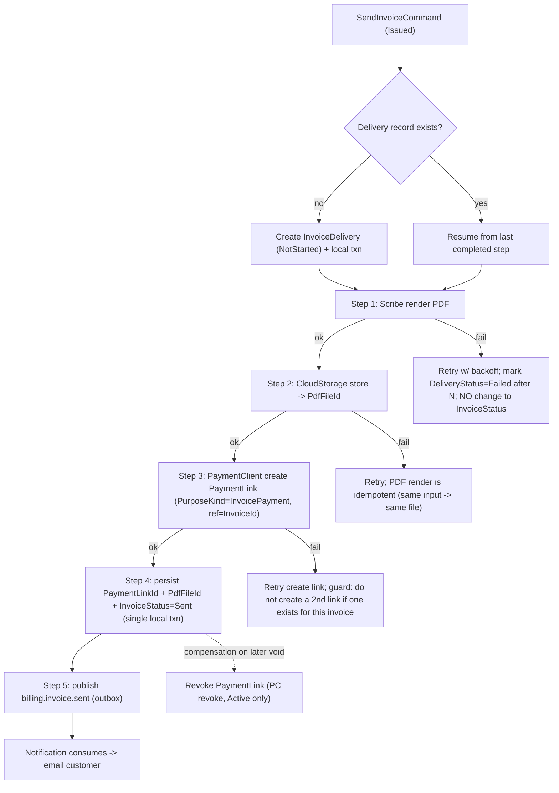
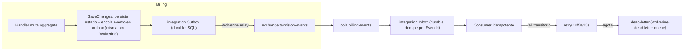
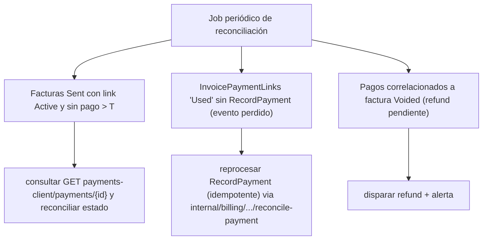

# Billing — Workflows distribuidos, sagas y compensaciones

Auditoría: arquitecto principal. Fecha: 2026-07-22.
Base: `07_Use_Case_Catalog` (UC-04 Send) + realidad verificada de PaymentClient (integración por **PaymentLink**, no por eventos `payments.*` genéricos — ver `10_PaymentClient_Billing_Issues.md`).

## 1. `SendInvoiceCommand` es una saga distribuida

El diseño (`07` UC-04) mezcla 6 pasos con fallos independientes en un solo handler: render PDF (Scribe) → guardar (CloudStorage) → crear PaymentLink (PaymentClient) → persistir local → cambiar estado → publicar notificación. **Ningún paso es idempotente entre sí y no hay compensación.** Un fallo en el paso 3 tras el paso 2 deja la factura en un estado inconsistente.

### Hallazgo: separar estado técnico del comercial

`InvoiceStatus` es **estado comercial** (Draft/Issued/Sent/Paid/…). La entrega (PDF+link+email) es **estado técnico** y NO debe contaminar `InvoiceStatus` (no agregar `PdfPending`/`LinkPending` a la máquina comercial). Introducir `InvoiceDeliveryStatus { NotStarted, PdfRendering, PdfStored, LinkCreated, NotificationSent, Delivered, Failed }` persistido aparte, avanzado por la saga.

### Diseño correcto: process manager persistido con pasos idempotentes + compensación



### Reglas de la saga

- **Idempotencia por paso**: cada paso guarda su resultado en `InvoiceDelivery` (una fila por invoice). Reintentar la saga reanuda desde el último paso completado. El render de Scribe es determinista (mismo input → mismo PDF); crear link chequea "ya existe link activo para esta invoice" antes de crear otro (evita doble link).
- **Transacción local mínima**: el cambio `InvoiceStatus=Sent` + `PaymentLinkId` + `PdfFileId` se persiste en **una** transacción local (paso 4), y la publicación de `billing.invoice.sent` va por **outbox** en esa misma transacción. Nunca se publica antes de commitear.
- **Compensación**: si la factura se anula después, se revoca el PaymentLink (PaymentClient `revoke`, solo Active). Si el link ya fue usado, se dispara reembolso (ver §3).
- **No bloquear por PDF**: si Scribe falla, la factura puede quedar `Sent` con `DeliveryStatus=PdfPending` y reintentar el render de forma asíncrona (corrige C-04). El email se difiere hasta tener el PDF, o se envía sin adjunto con el link.

### ¿Saga persistida / process manager / workflow / tabla de operaciones?

**Recomendación:** tabla de operaciones (`InvoiceDelivery`) + reintentos de Wolverine (inbox durable) — **no** una librería de saga pesada. El flujo es lineal, corto y con compensación única (revoke). Un process manager formal (Wolverine Saga) es justificable solo si crecen los pasos con esperas largas (p.ej. esperar settlement). MVP: tabla + pasos idempotentes + outbox.

## 2. Saga de pago online (correlación por PaymentLink — realidad de PaymentClient)

PaymentClient **no** publica `payments.*`; el único evento de éxito de un cobro por link es `PaymentLinkUsedIntegrationEvent { TenantId, PaymentLinkId, TenantPaymentId, AmountCents, Currency, UsedAtUtc }`.

```mermaid
sequenceDiagram
    autonumber
    participant B as Billing
    participant PC as PaymentClient
    participant Cust as Cliente (checkout público)
    participant Bus as taxvision-events
    B->>PC: POST payment-links (Purpose=InvoicePayment, ref=InvoiceId)
    PC-->>B: {PaymentLinkId, Token, ExpiresAt}
    B->>B: persist InvoicePaymentLink(PaymentLinkId, InvoiceId, TenantId, ExpectedAmount, Currency)
    B-->>Bus: billing.invoice.sent (con PayUrl)
    Cust->>PC: paga vía checkout (Token)
    PC-->>Bus: PaymentLinkUsedIntegrationEvent(PaymentLinkId, TenantPaymentId, Amount, Currency)
    Bus->>B: consume (inbox durable)
    B->>B: correlaciona por PaymentLinkId; valida TenantId+Amount+Currency
    alt válido y factura pagable
        B->>B: RecordPayment -> PaymentReceipt; InvoiceStatus=Paid/PartiallyPaid
        B-->>Bus: billing.invoice.paid + billing.receipt.issued
    else no correlaciona / tenant o monto no coincide / factura Voided
        B->>B: no-op idempotente / refund-si-void / alerta
    end
```

**Guardas obligatorias en el consumer** (todas verificables por test):
- `TenantId` del evento == `TenantId` del `InvoicePaymentLink` (rechaza cross-tenant, C-14/seguridad).
- `AmountCents`/`Currency` == esperado del link (rechaza monto/moneda incorrectos).
- dedupe por `PaymentLinkId` (+ `ProviderEventId` cuando exista, PC-ISSUE-03).
- factura en estado pagable; si `Voided` → refund automático + alerta (C-09).
- `PaymentLinkUsed` es "used", no "settled" definitivo (3DS puede resolver por webhook después) → el pago se marca `Provisional` hasta confirmación, o se acepta con la política de PaymentClient (documentar; PC-ISSUE-01 lo resuelve con `payments.payment_succeeded`).

## 3. Saga de reembolso

**Realidad:** PaymentClient no publica evento de reembolso ni expone API de reembolso para Billing (refund es webhook-driven interno). **Sin PC-ISSUE-01/05, Billing no puede enterarse ni iniciar reembolsos.** Diseño objetivo (con esos issues resueltos):

```mermaid
sequenceDiagram
    autonumber
    participant Sup as Soporte/Billing
    participant PC as PaymentClient
    participant Bus as taxvision-events
    participant B as Billing
    Sup->>PC: refund (por soporte o Billing via PC-ISSUE-05)
    PC->>PC: RefundPartial/Full (cap acumulado)
    PC-->>Bus: payments.payment_refunded (PC-ISSUE-01)
    Bus->>B: consume
    B->>B: correlaciona por PurposeExternalReferenceId=InvoiceId (PC-ISSUE-02) o por PaymentLinkId->InvoiceId
    B->>B: RegisterRefund(receiptId, amount); recibo->Refunded; AmountRefunded+=amount
    B->>B: estado -> PartiallyRefunded/Refunded (NO Paid, corrige C-01)
    B-->>Bus: billing.invoice.refunded
```

## 4. Numeración concurrente (sección crítica)

```mermaid
sequenceDiagram
    autonumber
    participant R1 as Issue req #1
    participant R2 as Issue req #2
    participant DB as SQL (InvoiceNumberSequences)
    R1->>DB: BEGIN; UPDATE Sequences SET Next=Next+1 OUTPUT INSERTED.Next WHERE (Tenant,Period) [UPDLOCK,HOLDLOCK]
    R2->>DB: BEGIN; UPDATE ... (bloquea hasta que R1 commitee)
    DB-->>R1: Next=42
    R1->>DB: INSERT Invoice(Number=INV-...-042) [unique (Tenant,Number)]; COMMIT
    DB-->>R2: Next=43 (tras liberar lock)
    R2->>DB: INSERT Invoice(Number=INV-...-043); COMMIT
```

Detalle y comparación de opciones en `07_Billing_Data_And_Concurrency.md`.

## 5. Outbox / Inbox



Políticas concretas (detalle en `07`): timeout de clientes M2M 30s; retry con cooldown 1s/5s/15s (patrón Growth); poison → DLQ tras agotar; cleanup/retención de outbox/inbox configurable; dedupe por `EventId` (patrón Growth `event:{EventId:N}`); recuperación de operaciones incompletas vía reanudación de la saga (`InvoiceDelivery`).

## 6. Reconciliación



La reconciliación es **obligatoria** porque (a) `PaymentLinkUsed` puede perderse y (b) los cobros directos no emiten evento. Es la red de seguridad contra la fragilidad de correlación (BDR-001).
