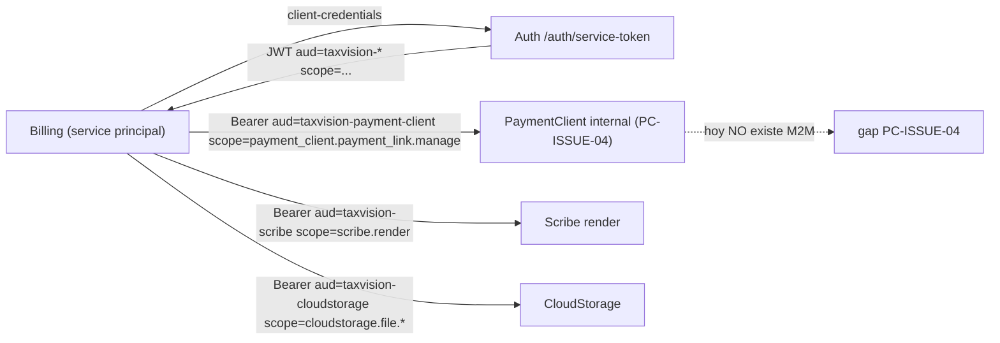

# Billing — Revisión de seguridad

Auditoría: arquitecto principal (seguridad multi-tenant / sistemas financieros). Fecha: 2026-07-22.
Base verificada: patrón de la casa `JwtTenantContextMiddleware` (tenant solo desde JWT), ownership-404 (Growth `GetOwnedByIdAsync` exige `TenantId`), `HasPermission`/`HasServiceScope`.

## 1. Multi-tenancy — vector por vector

Principio: **ningún Id recibido está autorizado solo porque exista.** Toda lectura/escritura filtra por `TenantId` del JWT; toda referencia externa (`CustomerId`, `FileId`, `PaymentLinkId`, `PaymentId`) se valida contra el tenant dueño.

| Vector | Riesgo | Estado en el diseño | Corrección requerida | Prueba |
|---|---|---|---|---|
| Extracción de TenantId | Aceptar tenant del payload/query | Correcto: `JwtTenantContextMiddleware` scaffoldeado toma `tenant_id` del JWT; controller usa `User.TryGetTenantId` | Mantener; prohibir cualquier `companyId`/`tenantId` en body/query (corrige el gap legado) | T-07 |
| Consultas por Id | `GET invoice/{id}` sin `TenantId` → cross-tenant read | El diseño dice `GetByIdAsync(tenantId, id)` pero el scaffold repo es stub | Todo repo query filtra `WHERE Id=@id AND TenantId=@tenant`; 404 si no matchea | T-07 |
| Query filters EF | Falta filtro global fail-closed | No implementado (B2) | Global query filter para `ITenantOwned` (README §23 pto 4), fail-closed | integración |
| Consumers de eventos | Aplicar un pago a la factura de otro tenant | **Riesgo real**: `PaymentLinkUsedIntegrationEvent` trae `TenantId`; hay que validar contra el `InvoicePaymentLink` | El consumer valida `evt.TenantId == link.TenantId` antes de `RecordPayment` | T-20 |
| Repositorios | Elevación por `IgnoreQueryFilters` | Growth lo usa con `TenantRepositoryGuard`; Billing debe replicar | Cualquier `IgnoreQueryFilters` va con guard explícito de tenant | code review |
| Idempotencia | Claves sin tenant → colisión cross-tenant | Patrón `ProcessedBusinessMessages` de Growth es `(TenantId, Operation, Key)` | Incluir `TenantId` en toda clave de idempotencia | T-04 |
| Cache keys | Claves sin tenant | N/A aún | Prefijar todo con `TenantId` | — |
| Archivos/descargas | Descargar `FileId` de otro tenant | **Riesgo alto**: el `PdfFileId` es opaco; si Billing solo pasa el `FileId` a CloudStorage sin validar dueño | Billing valida que el `FileId` pertenece a una factura del tenant antes de pedir la descarga; CloudStorage además filtra por tenant | T-08 |
| M2M | Token de servicio sin scope de tenant | PaymentClient no tiene M2M (PC-ISSUE-04) | El token de servicio de Billing lleva `tenant_id`; PaymentClient valida | T-20 |
| CustomerId | Snapshot de un cliente de otro tenant | Billing debe validar `CustomerId` pertenece al tenant al crear el snapshot | Validar contra Customer M2M/evento; no confiar en el `CustomerId` del body | integración |
| Logs | PII/tenant leak en logs | `ToString()` redacted (patrón Growth `CreateAttributionRequest`) | Records con `ToString()` que redacta email/taxid/hash | code review |
| Auditoría | Falta rastro de acceso | `audit.AuditEntries` previsto | Append-only por tenant | — |

## 2. Autorización

- **Humano**: `[HasPermission("billing.view"|"billing.manage")]` — permisos YA seeded en Auth. El scaffold usa `[Authorize]` plano; **falta el `BillingAuthorizationPolicyProvider`** (patrón Growth) para aplicar `perm:` — pendiente B2 (no bloquea scaffolding, sí implementación).
- **M2M**: `[HasServiceScope]` con audience `taxvision-billing`. El único endpoint interno de Billing (`reconcile-payment`) debe validar `actor_type=Service` + audience + scope, y nunca aceptar tenant del body.
- **Público**: solo `POST /billing/receipts/verify` (`[AllowAnonymous]`), solo lectura/validación (§4).
- **Regla**: los roles humanos nunca reciben scopes M2M (`billing.payment.reconcile` no se asigna a humanos), como en `GrowthServiceScopes` vs `GrowthPermissions`.

## 3. PII

Presencia de PII en el modelo: email, teléfono, TaxId, dirección, nombres (en `CustomerSnapshot`/`IssuerSnapshot`), URLs de pago, hashes de recibo.

| Ubicación | Riesgo | Corrección |
|---|---|---|
| `billing.invoice.sent` con `CustomerEmail` (C-14) | PII en el fan-out `taxvision-events` a todos los servicios | Publicar `InvoiceId`+`CustomerId`; Notification resuelve el email vía Customer M2M. O minimizar/cifrar |
| `billing.receipt.issued` con `CustomerEmail` | idem | idem |
| Snapshots en BD | PII en reposo | Cifrado a nivel de columna para TaxId/email si la política lo exige; retención fiscal explícita |
| `PayUrl`/`Token` en eventos | Token de pago expuesto en el bus | El `Token` del link es un secreto de posesión → no publicarlo en el fan-out; entregarlo solo al cliente vía Notification |
| Logs | PII en logs estructurados | `ToString()` redacted; nunca loguear TaxId/email/token/hash completos |

## 4. Endpoint público de verificación de recibos (`POST /billing/receipts/verify`)

El legado exponía `verify` anónimo por hash. Riesgos: enumeración, scraping, exposición de PII, timing attack, abuso automatizado.

**Diseño endurecido:**
- **Token/hash apropiado**: verificar por un token opaco de alta entropía (≥128 bits) que NO sea el `VerificationHash` interno reutilizado como identificador enumerable. El `verify` recibe `{ receiptToken }` (aleatorio por recibo), no un id secuencial ni el hash calculable.
- **Respuesta mínima**: `{ valid: bool, issuedAtUtc, amountCents, currency, invoiceNumber }` — **sin** email/teléfono/dirección/TaxId. Solo lo necesario para confirmar autenticidad.
- **Rate limiting**: política dedicada (patrón Growth `AddRateLimiter`), particionada por IP, límite estricto (p.ej. 10/min) + backoff; el `verify` es el vector de enumeración #1.
- **Timing**: comparación en **tiempo constante** (`CryptographicOperations.FixedTimeEquals`, ya usado en Auth) para no filtrar existencia por latencia; respuesta idéntica (mismo shape/tiempo) para "no existe" vs "inválido".
- **Logging seguro**: registrar intentos (para detección de abuso) sin el token completo ni PII.
- **Retención**: los recibos son documentos fiscales → retención larga; pero el `verify` no debe permitir barrido histórico masivo (rate limit + token opaco lo mitigan).
- **Sin enumeración**: nada de ids incrementales ni `ReceiptNumber` (que es semi-predecible `RCP-yyyy-NNN`) como clave de verificación pública — usar el token aleatorio.

## 5. Modelo de seguridad M2M (diagrama)

**Gaps M2M confirmados:**
- PaymentClient no acepta service-scope (PC-ISSUE-04) → la llamada Billing→PaymentClient no tiene ruta de auth válida hoy.
- Cada llamada M2M lleva `tenant_id` en el token de servicio; el servicio destino valida tenant + scope. Ningún Id del body autoriza por sí mismo.

## 6. Hallazgos de seguridad priorizados

| ID | Escenario | Impacto | Prob. | Corrección | Prueba | Bloquea prod |
|---|---|---|---|---|---|---|
| SEC-01 | Consumer aplica pago de tenant A a factura de B | Corrupción financiera cross-tenant | Media | Validar `evt.TenantId==link.TenantId`+monto+moneda | T-20/T-21 | Sí |
| SEC-02 | Descarga de PDF de otro tenant por `FileId` | Fuga de documento fiscal | Media | Validar dueño del `FileId` vía factura del tenant | T-08 | Sí |
| SEC-03 | Enumeración/scraping del `verify` público | Fuga de datos de recibos | Alta | Token opaco + rate limit + respuesta mínima + tiempo constante | T-23/T-09 | Sí |
| SEC-04 | PII (email/token) en eventos del fan-out | Sobre-exposición | Alta | Referencia en vez de PII; Token nunca al bus | contract test | Sí |
| SEC-05 | `[Authorize]` plano sin `perm:` (scaffold) | Cualquier usuario autenticado accede | Alta (si no se corrige en B2) | `BillingAuthorizationPolicyProvider` + `[HasPermission]` | autorización | Sí (impl) |
| SEC-06 | Falta global query filter por tenant | Cross-tenant read por bug de query | Media | Filtro global fail-closed | integración | Sí |
