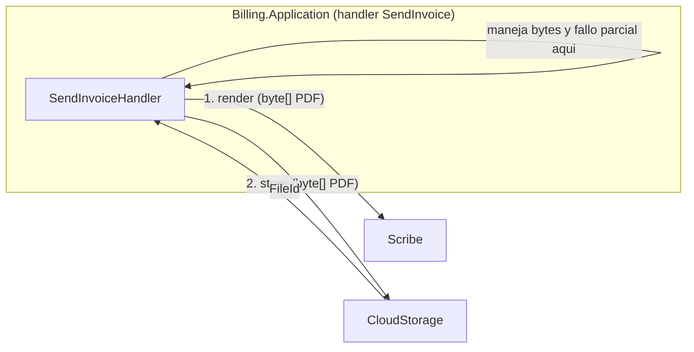
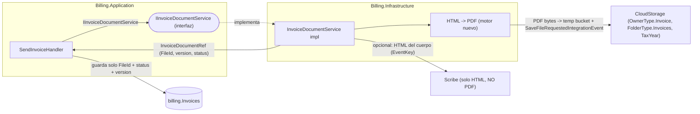
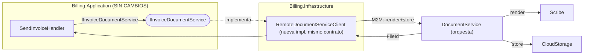

# Billing — Análisis de integración documental (Scribe + CloudStorage)

Auditoría: arquitecto principal. Fecha: 2026-07-22.
Pregunta: ¿cómo debe Billing generar y almacenar el PDF de factura/recibo? El diseño actual dice "Billing → Scribe (render)" y "Billing → CloudStorage (almacenar)".

> ## ⚠️ CORRECCIÓN CRÍTICA (evidencia de código, 2026-07-22)
> La premisa "Scribe renderiza el PDF" es **FALSA**. Verificado contra el repo:
> - **Scribe renderiza solo HTML de email** (`RenderController` → `RenderedContent(Subject, Html, Text, InlineAssets)`). **No produce PDF, no devuelve `byte[]` de PDF, no devuelve `FileId`.** No existe **ningún** motor HTML→PDF en todo el repo (`puppeteer|playwright|wkhtml|QuestPDF` → NOT_FOUND). El PDF es una capacidad **a construir desde cero**.
> - **No existe `FileType.Invoice`.** CloudStorage tiene `OwnerType.Invoice` + `FolderType.Invoices`/`Receipts` (ambos **exigen `TaxYear`**). Clasificación correcta: `OwnerType.Invoice` + `FolderType.Invoices` + `TaxYear`.
> - **Subida M2M a CloudStorage es event-driven**: el servicio hace `PutObject` a un bucket temporal con **su propia IAM MinIO** y publica `SaveFileRequestedIntegrationEvent` (el caller genera el `FileId`, que es la clave de idempotencia). Descarga = `POST storage/files/{fileId}/download-url` (presigned GET, 1–60 min).
>
> **Consecuencia para este análisis:** la elección A/B/C/D **sigue siendo válida** (es sobre dónde vive la orquestación), pero la implementación de cualquiera es **más pesada** de lo documentado: hay que añadir (1) un motor HTML→PDF, (2) una plantilla/EventKey de invoice en Scribe para el HTML (opcional), (3) un cliente MinIO + IAM en Billing, (4) el flujo `SaveFileRequestedIntegrationEvent`. Esto **refuerza** la Alternativa D (ocultar toda esa complejidad tras `IInvoiceDocumentService`) e incluso adelanta el caso para C (un `DocumentService` que sea dueño del HTML→PDF).

Ownership confirmado (invariante que NO se toca): **Scribe = dueño del render de contenido (HTML de email)**; **CloudStorage = dueño del almacenamiento** (`OwnerType.Invoice` + `FolderType.Invoices` + `TaxYear`; subida por `SaveFileRequestedIntegrationEvent`, descarga por presigned URL). Billing NO debe convertir a CloudStorage en un generador documental. **El HTML→PDF no tiene dueño hoy** — es la decisión abierta central de esta integración.

## Alternativas

- **A.** Billing.Application llama directamente a Scribe y a CloudStorage (dos clientes M2M explícitos en el handler).
- **B.** Billing llama solo a CloudStorage y **CloudStorage orquesta Scribe**.
- **C.** Crear un `DocumentService` nuevo que orqueste Scribe + CloudStorage; Billing llama a `DocumentService`.
- **D.** Mantener ambos servicios, ocultos tras una abstracción única `IInvoiceDocumentService` en `Billing.Infrastructure` (interfaz en `Billing.Application`).

## Evaluación por dimensión

| Dimensión | A (ambos directos) | B (CloudStorage orquesta Scribe) | C (DocumentService nuevo) | D (abstracción en Billing) |
|---|---|---|---|---|
| Responsabilidad del bounded context | Billing conoce plantillas Y almacenamiento — fuga de responsabilidad al Application | **Rompe ownership**: CloudStorage pasa a ser generador documental (cambio de responsabilidad no deseado) | Correcta y explícita, pero introduce un contexto nuevo | Correcta: Billing conoce "documento de factura", no plantillas ni bytes |
| Acoplamiento | Alto: Application acoplado a 2 contratos externos | Alto y **erróneo**: acopla storage con render | Bajo hacia Billing; el acople vive en DocumentService | Bajo: Application acoplado a 1 interfaz propia |
| Nº de llamadas distribuidas | 2 desde Billing | 1 desde Billing, +1 CloudStorage→Scribe (oculta) | 1 desde Billing, +2 internas | 2 desde Billing.Infrastructure (encapsuladas), 0 desde Application |
| Manejo de bytes | Billing.Application manosea `byte[]` del PDF entre Scribe y CloudStorage | Billing no ve bytes (bien), pero por el motivo equivocado | Billing no ve bytes | **Billing.Application no ve bytes**; la Infrastructure los pasa de Scribe a CloudStorage |
| Fallos parciales | Billing gestiona render-OK/store-fail y viceversa en el handler (contamina el caso de uso) | CloudStorage gestiona el fallo parcial (fuera de su dominio) | DocumentService gestiona el fallo parcial (su dominio) | La Infrastructure de Billing gestiona el fallo parcial; el Application solo ve `Result` |
| Retries | Duplicados en cada handler | En CloudStorage (mezcla políticas) | Centralizados en DocumentService | Centralizados en la implementación de `IInvoiceDocumentService` |
| Idempotencia | Billing.Application debe idempotizar 2 pasos | Ambigua (¿quién es la clave?) | DocumentService idempotente por `(InvoiceId, version)` | La implementación idempotiza; render determinista + `FileId` estable por `(InvoiceId, version)` |
| Reutilización por otros microservicios | Cada servicio reimplementa el patrón | CloudStorage "generador" tienta a otros a abusarlo | **Alta**: cualquier servicio usa DocumentService | Nula fuera de Billing (interfaz propia) — aceptable en MVP, migrable a C |
| Migración futura | Difícil: lógica dispersa en handlers | Difícil de revertir (CloudStorage ya "genera") | Ya es el estado final | **Fácil**: sustituir la impl por un cliente de `DocumentService` sin tocar Application |
| Observabilidad | 2 spans por handler, repetidos | Traza cruza a CloudStorage (confuso) | Traza limpia en DocumentService | 2 spans encapsulados bajo un span `document.render_and_store` |
| Escalabilidad | Acoplada al ritmo de Billing | CloudStorage se vuelve cuello de botella de render | DocumentService escala independiente | Escala con Billing; migrable a C si el render pesa |
| Esfuerzo MVP | Medio (pero deuda) | Alto + cambio de ownership | **Alto** (servicio nuevo: BD/compose/gateway/auth) | **Bajo**: una interfaz + una implementación |

## Recomendación MVP: **Alternativa D**

Coincide con la expectativa del diseño:

- `Billing.Application` depende **solo** de `IInvoiceDocumentService` (interfaz en Application).
- `Billing.Infrastructure` la implementa usando Scribe (render) + CloudStorage (almacenar).
- Billing **no** maneja plantillas, `byte[]` ni detalles de almacenamiento en la capa de casos de uso.
- La interfaz se diseña para poder sustituir la implementación por un `DocumentService` M2M (Alternativa C) sin tocar `Billing.Application`.
- Scribe sigue siendo dueño del render; CloudStorage sigue siendo dueño del almacenamiento.
- Billing conserva únicamente `FileId`, `DocumentGenerationStatus` y `DocumentVersion`.

**B se rechaza explícitamente**: convertiría a CloudStorage en un servicio de generación documental — un **cambio de responsabilidad** no autorizado. No se hace.
**C es el estado final deseable** cuando ≥2 servicios necesiten documentos o el render sea pesado/con colas; hoy es sobre-ingeniería (servicio nuevo con BD/compose/gateway/auth para un solo consumidor). D deja el camino abierto a C.

## Contrato propuesto (`Billing.Application/Abstractions/IInvoiceDocumentService.cs`)

```csharp
public interface IInvoiceDocumentService
{
    // Render (Scribe) + store (CloudStorage) encapsulados. Determinista e idempotente
    // por (TenantId, InvoiceId, DocumentVersion): mismo input -> mismo FileId lógico.
    Task<Result<InvoiceDocumentRef>> RenderAndStoreInvoiceAsync(
        InvoiceDocumentRequest request, CancellationToken ct);

    Task<Result<InvoiceDocumentRef>> RenderAndStoreReceiptAsync(
        ReceiptDocumentRequest request, CancellationToken ct);

    // Entrega al usuario: URL firmada (preferido) o stream. Valida dueño por tenant.
    Task<Result<DocumentDownload>> GetInvoiceDocumentAsync(
        Guid tenantId, Guid fileId, CancellationToken ct);
}

public sealed record InvoiceDocumentRequest(
    Guid TenantId, Guid InvoiceId, string InvoiceNumber, string TemplateKey,
    InvoiceDocumentModel Model, bool PaidWatermark, string DocumentVersion);

public sealed record InvoiceDocumentRef(
    Guid FileId, string DocumentVersion, DocumentGenerationStatus Status);

public enum DocumentGenerationStatus { Pending, Rendered, Stored, Failed }
```

**¿Quién es dueño del HTML→PDF?** (decisión abierta que la interfaz absorbe): (i) Billing.Infrastructure lo hace inline con una librería PDF nueva; (ii) Scribe se extiende para emitir PDF (cambio de responsabilidad de Scribe — hoy es email-only; requiere issue en Scribe); (iii) el futuro `DocumentService` (C) es dueño del HTML→PDF. Recomendación MVP: (i) dentro de la implementación de `IInvoiceDocumentService`, usando Scribe **solo** para el HTML del cuerpo (vía una EventKey/plantilla de invoice nueva) si se quiere reutilizar el motor de plantillas, o un template propio. La interfaz no cambia según cuál se elija — ese es el punto de D.

Notas de diseño de la interfaz (para habilitar la evolución a C):
- **Grano "render+store" en una sola operación**, no dos: así la implementación (D) o el futuro `DocumentService` (C) deciden internamente el orden, los retries y el manejo de bytes. Billing nunca ve el `byte[]`.
- **Idempotente por `(TenantId, InvoiceId, DocumentVersion)`**: reintentar produce el mismo `FileId` lógico; el render de Scribe es determinista.
- **`DocumentVersion`**: permite re-render (p.ej. añadir watermark "Paid") como una versión nueva sin perder la anterior; Billing guarda la versión vigente.
- **Entrega por URL firmada** (POR_CONFIRMAR soporte en CloudStorage): evita que Billing haga streaming de bytes y valida dueño por tenant (SEC-02).
- Sustituir D→C = cambiar el registro DI de `ScribeCloudStorageInvoiceDocumentService` por `RemoteDocumentServiceClient`, sin tocar `Billing.Application`.

## Diagramas

### Flujo actual (tal como está documentado — variante A)



### Flujo recomendado MVP (Alternativa D)



### Evolución futura (Alternativa C — DocumentService M2M)



## Impacto en la auditoría

- Corrige la mezcla de responsabilidades del handler `SendInvoice` (`05_Distributed_Workflows`): el paso "render→store" pasa a ser una sola operación encapsulada tras `IInvoiceDocumentService`, no dos pasos con bytes y fallos parciales en el Application.
- Añade al backlog: `IInvoiceDocumentService` (P1, fase B5) con la implementación Scribe+CloudStorage; deja el gancho para `DocumentService` (P3).
- No introduce servicio nuevo ni base de datos compartida ni cambia el ownership de Scribe/CloudStorage.
