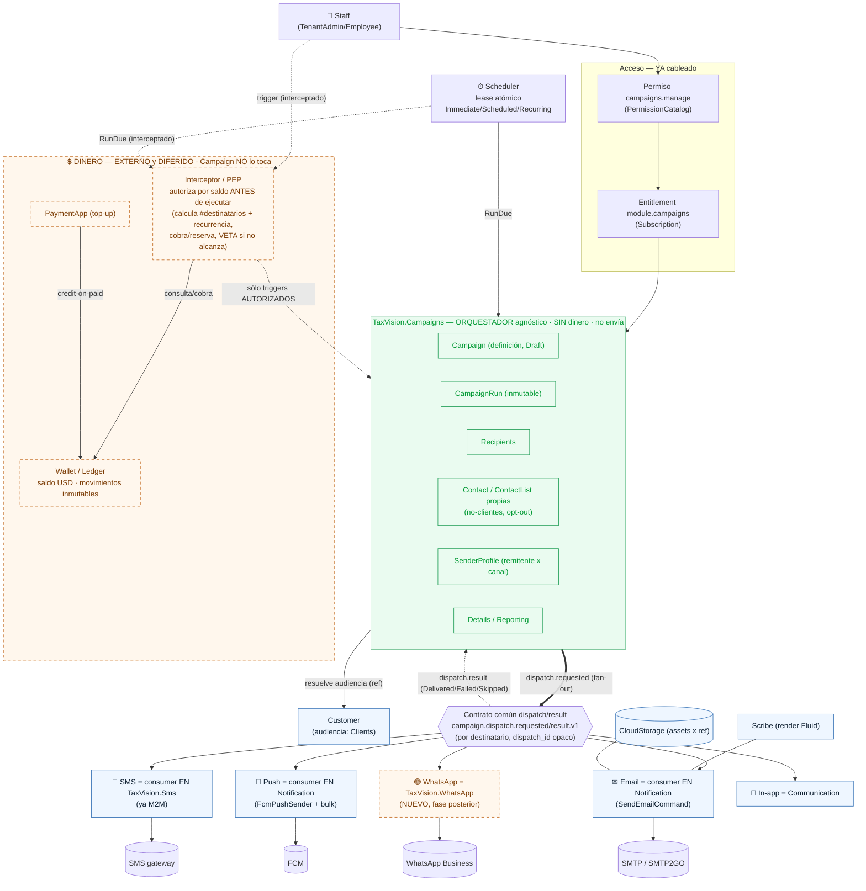

# Campaigns Suite — Diagrama de Arquitectura (estado objetivo)

> Refleja ADR-CAMP-001 (APPROVED, 2026-09-16/17): **Campaign = orquestador agnóstico de canal, SIN dinero**; canales = **consumers en servicios existentes**; **dinero = interceptor/PEP + Wallet externos y DIFERIDOS**.

## Vista de bloques



## Leyenda

- **Verde (core):** el servicio nuevo `TaxVision.Campaigns` — solo orquesta; sin dinero.
- **Azul (reuse):** servicios existentes que hospedan el consumer del canal (Notification, TaxVision.Sms, Communication) o colaboran (Customer, Scribe, CloudStorage).
- **Naranja punteado (diferido):** lo que **no** entra ahora — WhatsApp (nuevo, fase posterior) y toda la capa de dinero (PEP + Wallet + top-up), que vive **fuera** de Campaign e intercepta el trigger/RunDue.

## Flujo de una ejecución (hoy, sin dinero)

```mermaid
sequenceDiagram
  participant U as Staff / Scheduler
  participant C as Campaigns (orquestador)
  participant B as Bus (dispatch/result)
  participant X as Consumer de canal<br/>(Notification / TaxVision.Sms)
  participant P as Proveedor

  U->>C: trigger / RunDue (campaigns.manage + module.campaigns enforce)
  C->>C: crea CampaignRun (+DispatchRun durable), materializa UNIDADES (destinatario/canal) por páginas
  loop por unidad (destinatario × canal)
    C->>B: campaign.dispatch.requested.v1 (dispatch_id por intento, ContentRef)
    B->>X: consume (ActorType.Service)
    X->>P: entrega (render Scribe / secreto del proveedor)
    X-->>B: campaign.dispatch.result.v1 (Accepted/Delivered/Failed/Skipped)
    B-->>C: aplica result (idempotente por dispatch_id)
  end
  C->>C: timeouts → Unknown (reconciliable); cierra por total congelado → Completed/PartiallyFailed/Failed
  Note over C: Sin reserva/consumo/cobro. El dinero (si entra)<br/>lo intercepta un PEP externo ANTES del trigger.
```
